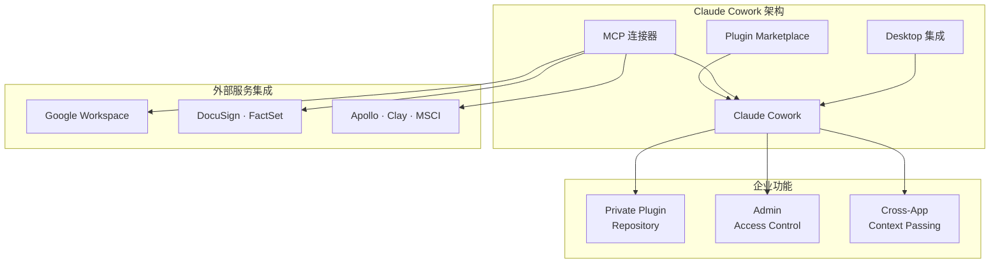
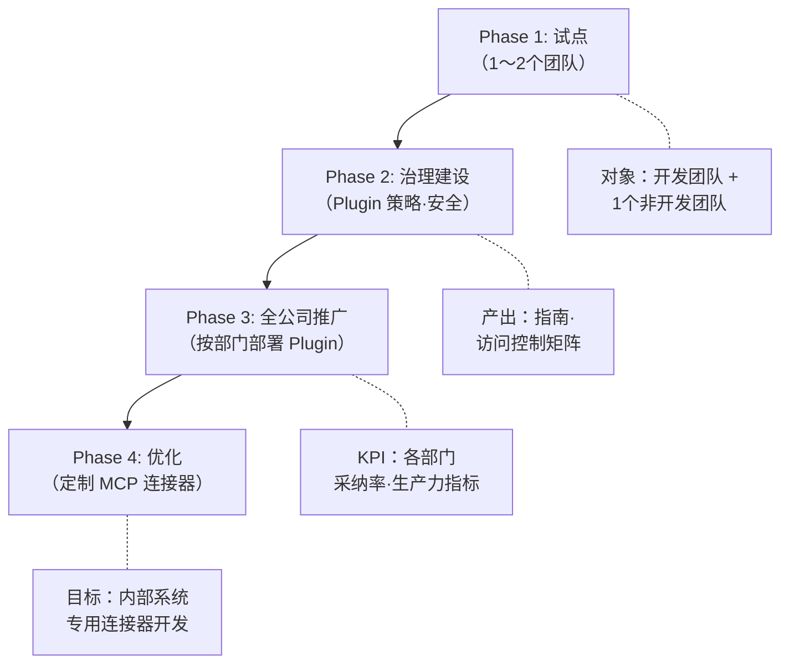

## 从 Claude Code 到 Claude Cowork

2026年1月，Anthropic 以 Research Preview 形式发布了 Claude Cowork。2月24日，该产品大幅强化了企业功能，正式宣布进军市场。TechCrunch 的标题精准概括了这一变化：<strong>"如果说 Claude Code 改变了编程，那么 Cowork 将改变整个企业。"</strong>

作为 Engineering Manager，我将分析这款产品发布的深层意义。如果说 Claude Code 是开发团队内部的生产力工具，那么 Cowork 则是将 AI Agent 能力扩展到 HR、设计、财务、运营等全部门的平台。

## Cowork 的核心架构

Claude Cowork 由三大核心支柱构成。

### 1. Plugin Marketplace——组织定制化 AI 工具生态

最值得关注的变化是 <strong>Private Plugin Marketplace</strong>。企业管理员可以构建专属于本组织的插件市场。

<strong>主要功能：</strong>

- 将 Private GitHub 仓库连接为插件源
- 按员工设置访问权限（控制哪些人可以使用哪些插件）
- 提供 HR、设计、工程、运营、财务分析、投资银行、股票研究、PE、资产管理等领域的预构建模板

这一功能的重要性在于，此前各团队各自摸索如何"用好" ChatGPT 或 Claude 的局面已经改变——<strong>企业可以在组织层面部署经过验证的 AI 工作流</strong>，基础设施已经具备。

### 2. MCP 连接器——与企业系统的原生集成

Claude Cowork 通过 Model Context Protocol（MCP）与企业现有系统直接连接。新增连接器如下：

| 类别 | 服务 |
|------|------|
| <strong>生产力</strong> | Google Drive, Google Calendar, Gmail |
| <strong>合同·法务</strong> | DocuSign, LegalZoom |
| <strong>销售·营销</strong> | Apollo, Clay, Outreach, SimilarWeb |
| <strong>金融·研究</strong> | FactSet, MSCI |
| <strong>内容</strong> | WordPress, Harvey |

MCP 连接器的意义远超简单的 API 集成。它意味着 Claude 能够<strong>双向</strong>理解和操作这些服务的上下文。例如，当你说"帮我审查上周的3份合同草案并整理核心风险"时，系统可以从 DocuSign 中获取文档进行分析，并将结果保存到 Google Drive——这样的工作流已成为可能。

### 3. Desktop 集成——延伸至 Excel 和 PowerPoint

Claude Cowork 在 Claude 桌面应用中运行，支持<strong>与 Excel 和 PowerPoint 的直接集成</strong>。核心是 <strong>Cross-App Context Passing</strong>：

- 在 Cowork 中完成的分析可在 Excel 中继续处理
- 将 Excel 数据自动转换为 PowerPoint 演示文稿
- 跨文件保持上下文，切换应用时无需从头说明

这一功能在高管报告撰写、季度业务回顾、投资分析等场景中，能带来显著的生产力提升。

## EM/CTO 视角下的战略启示

### 1. 从"开发团队 AI"到"全公司 AI"的转变

大多数组织的 AI 导入始于开发团队。Claude Code、GitHub Copilot、Cursor 等工具是典型代表。但 Cowork 的发布打破了这一边界。

<strong>CTO 需要思考的问题：</strong>

- 如何将开发团队的 AI 工具导入经验推广到非开发部门？
- 谁来管理 Plugin Marketplace 的治理策略？
- 如何限制通过 MCP 连接器的数据访问范围？

### 2. 供应商锁定与平台战略

Anthropic 的 Cowork 战略非常明确——<strong>通过 MCP 构建开放生态系统</strong>。在 MCP 已捐赠给 Linux Foundation 成为开放标准的背景下，Cowork 试图抢占"最佳标准实现产品"的位置。

对比：

| 项目 | Claude Cowork | Microsoft Copilot | Google Gemini for Workspace |
|------|-------------|-------------------|---------------------------|
| <strong>协议</strong> | MCP（开放标准） | 自有规范 | 自有规范 |
| <strong>Plugin 定制</strong> | Private Marketplace | Admin Center | AppSheet |
| <strong>编码 Agent 联动</strong> | Claude Code → Cowork | GitHub Copilot | Jules（有限） |
| <strong>桌面集成</strong> | Excel, PPT（新增） | Office 365 原生 | Google Workspace |

### 3. 安全考量

近期 Check Point Research 在 Claude Code 中发现了 CVE-2025-59536 和 CVE-2026-21852 漏洞，这一点值得关注。通过 Hooks、MCP 服务器配置和环境变量，曾存在远程代码执行和 API 密钥窃取的风险（目前已修复）。

随着 Cowork 与更多企业系统的连接，<strong>MCP 连接器的安全审计</strong>和<strong>插件代码审查流程</strong>已成为必选项。

## 实战导入路线图

以下是企业导入 Claude Cowork 时推荐的分阶段方案：

<strong>Phase 1：试点（2〜4周）</strong>

- 已在使用 Claude Code 的开发团队 + 1个非开发团队（如财务或 HR）
- 连接基础 MCP 连接器（Google Workspace）
- 测试预构建插件模板

<strong>Phase 2：治理建设（2〜4周）</strong>

- 配置 Private Plugin Marketplace
- 定义插件审批流程
- 设置各 MCP 连接器的数据访问范围
- 建立安全审计检查清单

<strong>Phase 3：全公司推广（4〜8周）</strong>

- 按部门部署定制插件
- 指定部门 Champion（AI Ambassador）
- 监控使用量和生产力指标

<strong>Phase 4：优化（持续进行）</strong>

- 开发内部系统专用 MCP 连接器
- 深化工作流自动化
- 衡量 ROI 并决定扩展方向

## 解读 Anthropic 的企业战略

从更宏观的视角审视 Cowork 的发布，Anthropic 的战略可以分为三个阶段：

1. <strong>占领开发者市场</strong>（2024〜2025）：通过 Claude Code 在开发者生产力市场建立根基
2. <strong>企业扩展</strong>（2026年初）：通过 Cowork 将 AI Agent 扩展至非开发岗位
3. <strong>平台生态系统</strong>（2026〜）：通过 MCP 开放标准 + Plugin Marketplace 构建第三方生态

这一战略与 Slack 从开发团队工具进化为全公司沟通平台的路径相似。区别在于 Cowork 提供的是<strong>智能体 AI 的执行力</strong>——不仅仅是收发消息，而是能够实际代替执行工作任务。

## 结语

Claude Cowork 企业版的发布是 AI 工具市场的重要转折点。这是 AI Agent 从开发团队内部工具扩展为全公司生产力平台的首个实质性案例。

作为 EM 或 CTO，当下应做的事：

1. <strong>摸清组织当前的 AI 工具使用现状</strong>（包括影子 AI）
2. <strong>选定 Cowork 试点团队</strong>
3. <strong>提前制定 MCP 连接器安全策略</strong>
4. <strong>设计 Plugin 治理体系</strong>

AI 正从"开发者的工具"向"组织的基础设施"转变。能否主动管理这一转变，还是被动跟随，将决定组织未来的技术竞争力。

## 参考资料

- [Anthropic, Claude Cowork 企业插件扩展 — TechCrunch](https://techcrunch.com/2026/02/24/anthropic-launches-new-push-for-enterprise-agents-with-plugins-for-finance-engineering-and-design/)
- [Claude Cowork：面向非开发者的 Claude Code — TechCrunch](https://techcrunch.com/2026/01/12/anthropics-new-cowork-tool-offers-claude-code-without-the-code/)
- [Anthropic 通过 Claude Cowork 更新办公生产力工具 — CNBC](https://www.cnbc.com/2026/02/24/anthropic-claude-cowork-office-worker.html)
- [Claude Cowork 革新 Excel 和 PowerPoint 工作流 — Applying AI](https://applyingai.com/2026/03/how-anthropics-claude-is-revolutionizing-excel-and-powerpoint-workflows/)
- [Anthropic vs 五角大楼 AI 治理 — Axios](https://www.axios.com/2026/03/03/ai-race-safety-guardrail)
