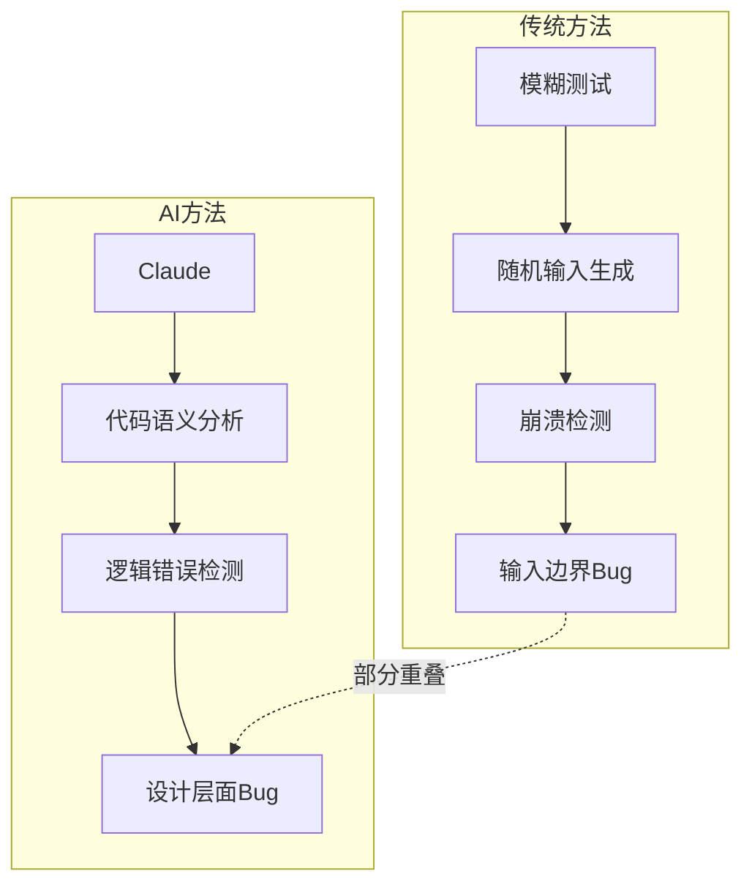
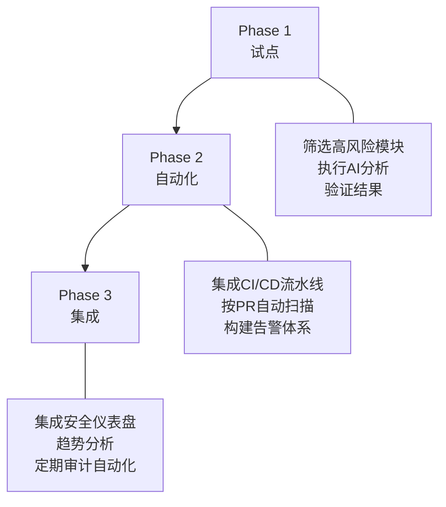

## 两周、6,000个C++文件、22个CVE

2026年3月6日，Anthropic与Mozilla联合发布了利用AI模型进行浏览器安全审计的成果。Claude Opus 4.6对Firefox的C++代码库约<strong>6,000个文件</strong>进行了分析，共提交了<strong>112份独立Bug报告</strong>，其中<strong>22个被正式注册为CVE</strong>。

严重程度分类如下：

| 严重程度 | 数量 | 占比 |
|----------|------|------|
| High | 14个 | 63.6% |
| Moderate | 7个 | 31.8% |
| Low | 1个 | 4.5% |

14个高严重度漏洞约占2025年全年Firefox已修补高严重度漏洞的<strong>五分之一</strong>。所有漏洞均已在Firefox 148中完成修补。

## AI发现了Fuzzing遗漏的问题

Firefox是一个经历了数十年<strong>模糊测试（Fuzzing）</strong>、<strong>静态分析（Static Analysis）</strong>以及定期安全审查的项目。然而Claude仍然能够发现新漏洞，其原因值得深入探讨。

核心差异在于<strong>检测目标的性质</strong>：

- <strong>模糊测试</strong>：通过随机输入触发崩溃的方式，擅长发现输入验证缺失和缓冲区溢出等模式。
- <strong>AI代码分析</strong>：理解代码的语义和上下文，检测逻辑错误。能够发现Fuzzing难以捕获的<strong>逻辑错误（Logic Errors）</strong>和<strong>Use After Free</strong>等复合型内存漏洞。

根据Mozilla官方公告，Claude"在数十年的模糊测试和静态分析之后，仍然发现了大量此前未知的Bug"。尤其值得关注的是，在开始探索JavaScript引擎仅<strong>20分钟后</strong>就发现了一个Use After Free漏洞。

## 112份报告的质量——Mozilla为何信任AI

比起单纯的"发现N个漏洞"，更重要的是<strong>报告的质量</strong>。Mozilla安全团队之所以能够迅速接受Anthropic的成果，有三个关键原因：

1. <strong>最小复现测试用例（Minimal Test Case）</strong>：每个Bug都附带了可复现的最小代码
2. <strong>详细的PoC（Proof of Concept）</strong>：具体说明漏洞如何被利用的场景
3. <strong>候选补丁（Candidate Patches）</strong>：包含修复方案的完整报告

得益于这种结构化的报告，Mozilla安全团队在收到报告后<strong>数小时内</strong>即完成验证并着手修复。安全审计中最大的瓶颈——"报告分诊（Triage）"时间被大幅缩短。

## 漏洞利用与检测——AI的当前定位

值得注意的是，Anthropic还单独测试了Claude的<strong>漏洞利用开发能力</strong>：

| 项目 | 结果 |
|------|------|
| 测试次数 | 数百次 |
| API成本 | $4,000 |
| 成功的Exploit | 2个 |

<strong>漏洞检测能力</strong>与<strong>漏洞利用开发能力</strong>之间存在巨大差距。AI在阅读代码并识别潜在问题方面表现出色，但编写实际攻击代码仍然困难。这一不对称性对防御方有利，意味着安全团队拥有优先将AI用于防御而非攻击的<strong>时间窗口（Window of Opportunity）</strong>。

## 面向EM/CTO的实战启示

以下整理了该案例对工程管理者的关键启示。

### 1. AI安全审计引入路线图

<strong>Phase 1（试点，1~2周）</strong>：
- 从遗留代码中筛选安全敏感模块（认证、支付、数据处理）
- 使用LLM代码分析工具执行一次性审计
- 由现有安全团队验证结果，评估可信度

<strong>Phase 2（自动化，1~2个月）</strong>：
- 在CI/CD流水线中添加AI安全扫描步骤
- 针对PR级别的代码变更进行自动分析
- 构建Slack/邮件告警体系

<strong>Phase 3（集成，按季度）</strong>：
- 将AI审计结果集成到安全仪表盘
- 漏洞趋势分析与风险评分
- 按季度对整个代码库进行自动审计

### 2. 成本效益对比

基于Anthropic的案例进行估算：

| 项目 | 传统方式 | AI审计 |
|------|----------|--------|
| 所需时间 | 数周~数月 | 2周 |
| 专业人员 | 高级安全工程师2~3名 | AI + 验证人员1名 |
| 覆盖范围 | 基于抽样 | 全量代码库（6,000文件） |
| 报告质量 | 专家水平 | 含测试用例 + PoC + 补丁 |

当然，AI审计并不能完全替代人类专家。最优方案是<strong>AI进行初筛</strong>，<strong>人类专家负责验证和优先级判断</strong>的混合模式。

### 3. 组织引入时的注意事项

- <strong>代码保密性</strong>：需要审视向外部AI API传输代码的安全策略。考虑采用本地化部署模型或零数据留存API合同
- <strong>误报（False Positive）管理</strong>：112份报告中22个被注册为实际CVE（约20%），其余为低严重度Bug或误报，分诊流程不可或缺
- <strong>与现有工具的集成</strong>：制定与SAST（静态分析）、DAST（动态分析）、SCA（软件成分分析）等现有AppSec流水线的协同策略
- <strong>合规要求</strong>：审视AI安全审计结果在SOC 2、ISO 27001等合规框架中作为证据使用的方案

## 更广阔的视野——AI AppSec的未来

此次案例并非孤立事件，而是<strong>AI驱动安全审计</strong>逐步成为行业标准这一趋势的一部分：

- <strong>Google Project Zero</strong>已在开展基于LLM的漏洞检测研究
- <strong>GitHub Copilot</strong>的安全审查功能持续增强
- <strong>NIST</strong>的AI Agent安全标准也包含了将AI作为安全工具使用的指南

对EM/CTO而言，核心问题已不是"是否引入AI安全审计"，而是<strong>"何时、以何种顺序引入"</strong>。如果在Firefox这样经过数十年验证的代码库中AI都能发现新漏洞，那么你的代码库又会如何呢？

## 核心摘要

| 项目 | 内容 |
|------|------|
| 主体 | Anthropic (Claude Opus 4.6) x Mozilla |
| 周期 | 2周（2026年2月） |
| 范围 | Firefox C++代码库6,000个文件 |
| 成果 | 112份报告 → 22个CVE（高严重度14个） |
| 核心优势 | 检测Fuzzing遗漏的逻辑错误 |
| 报告质量 | 含最小复现代码 + PoC + 候选补丁 |
| 修补状态 | 已在Firefox 148中全部修补 |

## 参考资料

- [Anthropic官方公告: Mozilla Firefox Security](https://www.anthropic.com/news/mozilla-firefox-security)
- [Mozilla博客: Hardening Firefox with Anthropic's Red Team](https://blog.mozilla.org/en/firefox/hardening-firefox-anthropic-red-team/)
- [TechCrunch: Anthropic's Claude found 22 vulnerabilities in Firefox over two weeks](https://techcrunch.com/2026/03/06/anthropics-claude-found-22-vulnerabilities-in-firefox-over-two-weeks/)
- [The Hacker News: Anthropic Finds 22 Firefox Vulnerabilities](https://thehackernews.com/2026/03/anthropic-finds-22-firefox.html)
