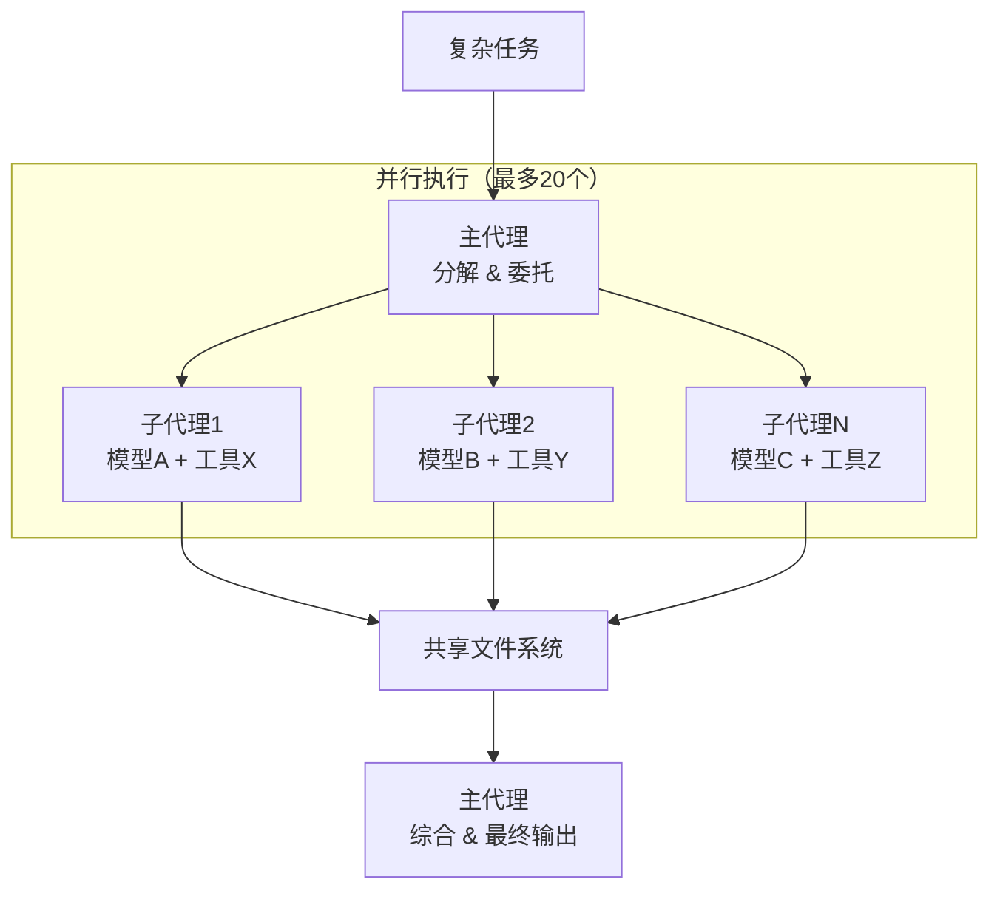
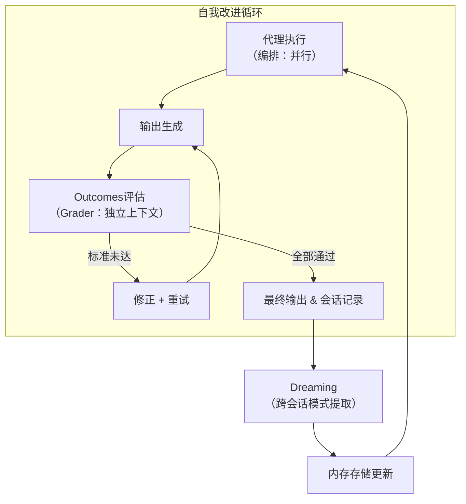

5月6日，在旧金山Code with Claude大会上，当Anthropic宣布三项新功能时，我脑中浮现的第一个问题是："这个代理在我下班后到底在学什么？"

Dreaming、Outcomes、多代理编排（Multiagent Orchestration）。光看名字有些营销味道，但深入结构后，你会发现具体的工程决策。尤其是Dreaming，很多人容易误解：说"代理在学习"是对的，但改善的不是模型，而是内存。这个区别比看起来更重要。

由于没有API访问权限，我无法直接测试Dreaming。它目前还是Research Preview阶段。本文基于官方文档、Anthropic博客、大会资料和早期试点报告，分析三项功能的结构。没有亲自运行的内容，我不会假装运行过。

## Code with Claude 2026 — 无新模型，只有代理基础设施

5月6日旧金山主题演讲最值得关注的，是没有新模型发布。Anthropic没有拼性能跑分，而是专注于代理执行层。

主要发布内容：

- **Dreaming**：代理内存自动刷新（Research Preview）
- **Outcomes**：基于成功标准的自我评估与迭代（Public Beta）
- **Multiagent Orchestration**：主代理-子代理并行执行（Public Beta）
- 使用限制翻倍（Pro、Max、Team、Enterprise）
- 取消高峰时段流量限制（Pro、Max）
- <strong>Claude Security</strong>：基于Opus 4.7的代码漏洞扫描器（Enterprise）
- Remote Agents：用手机控制笔记本
- SpaceX Project Colossus合作（22万个以上GPU）

Notion、Rakuten、Sentry和Harvey已在生产环境应用这些功能。大会随后在伦敦（5月19日）和东京（6月10日）继续举行。

这个模式值得关注：Anthropic这个月没有试图赢得模型基准竞赛，而是在构建让大规模代理部署变得可行的管道。

## Dreaming — 内存整合系统，不是模型训练

Anthropic解释Dreaming时借用了海马体（hippocampus）的比喻——人类在睡眠中重播当天经历，决定保留什么。这个比喻合理。系统实际做的事是：

1. 审阅过去的代理会话（最多100个）
2. 提取模式：重复错误、收敛的工作流、团队偏好
3. 从现有内存存储中删除重复和过时条目，添加新条目
4. 原始会话记录保持不变

<strong>这不是微调（fine-tuning）。</strong> Anthropic明确说明："Dreaming does not modify the underlying model weights."（Dreaming不修改底层模型权重。）改变的是代理下次会话启动时读取的内存存储。模型本身不变。

Harvey（法律AI初创公司）的试点结果常被引用：启用Dreaming后，任务完成率提升约6倍。具体机制是：代理开始在会话间记住文件类型的特殊处理方式和工具特有的行为模式，而这些正是法律文档工作流中反复出错的地方。

我觉得这个6倍数据有意思，但需要背景。Harvey处理法律文档。相同的合同结构、相同的工具、重复的审查流程——这是模式提取效果好的领域。将"Dreaming能让完成率提升6倍"推广到每次请求都不同的通用代理，没有数据支撑。

Dreaming仍是Research Preview。我能描述文档说它能做什么，无法报告实际运行的体验。

## Outcomes — LLM-as-judge模式的产品化

Outcomes本质上不是新概念。LLM-as-judge——用独立的模型实例评估代理输出——在许多代理管道中已是标准做法。Anthropic将它做成了具有特定架构的托管原语。

Outcomes的工作方式：

```
1. 开发者编写成功标准（rubric）
   示例："合同条款必须满足法律要求A、B、C"

2. Writer代理生成输出

3. Grader在独立上下文窗口中按rubric评估
   — 独立于Writer的推理过程
   — 输出每项标准的通过/未通过判定

4. 有项目未通过 → Grader向Writer发送修正指令

5. Writer修改并重试

6. 所有标准通过 → 返回结果
```

关键设计是grader在<strong>完全独立的上下文窗口</strong>中运行。它看不到Writer的推理过程，只能看到输出结果和rubric。这就是Outcomes与让同一个代理"检查自己的工作"的区别所在。在同一上下文窗口中自我审查存在偏见——代理倾向于为自己已产生的内容辩护。

Anthropic内部基准测试结果：Word文档生成质量提升8.4%，PowerPoint幻灯片提升10.1%。

实际操作中，rubric设计是核心工作。太宽松，Outcomes没有效果。太严格，代理会陷入无限重试循环。

[4月撰写的Managed Agents基础部署指南](/zh/blog/zh/claude-managed-agents-production-deployment-guide)分析了每会话$0.08的基础成本。Outcomes在此之上增加了grader会话成本，具体取决于rubric复杂度和需要多少次重试。

## 多代理编排 — 并行模式的标准化

让多个专业代理并行处理复杂任务并不是新思路。[Claude Code五种代理工作流模式](/zh/blog/zh/claude-code-agentic-workflow-patterns-5-types)已经介绍过这种架构。Orchestration增加的是这种模式的托管版本：

- 主代理分解任务并委托给专家代理
- 最多20个子代理并行运行
- 每个子代理有<strong>独立的模型、提示词和工具配置</strong>
- 通过共享文件系统协调输出
- 在Claude Console中可追踪全部流程



每个子代理可以独立配置模型是重要的特性。代码生成子代理使用Opus 4.7，快速验证子代理使用Haiku 4.5——在重要的地方不牺牲输出质量的同时控制成本。

## 三项功能共同构建的自我改进循环

单独看Dreaming、Outcomes、Orchestration，它们像是三个独立的功能补充。放在一起看，它们构成了一个闭环：



观察（Observe）：代理工作期间，会话数据不断积累。

评估（Evaluate）：Outcomes的grader按成功标准评估每个任务，记录失败原因。

改进（Improve）：Dreaming定期审阅积累的会话数据，更新内存存储。下次会话的代理从这份丰富的上下文开始工作。

随着这个循环的重复，代理不是获得了新技能，而是积累了"在什么情况下需要注意什么"的运营知识。模型不变，但有效行为在改善。

[Hindsight MCP的基于经验的内存刷新方法](/zh/blog/zh/hindsight-mcp-agent-memory-learning)从不同角度覆盖了类似的领域。比较这两种设计有助于思考代理内存架构的选择。

## 我的质疑

有几点让我确实存疑。

<strong>第一，Harvey 6倍数据的可推广性。</strong> 法律文档处理是结构化和重复性的工作。相同的合同结构、相同的工具、相同的审查流程。在这里模式提取效果好。但将"使用Dreaming代理完成率提升6倍"推广到所有场景，是在过度泛化一个领域特定的结果。

<strong>第二，内存污染（memory poisoning）风险。</strong> 如果代理持续以错误方式处理任务，Dreaming可能会强化这些错误模式。Anthropic提供了"在变更应用前进行审查"的选项，但实际上有多少团队会在高量级生产系统中认真审查每次内存更新？这需要更好的工具支持。

<strong>第三，可审计性张力。</strong> 代理自主改变自身行为模式的系统很难审计。"六个月前代理为何做出那个决定？"需要内存存储的版本历史——而这方面的工具目前还不够清晰。

<strong>第四，Research Preview状态。</strong> Dreaming还不是生产就绪的功能。与Public Beta的Outcomes和Orchestration不同，Dreaming在生产规模下的稳定性尚待验证。[代理成本现实分析](/zh/blog/zh/ai-agent-cost-reality)中也强调了这一点：治理成本、监控成本和调试成本即使在token便宜的情况下也是真实的成本。

第五，Outcomes grader成本随重试深度线性增长。一个有五项标准的rubric，如果任务在前三次尝试中失败，可能会使会话成本增加三倍。目前还没有针对这点的成本估算工具。

## 谁应该现在使用这些功能

<strong>从Outcomes开始。</strong> 如果您已经在运行Managed Agents且输出一致性是主要问题，rubric设计值得投入时间。独立的grader上下文确实解决了自我审查偏见的问题。它是Public Beta，三者中最容易采用。

<strong>Orchestration适合任务过大或需要太多专业知识的情况，单个代理难以胜任。</strong> 大型报告生成、同时进行代码审查和文档编写、多源数据分析等。注意编排开销——配置不当的20个子代理可能会抵消并行化带来的收益。

<strong>Dreaming：谨慎推进。</strong> Research Preview意味着生产稳定性无法保证。最可能受益的代理是那些在较长时间内处理重复性、结构化工作的代理。对于处理各种不同请求的代理，改善轨迹不那么可预测。

我认为三项功能的组合在系统设计上很有意思。Observe → Evaluate → Improve是一个简洁的循环。但我对"自我改进代理"这种框架带来的过高期望持保留态度。改善的是内存，不是模型，而内存可能出错。Research Preview功能，正如Anthropic自己警告的，尚未在生产环境中经过充分验证。

## 可行性评估

我能直接验证的范围：Anthropic SDK安装，基础Messages API连接。Dreaming、Outcomes和Orchestration需要Enterprise或Beta计划访问权限——我没有直接运行这些功能。

参考的主要来源：
- [New in Claude Managed Agents: dreaming, outcomes, and multiagent orchestration](https://claude.com/blog/new-in-claude-managed-agents) — Anthropic官方
- [Outcomes实现示例](https://platform.claude.com/cookbook/managed-agents-cma-verify-with-outcome-grader) — Claude平台
- [Code w/ Claude SF 2026概要](https://claude.com/blog/code-w-claude-sf-2026-sf) — Anthropic博客

当更多团队分享生产环境中Dreaming的结果时——尤其是法律科技以外的领域——我会更新我的判断。目前的评估：有趣的架构，仍需超越单一试点的验证。
