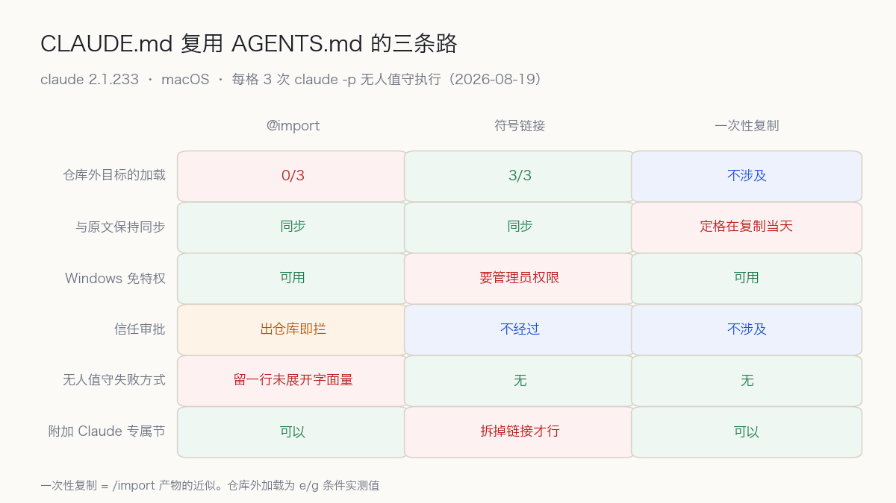

8 月 16 日，我发过一篇加载实测：76 次执行，量出 codex 和 Claude Code 各读各的规则文件，互不相认。那次测试里，CLAUDE.md 指向 AGENTS.md 的符号链接测到 3/3 满分，而 `@AGENTS.md` import 这条路，我标了「未测」就发了出去。补上 `@AGENTS.md` 实测数据前，先读了一遍官方 memory 文档。官方把三条路写在同一页：`@AGENTS.md` import、符号链接、`/import` 一次性复制。并排摆着，看不出偏好，像在说三条路随便选。

先说结论：三条路随便选不成立。两条主路在不同的层解析，在不同的条件下失败，且失败都不出声。import 要过一道信任审批，审批等的是一个会点头的人；CI、Git 钩子、不开交互界面的 `claude -p` 里没有人。符号链接在文件系统层解析完毕，信任审批根本看不见它。选法按条件分两支：引用目标在仓库内、团队有 Windows 开发者，用相对路径 import；目标在仓库外，或者规则必须在无人值守的路径上也活着，用符号链接。

## 官方文档把三条路写在同一页

> Claude Code reads `CLAUDE.md`, not `AGENTS.md`. If your repository already uses `AGENTS.md` for other coding agents, create a `CLAUDE.md` that imports it so both tools read the same instructions without duplicating them.
>
> — [How Claude remembers your project](https://code.claude.com/docs/en/memory)

引文下面紧跟着两条补充。一条说，不需要加 Claude 专属内容，符号链接也行，命令一行：

```bash
ln -s AGENTS.md CLAUDE.md
```

另一条针对 Windows：建符号链接需要管理员权限或开发者模式，官方建议 Windows 用户改走 `@AGENTS.md` import。第三条路是 `/import` 命令，把 AGENTS.md 一次性复制进 CLAUDE.md，连 MCP 服务器、自定义命令、子代理、技能一起搬过来，要求 Claude Code v2.1.213 以上。

import 规则也在这一页：相对路径、绝对路径都允许，相对路径以含 import 的文件为基准解析；引入的文件可继续递归引入，最深四跳。官方还写明：拆成 @path import 只帮组织，不省上下文，引入的文件在启动时全部加载。想靠拆文件省 token，这条路官方已经封死。

文档没写三条路各自在什么条件下失败、失败长什么样。这正是我拿七个目录去量的东西。

## 七个目录和一个金丝雀词

/tmp 下建七个目录，各对应一种配置，AGENTS.md 里埋一条指令：所有回答末尾必须带上 ZQ7CANARY。在每个目录跑三次同一句话：

```bash
claude -p 'Reply with exactly the word OK and nothing else.'
```

回答出现 ZQ7CANARY，规则文件就进了模型上下文；只有 OK，就是没进。这类探针词我叫金丝雀。环境是 macOS、claude 2.1.233，输出走 `--output-format json`，用户级 ~/.claude/CLAUDE.md 在七个条件下保持不变，不影响组间比较。

结果如下：

```text
a  CLAUDE.md 内容只有一行 @AGENTS.md（相对路径，仓库内）      3/3
b  CLAUDE.md 是指向 AGENTS.md 的符号链接                     3/3
c  CLAUDE.md 是 AGENTS.md 的一次性复制（/import 产物近似）    3/3
d  只有 AGENTS.md，没有 CLAUDE.md（对照组）                  0/3
e  CLAUDE.md 只有一行 @/tmp/claudemd-lab-ext/AGENTS.md       0/3
   （绝对路径，指向仓库外）
f  CLAUDE.md 用绝对路径引用仓库内的 AGENTS.md                 3/3
g  CLAUDE.md 是指向仓库外文件的符号链接                       3/3
```

d 是基准。Claude Code 不读 AGENTS.md，官方文档第一句话就这么写，对照组 0/3 印证了这条规则。a、b、c 三条路在常规形态下全绿，到这里确实怎么选都行。

分歧在 e、f、g。绝对路径写法本身没有罪：f 指向仓库内，3/3。同一种写法指向仓库外，e 掉到 0/3。g 用符号链接指向同一类仓库外文件，3/3。三个条件摆在一起，切割线落在两个变量上：路径解析到哪里，以及由谁来解析。

e 的失败没有任何声音，没有警告，也没有错误。我追加了一问，让模型不用任何工具、原样打印会话开始时收到的项目指令。模型打出来的是一行未展开字面量：`@/tmp/claudemd-lab-ext/AGENTS.md`。规则没上车，座位上只留了一张写着车次的纸条。比方到此为止，因为纸条至少看得见，而实际运行中没人会去翻那份指令。

## 分岔发生在解析的层

符号链接在文件系统层解析。Claude Code 的加载器去打开 CLAUDE.md 时，内核顺着链接递过目标文件，加载器手里就是项目根目录下的一个普通文件。「路径指向仓库外」的信息在解析时根本不存在，信任判断无从做起。g 条件 3/3 的原因就在这里：门没拦，是因为在这一层根本没有门。

`@` import 在加载器内部解析。路径还是字符串，加载器能判断路径是否越出工作目录。一旦越出，就挂上审批：

> An import in a project-level memory file is external when its path resolves outside your working directory... The first time Claude Code encounters external imports in a project, it shows an approval dialog listing the files. If you decline, the imports stay disabled and the dialog doesn't appear again.
>
> — [How Claude remembers your project](https://code.claude.com/docs/en/memory)

审批的结构是等一个人点头。`claude -p` 没有终端交互，没有人可等，于是不放行。注意失败形态：会话不报错，只是那一段内容缺席。安全视角下这叫 fail-closed，拦得对；运营视角下它静默，缺了一块没有任何信号。两个属性叠在一起，就是 e 条件的样子：一切正常，规则不在。

批准状态落在哪里，我也查了。e 条件跑完，项目目录下没有生成 `.claude/`，家目录配置里也找不到该路径记录。就算有人在交互式会话里点过允许，批准状态也不进仓库、不随代码走。同事 clone 下来，一切从头再来。「在我机器上是好的」是这种机制的必然产物，跟谁的操作都没关系。

审批门的走向有迹可循。2.1.232 的更新日志有一行：

> Cowork sessions no longer inline external @-imports from user-scope memory files
>
> — [Claude Code CHANGELOG — 2.1.232](https://github.com/anthropics/claude-code/blob/main/CHANGELOG.md)

同一批修补还封了符号链接抢占和沙箱绕过。external import 是一块正在收缩的信任面，方向明确：只会更紧，不会更松。

## 六个维度上的三方对照



六个维度，没有一行三方同分。挑几项重点说明。

同步。import 和符号链接都是活引用，AGENTS.md 改动，下次会话读到的就是新内容。一次性复制在复制完成那一刻开始过期，原文再改，副本不知情。`/import` 适合做迁移的第一步，不适合当长期结构。

Windows。符号链接的麻烦在权限前还有一层：Git 检出。`core.symlinks` 为 false 的环境里，Git 会把链接检出成普通文本文件，内容就是那条路径字符串。Claude Code 打开文件，读到的「规则」是一行路径。这比权限报错更隐蔽：文件确实在磁盘上、确实可读，只是内容不对。

专属节。符号链接是两个名字共一份内容，想给 Claude 加一段不该出现在 AGENTS.md 里的规则，得先把链接拆掉。import 天生留着口子，`@` 行下面接着写即可。官方把符号链接定位成「不需要加 Claude 专属内容时」的方案，边界划得很准。

token 一句话带过。三条路都不花钱，这次实测中缓存波动盖过了各条件的 prompt token 差，分不出干净差值，不给数字，只引官方定论：拆分帮组织，不省上下文。

## 反方：批准一次就够了

把反方摆到最强的位置上。e 条件 0/3，只因为 headless 环境没有对话框可弹。真实的开发大多发生在交互终端里，第一次遇到 external import 会弹窗，点一次允许，之后不再打扰。照反方的说法，这是拿只在脚本里出现的边角情况，吓唬每天开着终端写代码的人。

反方立场在单机交互场景下完全成立。一人开发、只在自己机器、只用交互式会话，批准确实只要一次，之后不会再遇到审批提示。只用纯交互模式的团队，后半部分大可不必在意，前半部分的数据留作参考即可。

反方立场在三个场景下会塌掉。第一，CI、Git 钩子、定时任务、子代理，这些路径上没有人点允许，而恰恰是这些路径最需要规则文件：人不在场时，规则文件是唯一还站着的约束。第二，批准以人和机器为单位。新同事入职后的第一个会话要重新审批；更麻烦的是拒绝那一侧，官方文档写明，点了拒绝后 import 保持禁用、对话框不再出现。一次手滑，规则从此静默缺席，没有明显的恢复入口。第三，实测确认批准状态不进仓库。批准状态没法提交进版本库，谈不上评审和随代码分发，每台新机器、每个新成员都会重演一遍流程。更常见的是不重演，也不知道自己错过了什么。

反方赢下单机交互那一格。但团队一旦把 `claude -p` 排进流水线、把钩子挂在提交上，在那些格子里，反方没有立足点。

## 明天早上的检查动作

仓库里有 CLAUDE.md，检查用不了五分钟。

第一步，找出引用行：

```bash
grep -n '@' CLAUDE.md
```

第二步，对每一条命中结果判断路径落点。相对路径以含 import 的文件为基准解析，别拿当前目录心算。落在仓库外的路径——家目录、/tmp、越出仓库的 `../`，要么把目标文件搬进仓库，要么换成符号链接。

第三步，不确定就埋金丝雀。AGENTS.md 末尾加一行「所有回答带上某个词」，跑一次 `claude -p` 看词出不出来，测完删掉。整个探测一分钟。

交互式下有官方确认入口：跑 `/context`，Memory files 列表应出现 CLAUDE.md。但 `/context` 救不了无人值守的路径。我查过 init 事件的 `memory_paths` 字段，七个条件下只报自动记忆目录，从不报 CLAUDE.md 的加载状态。headless 环境里，金丝雀是唯一可靠的探针。

Windows 成员多的团队加查一条：`git config core.symlinks`。若为 false，检出会把链接铺平成路径文本；把 `core.symlinks = true` 写入团队初始化脚本，才能避开这种静默失败。

## 适合谁，不适合谁

相对路径 `@AGENTS.md` 适合三种仓库：一份 AGENTS.md 喂两套工具的 monorepo；Windows、macOS、Linux 混编的团队；想在公共规则下追加 Claude 专属段落的项目。这三种情形里路径不出仓库，信任审批永远不会触发，import 的短板碰不到。

符号链接适合两种场景：把家目录个人规则复用到多个仓库，审批门在文件系统层之上，看不见链接；在 CI、钩子、定时任务里跑 `claude -p`，无人值守路径上，链接没有沉默环节。代价是把 `core.symlinks` 和 Windows 检出写进团队机器初始化清单。

有几种组合得单独点名：指向仓库外的 `@` import 挂在 headless 路径上，是一个安静的空位，规则以为在，实际不在；`core.symlinks=false` 的 Windows 检出配符号链接，链接变文本；为省 token 拆 import，官方明说无效；长期依赖 `/import` 的一次性复制，原文改动，副本不跟。最后一种最普遍：从来不确认规则是否真的上了车。headless 体系里失败的形态是沉默，不去确认，永远不会知道。

选型结论落在两个条件上。引用目标在仓库内、团队有 Windows 开发者，用相对路径 `@AGENTS.md`，Claude 专属规则接在那一行下面。目标在仓库外，或规则必须在无人值守路径上活着，用符号链接，同时把 `core.symlinks` 写进新人手册。两头都占的仓库，先把仓库外的依赖搬进仓库，再走相对路径 import。

选型结论有保质期。批准状态若能提交进仓库、随代码分发，import 的短板就补齐了，本篇后半可以作废。反方向的风险同样存在：2.1.232 在收紧符号链接和沙箱的特权，g 条件那扇没设防的侧门，未必一直开着。

把规则收进一个文件，起点是文档整理。走到 external import 这一步，问题换了性质，从「文件放在哪」变成「谁信任目标文件」。规则分发以排版问题开场，以权限问题收尾。符号链接今天还能绕过那道门，是刻意设计，还是排期没轮到，更新日志没有说。

## 参考资料

- [How Claude remembers your project（Claude Code memory）](https://code.claude.com/docs/en/memory)
- [Claude Code CHANGELOG — 2.1.232](https://github.com/anthropics/claude-code/blob/main/CHANGELOG.md)
