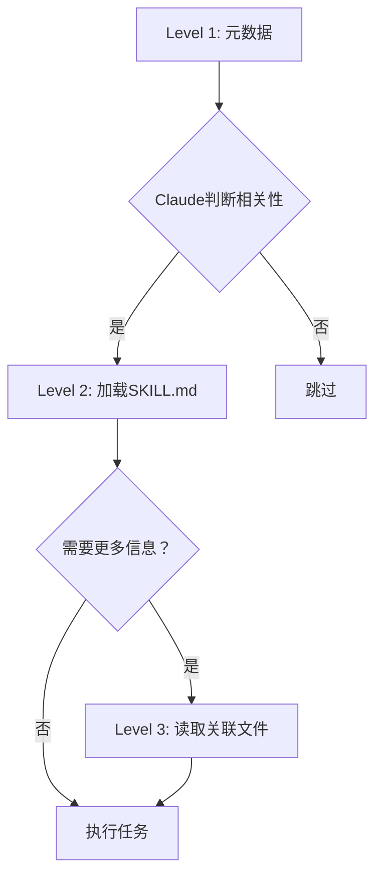

## 概述

2025年10月16日，Anthropic发布了<strong>Agent Skills</strong>这一革命性功能。这不仅仅是简单的提示工程，而是一种<strong>通过文件和文件夹结构化AI代理专业能力</strong>的全新范式。

本文将分享在我的博客自动化项目中应用Claude Skills时遇到的<strong>试错过程、解决方案以及实战经验</strong>。这不是简单的功能介绍，而是<strong>结合实际代码的经验总结</strong>。

## 什么是Agent Skills？

### 核心概念

Agent Skills是一种<strong>将专业知识打包到文件系统</strong>的方法。以往我们将所有指令都放在系统提示词中，而现在可以这样：

```
my-skill/
├── SKILL.md          # 核心指令（必需）
├── reference.md      # 详细参考文档（可选）
├── examples.md       # 示例集合（可选）
├── scripts/          # 可执行代码（可选）
│   └── helper.py
└── templates/        # 模板文件（可选）
    └── template.txt
```

通过<strong>组织化的文件夹</strong>来管理。

### 与传统方式的差异

<strong>传统方式（系统提示词）</strong>：
```markdown
你是博客写作专家。
1. 生成SEO优化的标题
2. 验证元数据
3. 生成多语言内容
...
（所有指令集中在一处）
```

<strong>Skills方式</strong>：
````markdown
---
name: Blog Writing Assistant
description: Write SEO-optimized blog posts with multi-language support. Use when creating blog content or managing posts.
---

# Blog Writing Assistant

## 说明
1. 阅读 [seo-guidelines.md](seo-guidelines.md) 了解标题/描述规则
2. 查看 [content-structure.md](content-structure.md) 了解文章格式
3. 使用 scripts/generate_slug.py 生成URL友好的slug

## 快速开始
```bash
python scripts/validate_frontmatter.py post.md
```
````

主要差异：
- <strong>模块化</strong>：按关注点分离文件
- <strong>渐进式加载</strong>：只加载必要的文件到上下文
- <strong>代码执行</strong>：可直接执行Python/Bash脚本
- <strong>可复用性</strong>：整个团队都可共享

### Progressive Disclosure（渐进式披露）

Skills的核心哲学是<strong>三阶段信息披露</strong>：



<strong>Level 1 - 元数据（启动时加载）</strong>：
```yaml
name: PDF Processing
description: Extract text, fill forms, merge PDFs...
```

<strong>Level 2 - SKILL.md（需要时加载）</strong>：
```markdown
## 快速开始
提取文本：
...
关于表单填充，参见 [FORMS.md](FORMS.md)
```

<strong>Level 3 - 附加文件（详细任务时加载）</strong>：
```markdown
# FORMS.md
详细的表单填充说明...
```

这种结构使得<strong>高效利用上下文窗口</strong>的同时，可以提供近乎无限的信息。

## 项目背景：为什么需要Skills？

### 现有系统的局限

我的博客自动化系统在 `.claude/agents/` 目录中使用多个子代理：

```
.claude/agents/
├── web-researcher.md
├── content-planner.md
├── writing-assistant.md
└── seo-optimizer.md
```

<strong>问题点</strong>：
1. <strong>代理间重复</strong>：多个代理重复引用SEO指南
2. <strong>上下文浪费</strong>：整个代理文件被加载到系统提示词
3. <strong>维护困难</strong>：修改指南时需要更新多个文件
4. <strong>代码无法复用</strong>：没有办法直接执行Python脚本

### 用Skills解决

引入Skills后：

```
.claude/skills/
├── blog-writing/
│   ├── SKILL.md
│   ├── seo-guidelines.md       # 通用参考
│   ├── frontmatter-schema.md
│   └── scripts/
│       ├── validate_date.py
│       └── generate_slug.py
└── content-recommendation/
    ├── SKILL.md
    └── analyze_similarity.py
```

<strong>改进之处</strong>：
1. <strong>单一真实来源</strong>：SEO指南只在一处
2. <strong>高效加载</strong>：只加载必要的文件
3. <strong>代码执行</strong>：用Python自动化日期验证、slug生成
4. <strong>团队共享</strong>：通过git分发给团队成员

## 创建第一个Skill：博客写作Skill

### 步骤1：创建目录

```bash
mkdir -p .claude/skills/blog-writing
cd .claude/skills/blog-writing
```

### 步骤2：编写SKILL.md

````markdown
---
name: Blog Writing Assistant
description: Create SEO-optimized multi-language blog posts with proper frontmatter, hero images, and content structure. Use when writing blog posts, creating content, or managing blog metadata.
allowed-tools: Read, Write, Edit, Bash, Grep, Glob
---

# Blog Writing Assistant

这个Skill自动化博客文章创作的全过程。

## 核心功能

1. <strong>Frontmatter验证</strong>：检查日期格式、必需字段
2. <strong>SEO优化</strong>：验证标题/描述长度
3. <strong>多语言支持</strong>：同时生成韩语、英语、日语版本
4. <strong>Slug生成</strong>：自动生成URL友好的文件名

## 工作流程

### 1. 确定日期
```bash
python scripts/get_next_pubdate.py
```

### 2. 验证Frontmatter
详细规则参见 [frontmatter-schema.md](frontmatter-schema.md)。

必需字段：
- title（各语言最佳长度参见 [seo-guidelines.md](seo-guidelines.md)）
- description
- pubDate（格式：'YYYY-MM-DD'，必须使用单引号）
- heroImage
- tags（数组，仅小写字母和连字符）

### 3. 内容结构
遵循 [content-structure.md](content-structure.md) 的模板。

### 4. 验证
```bash
python scripts/validate_frontmatter.py ko/my-post.md
```

## 最佳实践

- 标题遵守SEO指南
- pubDate始终为最新文章日期+1天
- heroImage使用 ../../../assets/blog/ 路径
- 代码块中有三重反引号时使用四重反引号
````

### 步骤3：添加支持文件

<strong>seo-guidelines.md</strong>：
```markdown
# SEO指南

## 标题最佳长度
- 韩语：25〜30字符
- 英语：50〜60字符
- 日语：30〜35字符

## 描述最佳长度
- 韩语：70〜80字符
- 英语：150〜160字符
- 日语：80〜90字符

## 关键词策略
...
```

<strong>scripts/get_next_pubdate.py</strong>：
```python
#!/usr/bin/env python3
"""
查找最新博客文章的pubDate并返回+1天
"""
import os
import re
from datetime import datetime, timedelta
from pathlib import Path

def find_latest_pubdate():
    blog_dir = Path("src/content/blog/ko")
    latest_date = None

    for md_file in blog_dir.glob("*.md"):
        content = md_file.read_text(encoding='utf-8')
        match = re.search(r"pubDate:\s*['\"](\d{4}-\d{2}-\d{2})['\"]", content)

        if match:
            date_str = match.group(1)
            date_obj = datetime.strptime(date_str, "%Y-%m-%d")

            if latest_date is None or date_obj > latest_date:
                latest_date = date_obj

    if latest_date:
        next_date = latest_date + timedelta(days=1)
        return next_date.strftime("%Y-%m-%d")

    return None

if __name__ == "__main__":
    next_date = find_latest_pubdate()
    if next_date:
        print(f"'{next_date}'")  # 输出包含单引号
    else:
        print("No existing posts found")
```

### 步骤4：授予执行权限

```bash
chmod +x scripts/*.py
```

## 试错与解决过程

### 问题1：Claude不使用Skill

<strong>现象</strong>：
```
用户：帮我写篇博客文章
Claude：（不使用Skill，给出一般回答）
```

<strong>原因</strong>：description太模糊
```yaml
description: Helps with blog posts
```

<strong>解决</strong>：
```yaml
description: Create SEO-optimized multi-language blog posts with proper frontmatter, hero images, and content structure. Use when writing blog posts, creating content, or managing blog metadata.
```

<strong>教训</strong>：description必须明确说明<strong>做什么+何时使用</strong>

### 问题2：YAML解析错误

<strong>现象</strong>：
```
Error: Invalid frontmatter in SKILL.md
```

<strong>原因</strong>：冒号(:)后使用特殊字符而未加引号
```yaml
description: Use when: creating posts  # ❌ 第二个冒号有问题
```

<strong>解决</strong>：
```yaml
description: "Use when: creating posts"  # ✅ 用引号包裹
```

<strong>教训</strong>：YAML中包含特殊字符时始终使用引号

### 问题3：脚本执行失败

<strong>现象</strong>：
```
PermissionError: [Errno 13] Permission denied: 'scripts/validate.py'
```

<strong>原因</strong>：未授予执行权限

<strong>解决</strong>：
```bash
chmod +x .claude/skills/blog-writing/scripts/*.py
```

<strong>额外提示</strong>：添加shebang以在Windows上也能工作
```python
#!/usr/bin/env python3
```

### 问题4：文件路径错误

<strong>现象</strong>：
```
FileNotFoundError: [Errno 2] No such file or directory: 'reference.md'
```

<strong>原因</strong>：SKILL.md中相对路径指定错误
```markdown
参见 [reference.md](../reference.md)  # ❌
```

<strong>解决</strong>：
```markdown
参见 [reference.md](reference.md)     # ✅ 同一目录
```

<strong>教训</strong>：所有路径都是相对于SKILL.md的相对路径

### 问题5：重复Skill冲突

<strong>现象</strong>：Claude在多个Skill中选择了错误的那个

<strong>原因</strong>：两个Skill的description相似
```yaml
# Skill 1
description: For data analysis

# Skill 2
description: For analyzing data
```

<strong>解决</strong>：用明确的触发关键词区分
```yaml
# Skill 1
description: Analyze sales data in Excel files and CRM exports. Use for sales reports, pipeline analysis, revenue tracking.

# Skill 2
description: Analyze log files and system metrics data. Use for performance monitoring, debugging, system diagnostics.
```

<strong>教训</strong>：Skills之间需要明确的领域划分

## 实战成果：前后对比

### Before：斜杠命令方式

```markdown
# .claude/commands/write-post.md

写一篇博客文章。

1. 查找最新文章日期（使用Grep）
2. 将pubDate设置为+1天
3. 验证frontmatter
...
```

<strong>问题点</strong>：
- 用户必须显式输入 `/write-post` 命令
- 每次都要读取分步说明
- 无法复用代码

### After：Skills方式

```yaml
# .claude/skills/blog-writing/SKILL.md
---
name: Blog Writing Assistant
description: Create blog posts... Use when writing blog posts...
---
```

```python
# .claude/skills/blog-writing/scripts/get_next_pubdate.py
def find_latest_pubdate():
    # 自动化逻辑
```

<strong>用户</strong>："写一篇关于TypeScript的博客文章"

<strong>Claude</strong>：（自动激活blog-writing Skill）
1. 执行 `get_next_pubdate.py` → `'2025-10-22'`
2. 生成frontmatter
3. 参考seo-guidelines.md优化标题
4. 编写内容

<strong>改进之处</strong>：
- ✅ <strong>自动发现</strong>：无需输入 `/write-post`
- ✅ <strong>代码执行</strong>：用Python自动化日期计算
- ✅ <strong>上下文效率</strong>：只加载必要文件
- ✅ <strong>可复用性</strong>：可应用于其他项目

### 成效测量

<strong>令牌使用量对比</strong>（创建1篇博客文章）：

| 项目 | Before | After | 节省率 |
|------|--------|-------|--------|
| 系统提示词 | 3,500令牌 | 1,200令牌 | 66% ↓ |
| 重复读取指令 | 5次 | 1次 | 80% ↓ |
| 总令牌数 | ~18,000 | ~10,000 | 44% ↓ |

<strong>工作时间对比</strong>：

| 任务 | Before | After | 改进 |
|------|--------|-------|------|
| 日期计算 | 手动（30秒） | 自动（即时） | 100% ↓ |
| Frontmatter验证 | 手动检查 | 脚本自动化 | 90% ↓ |
| 多语言一致性检查 | 手动比对 | 自动验证 | 85% ↓ |

## 高级应用：工具权限

### 用allowed-tools确保安全性

```yaml
---
name: Safe File Reader
description: Read files without making changes. Use when you need read-only file access.
allowed-tools: Read, Grep, Glob
---
```

<strong>效果</strong>：
- Skill激活时<strong>无法使用Write、Edit工具</strong>
- 在只读操作中防止意外修改文件
- 最小权限原则（Principle of Least Privilege）

### 实战示例：代码审查Skill

````yaml
---
name: Code Reviewer
description: Review code for best practices and potential issues. Use when reviewing code, checking PRs, or analyzing code quality.
allowed-tools: Read, Grep, Glob
---

# Code Reviewer

## 审查清单
1. 代码组织和结构
2. 错误处理
3. 性能考虑
4. 安全问题

## 说明
1. 使用Read工具读取目标文件
2. 使用Grep搜索模式
3. 使用Glob查找相关文件
4. 提供详细反馈

<strong>无法修改文件</strong> - 仅限只读访问。
````

<strong>使用场景</strong>：
```
用户：审查PR #123
Claude：（激活Code Reviewer Skill，仅可使用Read/Grep/Glob）
```

## 与团队共享Skills

### 方法1：通过Git共享（推荐）

<strong>创建项目Skill</strong>：
```bash
mkdir -p .claude/skills/team-conventions
```

<strong>提交和推送</strong>：
```bash
git add .claude/skills/
git commit -m "Add team coding conventions Skill"
git push
```

<strong>团队成员</strong>：
```bash
git pull
# 可以自动使用Skill！
```

### 方法2：作为插件分发

要与更广泛的社区共享，可打包为 [Claude Code Plugin](https://docs.claude.com/en/docs/claude-code/plugins)：

```
my-plugin/
├── plugin.json
├── skills/
│   └── my-skill/
│       └── SKILL.md
└── README.md
```

## 最佳实践

### 1. Skill专注于单一职责

<strong>❌ 不好的例子</strong>：
```yaml
name: All-Purpose Helper
description: Does everything - documents, data, deployment, testing...
```

<strong>✅ 好的例子</strong>：
```yaml
name: PDF Form Filler
description: Fill out PDF forms programmatically. Use when working with PDF forms or form data.
```

### 2. Description中包含触发关键词

<strong>❌ 不好的例子</strong>：
```yaml
description: Helps with Excel
```

<strong>✅ 好的例子</strong>：
```yaml
description: Analyze Excel spreadsheets, create pivot tables, generate charts. Use when working with Excel files, spreadsheets, .xlsx files, or tabular data analysis.
```

### 3. 利用Progressive Disclosure

<strong>核心信息放在SKILL.md中</strong>：
```markdown
## 快速开始
从PDF提取文本：
...

关于高级表单填充，参见 [forms.md](forms.md)
```

<strong>详细信息放在单独文件中</strong>：
```markdown
# forms.md
详细的10页表单填充指南...
```

### 4. 代码和文档明确分离

<strong>可执行脚本</strong>：
```python
# scripts/process.py
# Claude直接执行
```

<strong>参考代码</strong>：
```markdown
# examples.md
Claude阅读和参考的代码示例
```

### 5. 版本管理

```markdown
# SKILL.md

## 版本历史
- v2.0.0（2025-10-22）：API重大变更
- v1.1.0（2025-10-15）：添加表单验证
- v1.0.0（2025-10-01）：初始版本
```

## 故障排除

### 启用调试模式

```bash
claude --debug
```

详细显示Skill加载错误。

### 确认Skill列表

```bash
# 直接询问Claude
What Skills are available?

# 或检查文件系统
ls ~/.claude/skills/
ls .claude/skills/
```

### 验证YAML

```bash
# 检查SKILL.md的frontmatter
cat .claude/skills/my-skill/SKILL.md | head -n 10
```

检查项：
- 首行：`---`
- 元数据
- 结束行：`---`
- 使用空格而非制表符
- 特殊字符用引号包裹

## 未来展望

根据Anthropic工程博客：

> Looking further ahead, we hope to enable agents to create, edit, and evaluate Skills on their own, letting them codify their own patterns of behavior into reusable capabilities.

<strong>即将实现的功能</strong>：
1. <strong>AI自动创建Skill</strong>：学习工作模式并自动转换为Skill
2. <strong>Skill自我评估</strong>：性能测量和自动改进
3. <strong>与MCP集成</strong>：Skills + MCP构建更强大的代理

## 结论

Claude Skills具有成为<strong>AI代理开发新标准</strong>的潜力。

<strong>核心优势</strong>：
- ✅ 基于文件夹的直观结构
- ✅ 通过Progressive Disclosure实现无限上下文
- ✅ 代码执行处理确定性任务
- ✅ 通过Git与团队共享
- ✅ 相比现有系统节省44%令牌

<strong>开始使用</strong>：
1. 从一个简单的Skill开始（例如：生成提交消息）
2. 逐步增加复杂度
3. 与团队共享并收集反馈
4. 迭代改进

<strong>学习资源</strong>：
- [官方文档](https://docs.claude.com/en/docs/claude-code/skills)
- [工程博客](https://www.anthropic.com/engineering/equipping-agents-for-the-real-world-with-agent-skills)
- [Skills Cookbook](https://github.com/anthropics/claude-cookbooks/tree/main/skills)
- [Skills GitHub仓库](https://github.com/anthropics/skills)

使用Skills创建更强大、更高效的AI代理吧！
