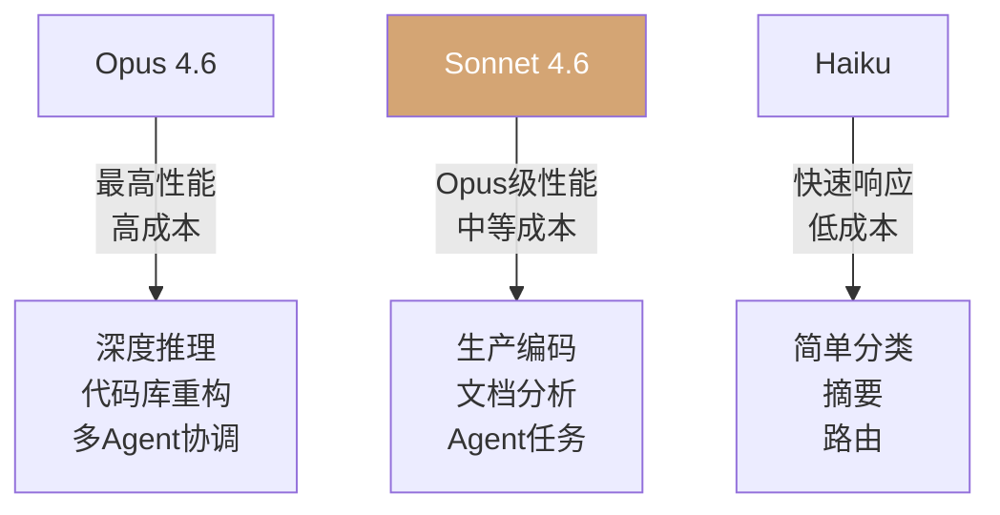

## 概述

Anthropic发布了<strong>Claude Sonnet 4.6</strong>。该模型在编码、计算机使用、长上下文推理、Agent规划、知识工作和设计方面实现了全面升级，并以Beta形式支持<strong>100万Token上下文窗口</strong>。该公告在Hacker News上获得724分，引发广泛关注，本文将进行深入分析。

## Sonnet 4 → 4.6：有什么变化

### 编码能力的飞跃

在Claude Code内部测试中，用户<strong>约70%的时间更偏好</strong>Sonnet 4.6而非Sonnet 4.5。主要改进包括：

- 修改代码前<strong>更有效地理解上下文</strong>
- <strong>更好地整合</strong>共享逻辑而非重复
- 长时间会话中的<strong>疲劳感降低</strong>
- 过度工程化和"偷懒"响应<strong>显著减少</strong>

令人惊讶的是，用户甚至以<strong>59%的比例更偏好Sonnet 4.6而非2025年11月发布的前沿模型Opus 4.5</strong>。

### 计算机使用（Computer Use）性能

Anthropic于2024年10月在业界首次推出了通用计算机使用模型。在<strong>OSWorld基准测试</strong>中，Sonnet模型在16个月内持续进步，Sonnet 4.6在复杂电子表格操作和多步骤Web表单填写中展现出<strong>人类级别的能力</strong>。

在安全方面，对提示注入攻击的抵抗力相比Sonnet 4.5<strong>大幅提升</strong>，达到与Opus 4.6相当的水平。

### 100万Token上下文窗口

Beta提供的<strong>1M Token上下文窗口</strong>可以在单次请求中容纳整个代码库、长篇合同或数十篇研究论文。关键在于它不仅处理长文本，更能<strong>跨整个上下文进行有效推理</strong>。

## 模型版本策略分析

### Anthropic的编号体系

Anthropic采用了独特的版本管理策略：

```
Sonnet 3.5 → Sonnet 4 → Sonnet 4.5 → Sonnet 4.6
Opus 4 → Opus 4.5 → Opus 4.6
```

<strong>0.1单位的点版本发布</strong>暗示了在保持架构的同时改进训练数据和微调的方法。这向用户传达了"无破坏性改进"的信任。

### 中端模型策略的意义


Sonnet 4.6的核心信息是<strong>"以Sonnet价格获得Opus级性能"</strong>。以前需要Opus才能完成的任务现在Sonnet就能胜任，这在成本效率方面具有革命性意义。

## 基准性能对比

### 主要成果

| 领域 | 对比Sonnet 4.5 | 备注 |
|------|---------------|------|
| Claude Code偏好度 | 70%偏好 | 用户评价 |
| 对比Opus 4.5偏好度 | 59%偏好 | 用户评价 |
| OfficeQA | 与Opus 4.6持平 | 文档理解 |
| Box推理Q&A | +15pp | 企业文档 |
| 保险基准 | 94% | 计算机使用最高分 |

### Vending-Bench Arena：战略思维能力

特别引人注目的是<strong>Vending-Bench Arena</strong>评估。该基准测试让AI模型运营模拟业务并相互竞争，Sonnet 4.6开发出了独特的策略：

1. 前10个月：<strong>集中投资产能</strong>（支出高于竞争对手）
2. 最后阶段：<strong>急转向盈利</strong>
3. 结果：<strong>大幅领先</strong>竞争模型

这超越了简单的基准分数，展示了<strong>长期规划和战略思维</strong>的能力。

## 成本效率分析

### 定价

Sonnet 4.6的定价与Sonnet 4.5保持一致：

- <strong>输入</strong>：$3 / 百万Token
- <strong>输出</strong>：$15 / 百万Token

### 性价比



Anthropic表示Sonnet 4.6的<strong>"性价比令人惊叹"</strong>，客户也确认它已成为<strong>重度Opus用户的可行替代方案</strong>。

## 平台更新

伴随Sonnet 4.6发布的重要平台改进包括：

- <strong>自适应思考（Adaptive Thinking）</strong>和扩展思考支持
- <strong>上下文压缩（Compaction）</strong>Beta：对话接近限制时自动总结旧上下文
- <strong>Web搜索/获取工具</strong>：新增自动过滤搜索结果的代码执行功能
- <strong>Claude in Excel</strong>：MCP连接器支持S&P Global、Bloomberg等外部数据
- 代码执行、记忆、程序化工具调用等<strong>正式发布（GA）</strong>

## 对开发者的启示

### 迁移建议

Anthropic建议从Sonnet 4.5迁移时<strong>探索思考努力（thinking effort）的完整范围</strong>。Sonnet 4.6即使关闭扩展思考也能提供强大性能，因此可以根据用途找到速度与性能的最佳平衡点。

### 模型选择指南

- <strong>Opus 4.6</strong>：需要最深层推理时（代码库重构、多Agent工作流）
- <strong>Sonnet 4.6</strong>：大多数生产任务（编码、文档分析、Agent任务）
- API标识符：`claude-sonnet-4-6`

## 结论

Claude Sonnet 4.6不仅仅是一个点版本更新，它标志着<strong>中端模型侵入前沿模型领域</strong>的战略转折点。在以Sonnet价格提供Opus级性能的同时，在计算机使用能力和长上下文处理方面实现了实质性飞跃。

Anthropic的模型进化速度正在加速，<strong>模型选择标准正从"最好的模型"转向"最适合用途的模型"</strong>。对开发者和企业而言，这意味着需要更精细的模型策略。

## 参考资料

- [Anthropic官方公告：Introducing Sonnet 4.6](https://www.anthropic.com/news/claude-sonnet-4-6)
- [Claude Sonnet 4.6 System Card](https://anthropic.com/claude-sonnet-4-6-system-card)
- [Hacker News讨论（724pts）](https://news.ycombinator.com/item?id=43083851)
- [OSWorld基准测试](https://os-world.github.io/)
- [Vending-Bench Arena](https://andonlabs.com/evals/vending-bench-arena)
