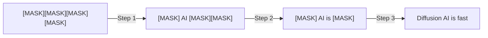
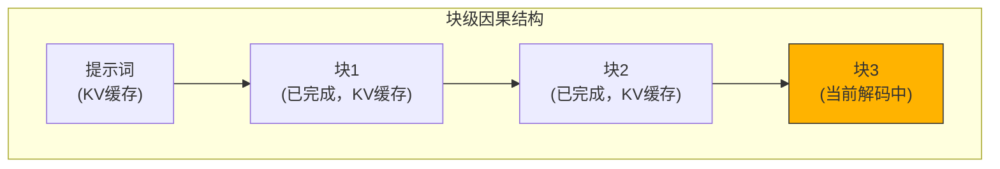

## 概述

Autoregressive（AR）语言模型逐个顺序生成token。这种方式虽然稳定，但本质上<strong>无法并行化</strong>。Together AI发布的<strong>Consistency Diffusion Language Models（CDLM）</strong>将扩散语言模型的推理速度提升最高14倍，同时几乎消除了质量损失，是一项革命性的技术。

## 什么是扩散语言模型（DLM）

扩散语言模型将图像生成中熟悉的扩散（Diffusion）概念应用于文本。从完全掩码的序列开始，<strong>经过多次迭代步骤逐步转换为干净的文本</strong>。

这种方法有两个核心优势：

- <strong>并行生成</strong>：一次迭代中可以同时确定多个token
- <strong>双向上下文</strong>：支持文本填充（infilling）和修改任务

## 传统DLM的两大瓶颈

然而，传统DLM存在严重的实用性问题：

1. <strong>无法使用KV缓存</strong>：双向注意力要求每个去噪步骤都重新计算整个上下文的注意力
2. <strong>需要大量迭代步骤</strong>：保持质量需要与生成长度成比例的去噪步骤，简单减少步骤会导致质量急剧下降

## CDLM的核心机制

CDLM是一种<strong>后训练（post-training）</strong>方法，同时解决这两个瓶颈。

### 1. 轨迹收集（Trajectory Collection）

首先使用教师DLM离线收集解码轨迹。设置生成长度256、块大小32，确保高质量的轨迹数据。

### 2. 块因果学生模型

教师模型使用双向注意力，而学生模型采用<strong>块级因果掩码</strong>。这实现了：

- 对提示词和已完成块的<strong>精确KV缓存</strong>
- 在当前块内保持双向上下文

### 3. 三个训练目标

CDLM同时优化三个损失函数：

- <strong>蒸馏损失（Distillation Loss）</strong>：在新解除掩码的位置学习教师模型的分布
- <strong>一致性损失（Consistency Loss）</strong>：保证块内时间一致性，引导稳定的多步转换
- <strong>辅助MLM损失（Auxiliary DLM Loss）</strong>：通过标准掩码去噪保持一般的token预测能力和推理能力

## 性能结果

CDLM-Dream的基准测试结果令人印象深刻：

| 基准测试 | 步骤减少 | 延迟改善 |
|---------|--------|---------|
| GSM8K-CoT | ~7.7x | <strong>11.2x</strong> |
| MBPP-Instruct | ~4.1x | <strong>14.5x</strong> |
| 整体平均 | 4.1x~7.7x | 最高14.5x |

关键在于这些速度提升<strong>几乎不损害准确度</strong>。简单减少步骤数会导致质量大幅下降，但CDLM基于训练的方法通过强制轨迹一致性解决了这个问题。

## 为什么块级DLM是最优选择

硬件利用率分析表明，块级DLM位于<strong>AR和传统DLM之间的最优点</strong>：

- <strong>AR解码</strong>：小批量时受内存限制（算术强度 ≈ 1）
- <strong>传统DLM</strong>：批量为1时就受计算限制（双向注意力导致饱和）
- <strong>块DLM（CDLM）</strong>：块内并行性分摊内存访问，同时保持实用的扩展性

## 实际意义

### AR一强时代的转折点

当前LLM生态由AR模型主导——GPT、Claude、Gemini都采用AR方式。CDLM证明扩散模型可以在<strong>速度和质量两方面都具有竞争力</strong>。

### 可扩展性

作为后训练方法，CDLM可以应用于更强大的DLM骨干网络。从大型教师模型收集轨迹并训练中等规模的学生模型也是一个有前景的方向。

### 新应用场景

利用双向上下文，扩散模型在AR模型难以自然处理的任务中展现优势：文本填充、纠正和重写。

## 结论

CDLM是扩散语言模型实用化的重要一步。块级因果结构实现了KV缓存，一致性训练大幅减少了步骤数同时保持了质量。最高14.5倍的延迟改善对以AR为中心的当前范式构成了有意义的挑战。

## 参考资料

- [Together AI官方博客 — Consistency Diffusion Language Models](https://www.together.ai/blog/consistency-diffusion-language-models)
- [Block Diffusion: Interpolating Between Autoregressive and Diffusion Language Models](https://arxiv.org/abs/2503.09573)
- [Beyond Next-Token Prediction: A Performance Characterization of Diffusion versus Autoregressive Language Models](https://arxiv.org/abs/2412.00024)
