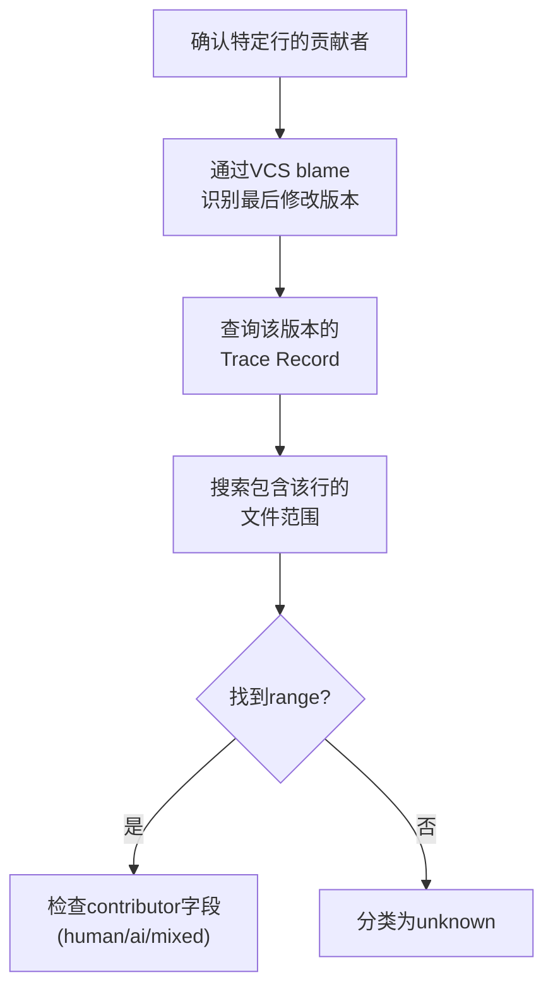
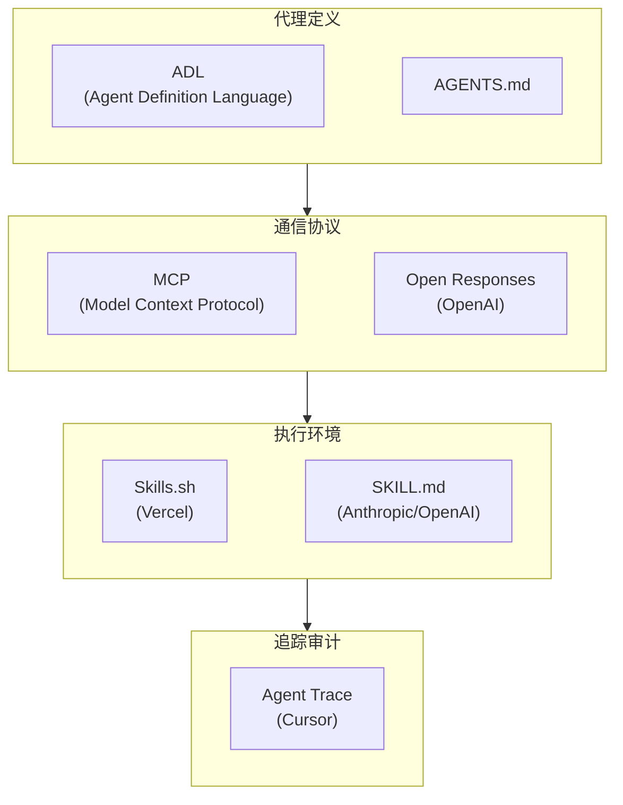

## 概述

2026年1月，Cursor发布了一项名为<strong>Agent Trace</strong>的开放规范（RFC）。这项从版本0.1.0开始的规范，是业界对"如何追踪AI编写的代码"这一问题的第一个系统性答案。

当前大多数开发团队使用的`git blame`只能告诉我们"谁最后一次修改了这一行"。但在AI编码工具已经普及的今天，我们真正需要的信息是不同的。<strong>这段代码是由人类编写的，还是由AI生成的，或者是两者协作的结果？</strong>

本文将深入分析Agent Trace的技术规范，并从工程经理（EM）和首席技术官（CTO）的角度阐明为什么这项标准如此重要。

## Agent Trace是什么

Agent Trace是一项开放规范，用于在版本管理的代码库中以<strong>厂商中立的JSON格式记录AI贡献和人类贡献</strong>。

其核心特性如下：

<strong>文件和行级别的贡献追踪</strong>：不仅仅是"这个提交涉及AI"，而是记录某个特定文件第几行到第几行是由AI生成的。

<strong>四种贡献者类型分类</strong>：分为`human`（人类直接编写）、`ai`（AI生成）、`mixed`（人类编辑AI输出或反之）、`unknown`（来源不明）。

<strong>厂商中立设计</strong>：无论来自Cursor、Copilot、Claude Code还是其他工具，都可以用相同的格式记录。

<strong>存储库无关</strong>：可以存储在本地文件、git notes、数据库等任何地方。

## Trace Record的结构

Agent Trace的基本单位是<strong>Trace Record</strong>。让我们查看其JSON架构：

```json
{
  "version": "0.1.0",
  "id": "550e8400-e29b-41d4-a716-446655440000",
  "timestamp": "2026-01-15T09:30:00Z",
  "vcs": {
    "type": "git",
    "revision": "a1b2c3d4e5f6..."
  },
  "tool": {
    "name": "cursor",
    "version": "0.45.0"
  },
  "files": [
    {
      "path": "src/utils/parser.ts",
      "conversations": [
        {
          "url": "https://cursor.com/conversations/abc123",
          "ranges": [
            {
              "start_line": 15,
              "end_line": 42,
              "contributor": "ai",
              "content_hash": "murmur3:9f2e8a1b"
            },
            {
              "start_line": 43,
              "end_line": 50,
              "contributor": "mixed"
            }
          ]
        }
      ]
    }
  ],
  "metadata": {
    "dev.cursor": {
      "session_id": "xyz789"
    }
  }
}
```

这个结构中有几个值得注意的地方：

<strong>基于对话的分组</strong>：将AI在一次对话会话中生成的多个代码范围组合在一起管理。这是追踪"为什么代码以这种方式生成"的关键。

<strong>通过content_hash追踪代码移动</strong>：即使代码因重构而移到不同的文件或位置，也能通过哈希值保持原始贡献信息。

<strong>模型标识符</strong>：以`provider/model-name`格式（例如：`anthropic/claude-opus-4-5-20251101`）记录哪个AI模型生成了代码。

## 行追踪方法论

在Agent Trace中确认特定行贡献者的过程如下：



这种方法与传统的`git blame`互补运作。`git blame`告诉我们"谁最后修改了这行"，而Agent Trace额外告诉我们"那次修改是AI做的还是人类做的"。

## 对EM和CTO为什么重要

### 1. 代码审查工作流的演进

目前大多数团队对Pull Request中的所有代码进行相同级别的审查。但随着Agent Trace的引入，审查策略可以变得差异化：

<strong>AI生成的代码</strong>：重点审查逻辑正确性、边界情况、安全漏洞

<strong>人类编写的代码</strong>：重点审查设计意图、架构适配性

<strong>Mixed代码</strong>：验证人类如何编辑了AI输出，修改理由是否合理

通过这种方式，可以更有效地分配审查时间。

### 2. 团队能力评估的新标准

AI工具使用率高不一定意味着生产力高。分析Agent Trace数据可以了解：

<strong>AI生成代码的修改率</strong>：AI生成的代码中需要人类重新修改的比例。这个值高意味着需要重新评估提示词质量或AI工具选择。

<strong>工具间的代码质量对比</strong>：可以比较Cursor、Copilot、Claude Code等不同工具生成代码的缺陷率。

<strong>团队成员的AI使用模式</strong>：数据驱动地判断谁在有效使用AI，哪些领域需要AI使用培训。

### 3. 合规性和审计应对

金融、医疗、国防等受监管行业对代码来源的明确性要求不断增加。Agent Trace在以下方面有帮助：

<strong>审计追踪</strong>：能定量报告代码的AI贡献比例。

<strong>许可证风险管理</strong>：识别AI生成的代码部分，明确指定许可证审查对象。

<strong>安全漏洞应对</strong>：若在AI生成代码中发现安全问题，可同时审查同一对话会话中生成的其他代码。

## 支持的VCS和可扩展性

Agent Trace除了支持Git外，还支持多个版本控制系统：

| VCS | 版本格式 | 特点 |
|-----|---------|------|
| git | 40字符hex SHA | 最常见 |
| jj (Jujutsu) | Change ID | 对rebase稳定 |
| hg (Mercurial) | Changeset ID | 支持传统项目 |
| svn | Revision 号 | 企业环境 |

此外，`metadata`字段可以使用反向域名标记法（例如：`dev.cursor`、`com.github`）添加厂商特定的扩展数据，这样既能保证兼容性，又能存储每个工具的独特信息。

## 故意不涉及的领域

Agent Trace规范显式排除的领域同样重要：

<strong>法律所有权/版权</strong>：AI生成代码的法律所有权问题超出该规范范围。这是法律和政策的问题。

<strong>学习数据来源追踪</strong>：不追踪AI模型是基于哪些学习数据来生成代码的。

<strong>代码质量评估</strong>：不判断AI生成代码是好是坏。这是代码审查和测试的领域。

<strong>UI表现方式</strong>：如何可视化追踪数据由各工具实现决定。

这些边界设定是让规范务实和可采用的关键。

## 实际应用场景

### 场景1：AI编码工具采用效果测量

假设团队在3个月前引入了Claude Code。通过分析Agent Trace数据，可以生成如下报告：

```
AI代码贡献分析报告 (2026年第一季度)
=====================================
代码总行数: 45,000
├── human: 28,000 (62.2%)
├── ai: 12,000 (26.7%)
├── mixed: 4,500 (10.0%)
└── unknown: 500 (1.1%)

AI生成代码修改率: 23%
(AI生成的12,000行中，2,760行在后续提交中被人类修改)

模型分布:
├── anthropic/claude-opus-4-5: 7,200行 (修改率 18%)
├── openai/gpt-5.2: 3,800行 (修改率 31%)
└── cursor/custom: 1,000行 (修改率 15%)
```

有了这样的数据，可以向管理层定量报告AI工具投资的回报。

### 场景2：安全事件响应

当生产环境中发现安全漏洞时，可以通过Agent Trace确认该代码是否由AI生成，并将同一对话会话中生成的其他代码也纳入安全检查范围。

## AI代理标准化的大图景

Agent Trace并非独立存在。在2025〜2026年期间，AI代理生态系统中正同时出现多个标准：



Agent Trace在这个生态系统中负责<strong>"执行后(post-execution)"</strong>阶段。代理被定义（ADL/AGENTS.md）、通信（MCP/Open Responses）、执行（Skills）后，Agent Trace的作用是追踪结果物。

## 当前限制和未解决的问题

处于RFC状态，仍有一些未解决的问题：

<strong>合并和rebase处理</strong>：分支合并时Trace Record应该如何合并仍缺乏明确答案。

<strong>大规模代理变更</strong>：AI一次修改数百个文件的性能和存储策略仍未确定。

<strong>采用激励</strong>：需要激励工具厂商采用该规范。目前由Cursor主导，Vercel、Cognition、Cloudflare等作为合作伙伴参与。

## 结论

Agent Trace是AI编码时代对<strong>"谁编写了这段代码"</strong>这一根本性问题的第一个系统性答案。尽管仍处于RFC阶段，但它在代码审查、团队能力评估、合规性这三个实际应用领域拥有立即提供价值的潜力。

特别是从EM或CTO的角度，在关注这项规范发展的同时，提前准备好测量团队内AI编码工具使用情况的基础框架，是一项明智的战略。随着Agent Trace的成熟，其数据将成为AI工具投资决策和团队运营优化的核心依据。

## 参考资源

- [Agent Trace官方网站](https://agent-trace.dev/)
- [Cursor Agent Trace GitHub仓库](https://github.com/cursor/agent-trace)
- [InfoQ: Agent Trace分析文章](https://www.infoq.com/news/2026/02/agent-trace-cursor/)
- [Cognition: Agent Trace上下文图](https://cognition.ai/blog/agent-trace)
