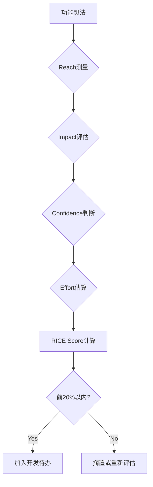
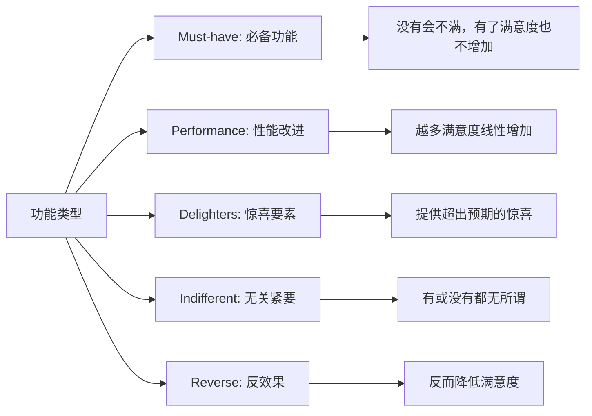
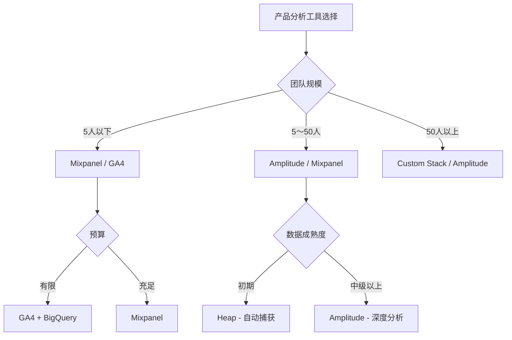
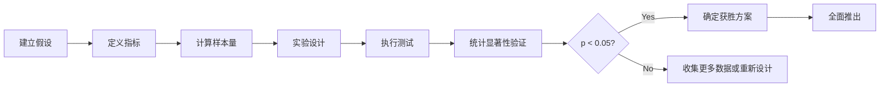
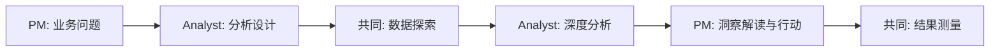

## 概述：为什么数据驱动决策至关重要

产品经理（Product Manager, PM）每天都要做出数十个决策。是优先开发哪个功能，如何改善用户体验，资源应该投入到哪里等等，这些都是重要选择的连续。虽然直觉和经验也很重要，但<strong>基于数据的决策</strong>可以大幅提高成功率。

Netflix、Spotify、Amazon等全球企业通过数据驱动文化引领市场的原因很明确。数据能够实现以下目标：

- <strong>客观的优先级决策</strong>：基于实际用户行为而非主观意见
- <strong>快速实验与验证</strong>：通过A/B测试快速验证假设
- <strong>风险最小化</strong>：在大规模投资前用数据验证方向
- <strong>团队对齐</strong>：通过共同指标在利益相关者之间达成共识

本文详细介绍PM在实务中可以直接应用的核心指标、决策框架、分析工具以及实战案例。

## 核心指标：测量产品健康状态

### 1. 用户参与度指标

#### DAU/MAU Ratio（日活跃用户数/月活跃用户数比率）

<strong>DAU/MAU比率</strong>是衡量用户参与度最基本的指标。

```
DAU/MAU Ratio = (日活跃用户数 / 月活跃用户数) × 100%
```

<strong>基准值</strong>：
- 20%以上：优秀的参与度（例如：Facebook、Instagram）
- 10〜20%：良好水平（大多数社交应用）
- 10%以下：需要改进（实用工具类应用除外）

<strong>实务应用</strong>：
- 测量产品的"习惯养成力"
- 追踪新功能发布后的参与度变化
- 与竞争对手进行基准比较

#### Retention Rate（留存率）

衡量用户使用产品的持续时间。

<strong>按测量时间点分类</strong>：
- <strong>Day 1 Retention</strong>：注册次日留存率（目标30〜40%以上）
- <strong>Day 7 Retention</strong>：一周后（20〜30%）
- <strong>Day 30 Retention</strong>：一个月后（10〜20%）

<strong>Cohort Retention分析SQL</strong>：

```sql
-- 按队列分析留存率
WITH user_cohorts AS (
  SELECT
    user_id,
    DATE_TRUNC('month', first_login_date) AS cohort_month
  FROM users
),
cohort_activity AS (
  SELECT
    uc.cohort_month,
    DATE_TRUNC('month', a.activity_date) AS activity_month,
    COUNT(DISTINCT uc.user_id) AS active_users
  FROM user_cohorts uc
  JOIN user_activity a ON uc.user_id = a.user_id
  WHERE a.activity_date >= uc.cohort_month
  GROUP BY 1, 2
)
SELECT
  cohort_month,
  activity_month,
  active_users,
  ROUND(100.0 * active_users /
    FIRST_VALUE(active_users) OVER (
      PARTITION BY cohort_month
      ORDER BY activity_month
    ), 2
  ) AS retention_rate
FROM cohort_activity
ORDER BY cohort_month, activity_month;
```

### 2. 业务成果指标

#### NPS（Net Promoter Score，净推荐值）

衡量用户满意度和推荐意愿的指标。

```
NPS = (推荐客户比例) - (不推荐客户比例)
```

<strong>分数解读</strong>：
- 9〜10分：Promoters（推荐者）
- 7〜8分：Passives（中立者）
- 0〜6分：Detractors（批评者）

<strong>按行业基准值</strong>：
- SaaS：30〜40
- 电商：30〜50
- 消费类应用：20〜40

#### Conversion Rate & Funnel Analysis（转化率与漏斗分析）

衡量用户旅程各阶段的转化率。

<strong>电商漏斗示例</strong>：
```
访问 → 商品浏览 → 加入购物车 → 结账 → 完成购买
100% →   60%    →    25%    →  15%  →   12%
```

<strong>Funnel分析SQL</strong>：

```sql
-- 用户旅程漏斗分析
WITH funnel_events AS (
  SELECT
    user_id,
    MAX(CASE WHEN event_name = 'page_view' THEN 1 ELSE 0 END) AS viewed,
    MAX(CASE WHEN event_name = 'product_click' THEN 1 ELSE 0 END) AS clicked,
    MAX(CASE WHEN event_name = 'add_to_cart' THEN 1 ELSE 0 END) AS added_cart,
    MAX(CASE WHEN event_name = 'checkout' THEN 1 ELSE 0 END) AS checked_out,
    MAX(CASE WHEN event_name = 'purchase' THEN 1 ELSE 0 END) AS purchased
  FROM user_events
  WHERE event_date BETWEEN '2025-10-01' AND '2025-10-31'
  GROUP BY user_id
)
SELECT
  SUM(viewed) AS total_views,
  SUM(clicked) AS total_clicks,
  ROUND(100.0 * SUM(clicked) / NULLIF(SUM(viewed), 0), 2) AS click_rate,
  SUM(added_cart) AS total_cart_adds,
  ROUND(100.0 * SUM(added_cart) / NULLIF(SUM(clicked), 0), 2) AS cart_rate,
  SUM(checked_out) AS total_checkouts,
  ROUND(100.0 * SUM(checked_out) / NULLIF(SUM(added_cart), 0), 2) AS checkout_rate,
  SUM(purchased) AS total_purchases,
  ROUND(100.0 * SUM(purchased) / NULLIF(SUM(checked_out), 0), 2) AS purchase_rate
FROM funnel_events;
```

### 3. 按产品类型的定制指标

| 产品类型 | 核心指标 | 说明 |
|---------|----------|------|
| <strong>B2B SaaS</strong> | MRR（Monthly Recurring Revenue，月度经常性收入） | 月度经常性收入 |
| | Churn Rate（流失率） | 流失率（目标低于5%） |
| | CAC Payback Period（客户获取成本回收期） | 客户获取成本回收期 |
| <strong>Marketplace（交易平台）</strong> | GMV（Gross Merchandise Value，商品交易总额） | 商品交易总额 |
| | Take Rate（平台抽佣率） | 平台抽佣率 |
| | Liquidity（供需匹配率） | 双边市场平衡度 |
| <strong>Consumer Apps（消费类应用）</strong> | Session Length（会话时长） | 平均使用时间 |
| | Screen Flow Efficiency（屏幕流转效率） | 屏幕转换效率 |
| | Feature Adoption Rate（功能采用率） | 新功能采用率 |

## 决策框架：优先做什么

### 1. RICE Framework（RICE框架）

RICE是<strong>Reach</strong>（覆盖面）、<strong>Impact</strong>（影响力）、<strong>Confidence</strong>（信心）、<strong>Effort</strong>（工作量）的缩写，用于定量评估功能优先级。

```
RICE Score = (Reach × Impact × Confidence) / Effort
```

<strong>各要素说明</strong>：

| 要素 | 测量方法 | 示例 |
|-----|----------|------|
| <strong>Reach</strong> | 季度内受影响的用户数 | 10,000人 |
| <strong>Impact</strong> | 每用户影响度（0.25〜3） | 2.0（大影响） |
| <strong>Confidence</strong> | 信心度（0〜100%） | 80% |
| <strong>Effort</strong> | 开发工时（人月） | 2个月 |

<strong>实战示例</strong>：



<strong>实际计算示例</strong>：

| 功能 | Reach | Impact | Confidence | Effort | RICE Score |
|-----|-------|--------|------------|--------|-----------|
| 添加社交登录 | 15,000 | 1.5 | 90% | 1 | 20,250 |
| AI推荐系统 | 25,000 | 2.5 | 60% | 4 | 9,375 |
| 深色模式 | 8,000 | 1.0 | 100% | 0.5 | 16,000 |

结果：<strong>社交登录</strong>获得最高RICE分数，排第一优先级

### 2. ICE Framework（简化版框架）

需要快速决策时使用的轻量级框架。

```
ICE Score = (Impact + Confidence + Ease) / 3
```

- <strong>Impact</strong>：影响力（1〜10）
- <strong>Confidence</strong>：信心度（1〜10）
- <strong>Ease</strong>：实现容易度（1〜10）

<strong>应用场景</strong>：冲刺规划、初创公司早期阶段、快速实验评估

### 3. Kano Model（用户满意度分析模型）

根据用户满意度标准对功能进行分类。



<strong>实务应用</strong>：
1. <strong>Must-have优先满足</strong>：登录、搜索、支付等
2. <strong>Performance持续改进</strong>：速度、准确度、用户体验
3. <strong>Delighters选择性投资</strong>：差异化要点

### 4. Value vs Effort Matrix（价值-工作量矩阵）

通过可视化快速识别优先级。

```
高价值
    ↑
    │  Quick Wins     │  Major Projects
    │  (立即执行)      │  (计划后执行)
────┼──────────────┼────────────────→
    │  Fill-ins       │  Time Sinks
    │  (有空再做)      │  (搁置/废弃)
    ↓
低价值          低工作量 ← → 高工作量
```

## 数据分析工具：选择什么

### 主要产品分析工具对比

| 工具 | 优势 | 劣势 | 价格 | 推荐对象 |
|-----|------|------|--------|----------|
| <strong>Amplitude</strong> | - 强大的行为队列分析<br>- 深度漏斗分析<br>- 预测分析 | - 学习曲线陡峭<br>- 配置复杂度高 | $$$ | B2B SaaS、成长期初创公司 |
| <strong>Mixpanel</strong> | - 直观的UI<br>- 实时分析<br>- 优秀的文档 | - 大规模数据处理时较慢 | $$ | 消费类应用、中小规模团队 |
| <strong>Heap</strong> | - 自动捕获（无需代码更改）<br>- 可进行回溯分析 | - 数据量大时成本高<br>- 定制化受限 | $$$ | 快速原型开发、早期阶段 |
| <strong>Google Analytics 4</strong> | - 免费<br>- 广泛集成<br>- 强大的机器学习 | - 界面复杂<br>- 产品特定功能不足 | Free | 预算有限、以网页为中心的产品 |

### 工具选择标准



### 基于SQL的自建分析栈

许多企业青睐<strong>数据仓库 + SQL + BI工具</strong>组合。

<strong>优势</strong>：
- 完全的数据控制权
- 成本效益（大规模时）
- 定制化自由度

<strong>架构示例</strong>：
```
数据收集: Segment / RudderStack
    ↓
存储: Snowflake / BigQuery
    ↓
转换: dbt (data build tool)
    ↓
可视化: Looker / Tableau / Metabase
```

## A/B测试：通过科学实验验证

### A/B测试流程



### 样本量计算

<strong>所需样本数公式</strong>（简化版）：

```
n = (Z² × p × (1-p)) / E²

n: 所需样本数
Z: 置信水平（95% → 1.96）
p: 预期转化率
E: 容许误差
```

<strong>实用计算器</strong>：[Evan Miller's Sample Size Calculator](https://www.evanmiller.org/ab-testing/sample-size.html)

<strong>示例</strong>：
- 当前转化率：10%
- 最小可检测效应：2%（绝对值）
- 置信水平：95%
- 检验力：80%

→ <strong>所需样本数：约3,800人/组</strong>

### A/B测试最佳实践

#### 1. 建立明确假设

<strong>不好的例子</strong>："试试改变按钮颜色"

<strong>好的例子</strong>：
```
假设：将CTA按钮从蓝色改为绿色，
      因为增加用户心理"安全感"，
      注册转化率将提高5%以上。

零假设（H0）：颜色变化不影响转化率。
备择假设（H1）：绿色按钮提高转化率。
```

#### 2. 只测试一个变量（谨慎多变量测试）

- <strong>A/B测试</strong>：只改变按钮颜色
- <strong>多变量测试</strong>：同时改变按钮颜色+文案+位置（复杂度高）

#### 3. 足够的测试周期

<strong>最短周期</strong>：1〜2周（消除星期效应）
<strong>注意</strong>：太短会受"新鲜感效应"影响

#### 4. 按细分群体分析

不要只看总体平均值，要按细分群体分析。

```sql
-- 按细分群体分析A/B测试结果
SELECT
  user_segment,
  experiment_group,
  COUNT(DISTINCT user_id) AS users,
  SUM(converted) AS conversions,
  ROUND(100.0 * SUM(converted) / COUNT(DISTINCT user_id), 2) AS conversion_rate
FROM ab_test_results
WHERE test_id = 'checkout_button_color'
GROUP BY user_segment, experiment_group
ORDER BY user_segment, experiment_group;
```

<strong>结果示例</strong>：

| Segment | Group | Users | Conversions | Conv. Rate |
|---------|-------|-------|-------------|-----------|
| New Users | Control | 5,000 | 500 | 10.0% |
| New Users | Treatment | 5,000 | 575 | 11.5% |
| Returning | Control | 3,000 | 600 | 20.0% |
| Returning | Treatment | 3,000 | 585 | 19.5% |

<strong>洞察</strong>：新用户反应积极但回访用户反应消极 → <strong>考虑只针对新用户</strong>

### 常见A/B测试错误

#### 1. Peeking Problem（中途查看问题）

实验中途查看结果并提前结束会增加<strong>假阳性（False Positive）</strong>概率。

<strong>解决方案</strong>：顺序测试或严格遵守预定结束时间

#### 2. Simpson's Paradox（辛普森悖论）

整体上A占优，但按细分群体B占优的情况。

<strong>示例</strong>：
```
整体：Treatment胜利（12% vs 11%）
移动端：Control胜利（8% vs 7%）
桌面端：Control胜利（15% vs 14%）
```

→ Treatment组被分配了更多高转化率细分群体（随机分配失败）

#### 3. 统计显著性 ≠ 实际意义

即使达到p < 0.05，<strong>效果量小可能没有执行价值</strong>。

<strong>判断标准</strong>：
- 绝对值：转化率提高0.1%（10.0% → 10.1%）
- 相对值：提高1%
- 业务影响：月收入增加$500

→ 需要评估相对开发成本的ROI

## 实战案例：全球企业的数据应用

### 1. Netflix：个性化推荐系统

<strong>挑战</strong>：如何让用户在数千万内容中找到想看的内容？

<strong>数据驱动解决方案</strong>：
- <strong>75%的观看来自推荐</strong>
- 通过A/B测试优化缩略图
- 针对每个用户显示不同缩略图（个性化）

<strong>核心指标</strong>：
- Effective Catalog Size：实际被观看的内容比例
- Take Rate：推荐点击后观看转化率

<strong>结果</strong>：推荐算法创造年度<strong>超过10亿美元价值</strong>（防止流失）

### 2. Spotify：Discover Weekly（每周发现）

<strong>挑战</strong>：引导用户发现新音乐

<strong>数据应用</strong>：
- 协同过滤 + NLP（歌词分析）
- 利用收听历史、跳过模式、播放列表保存数据

<strong>A/B测试结果</strong>：
- <strong>播放时间增加9%</strong>
- 高级会员转化率提高5%

<strong>核心洞察</strong>："新鲜感vs熟悉感"平衡（70%熟悉类型 + 30%新类型）

### 3. Airbnb：动态定价（智能定价）

<strong>挑战</strong>：帮助房东设定最优价格

<strong>数据模型</strong>：
- 需求预测：地区活动、季节性、搜索趋势
- 供给分析：周边房源价格、便利设施
- 机器学习推荐最优价格

<strong>结果</strong>：
- 房东收入<strong>平均增加4%</strong>
- 预订率提升8%

### 4. Amazon：一键下单

<strong>假设</strong>：支付步骤越多流失率越高

<strong>实验</strong>：
- Control：原有3步支付
- Treatment：一键支付

<strong>结果</strong>：
- 转化率<strong>提高20%以上</strong>
- 获得专利并确保竞争优势

<strong>教训</strong>：<strong>消除摩擦是关键</strong>

## 避免数据陷阱：常见错误

### 1. Correlation ≠ Causation（相关性 ≠ 因果关系）

<strong>示例</strong>：
- 观察："收到更多应用推送通知的用户回访率更高"
- 错误结论："发送更多推送通知会提高回访率"
- 实际原因：活跃用户本来就收到更多推送

<strong>解决方案</strong>：<strong>随机对照试验（RCT）</strong> = A/B测试

### 2. Vanity Metrics（虚荣指标）

不要执着于无意义的数字。

| Vanity Metric | Actionable Metric |
|--------------|------------------|
| 总会员数 | 月活跃用户（MAU） |
| 页面浏览量 | 每会话目标达成率 |
| 应用下载数 | Day 7留存率 |
| 粉丝数 | 参与率（点赞、评论） |

### 3. Survivorship Bias（幸存者偏差）

<strong>示例</strong>："成功用户都完成了教程"
→ 但教程中流失的用户被排除在分析之外

<strong>解决方案</strong>：<strong>包含流失用户分析</strong>

```sql
-- 比较流失用户vs留存用户的行为
SELECT
  CASE
    WHEN last_login_date < CURRENT_DATE - INTERVAL '30 days' THEN 'Churned'
    ELSE 'Active'
  END AS user_status,
  AVG(sessions_count) AS avg_sessions,
  AVG(feature_usage_count) AS avg_feature_usage,
  AVG(tutorial_completion_rate) AS avg_tutorial_completion
FROM user_metrics
GROUP BY user_status;
```

### 4. HARKing（结果已知后假设）

看到数据后再建立假设 = <strong>违反科学方法</strong>

<strong>正确顺序</strong>：
1. 建立假设
2. 设计实验
3. 收集数据
4. 分析并得出结论

<strong>错误顺序</strong>：
1. 收集数据
2. 发现模式
3. 事后添加假设（事后合理化）

### 5. 多重比较问题

同时进行20个A/B测试，偶然会有1个出现p < 0.05。

<strong>解决方案</strong>：应用<strong>Bonferroni校正</strong>
```
校正显著性水平 = 0.05 / 测试数量
```

例：10个测试 → 应用p < 0.005标准

## 构建数据文化：组织层面的变革

### 1. 数据素养教育

<strong>所有团队成员都应该能够阅读和解释数据。</strong>

<strong>教育计划</strong>：
- 基础SQL培训（2周课程）
- 统计学101：p值、置信区间、样本量
- 如何阅读仪表板（理解关键指标）

<strong>推荐资源</strong>：
- Mode Analytics SQL Tutorial
- Khan Academy Statistics
- Amplitude's Product Analytics Playbook

### 2. 自助分析基础设施

PM应该能够在不依赖数据团队的情况下直接进行分析。

<strong>构建要素</strong>：
- 标准化数据仓库
- 预定义指标（指标层）
- 仪表板模板
- SQL查询库

<strong>工具示例</strong>：
- dbt（数据转换和文档化）
- Looker / Tableau（自助BI）
- Metabase（开源替代方案）

### 3. 数据治理

<strong>需要定义的内容</strong>：
- <strong>北极星指标</strong>：公司整体最优先指标
- 指标定义文档（DAU的确切定义是什么？）
- 数据质量SLA（准确性、新鲜度、完整性）

<strong>示例：北极星指标</strong>：
- Spotify：Time Spent Listening（收听时长）
- Airbnb：Nights Booked（预订夜数）
- Facebook：Daily Active Users（日活跃用户数）

### 4. 实验驱动文化

<strong>用"数据"而非"意见"解决争论。</strong>

<strong>实践方法</strong>：
- 所有功能发布前强制A/B测试
- 分享失败的实验（学习文化）
- 定期实验结果审查会议

<strong>Amazon的"Disagree and Commit"</strong>：
- 意见不同时用数据验证
- 根据实验结果快速转向

### 5. PM与数据分析师协作

<strong>有效协作结构</strong>：



<strong>推荐每周数据同步会</strong>：
- 回顾上周实验结果
- 确认本周优先指标
- 讨论数据问题及解决方案

## 结论：PM今天就能做的事

数据驱动决策不是一蹴而就的。但<strong>从小习惯开始</strong>，可以逐步提升能力。

### 立即可行的行动计划

#### Week 1：打基础
- [ ] 定义产品的<strong>3个核心指标</strong>（DAU、留存率、转化率）
- [ ] 养成每天早上查看仪表板的习惯
- [ ] 完成1门SQL基础课程（例如：Mode Analytics Tutorial）

#### Week 2-4：开始分析
- [ ] 执行第一次<strong>队列留存分析</strong>
- [ ] 通过漏斗分析找出主要流失点
- [ ] 按细分群体比较指标（新用户vs回访者、移动端vs桌面端）

#### Month 2：开始实验
- [ ] 设计并执行第一次<strong>A/B测试</strong>
- [ ] 用RICE框架重新排列待办事项优先级
- [ ] 与团队分享实验结果并进行学习会议

#### Month 3+：构建文化
- [ ] 每周举办"数据答疑时间"（回答团队成员问题）
- [ ] 与整个团队分享关键指标仪表板
- [ ] 发表失败实验案例（以学习为中心）

### 核心原则3条

1. <strong>行动胜于完美</strong>：以80%的信心开始，通过迭代改进。
2. <strong>数据是起点</strong>：数字不能说明一切。要结合用户访谈。
3. <strong>文化是一切</strong>：比工具更重要的是整个团队信任和使用数据的文化。

### 推荐学习资源

<strong>书籍</strong>：
- "Lean Analytics" by Alistair Croll & Benjamin Yoskovitz
- "Trustworthy Online Controlled Experiments" by Ron Kohavi et al.
- "How to Measure Anything" by Douglas W. Hubbard

<strong>在线课程</strong>：
- Reforge: [Product Analytics](https://www.reforge.com/product-analytics)
- Udacity: [A/B Testing by Google](https://www.udacity.com/course/ab-testing--ud257)
- Amplitude Academy：免费产品分析课程

<strong>社区</strong>：
- [Lenny's Newsletter](https://www.lennysnewsletter.com/) - PM洞察
- [Reforge Community](https://www.reforge.com/community) - 数据驱动PM网络
- [Product School](https://productschool.com/) - 活动与工作坊

---

数据能让PM的决策<strong>更快速、更准确、更自信</strong>。从今天开始追踪一个小指标吧。3个月后，你将成为完全不同水平的PM。
