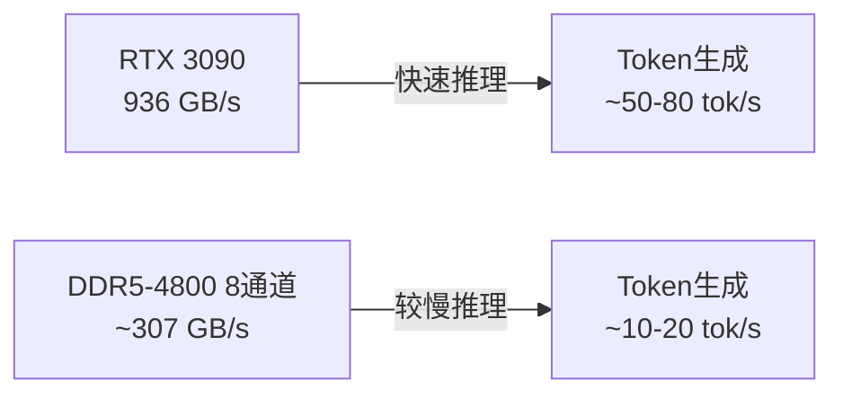
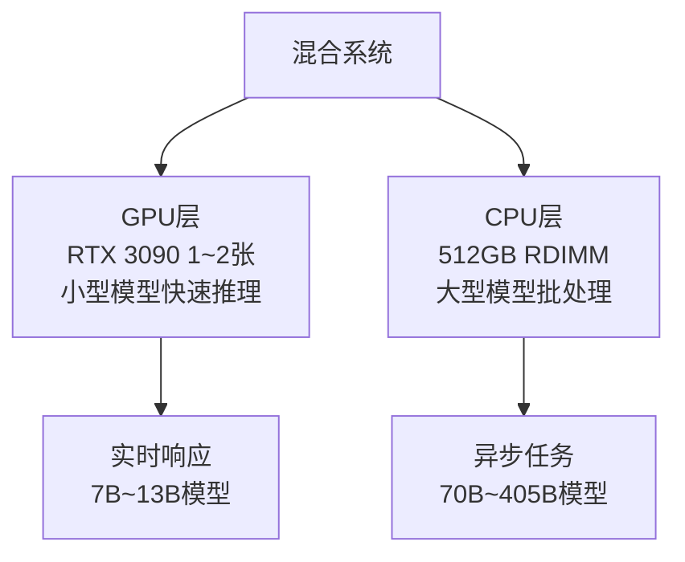

## 概述

2026年2月，Reddit r/LocalLLaMA社区中关于<strong>DDR5 RDIMM每GB价格已低于RTX 3090 VRAM每GB价格</strong>的讨论引发了热烈关注。这篇获得392个赞的帖子预示着本地LLM硬件选择的根本性转折。

在"VRAM就是正义"一直是主流观点的本地LLM社区中，基于RAM的CPU推理在成本效率上可能超越GPU的可能性，给许多人带来了冲击。

## 每GB成本对比：当前实际数据

### RTX 3090的VRAM成本

RTX 3090搭载24GB GDDR6X VRAM，2026年在二手市场上的交易价格约为<strong>$600~800</strong>。

- 24GB VRAM基准：<strong>$25~33/GB</strong>
- 4卡堆叠（96GB）：<strong>$2,400~3,200</strong>
- 不支持NVLink，无法进行张量并行，仅支持管道并行

### DDR5 RDIMM的成本

DDR5 RDIMM价格急剧下降，改变了整个格局。

- DDR5-4800 RDIMM 128GB：<strong>约$200~250</strong>
- 每GB成本：<strong>$1.5~2.0/GB</strong>
- 512GB配置：<strong>$800~1,000</strong>

```
┌─────────────────────────────────────────────┐
│       每GB成本对比（2026年2月）              │
├──────────────────┬──────────────────────────┤
│ RTX 3090 VRAM    │ $25~33/GB               │
│ DDR5 RDIMM       │ $1.5~2.0/GB             │
│ 成本差距         │ 约15~20倍               │
├──────────────────┴──────────────────────────┤
│ 获取512GB内存的成本                         │
│ GPU（3090 x22张）│ ~$15,000                │
│ RAM（RDIMM x4）  │ ~$1,000                 │
└─────────────────────────────────────────────┘
```

## 为什么还要用GPU：速度问题

单看每GB成本，RDIMM占据压倒性优势，但关键在于<strong>推理速度</strong>。

### 内存带宽对比



- <strong>RTX 3090</strong>：GDDR6X 936 GB/s带宽
- <strong>DDR5-4800 8通道</strong>：约307 GB/s带宽
- GPU提供约<strong>3倍</strong>的带宽

LLM推理中的token生成速度几乎与内存带宽成正比。也就是说，运行相同模型时，GPU快约3~5倍。

## 成本结构分析：CPU何时更有优势

### 场景1：加载大型模型

要在本地运行70B~405B参数级模型，VRAM容量是最大瓶颈。

- <strong>Llama 3.1 405B（Q4_K_M）</strong>：需要约230GB
- GPU方案：约10张RTX 3090（$6,000~8,000）
- RAM方案：DDR5 RDIMM 256GB（$500）+ CPU/主板（$1,000~2,000）

在这种情况下，<strong>CPU推理在成本上具有压倒性优势</strong>。

### 场景2：需要快速响应

实时聊天机器人或代码自动补全等对延迟敏感的场景：

- RTX 3090单卡运行7B~13B模型：<strong>50+ tok/s</strong>
- DDR5系统运行相同模型：<strong>10~20 tok/s</strong>

如果速度至关重要，<strong>GPU依然是绝对优势</strong>。

### 场景3：批处理/异步任务

文档摘要、翻译、数据分析等对响应时间要求不高的场景：

- GPU系统成本：<strong>$3,000~5,000</strong>（3090 x2~4张）
- CPU系统成本：<strong>$2,000~3,000</strong>（Xeon + 512GB RDIMM）
- CPU系统可以<strong>以更低成本运行更大的模型</strong>

## 社区反应与核心论点

Reddit社区讨论的核心论点总结：

### "RDIMM不包含计算能力"

GPU同时提供VRAM和计算能力（CUDA核心），而RDIMM只提供纯粹的内存，需要额外的CPU。但最新的Xeon和EPYC处理器的AVX-512性能对CPU推理相当高效。

### "还要考虑功耗"

- 4张RTX 3090：<strong>~1,400W</strong>
- Xeon + 512GB RDIMM系统：<strong>~300~500W</strong>

长期运营中的电力成本差异相当可观。

### "二手3090价格可能继续下降"

随着RTX 5090的发布，3090二手价格呈下降趋势，但RDIMM价格下降速度更快。

## 实战构建指南：CPU推理系统

构建面向大型模型的CPU推理系统：

### 推荐配置（约$2,500）

| 部件 | 型号 | 预估价格 |
|------|------|----------|
| CPU | Intel Xeon w5-2465X（16核） | $800 |
| 主板 | ASUS Pro WS W790E-SAGE | $700 |
| RAM | DDR5-4800 RDIMM 128GB x4（512GB） | $800 |
| 其他 | 电源、机箱、SSD | $200 |

### llama.cpp配置

```bash
# 构建llama.cpp（AVX-512优化）
cmake -B build -DGGML_AVX512=ON -DGGML_AVX512_VNNI=ON
cmake --build build --config Release

# 运行405B模型（Q4_K_M量化）
./build/bin/llama-server \
  -m models/llama-3.1-405b-q4_k_m.gguf \
  --threads 16 \
  --ctx-size 8192 \
  --host 0.0.0.0 \
  --port 8080
```

## 混合方案：GPU + CPU组合

实际上最现实的选择是<strong>混合配置</strong>。



- 小型模型（7B~13B）使用GPU进行快速推理
- 大型模型（70B+）使用CPU进行高性价比运行
- 通过llama.cpp的`--n-gpu-layers`选项将部分层卸载到GPU

## 结论：转折点的意义

DDR5 RDIMM价格低于RTX 3090 VRAM的每GB成本，不仅仅是简单的价格逆转。这意味着<strong>本地LLM运营策略的根本性变革</strong>。

1. <strong>大型模型可及性提升</strong>：405B级模型可在$2,500系统上运行
2. <strong>成本优化选项多样化</strong>：根据用途选择GPU/CPU/混合方案
3. <strong>入门门槛降低</strong>：本地LLM实验成本大幅下降

如果速度是首要考量，GPU仍然是正确答案。但如果目标是<strong>"以最低成本运行最大模型"</strong>，基于DDR5 RDIMM的CPU推理正在成为2026年的新最优解。

## 参考资料

- [Reddit r/LocalLLaMA: PSA: DDR5 RDIMM price passed the point were 3090 are less expensive per gb](https://www.reddit.com/r/LocalLLaMA/comments/1r83irw/psa_ddr5_rdimm_price_passed_the_point_were_3090/)
- [llama.cpp GitHub Repository](https://github.com/ggml-org/llama.cpp)
- [DDR5 RDIMM Pricing Trends — Memory Benchmark](https://www.memorybenchmark.net/)
