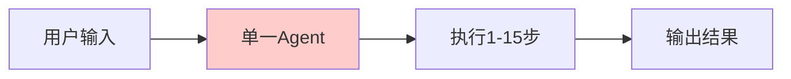
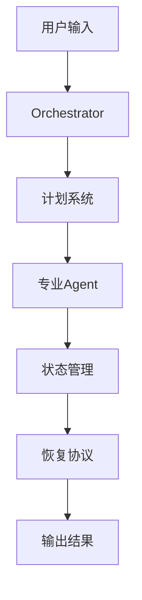
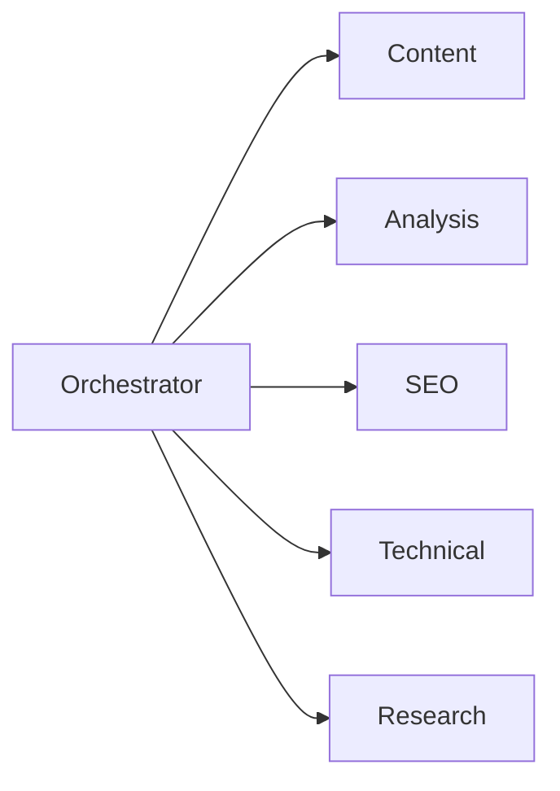
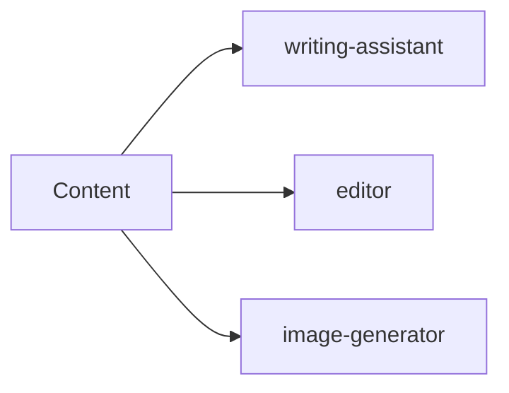
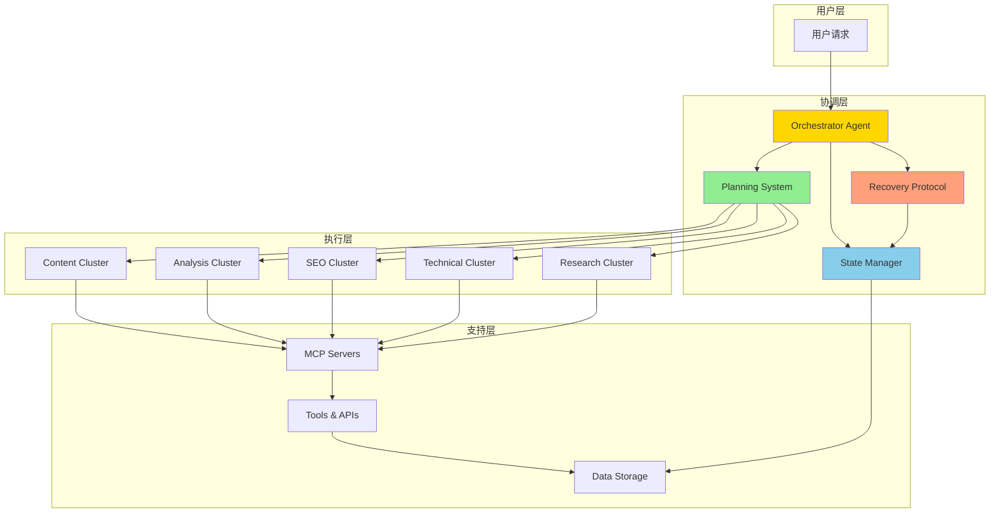

## 从Shallow到Deep：代理架构的演进

2025年，AI代理（Agent）开发正经历一场根本性的范式转变。传统的<strong>Shallow Agents（Agent 1.0）</strong>模式——让单一代理处理所有任务——正在被<strong>Deep Agents（Agent 2.0）</strong>模式所取代。

这不仅仅是性能的提升，而是架构思维的根本变革。

### Shallow Agents的局限性

传统Agent 1.0架构存在明显的局限：

- <strong>短周期执行</strong>：通常只能处理5〜15个步骤
- <strong>缺乏规划</strong>：没有明确的任务分解机制
- <strong>状态丢失</strong>：执行过程中的状态无法持久化
- <strong>脆弱性高</strong>：一旦出错，整个任务失败



### Deep Agents的革新

Deep Agents（Agent 2.0）引入了全新的架构理念：

- <strong>长周期执行</strong>：支持100+步骤的复杂任务
- <strong>显式规划</strong>：任务分解与依赖管理
- <strong>持久状态</strong>：全程状态跟踪与恢复
- <strong>自愈能力</strong>：自动检测并恢复错误



## Deep Agents的四大支柱

基于LangChain和Philipp Schmid的研究，Deep Agents架构建立在四个核心支柱之上：

### 1. 显式规划系统（Explicit Planning）

传统代理依赖隐式的"思考"过程，而Deep Agents要求<strong>外化规划</strong>：

```yaml
# planning-protocol.md
planning_protocol:
  phases:
    - name: "任务分解"
      actions:
        - 分析用户目标
        - 识别子任务
        - 确定依赖关系

    - name: "资源评估"
      actions:
        - 评估所需工具
        - 估算时间成本
        - 识别潜在风险

    - name: "执行计划"
      actions:
        - 生成任务图
        - 分配优先级
        - 设定检查点
```

<strong>关键特性</strong>：
- 任务依赖图（DAG）生成
- 关键路径分析
- 动态重规划能力

### 2. 层级化委托（Hierarchical Delegation）

单一代理无法精通所有领域。层级化委托通过<strong>专业化分工</strong>解决这一问题：

**Orchestrator → 集群:**



**集群 → Agent (例: Content):**



<strong>设计原则</strong>：
- 每个代理专注单一职责
- 明确的接口协议
- 可独立测试和扩展

### 3. 持久化内存（Persistent Memory）

长周期任务需要<strong>状态持久化</strong>来保证连续性：

```typescript
// state-management.ts
interface AgentState {
  // 任务状态
  currentTask: string;
  completedSteps: string[];
  pendingSteps: string[];

  // 执行上下文
  context: {
    workingDirectory: string;
    activeFiles: string[];
    lastCheckpoint: Date;
  };

  // 错误历史
  errorLog: {
    timestamp: Date;
    error: string;
    resolution: string;
  }[];

  // 决策记录
  decisions: {
    decision: string;
    reasoning: string;
    alternatives: string[];
  }[];
}

// 状态持久化
function saveState(state: AgentState): void {
  const statePath = '.claude/state/current-task.json';
  fs.writeFileSync(statePath, JSON.stringify(state, null, 2));
}

// 状态恢复
function loadState(): AgentState | null {
  const statePath = '.claude/state/current-task.json';
  if (fs.existsSync(statePath)) {
    return JSON.parse(fs.readFileSync(statePath, 'utf-8'));
  }
  return null;
}
```

<strong>内存层级</strong>：
- <strong>工作内存</strong>：当前任务的即时状态
- <strong>短期内存</strong>：会话级别的上下文
- <strong>长期内存</strong>：跨会话的学习和偏好

### 4. 极致上下文工程（Extreme Context Engineering）

Deep Agents需要精心设计的上下文来最大化效率：

```yaml
# context-engineering.md
context_optimization:
  # 1. 上下文压缩
  compression:
    - 使用摘要代替完整内容
    - 分层信息架构
    - 按需加载详细信息

  # 2. 上下文分区
  partitioning:
    - 领域特定知识库
    - 任务特定指令集
    - 共享资源池

  # 3. 上下文缓存
  caching:
    - 预热常用模式
    - 缓存中间结果
    - 增量更新机制
```

## 当前架构分析：65%合规性

对现有`.claude/`目录结构进行Deep Agents合规性审计，发现以下情况：

### 现有优势（已符合Deep Agents原则）

| 维度 | 当前实现 | 合规度 |
|------|----------|--------|
| 专业化代理 | 16个专业代理 | 90% |
| 任务分离 | 明确的职责边界 | 85% |
| 工具集成 | MCP服务器集成 | 80% |
| 文档规范 | CLAUDE.md完善 | 75% |

### 待改进领域（需要增强）

| 维度 | 问题 | 影响 |
|------|------|------|
| 协调机制 | 缺少中央协调者 | 任务分配混乱 |
| 规划系统 | 无显式规划 | 复杂任务处理困难 |
| 状态管理 | 状态分散 | 恢复困难 |
| 错误恢复 | 无自动恢复 | 手动干预频繁 |

### 合规性评分

```
当前总体合规度：65%

分项评分：
- 显式规划：40%
- 层级委托：75%
- 持久内存：50%
- 上下文工程：70%
```

## 优化实施方案

基于分析结果，制定以下优化策略：

### 1. 引入Orchestrator Agent（协调者代理）

创建中央协调者来管理所有子代理：

```markdown
<!-- .claude/agents/orchestrator.md -->
# Orchestrator Agent

## 角色定义
中央协调者，负责：
- 任务接收与分解
- 子代理分配
- 进度监控
- 资源协调

## 决策流程
1. 接收用户请求
2. 分析任务类型
3. 选择专业集群
4. 分配子任务
5. 监控执行
6. 聚合结果

## 集群映射
- 内容创作 → Content Cluster
- 数据分析 → Analysis Cluster
- 搜索优化 → SEO Cluster
- 技术运维 → Technical Cluster
- 信息研究 → Research Cluster
```

### 2. 定义5个专业集群

将现有16个代理组织为5个功能集群：

```yaml
# cluster-definitions.yaml
clusters:
  content:
    name: "内容创作集群"
    agents:
      - writing-assistant
      - editor
      - image-generator
      - content-planner
    capabilities:
      - 博客文章撰写
      - 内容审校
      - 图像生成
      - 内容策划

  analysis:
    name: "分析报告集群"
    agents:
      - analytics
      - analytics-reporter
      - post-analyzer
    capabilities:
      - 流量分析
      - 报告生成
      - 内容评估

  seo:
    name: "搜索优化集群"
    agents:
      - seo-optimizer
      - backlink-manager
      - content-recommender
    capabilities:
      - SEO优化
      - 链接建设
      - 内容推荐

  technical:
    name: "技术运维集群"
    agents:
      - site-manager
      - improvement-tracker
      - prompt-engineer
    capabilities:
      - 站点管理
      - 改进追踪
      - 提示优化

  research:
    name: "信息研究集群"
    agents:
      - web-researcher
      - learning-tracker
      - trend-analyzer
    capabilities:
      - 网络调研
      - 学习追踪
      - 趋势分析
```

### 3. 实现规划协议

引入显式规划系统：

```typescript
// planning-protocol.ts
interface TaskPlan {
  id: string;
  goal: string;
  decomposition: SubTask[];
  dependencies: DependencyGraph;
  checkpoints: Checkpoint[];
  estimatedSteps: number;
}

interface SubTask {
  id: string;
  description: string;
  assignedCluster: string;
  assignedAgent: string;
  prerequisites: string[];
  expectedOutput: string;
}

function createPlan(userGoal: string): TaskPlan {
  // 1. 目标分析
  const analysis = analyzeGoal(userGoal);

  // 2. 任务分解
  const subtasks = decomposeIntoSubtasks(analysis);

  // 3. 依赖识别
  const dependencies = identifyDependencies(subtasks);

  // 4. 代理分配
  const assignments = assignAgents(subtasks);

  // 5. 检查点设置
  const checkpoints = setCheckpoints(subtasks);

  return {
    id: generateId(),
    goal: userGoal,
    decomposition: assignments,
    dependencies: dependencies,
    checkpoints: checkpoints,
    estimatedSteps: calculateSteps(subtasks)
  };
}
```

### 4. 建立状态管理系统

实现持久化状态管理：

```typescript
// state-manager.ts
class StateManager {
  private statePath = '.claude/state/';

  // 保存任务状态
  saveTaskState(taskId: string, state: TaskState): void {
    const filePath = `${this.statePath}${taskId}.json`;
    const stateWithMeta = {
      ...state,
      savedAt: new Date().toISOString(),
      version: '1.0'
    };
    fs.writeFileSync(filePath, JSON.stringify(stateWithMeta, null, 2));
  }

  // 恢复任务状态
  loadTaskState(taskId: string): TaskState | null {
    const filePath = `${this.statePath}${taskId}.json`;
    if (fs.existsSync(filePath)) {
      return JSON.parse(fs.readFileSync(filePath, 'utf-8'));
    }
    return null;
  }

  // 创建检查点
  createCheckpoint(taskId: string, step: number): void {
    const state = this.loadTaskState(taskId);
    if (state) {
      const checkpoint = {
        step: step,
        state: JSON.parse(JSON.stringify(state)),
        createdAt: new Date().toISOString()
      };
      const checkpointPath = `${this.statePath}checkpoints/${taskId}-${step}.json`;
      fs.writeFileSync(checkpointPath, JSON.stringify(checkpoint, null, 2));
    }
  }

  // 从检查点恢复
  restoreFromCheckpoint(taskId: string, step: number): TaskState | null {
    const checkpointPath = `${this.statePath}checkpoints/${taskId}-${step}.json`;
    if (fs.existsSync(checkpointPath)) {
      const checkpoint = JSON.parse(fs.readFileSync(checkpointPath, 'utf-8'));
      return checkpoint.state;
    }
    return null;
  }
}
```

### 5. 配置恢复协议

实现自动错误恢复机制：

```typescript
// recovery-protocol.ts
interface RecoveryProtocol {
  maxRetries: number;
  retryStrategies: RetryStrategy[];
  escalationPath: string[];
}

const recoveryProtocol: RecoveryProtocol = {
  maxRetries: 3,
  retryStrategies: [
    {
      name: '简单重试',
      condition: 'transient_error',
      action: 'retry_same_step',
      delay: 1000
    },
    {
      name: '回滚重试',
      condition: 'state_corruption',
      action: 'restore_checkpoint_and_retry',
      delay: 2000
    },
    {
      name: '替代方案',
      condition: 'persistent_failure',
      action: 'try_alternative_approach',
      delay: 3000
    }
  ],
  escalationPath: [
    'retry_with_same_agent',
    'delegate_to_alternative_agent',
    'escalate_to_orchestrator',
    'request_human_intervention'
  ]
};

async function executeWithRecovery(
  task: SubTask,
  agent: Agent,
  stateManager: StateManager
): Promise<TaskResult> {
  let retries = 0;

  while (retries < recoveryProtocol.maxRetries) {
    try {
      // 创建检查点
      stateManager.createCheckpoint(task.id, retries);

      // 执行任务
      const result = await agent.execute(task);

      // 验证结果
      if (validateResult(result, task.expectedOutput)) {
        return result;
      }

      throw new Error('Result validation failed');

    } catch (error) {
      retries++;

      // 选择恢复策略
      const strategy = selectRecoveryStrategy(error);

      // 应用恢复策略
      await applyRecoveryStrategy(strategy, task, stateManager);

      // 记录错误
      logError(task.id, error, strategy);
    }
  }

  // 超过最大重试次数，升级处理
  return escalateToHuman(task);
}
```

## 优化后的架构全景

完整实施后，新架构如下：



## 预期改进效果

实施Deep Agents优化后，预期达到以下指标：

### 执行能力提升

| 指标 | 优化前 | 优化后 | 提升 |
|------|--------|--------|------|
| 最大步骤数 | 5〜15步 | 100+步 | 6〜20倍 |
| 任务成功率 | ~70% | >95% | +25% |
| 自动恢复率 | ~20% | >90% | +70% |
| 上下文利用率 | ~50% | >85% | +35% |

### 效率指标

- <strong>任务完成时间</strong>：减少40%（并行执行+智能调度）
- <strong>人工干预频率</strong>：降低80%（自动恢复机制）
- <strong>资源利用率</strong>：提升50%（智能资源调配）

### 质量指标

- <strong>输出一致性</strong>：提升60%（标准化流程）
- <strong>错误检测率</strong>：提升70%（多层验证）
- <strong>可追溯性</strong>：提升90%（完整状态记录）

## 实施路线图

分阶段实施优化方案：

### 第一阶段：基础设施（第1〜2周）

```yaml
phase1:
  tasks:
    - 创建orchestrator.md
    - 定义集群结构
    - 建立状态目录结构
  deliverables:
    - 协调者代理定义
    - 5个集群配置文件
    - .claude/state/目录
```

### 第二阶段：规划系统（第3〜4周）

```yaml
phase2:
  tasks:
    - 实现规划协议
    - 开发任务分解算法
    - 配置依赖管理
  deliverables:
    - planning-protocol.md
    - 任务图生成器
    - 检查点系统
```

### 第三阶段：恢复机制（第5〜6周）

```yaml
phase3:
  tasks:
    - 实现恢复协议
    - 配置重试策略
    - 建立升级路径
  deliverables:
    - recovery-protocol.md
    - 错误处理系统
    - 状态恢复工具
```

### 第四阶段：集成测试（第7〜8周）

```yaml
phase4:
  tasks:
    - 端到端测试
    - 性能基准测试
    - 文档完善
  deliverables:
    - 测试报告
    - 性能基线
    - 完整文档
```

## 实战案例：博客发布全流程

以完整的博客发布流程为例，展示Deep Agents架构的运作：

```yaml
task: "撰写并发布关于TypeScript 5.0的技术博客"

execution_flow:
  # 1. 接收请求
  - step: 1
    agent: orchestrator
    action: 接收并分析请求
    output: 任务计划

  # 2. 规划分解
  - step: 2
    agent: planning-system
    action: 生成任务图
    output:
      subtasks:
        - 研究TypeScript 5.0特性
        - 撰写博客内容
        - 生成配图
        - SEO优化
        - 多语言翻译
        - 发布上线

  # 3. 研究阶段
  - step: 3-5
    cluster: research
    agent: web-researcher
    action: 收集TypeScript 5.0资料
    checkpoint: true

  # 4. 内容创作
  - step: 6-15
    cluster: content
    agents:
      - writing-assistant: 撰写中文版
      - editor: 审校
      - image-generator: 生成配图
    checkpoint: true

  # 5. SEO优化
  - step: 16-20
    cluster: seo
    agents:
      - seo-optimizer: 元数据优化
      - content-recommender: 关联内容
    checkpoint: true

  # 6. 多语言处理
  - step: 21-35
    cluster: content
    agent: writing-assistant
    action: 翻译为英文/日文/中文
    parallel: true
    checkpoint: true

  # 7. 技术验证
  - step: 36-40
    cluster: technical
    agent: site-manager
    action: 构建测试
    checkpoint: true

  # 8. 发布
  - step: 41-45
    cluster: technical
    agent: site-manager
    action: 部署发布

  # 9. 验证
  - step: 46-50
    cluster: analysis
    agent: post-analyzer
    action: 发布后检查

total_steps: 50
estimated_time: 2小时
auto_recovery_points: 7
```

## 关键注意事项

在实施Deep Agents架构时，需要注意以下要点：

### 避免过度设计

- 从核心功能开始，逐步扩展
- 保持代理职责单一明确
- 避免过深的层级嵌套

### 监控与调优

- 跟踪每个代理的执行指标
- 定期审查恢复日志
- 根据数据优化参数

### 版本管理

- 状态文件纳入版本控制
- 保持配置的向后兼容
- 文档化所有变更

## 总结

Deep Agents范式代表了AI代理架构的重大演进。通过实施<strong>显式规划、层级委托、持久内存和极致上下文工程</strong>四大支柱，我们可以将代理系统从"简单助手"升级为"智能协作者"。

核心收益：
- <strong>执行深度</strong>：从5〜15步扩展到100+步
- <strong>可靠性</strong>：自动恢复率>90%
- <strong>效率</strong>：人工干预减少80%
- <strong>可维护性</strong>：标准化、可追溯

Deep Agents不仅是技术升级，更是思维方式的转变——从"让AI完成任务"到"设计AI协作系统"。

---

## 参考资料

- [LangChain: Deep Agents](https://blog.langchain.dev/introducing-deep-agents/)
- [Philipp Schmid: Agents 2.0](https://www.philschmid.de/agents-2-0)
- [Anthropic: Building Effective Agents](https://www.anthropic.com/research/building-effective-agents)
- [Claude Code Best Practices](https://www.anthropic.com/engineering/claude-code-best-practices)
