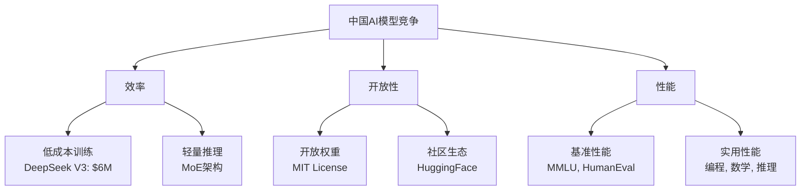

## 概述

2026年初，中国AI行业迎来了大语言模型（LLM）的新浪潮。Reddit r/LocalLLaMA社区传来<strong>DeepSeek V4即将发布</strong>的消息，引起了广泛关注。继Qwen3.5、GLM-5之后，DeepSeek V4的到来标志着中国AI企业的下一代模型竞争正在全面加速。

## DeepSeek的发展历程

### 从V3到V4的飞跃

DeepSeek是一家自2023年成立以来快速成长的中国AI企业。其中<strong>DeepSeek V3</strong>仅用600万美元的训练成本就达到了与GPT-4相当的性能，在AI行业掀起了"斯普特尼克时刻"。

V4预期的主要改进包括：

- <strong>Mixture of Experts（MoE）架构</strong>的进一步精细化
- 推理能力的大幅增强（整合R1系列成果）
- 多模态支持的扩展
- 训练效率的进一步提升

### 开放权重策略的延续

DeepSeek的核心竞争力之一是其<strong>开放权重政策</strong>。通过在MIT许可证下公开模型权重，全球开发者社区可以自由使用和改进。预计V4将继续延续这一策略。

## 中国AI模型浪潮 — 2026年现状

2026年初已发布（或即将发布）的重要模型整理如下：

| 模型 | 开发方 | 特点 |
|------|--------|------|
| <strong>DeepSeek V4</strong> | DeepSeek | 基于MoE、超高效训练、开放权重 |
| <strong>Qwen3.5</strong> | 阿里云 | 大规模参数、多语言增强 |
| <strong>GLM-5</strong> | 智谱AI | 多模态融合、智能体功能增强 |
| <strong>Yi-Lightning</strong> | 零一万物 | 推理优化、成本效率 |

### 竞争的核心维度

## 开源模型 vs 闭源模型格局

中国AI企业的开源模型策略与西方企业的闭源模型路线形成鲜明对比。

### 开源模型的优势

- <strong>透明性</strong>：可以验证模型结构和权重
- <strong>定制化</strong>：可以针对特定领域进行微调
- <strong>本地运行</strong>：保障数据隐私
- <strong>社区创新</strong>：量化、优化等社区贡献

### 与闭源模型差距缩小

正如DeepSeek R1展示了与OpenAI o1相当的性能，中国开源模型正在快速缩小与闭源模型的性能差距。尤其在<strong>编程</strong>、<strong>数学</strong>和<strong>推理</strong>领域的进展尤为显著。

## 本地LLM社区反响

DeepSeek V4的消息在Reddit r/LocalLLaMA社区获得308点赞，引起了巨大反响。主要关注点包括：

- <strong>本地运行可行性</strong>：VRAM需求将是多少
- <strong>量化支持</strong>：GGUF、GPTQ等格式支持计划
- <strong>性能基准</strong>：与GPT-4o、Claude 3.5的比较
- <strong>API定价</strong>：与现有V3相比的价格变动

## 未来展望

### 竞争加速的意义

中国AI企业的模型浪潮不仅仅是简单的竞争，更是在推动AI技术的民主化。开源模型的持续发展预计将带来以下变化：

1. <strong>AI可及性提升</strong>：中小企业和个人开发者也能使用前沿模型
2. <strong>成本降低</strong>：训练和推理成本的持续下降
3. <strong>创新加速</strong>：基于社区的模型改进和应用领域扩展
4. <strong>地缘政治影响</strong>：AI技术霸权竞争的新阶段

## 结论

随着DeepSeek V4发布的临近，中国AI企业的下一代模型竞争正在进入新阶段。Qwen3.5、GLM-5接连发布的模型浪潮，将进一步丰富开源AI模型生态系统。对于使用本地LLM的开发者来说，一个前所未有的精彩时代正在到来。

## 参考资料

- [Reddit r/LocalLLaMA - DeepSeek V4 Release Soon](https://www.reddit.com/r/LocalLLaMA/comments/1r71tn1/deepseek_v4_release_soon/)
- [DeepSeek官网](https://www.deepseek.com/)
- [DeepSeek HuggingFace](https://huggingface.co/deepseek-ai)
- [Wikipedia - DeepSeek](https://en.wikipedia.org/wiki/DeepSeek)
