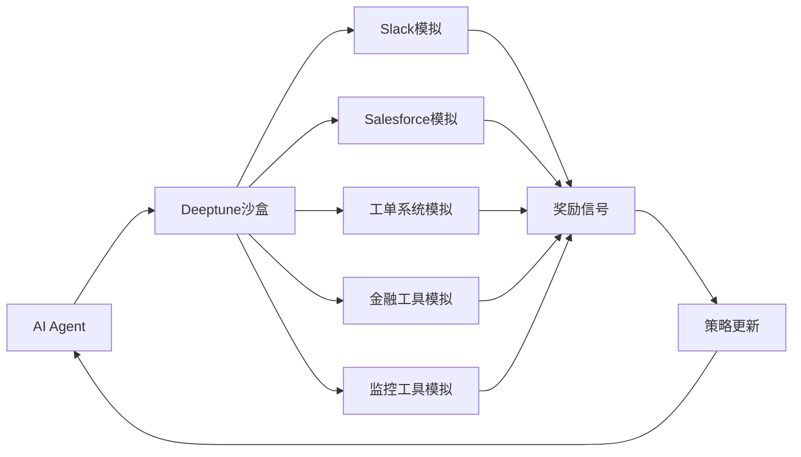
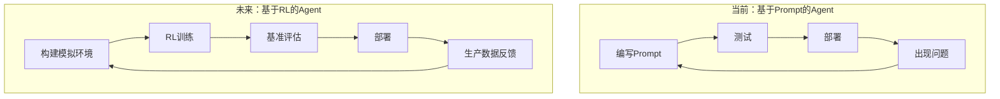

## 概述

总部位于纽约的初创公司**Deeptune**完成了由Andreessen Horowitz（a16z）领投的**$43M Series A**融资。776、Abstract Ventures和Inspired Capital参与了本轮投资，OpenAI Research的Noam Brown、Mercor CEO Brendan Foody、Applied Compute CEO Yash Patil等业界关键人物以天使投资人身份加入。

Deeptune正在构建的是AI Agent的**「训练健身房（Training Gym）」**——为会计师、客服人员、DevOps工程师等专业人士提供高保真（high-fidelity）的**强化学习（Reinforcement Learning, RL）环境**，模拟他们的真实工作场景。通过虚拟再现Slack、Salesforce、工单系统、金融工具、监控工具等，让AI Agent在模拟环境中积累实战经验。

本文将分析Deeptune的方法为什么值得关注，以及工程领导者应该如何应对这一趋势。

---

## Deeptune做什么

### "沙盒"架构

Deeptune的核心理念非常直接：**为AI Agent提供与真实工作环境一致的虚拟环境，通过强化学习进行反复训练**。

如果说传统的LLM微调是"让学生看教科书"，那么Deeptune的RL环境就是"让学生在实验室里动手操作"。Agent在模拟环境中查看Slack消息、在Salesforce中查询客户数据、在工单系统中撰写回复——将完整的工作流重复数千次。

### 团队构成

Deeptune的团队由**Anthropic、Scale AI、Palantir、Glean**的资深成员组成，在AI模型开发、数据基础设施和企业软件领域拥有深厚的专业知识。Anthropic背景尤为引人注目——这些人亲身体验过LLM的局限性，深知RL作为补充的必要性。

### 为什么选择RL？

当前大多数AI Agent依赖Prompt Engineering和few-shot示例。这种方法的局限性非常明显：

- **边缘场景处理不足**：Prompt无法覆盖所有异常情况
- **工具使用缺乏优化**：Agent无法学习以何种顺序使用哪些工具最高效
- **多步决策能力薄弱**：在5步以上的复杂工作流中，准确率急剧下降

RL通过**基于经验的学习**来解决这些问题。通过数千次模拟，Agent自主发现最优行动策略（Policy）。

---

## 工程组织为什么应该关注

### 1. 瓶颈正在转移

长期以来，AI Agent落地的最大瓶颈是**"模型性能"**。但随着GPT-4、Claude、Gemini等Foundation Model的性能趋于收敛，瓶颈正在转向**"特定业务的适配（Adaptation）"**。

Deeptune的方法旨在从结构上解决这一适配问题。对工程组织而言，这意味着我们正在从用Prompt"说服"通用LLM的时代，迈向**部署经RL训练的专业Agent**的时代。

### 2. "AI Agent DevOps"时代的到来

正如CI/CD流水线已成为软件开发的标配，**AI Agent的训练-评估-部署流水线**也将很快成为必需品。Deeptune的RL环境承担的正是该流水线中的"训练"环节。

### 3. RL市场的爆发式增长

强化学习市场预计将从2025年的**$11.6B**增长到2034年的**$90B以上**。这一增长的相当大一部分将不是来自游戏或机器人领域，而是来自**企业工作流自动化**。Deeptune的定位正是这一庞大市场的基础设施层。

---

## 面向专业工作流的RL：技术分析

### 与传统RL的区别

与Atari游戏或机器人控制中使用的RL相比，专业工作流RL面临独特的技术挑战：

| 维度 | 游戏/机器人RL | 专业工作流RL |
|------|-------------|------------|
| **状态空间** | 像素、传感器值（连续） | 文本、结构化数据（复合） |
| **动作空间** | 手柄输入（有限） | API调用、文本输入（近乎无限） |
| **奖励信号** | 分数、距离（即时） | 工作质量、客户满意度（延迟） |
| **回合长度** | 秒级到分钟级 | 分钟级到小时级 |
| **环境复杂度** | 基于物理法则 | 基于业务逻辑 |

### 核心技术挑战

**1. 环境保真度（Environment Fidelity）**

模拟环境与真实环境的匹配程度决定了RL训练的成败。Deeptune对Slack、Salesforce等进行"高保真"模拟，意味着远不止简单的API Mocking——而是要**再现真实的使用模式、数据分布和错误场景**。

**2. 奖励函数设计（Reward Shaping）**

将"良好的客户服务"量化绝非易事。Deeptune很可能采用了多层次的奖励体系：

- **完成奖励**：是否成功完成任务
- **效率奖励**：是否以最少步骤完成
- **质量奖励**：输出的准确性和完整性
- **安全奖励**：是否避免了危险操作（删除数据、输入错误金额等）

**3. Sim-to-Real迁移**

在模拟中训练的策略是否能在生产环境中有效运作？即便在游戏RL中，这一鸿沟也是重大挑战。而在业务环境中，**意外的用户行为、系统故障、数据不一致**等因素可能使这一鸿沟更大。

### OpenAI的Noam Brown为何投资

天使投资人名单中最引人注目的是OpenAI Research的**Noam Brown**。作为扑克AI Libratus和Pluribus的核心研究者，他处于RL驱动战略决策的最前沿。他对Deeptune的投资是一个强烈的信号：**"仅靠LLM无法构建生产级工作Agent，RL是必不可少的。"**

---

## CTO/EM行动清单

### 短期（3-6个月）

1. **识别AI Agent试点业务**：梳理内部那些重复性强、规则明确、失败成本低的业务。这些将成为RL训练Agent的首批应用目标。

2. **记录当前Prompt型Agent的局限**：如果已经部署了基于LLM的Agent，请系统性地记录反复出现的失败模式。这些数据将成为未来RL奖励函数设计的基础。

3. **标准化业务工作流**：RL训练需要清晰定义的业务流程。从现在开始记录核心工作流，标准化工具使用模式。

### 中期（6-18个月）

4. **建设RL Ops能力**：为MLOps团队招募具有RL经验的工程师，或提升现有团队的RL能力。即使使用Deeptune这样的平台，针对自有领域的定制化仍然是必需的。

5. **评估模拟环境解决方案**：评估Deeptune等第三方解决方案，同时验证它们能否处理自身业务环境的特殊性。拥有大量自研系统的组织需要谨慎评估环境构建成本。

6. **构建Agent评估框架**：在将RL训练的Agent部署到生产环境之前，准备系统性的基准测试和安全性测试框架。

### 长期（18个月以上）

7. **设计Human-in-the-Loop RL流程**：设计反馈回路，将Agent在生产环境中积累的经验反馈到RL训练中。这将是Agent性能差异化竞争力的核心。

8. **建立AI Agent治理体系**：RL训练的Agent行为可能比Prompt型更难预测。需要建立涵盖监控、审计（Audit）和回滚策略的治理体系。

---

## 总结

Deeptune的$43M融资不仅仅是一条创业新闻。这是AI Agent市场正在**从"Prompt Engineering时代"向"强化学习训练时代"转型**的强烈信号。

核心要点：

- **LLM提供「知识」，RL提供「经验」。** 执行专业业务的Agent两者都需要。
- **模拟环境是新的基础设施层。** 正如CI/CD成为软件部署的标准，RL模拟将成为Agent部署的标准。
- **现在就开始准备。** 工作流标准化、Agent失败模式记录、RL Ops能力建设——从这三件事开始。

a16z、OpenAI Research的Noam Brown以及Anthropic/Scale AI背景的团队，全部指向同一个方向。作为工程领导者，我们不能错过这个转折点。
