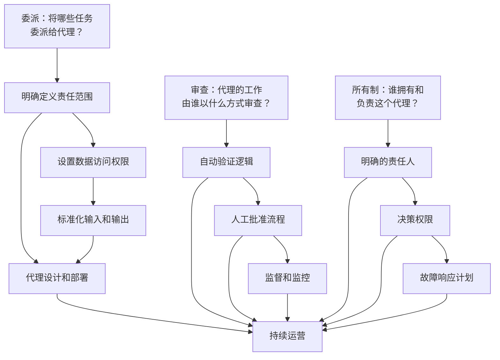
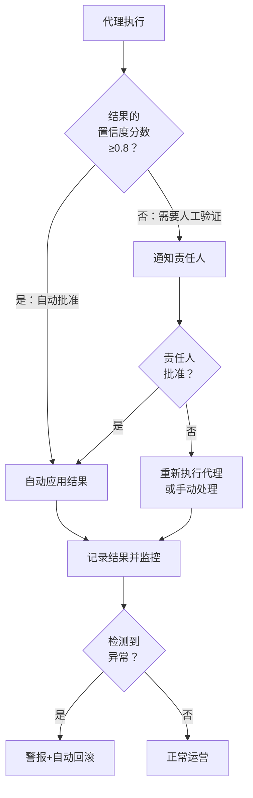
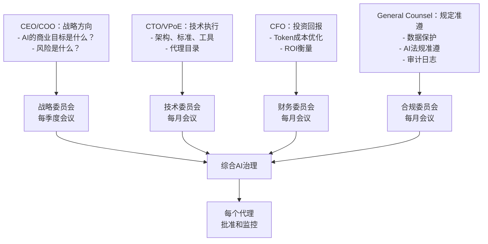

## 序言：代理AI革命的海市蜃楼

从2024年开始，人们声称"AI代理时代"已然到来。一些企业确实制作了令人印象深刻的演示：接收Slack消息后自动生成Jira工单、执行数据分析、撰写报告的代理。

然而，Deloitte 2026年技术趋势报告揭露的现实令人沮丧：

**<strong>全球仅11%的企业在生产环境中实际运营代理AI。</strong>**

其余企业在哪里呢？

- **42%**：仍在开发策略中
- **35%**：缺乏正式战略
- **12%**：停留在实验阶段

**<strong>89%的企业未能进入实际运营（production）阶段。</strong>**这不仅仅是延迟，而是组织运营模式的失败。

本篇文章的焦点并非"为何应该采用AI代理"（这在之前的文章"生成式AI采用，为何需要自上而下的方式"中讨论过），而是从工程经理（EM）和VP of Engineering（VPoE）的角度，具体说明**如何实际运营**这些系统。

---

## 第一部分：现状诊断——你的组织处于哪个阶段

### 阶段1：探索阶段（42%——仍在制定战略）

"AI代理是未来。我们也应该做点什么。"

处于这个阶段的组织展现出以下特征：

- <strong>分散的概念验证（PoC）</strong>：各个团队独立创建小型代理
- <strong>职权不明</strong>：无人能够明确回答"谁负责这个？"
- <strong>Token成本冲击</strong>：仅运行几个小代理，月度账单就达到数万美元
- <strong>缺乏连续性</strong>：一个人离职，代理也随之停运

**警示信号**：
```
工程师1："我们团队制作了一个Slack AI机器人"
工程师2："什么？我们也做了一个"
EM："...两个都上线了？"
```

### 阶段2：试点阶段（12%——实验中）

"好的，让我们采取组织级别的方法。"

在这个阶段：

- <strong>成立中央AI团队</strong>（或尝试成立）
- <strong>选择几个关键工作流</strong>
- <strong>获得初期成功</strong>：开发人员自动化代码审查请求效果显著
- <strong>随后陷入停滞</strong>：同时运营5个以上代理时，管理复杂性急剧增长

**典型的困境点**：
```
第1周："这个真的很有用！"
第3周："但...这个代理有时候会做奇怪的事"
第4周："这个问题的原因是什么？谁能检查一下代码？"
第5周："最后我们还是手动做吧"
```

### 阶段3：缺乏战略（35%——方向不明）

最危险的状态。组织感受到AI代理的必要性，但不知道如何推进。

这个阶段的组织表现出以下模式：

- <strong>高期望，低理解</strong>：CEO说"用AI把效率翻倍"，而团队想"连基础设施都没搭好"
- <strong>治理真空</strong>：AI代理访问公司数据，但没有人被指定进行监督
- <strong>Token成本冲击</strong>：根据Gartner数据，Token成本在两年内下降了280倍，但企业月度AI账单仍达数千万美元。为什么？因为使用量爆炸增长。

---

## 第二部分：失败的根本原因——运营而非技术

Gartner的警告明确无误：

**<strong>40%的代理AI项目将在2027年前失败。原因不是技术不足，而是组织在破碎的流程上堆砌代理。</strong>**

### 根本原因1：未能随自动化重新设计工作方式

大多数组织犯的错误：

**错误的方法**：
```
既有流程：人工 → 数据收集 → 分析 → 报告 → 决策
↓
新流程：代理 → 数据收集 → 分析 → 报告 → 人工（决策）
```

代理只是简单地替代了"人工的手动工作部分"。这无法解决组织运营的根本瓶颈。

**正确的方法**：
```
分析：为什么这个流程很慢？
- "数据收集需要2天" → 重新设计数据访问架构
- "报告格式复杂" → 自动生成报告+人工审查关键项
- "决策要经过多个部门" → 重组决策权限

重新设计的流程：代理 → 实时数据访问 → 自动分析 → 仅关键项人工批准 → 自动执行
```

**根据CIO.com 2026年工程报告**，领先企业的工程师不再花大量时间"编写代码"。取而代之：

- <strong>数据工程</strong>（超过50%的时间）：设计代理可访问的数据结构
- <strong>代理编排</strong>（20〜30%）：协调多个代理之间的交互
- <strong>治理和合规</strong>（20%以上）：定义代理可以和不能做什么
- <strong>编码</strong>（10%或更少）：曾是大部分时间的活动

### 根本原因2：隐藏工作的爆炸

Deloitte报告中的惊人发现：

<strong>全部工作的80%是"乏味"的任务。</strong>

- 数据清理和验证
- 利益相关者之间的协调和沟通
- 治理、监督、合规检查
- 工作流集成和异常处理

引入代理后，<strong>这些乏味的工作突然变得可见。</strong>

```
之前："报告编制需要3小时"
→ 代理部署后："报告生成需要1小时，但数据验证需要4小时，
                三个部门协调需要2小时，规定检查需要1小时..."
```

这些意外的"隐藏工作"是代理部署的真实成本。

### 根本原因3：Token成本的急速增长

这不仅仅是成本问题，而是**运营模式设计失败**的表现。

**事实**：
- Claude/GPT-4 Token成本在两年内下降了280倍 ✓
- 但企业月度AI账单高达$10M〜$50M ✗

**为什么？**

领先企业理解：
- 代理运行24/7（不仅仅是工作时间）
- 每个工作流需要多个代理
- 重试、异常处理和监督会使Token使用量增加5〜10倍

**在正确的运营模式中：**
- 定义代理"何时应该执行"
- 监控Token使用并进行异常检测
- 测量每个代理的成本并跟踪ROI

---

## 第三部分：委派-审查-所有制框架

这是**HBR和Google Cloud提出的"企业级代理AI转型"的核心运营模式**。

### 概念说明



### 第一步：委派（Delegate）——将哪些任务交给代理

这个阶段是**组织设计而非技术**。

**检查清单**：

1. <strong>定义任务范围</strong>
   - [ ] "这个任务的输入是什么？"（数据、信号、请求）
   - [ ] "成功的定义是什么？"（可衡量的结果）
   - [ ] "可能失败吗？如何处理？"（异常处理）

2. <strong>数据治理</strong>
   - [ ] "代理将访问哪些数据？"
   - [ ] "谁验证访问权限？"
   - [ ] "敏感数据（PII、财务信息）如何处理？"

3. <strong>边界设置</strong>
   - [ ] "代理不能做什么？"（例如：绝不删除，总是需要批准）
   - [ ] "Token预算是？"（月度成本上限）
   - [ ] "响应时间要求？"（实时？每小时？每天？）

**实际案例**：

```
任务：每日生成客户满意度报告

委派：
✓ 输入：昨天的客户反馈数据（自动收集）
✓ 任务：情感分析 → 主题分类 → 总结
✓ 输出：结构化JSON（报告系统能理解的格式）
✓ 权限：匿名化客户名称
✓ 边界：绝不直接给客户发消息
✓ Token预算：每天不超过$500
✓ 时间：每日上午9点 KST
```

### 第二步：审查（Review）——自动化验证和人工批准

这是**89%的组织失败的地方**。

许多组织陷入以下两个极端之一：

**极端1：完全自动化**
```
代理执行 → 自动应用结果（无人工介入）
问题：一旦出错，造成大规模损害
```

**极端2：100%人工验证**
```
代理执行 → 人工审查并批准所有结果
问题：抵消代理的优势。只增加工作量
```

**正确的方法：智能审查结构**



**审查设计原则**：

1. <strong>基于置信度分数的自动化</strong>
   - 代理的输出有多确定？
   - 通常0.8以上自动执行，0.5〜0.8需要人工验证，0.5以下拒绝

2. <strong>基于异常的监督</strong>
   - 不是检查所有结果，而是仅检测异常
   - "与昨天相差5%以上"、"金额是平均值的2倍"等

3. <strong>分散批准权限</strong>
   ```
   低风险任务：团队负责人自动批准
   中等风险：EM或责任人批准
   高风险：VPoE/技术负责人批准
   规定影响：法律/合规最终批准
   ```

### 第三步：所有制（Own）——明确的责任和权限

**这是最重要的。**89%的失败组织跳过了这一步。

对每个代理：

1. <strong>指定明确的所有者</strong>
   - 通常是"代理自动化的原始任务的责任人"
   - 例如：生成每日报告的代理 → 数据分析师是所有者

2. <strong>决策权限</strong>
   - [ ] 能改变代理的输入值吗？（例如：分析期限）
   - [ ] 能调整代理的执行频率吗？
   - [ ] 能改变代理的输出格式吗？

3. <strong>故障响应计划（RCA：根本原因分析）</strong>
   - 代理失败时怎么办？
   - 退路流程是什么？（回到手动处理）
   - 何时自动重试，何时通知人工？

**实际模板**：

```markdown
## 代理所有者检查清单

### 代理：Customer_Satisfaction_Report_Generator

**所有者**：Kim Data（数据分析团队负责人）
**备用**：Lee Insight（资深分析师）

### 决策权限
- [x] 调整分析期限（每日 → 每周）
- [x] 更改包含/排除的客户组
- [x] 调整情感分析阈值
- [ ] 更改输出格式（需要VPoE批准）

### 监控
- 日常执行检查：在Slack #ai-agents频道查看
- 失败率目标：3%以下
- Token使用：$400/天（预算：$500/天）

### 故障响应
1. 自动重试（3次，间隔1小时）
2. 仍然失败则在Slack通知所有者
3. 所有者1小时内未响应则升级
4. 退路：发送昨天的报告（最低服务保证）
```

---

## 第四部分：工程经理的实战检查清单——周一早上要做什么

如果你是EM或VPoE，本周周一早上执行这个检查清单。

### 第1周：了解现状

**周一**：
- [ ] 了解组织当前AI代理现状
  ```bash
  Q："我们组织有多少个正在生产环境中运行的AI代理？"
      （不包括原型）
  ```
- [ ] 确认每个代理的所有者
  ```bash
  Q："每个代理的所有者是否明确指定？"
      （答案：是/否 → 否则存在问题）
  ```
- [ ] 检查Token成本追踪系统
  ```bash
  Q："上个月我们在AI代理上花了多少钱？"
      （答不出来则情况严重）
  ```

**周二**：
- [ ] 识别失败的代理
  ```bash
  Q："过去3个月有任何停运的代理吗？"
      有的话："为什么停运了？所有者是谁？"
  ```
- [ ] 识别隐藏成本
  ```bash
  问工程师："AI代理导致了什么新工作？
             数据验证、监控、异常处理？"
  ```

**周三〜周五**：
- [ ] 与各团队的代理用户会面（每次1小时，共5个团队）
  - 什么运行良好？
  - 什么被卡住了？
  - 需要什么治理？

### 第2周：问题定义

**周一**：
- [ ] 编写委派-审查-所有制框架文档（初稿）
- [ ] 分发给各团队并收集反馈

**周二〜周五**：
- [ ] 重新设计每个代理的审查流程
  - 当前：在做什么验证？（或没做什么验证？）
  - 目标：基于置信度分数的自动化+异常检测

### 第3〜4周：执行

**主要任务**：

1. <strong>重新指定所有者</strong>
   - 为所有代理指定明确的所有者
   - 更新职位描述（包含AI代理管理责任）

2. <strong>改进审查结构</strong>
   - 实施基于置信度分数的自动化（工程团队）
   - 构建监控仪表板

3. <strong>追踪Token成本</strong>
   - 为每个代理标记成本
   - 建立月度报告体系

4. <strong>制定治理政策</strong>
   - 哪些数据代理无法访问？
   - 如何维护监督和审计日志？

---

## 第五部分：治理——为什么需要领导层直接参与

这是最关键的部分。

根据HBR的"企业级代理AI转型蓝图"：

**<strong>高级领导层直接参与AI治理的企业比不参与的企业创造3倍以上的商业价值。</strong>**

为什么会这样？

### 治理的真正含义

治理不是"让代理做什么"。（那是技术决定。）

治理是**定义"组织将通过AI代理创造什么价值"**。

### 治理框架



### 四项治理政策

**1. 数据治理**

```
政策：代理无法看到什么数据？

✓ 可访问：
  - 公开客户数据（已匿名化）
  - 内部指标（收入、增长率等）
  - 标准化运营数据

✗ 不可访问：
  - 个人身份信息（PII）
  - 金融账户信息
  - 医疗/敏感信息
  - 员工个人信息
  - M&A等机密信息
```

**2. Token成本治理**

```
政策：如何管理代理成本？

按级别审批预算：
- <$1K/月：团队负责人审批
- $1K〜$10K/月：EM审批
- $10K〜$100K/月：VPoE审批
- >$100K/月：CEO/CTO审批

异常检测：
- 日成本超过预算150% → 自动中止+警报
- 月成本超过预算120% → 审查会议
```

**3. 合规治理**

```
政策：谁对代理生成的输出负责？

原则：
- 所有代理输出被记录在审计日志中
- 因代理输出导致的商业损失 → 所有者责任
- 代理本身的技术错误 → 工程团队责任
- 治理政策违反 → VPoE+法律团队责任

例子：
代理泄露客户个人信息 → 法律团队+所有者+CTO调查
```

**4. 绩效衡量治理**

```
政策：如何定义代理的成功？

每个代理：
1. 商业指标
   - "时间节省：月40小时" → 价值：$5,000/月
   - "错误率降低：95% → 99%" → 客户满意度提升
   - "Token成本：$200/月"

2. 技术指标
   - 成功率：99%以上目标
   - 平均响应时间：<5秒
   - 重试率：<3%

3. 治理指标
   - 规定准遵率：100%
   - 审计结果：通过/未通过
```

---

## 第六部分：实施路线图（3个月）

### 第1个月：基础建设

**周间计划**：

**第1周：现状了解和团队组建**
- [ ] 构建AI代理清单（生产、试点、PoC区分）
- [ ] 确认每个代理的所有者/责任人
- [ ] 组建AI治理工作小组（CEO、CTO、CFO、首席法律顾问）

**第2〜3周：定义委派-审查-所有制框架**
- [ ] 编写框架文档并获得董事会批准
- [ ] 与各团队开展研讨会（最少5个团队）
- [ ] 收集初期反馈并改进

**第4周：建立治理政策**
- [ ] 制定数据访问政策
- [ ] 制定Token成本管理政策
- [ ] 定义合规要求

### 第2个月：首次实施

**周间计划**：

**第1周：选择试点代理**
- [ ] 选择3个代理应用委派-审查-所有制（从低风险开始）
- [ ] 为每个代理制定重新设计计划

**第2〜4周：试点重新设计和部署**
- [ ] 委派：澄清输入、输出、权限
- [ ] 审查：实施基于置信度分数的自动化
- [ ] 所有制：指定所有者并建立责任体系

**监控**：
- 追踪成功率
- 追踪Token成本
- 收集用户反馈

### 第3个月：扩展和优化

**周间计划**：

**第1〜2周：评估试点结果**
- [ ] 审查商业指标（时间节省、错误率等）
- [ ] 审查技术指标（成功率、响应时间）
- [ ] 审查治理准遵度

**第3〜4周：组织范围扩展**
- [ ] 对所有代理应用委派-审查-所有制
- [ ] 构建自动监控仪表板
- [ ] 建立季度审查流程

---

## 第七部分：工程经理应避免的5个错误

这些是Deloitte研究中发现的模式。

### 错误1：认为代理是"自主的"

**风险**："这个代理是完全自主运行的。我们可以放手。"

**现实**：自主代理也需要治理。
- 监控（绩效指标）
- 审计（规定准遵）
- 再教育（数据变化时）

**正确的心态**："代理是工作者而非机器人"

### 错误2：无监控部署

**风险**：代理已部署，之后就置之不理。

**现实**：
```
部署第1周：一切良好。
部署第2周：出现微妙问题（5%错误率）
部署第3周：有人发现bug，但已有1,000条数据损坏
```

**正确的方法**：
- 第1周：日常监控
- 第2〜4周：每周监控
- 第2个月后：自动监控+每周审查

### 错误3：认为代理能替代人类

**风险**："这个代理可以替代这个团队成员。"

**现实**：根据Deloitte的发现，代理部署后：
- 自动化任务减少30% ✓
- 新增管理/监控工作增加25%
- 净工作量减少：仅5%

**正确的方法**："用代理重新分配人员，投入更高价值的工作"
- 数据验证 → 战略分析
- 报告生成 → 洞察提取
- 日程管理 → 项目规划

### 错误4：无批准流程直接应用输出

**风险**：代理生成的报告直接发给客户。

**现实**：
```
实际AI代理失误案例：
1. ChatGPT生成的法律意见存在幻觉
   → 律师提交到法庭（灾难）

2. AI代理计算工资错误 → 300名员工收到错误工资
   → 规定违反+诉讼风险
```

**正确的方法**：始终需要审查步骤
- 低风险：自动批准（置信度0.9以上）
- 中等风险：团队负责人批准
- 高风险：EM/VPoE批准

### 错误5：不追踪Token成本

**风险**："我们不知道AI成本是多少"

**现实**：
```
2024年：企业AI月成本$2M
2025年：$8M（增加4倍）
2026年：预计$25M

经营团队："什么增加了？"
VPoE："代理...呃...更多..."
```

**正确的方法**：
```yaml
代理成本追踪：
  - Customer_Analysis_Agent: $1,200/月
  - Inventory_Optimizer: $3,500/月
  - Support_Chatbot: $2,100/月
  - ...

异常检测：
  - 与昨天相比2倍以上 → 警报
  - 月成本超过预算120% → 审查

优化：
  - 改为批处理（实时 → 每日1次） → 70%成本降低
  - 改用更高效的模型 → 40%成本降低
```

---

## 结论：你的下一步

Deloitte的现实是冷酷但明确的：

**<strong>技术已经准备好。剩下的是运营模式。</strong>**

如果你是EM或VPoE：

1. **本周周一**：了解你的组织现状。"我们属于Deloitte报告中的11%，还是89%？"

2. **本月**：引入委派-审查-所有制框架。不要试图一次性改变整个组织，从一个代理开始。

3. **本季度**：制定治理政策。追踪Token成本，衡量绩效。

4. **3个月后**：评估你的组织是否进入了11%，还是仍在89%中。

HBR说得对：<strong>"高级领导层直接参与AI治理的企业比不参与的企业创造3倍以上的商业价值。"</strong>

当你的领导力成为这种变化的中心时，组织才能真正进入代理AI时代。

---

## 参考资料

**研究来源**：
- Deloitte Tech Trends 2026
- Gartner Enterprise AI Survey
- HBR "Blueprint for Enterprise-Wide Agentic AI Transformation" + Google Cloud
- CIO.com "Engineering Workflows in 2026"
- MIT Sloan Management Review（AI Pilot Success Rate）

**相关文章**：
- "生成式AI采用，为何需要自上而下的方式"（战略角度）
- "AI代理KPI和伦理：如何衡量绩效"（治理深化）
- "NIST AI代理安全标准"（安全角度）
