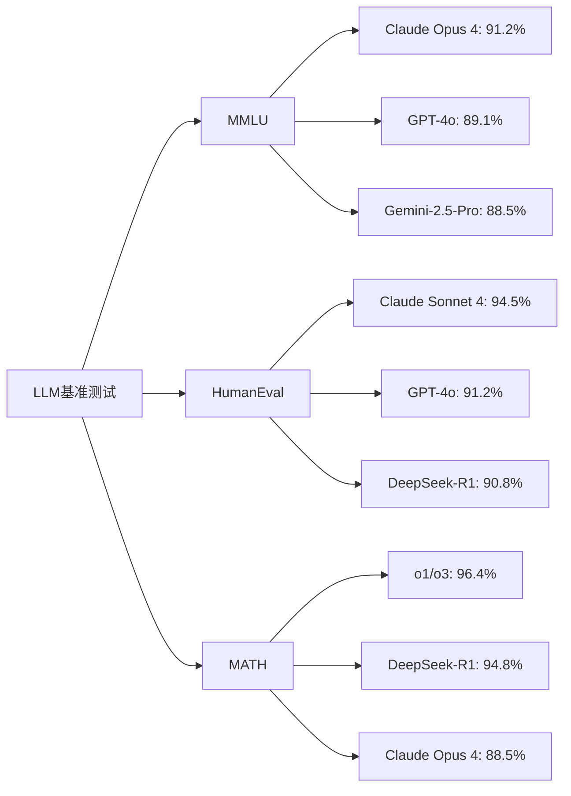
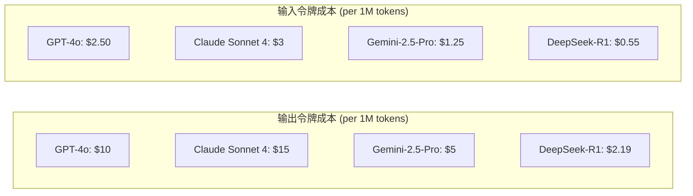
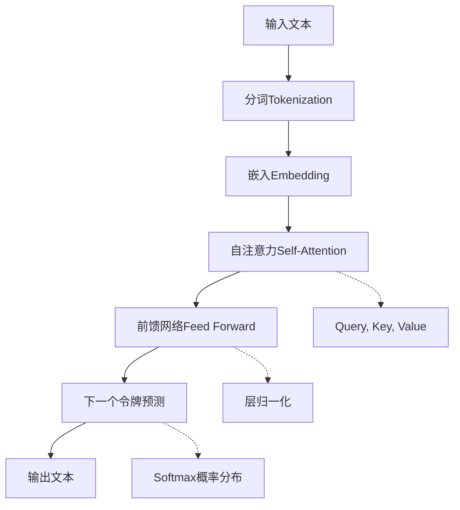
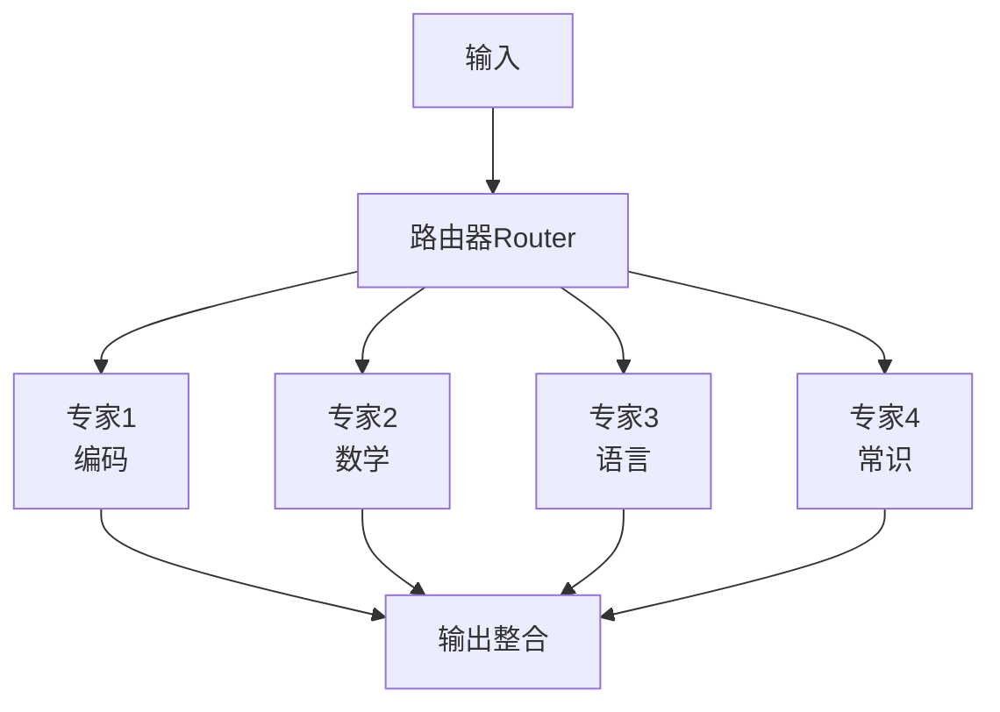
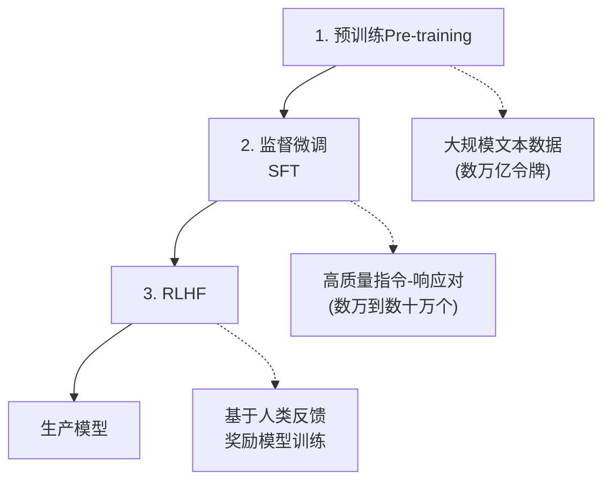
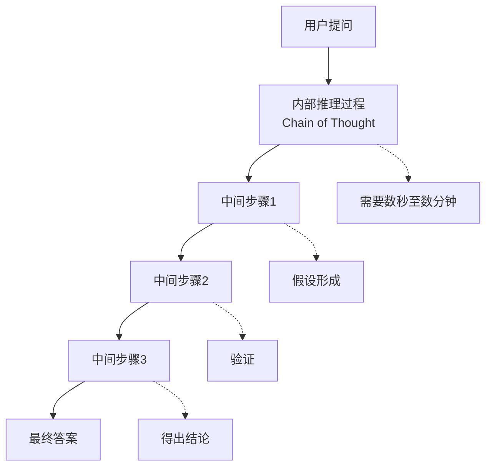
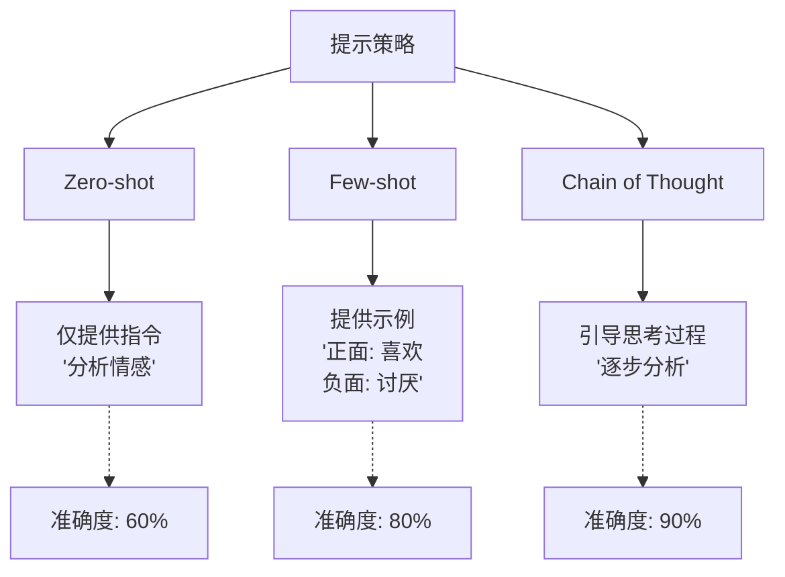
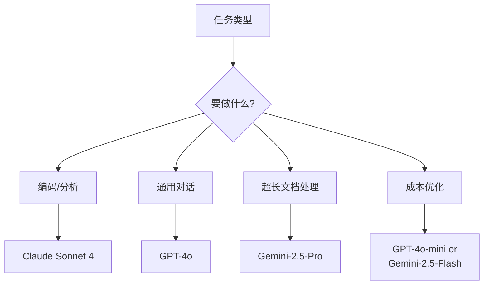

> <strong>系列: DeNA LLM 学习</strong> (1/5)
>
> 1. <strong>[Part 1: LLM基础与2025年AI现状](/zh/blog/zh/dena-llm-study-part1-fundamentals)</strong> ← 当前文章
> 2. [Part 2: 结构化输出与多LLM管道](/zh/blog/zh/dena-llm-study-part2-structured-output)
> 3. [Part 3: 模型训练方法论](/zh/blog/zh/dena-llm-study-part3-model-training)
> 4. [Part 4: RAG架构与最新趋势](/zh/blog/zh/dena-llm-study-part4-rag)
> 5. [Part 5: 智能体设计与多智能体编排](/zh/blog/zh/dena-llm-study-part5-agent-design)

## DeNA LLM 学习开篇

2025年，AI技术的发展速度超乎想象。基于DeNA进行的LLM学习资料，我们将通过5期内容，从最新LLM技术的基础到实战应用进行全面整理。本期Part 1将探讨LLM的基本原理和2025年当前的AI生态系统。

> <strong>资料来源</strong>: 本文基于[DeNA 内部学习资料](https://dena.github.io/llm-study20251201/)编写。

## 2025年主要LLM现状

### 性能比较: GPT-4 vs Claude vs Gemini

截至2025年，三大主要LLM主导市场:

```markdown
| 模型                                     | 开发商    | 特点       | 优势                       |
| ---------------------------------------- | --------- | ---------- | -------------------------- |
| <strong>GPT-5.1 / GPT-4o</strong>        | OpenAI    | 128K上下文 | 通用性、稳定性             |
| <strong>Claude Opus 4 / Sonnet 4</strong>| Anthropic | 200K上下文 | 编码、分析、长上下文       |
| <strong>Gemini-2.5-Pro</strong>          | Google    | 1M上下文   | 多模态、超长文档           |
| <strong>DeepSeek-R1</strong>             | DeepSeek  | 128K上下文 | 推理、开源、性价比高       |
```

### 基准测试性能 (2025年12月标准)



> <strong>MMLU</strong>: 大规模多任务语言理解 (57个学科知识评估)
> <strong>HumanEval</strong>: 编程能力评估
> <strong>MATH</strong>: 数学问题解决能力

### 价格比较 (2025年12月标准)



> <strong>核心洞察</strong>: DeepSeek-R1性价比出色，Gemini也具有强大的价格竞争力。Claude在编码和分析任务中表现优异。

## Next Token Prediction: LLM的核心原理

### Transformer架构

作为LLM基础的Transformer，最初在2017年Google的"Attention is All You Need"论文中提出。



### Next Token Prediction 工作原理

```python
# 简单的Next Token Prediction示例
def predict_next_token(context: str, model: LLM) -> str:
    """
    从给定上下文预测下一个令牌

    Args:
        context: "The quick brown"
        model: LLM模型

    Returns:
        "fox" (概率最高的令牌)
    """
    # 1. 分词
    tokens = tokenize(context)  # ["The", "quick", "brown"]

    # 2. 嵌入转换
    embeddings = model.embed(tokens)

    # 3. 通过Transformer层
    hidden_states = model.forward(embeddings)

    # 4. 计算概率分布
    logits = model.lm_head(hidden_states[-1])  # 最后一个令牌的hidden state
    probs = softmax(logits)

    # 5. 选择概率最高的令牌
    next_token = argmax(probs)  # "fox" (prob: 0.87)

    return next_token
```

> <strong>重要</strong>: LLM是基于<strong>令牌</strong>而非单词工作的。英语: 1个单词 ≈ 1个令牌，中文: 1个字 ≈ 1〜2个令牌。

### 最新研究趋势: Mixture of Experts (MoE)

从2024年开始，大型模型采用MoE架构:



<strong>优势</strong>:

- 计算效率: 仅激活全部参数的一部分
- 专业化: 每个专家专注于特定领域
- 可扩展性: 添加专家可提升性能

## Instruction Tuning: 让AI听从指令

### Pre-training vs Fine-tuning vs RLHF



### Instruction Tuning 数据集示例

```yaml
# SFT (Supervised Fine-Tuning) 数据格式
- instruction: "解析此JSON并提取名称。"
  input: '{"user": {"name": "John", "age": 30}}'
  output: "John"

- instruction: "修复此代码中的bug。"
  input: |
    def add(a, b):
        return a - b
  output: |
    def add(a, b):
        return a + b  # 使用+而非-

- instruction: "将此句子翻译成中文。"
  input: "Hello, world!"
  output: "你好，世界!"
```

### Post-training 技术比较

| 技术                               | 目的             | 数据需求     | 成本 |
| ---------------------------------- | ---------------- | ------------ | ---- |
| <strong>SFT</strong>               | 学习遵循指令     | 数万个       | 低   |
| <strong>RLHF</strong>              | 与人类偏好对齐   | 数千到数万个 | 高   |
| <strong>DPO</strong>               | 直接偏好优化     | 数千个       | 中等 |
| <strong>Constitutional AI</strong> | 价值观对齐自动化 | 极少         | 低   |

> <strong>DPO (Direct Preference Optimization)</strong>: 2023年由Stanford提出，比RLHF更简单且有效。

## Reasoning 模型: 会思考的AI

### o1、o3与DeepSeek-R1的发展

OpenAI在2024年9月发布o1推理模型后，2024年12月又公开了o3模型。同时，DeepSeek发布了开源推理模型DeepSeek-R1:



### 推理模型性能比较

```markdown
| 基准测试                                  | GPT-4o          | o1              | o3              |
| ----------------------------------------- | --------------- | --------------- | --------------- |
| <strong>AIME 2024</strong> (数学奥林匹克) | 13.4%           | 74.4%           | 96.7%           |
| <strong>Codeforces</strong> (编程竞赛)    | 11th percentile | 89th percentile | 99th percentile |
| <strong>GPQA Diamond</strong> (科学)      | 50.6%           | 78.3%           | 87.7%           |
```

> <strong>注</strong>: DeepSeek-R1以更低的成本实现了与o1相当的性能，为AI民主化做出了贡献。

### Chain of Thought (CoT) 提示

通用模型使用CoT也能提升推理能力:

```markdown
# ❌ 普通提示

"计算234 × 567。"
→ 错误答案的可能性高

# ✅ CoT 提示

"逐步计算234 × 567。显示每一步的中间结果。"
→ 准确度大幅提升
```

<strong>实际CoT示例</strong>:

```
问题: 计算234 × 567。

CoT 响应:
1. 首先，将234分解为200 + 30 + 4。
2. 分别乘以567:
   - 200 × 567 = 113,400
   - 30 × 567 = 17,010
   - 4 × 567 = 2,268
3. 全部相加:
   113,400 + 17,010 + 2,268 = 132,678

答案: 132,678
```

## 提示工程基础

### Zero-shot vs Few-shot vs Chain of Thought



### Temperature 参数的影响

```python
# Temperature设置对输出的影响

# Temperature = 0 (确定性、一致性)
response = model.generate(
    "用Python编写斐波那契数列。",
    temperature=0
)
# 输出: 始终相同的代码 (选择概率最高的令牌)

# Temperature = 0.7 (平衡、推荐)
response = model.generate(
    "写一个创意故事。",
    temperature=0.7
)
# 输出: 适度多样化同时保持一致性

# Temperature = 1.5 (创造性、不稳定)
response = model.generate(
    "提出一个全新的想法。",
    temperature=1.5
)
# 输出: 非常多样但一致性低，有时输出奇怪
```

### 有效提示编写原则

1. <strong>清晰性</strong>: 避免模糊指令

   ```
   ❌ "告诉我这个"
   ✅ "用150字以内解释Claude 3.5 Sonnet的三个主要特点。"
   ```

2. <strong>提供上下文</strong>: 包含背景信息

   ```
   ❌ "审查代码"
   ✅ "这是一个React组件。从性能、可读性和可访问性角度审查: [代码]"
   ```

3. <strong>指定输出格式</strong>: 明确期望的结构
   ```
   ✅ "以以下格式响应:
   1. 摘要 (1句话)
   2. 要点 (3个)
   3. 行动计划 (逐步)"
   ```

## 练习 A 洞察: OpenAI API 实战

### API基本使用

```python
from openai import OpenAI

client = OpenAI(api_key="your-api-key")

# 基本聊天补全
response = client.chat.completions.create(
    model="gpt-4o",
    messages=[
        {"role": "system", "content": "你是一个有帮助的AI助手。"},
        {"role": "user", "content": "什么是LLM?"}
    ],
    temperature=0.7,
    max_tokens=500
)

print(response.choices[0].message.content)
```

### 对话历史管理

```python
# 维护对话上下文
conversation_history = [
    {"role": "system", "content": "你是Python专家。"}
]

def chat(user_message: str) -> str:
    # 添加用户消息
    conversation_history.append({"role": "user", "content": user_message})

    # API调用
    response = client.chat.completions.create(
        model="gpt-4o",
        messages=conversation_history,
        temperature=0.7
    )

    # 保存助手响应
    assistant_message = response.choices[0].message.content
    conversation_history.append({"role": "assistant", "content": assistant_message})

    return assistant_message

# 对话示例
print(chat("解释列表推导式。"))
print(chat("显示示例代码。"))  # 保持之前的上下文
print(chat("将其转换为字典推导式。"))  # 连续对话
```

### 令牌使用优化

```python
import tiktoken

def count_tokens(text: str, model: str = "gpt-4") -> int:
    """计算文本的令牌数"""
    encoding = tiktoken.encoding_for_model(model)
    return len(encoding.encode(text))

# 提示优化示例
long_prompt = "这是一个非常长的提示..." * 100
token_count = count_tokens(long_prompt)
print(f"令牌数: {token_count}")  # 例: 8,543 tokens

# 成本计算
input_cost = (token_count / 1_000_000) * 10  # GPT-4 Turbo 输入成本
print(f"预估成本: ${input_cost:.4f}")
```

## 主要学习要点

### 1. 模型选择标准



### 2. 性能提升检查清单

- ✅ <strong>清晰指令</strong>: 消除歧义
- ✅ <strong>Few-shot示例</strong>: 提供3〜5个例子
- ✅ <strong>CoT提示</strong>: 用于复杂推理任务
- ✅ <strong>Temperature调整</strong>: 根据任务设置
- ✅ <strong>指定输出格式</strong>: 结构化响应
- ✅ <strong>上下文管理</strong>: 考虑令牌限制

### 3. 实际应用场景

| 场景               | 推荐模型          | 设置     |
| ------------------ | ----------------- | -------- |
| 代码审查           | Claude Sonnet 4   | temp=0.3 |
| 创意写作           | GPT-4o            | temp=0.9 |
| 数据分析           | Claude Sonnet 4   | temp=0.1 |
| 客户支持聊天机器人 | GPT-4o-mini       | temp=0.7 |
| 长文档摘要         | Gemini-2.5-Pro    | temp=0.5 |

## 下期预告

Part 2将涵盖<strong>结构化输出与多LLM管道</strong>:

- JSON模式与函数调用
- 结构化输出的实际应用
- 多LLM管道设计
- 使用Pydantic实现类型安全
- 练习 B: 构建复杂的数据提取系统

> <strong>下一篇文章</strong>: [Part 2: 结构化输出与多LLM管道](/zh/blog/zh/dena-llm-study-part2-structured-output)

## 参考资料

- [DeNA LLM 学习资料 (Zenn)](https://dena.github.io/llm-study20251201/)
- [OpenAI API Documentation](https://platform.openai.com/docs)
- [Anthropic Claude Documentation](https://docs.anthropic.com/claude/docs)
- [Google Gemini Documentation](https://ai.google.dev/docs)
- [Attention is All You Need (Transformer论文)](https://arxiv.org/abs/1706.03762)
- [Chain of Thought Prompting](https://arxiv.org/abs/2201.11903)

---

<strong>撰写日期</strong>: 2025年12月8日
<strong>系列</strong>: DeNA LLM 学习 (1/5)
<strong>标签</strong>: #LLM #AI #PromptEngineering #DeNA
