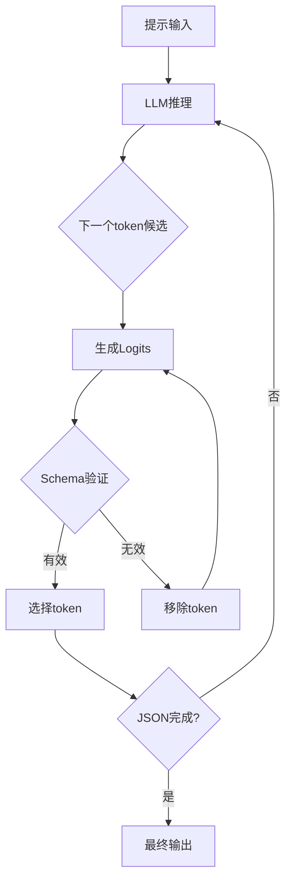
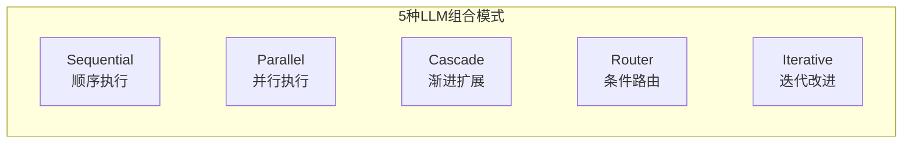

> **系列: DeNA LLM 研究** (2/5)
>
> 1. [Part 1: LLM基础与2025年AI现状](/zh/blog/zh/dena-llm-study-part1-fundamentals)
> 2. <strong>Part 2: 结构化输出与多LLM管道</strong> ← 当前文章
> 3. [Part 3: 模型训练方法论](/zh/blog/zh/dena-llm-study-part3-model-training)
> 4. [Part 4: RAG架构与最新趋势](/zh/blog/zh/dena-llm-study-part4-rag)
> 5. [Part 5: 智能体设计与多智能体编排](/zh/blog/zh/dena-llm-study-part5-agent-design)

## 概述

在DeNA的LLM研究系列Part 2中,我们探讨<strong>结构化输出(Structured Output)</strong>技术来可靠地控制LLM输出,以及<strong>Multi-LLM管道模式</strong>来通过组合多个LLM构建更强大的系统。

本文基于DeNA的研究资料并补充最新信息,提供可立即用于生产的模式和最佳实践。

### 本文涵盖内容

1. **结构化输出技术**
   - JSON Schema和Pydantic的使用
   - Constrained Decoding原理
   - 各提供商的实现方式 (OpenAI、Anthropic、Google)

2. **多LLM组合模式**
   - Sequential、Parallel、Cascade、Router、Iterative
   - 每种模式的应用场景与权衡
   - 实践实现示例

3. **实习B & C内容**
   - B1: 二元分类 (评论分类)
   - B2: 多项提取与评分
   - B3: 嵌套结构化输出
   - C1: 多评估轴并行处理
   - C2: 使用评估结果进行修正
   - C3: 修正-评估循环实现

## 1. 结构化输出 (Structured Output)

### 1.1 为什么需要结构化输出

LLM本质上生成自由格式的文本。但生产应用需要:

- **可解析数据**: JSON、YAML等标准格式
- **类型安全**: 字段类型验证 (string、number、boolean等)
- **必填字段保证**: 防止遗漏
- **嵌套结构支持**: 复杂数据模型

自由文本输出的问题:

```python
# ❌ 问题: 解析可能失败
response = llm.generate("Extract name and age from: John is 30 years old")
# 输出: "John is 30 years old. His name is John and he is 30."
# 如何解析这个?
```

结构化输出的优势:

```python
# ✅ 解决: 结构化输出
response = llm.generate_structured(
    prompt="Extract name and age",
    schema={"name": str, "age": int}
)
# 输出: {"name": "John", "age": 30}
# 即用数据
```

### 1.2 基于JSON Schema的结构化

JSON Schema是定义JSON数据结构的标准。

#### 基础示例

```json
{
  "$schema": "http://json-schema.org/draft-07/schema#",
  "type": "object",
  "properties": {
    "name": {
      "type": "string",
      "description": "用户名"
    },
    "age": {
      "type": "integer",
      "minimum": 0,
      "maximum": 150
    },
    "email": {
      "type": "string",
      "format": "email"
    }
  },
  "required": ["name", "age"]
}
```

#### OpenAI Structured Outputs API (2024年8月发布)

OpenAI提供原生JSON Schema支持:

```python
from openai import OpenAI

client = OpenAI()

response = client.chat.completions.create(
    model="gpt-4o",
    messages=[
        {"role": "user", "content": "Extract: John is 30 years old, email: john@example.com"}
    ],
    response_format={
        "type": "json_schema",
        "json_schema": {
            "name": "user_info",
            "strict": True,  # 严格模式: 100%符合schema
            "schema": {
                "type": "object",
                "properties": {
                    "name": {"type": "string"},
                    "age": {"type": "integer"},
                    "email": {"type": "string"}
                },
                "required": ["name", "age", "email"],
                "additionalProperties": False
            }
        }
    }
)

data = json.loads(response.choices[0].message.content)
# {"name": "John", "age": 30, "email": "john@example.com"}
```

**主要特点**:

- `strict: True`选项保证100%符合schema
- 基于Constrained Decoding,不可能生成无效JSON
- 无额外成本

### 1.3 使用Pydantic实现类型安全结构化

Pydantic是Python的数据验证库,非常适合LLM输出验证。

#### 基础Pydantic模型

```python
from pydantic import BaseModel, Field, EmailStr
from typing import List, Optional

class UserInfo(BaseModel):
    """用户信息模型"""
    name: str = Field(description="用户名")
    age: int = Field(ge=0, le=150, description="年龄 (0-150)")
    email: EmailStr = Field(description="邮箱地址")
    tags: Optional[List[str]] = Field(default=None, description="标签列表")

# Pydantic模型 → JSON Schema自动转换
schema = UserInfo.model_json_schema()
```

#### 使用Instructor库

Instructor完美集成Pydantic与LLM API:

```python
import instructor
from openai import OpenAI

# 给OpenAI客户端打补丁
client = instructor.from_openai(OpenAI())

# 直接接收Pydantic模型响应
user = client.chat.completions.create(
    model="gpt-4o",
    messages=[
        {"role": "user", "content": "Extract: John is 30, email john@example.com"}
    ],
    response_model=UserInfo  # 直接传入Pydantic模型
)

print(user.name)  # "John"
print(user.age)   # 30
print(user.email) # "john@example.com"
```

**优势**:

- Python原生类型检查
- IDE自动补全支持
- 自动运行时验证
- 支持复杂嵌套结构

#### 嵌套结构示例 (B3实习)

```python
from pydantic import BaseModel
from typing import List

class Address(BaseModel):
    """地址信息"""
    street: str
    city: str
    zip_code: str

class Company(BaseModel):
    """公司信息"""
    name: str
    industry: str

class Person(BaseModel):
    """人员信息 (嵌套结构)"""
    name: str
    age: int
    address: Address  # 嵌套对象
    companies: List[Company]  # 对象数组

# 请求LLM提取嵌套结构
person = client.chat.completions.create(
    model="gpt-4o",
    messages=[
        {"role": "user", "content": """
        Extract information:
        John lives at 123 Main St, New York, 10001.
        He works at Google (tech) and Microsoft (software).
        """}
    ],
    response_model=Person
)

print(person.address.city)  # "New York"
print(person.companies[0].name)  # "Google"
```

### 1.4 Constrained Decoding原理

Constrained Decoding是一种在LLM生成token时<strong>实时阻止不符合schema的token</strong>的技术。

#### 工作原理



#### 示例: JSON生成过程

```python
# 目标schema: {"name": str, "age": int}
# LLM生成过程 (逐步)

# 步骤1: 第一个token
# 候选: ["{", "The", "Name", ...] → 选择 "{" (schema开始)

# 步骤2: 键生成
# 候选: ["name", "age", "invalid", ...] → 选择 "name"

# 步骤3: 分隔符
# 候选: [":", ",", "}"] → 选择 ":"

# 步骤4: 值生成
# 候选: ["John", "123", "true"] → 选择 "John" (string类型)

# 步骤5: 下一个字段
# 候选: [",", "}"] → 选择 "," (需要age字段)

# 步骤6: 第二个键
# 候选: ["age", "name", ...] → 选择 "age"

# 步骤7: 值生成
# 候选: ["30", "John", "true"] → 选择 "30" (integer类型)

# 步骤8: 终止
# 候选: ["}"] → 选择 "}" (必填字段完成)

# 最终输出: {"name": "John", "age": 30}
```

**要点**:

- 每一步只<strong>允许符合schema的token</strong>
- 生成无效JSON的可能性<strong>0%</strong>
- 无需额外验证逻辑

#### 各提供商实现方式

| 提供商                | 实现方式                                | 备注                   |
| --------------------- | --------------------------------------- | ---------------------- |
| **OpenAI**            | Native Structured Outputs API           | 最便捷 (2024.08起)     |
| **Anthropic**         | Tool Use变通方式                        | 使用`tools`参数        |
| **Google Gemini**     | `response_mime_type="application/json"` | JSON Schema支持 (Beta) |
| **Local (llama.cpp)** | Grammar-based decoding                  | 需要GBNF语法定义       |
| **Outlines**          | FSM-based decoding                      | 开源,支持所有模型      |

#### Anthropic Claude Tool Use方式

Claude使用Tool Use而非直接JSON Schema支持:

```python
import anthropic

client = anthropic.Anthropic()

response = client.messages.create(
    model="claude-sonnet-4-20250514",
    max_tokens=1024,
    tools=[
        {
            "name": "extract_user_info",
            "description": "提取用户信息",
            "input_schema": {
                "type": "object",
                "properties": {
                    "name": {"type": "string"},
                    "age": {"type": "integer"}
                },
                "required": ["name", "age"]
            }
        }
    ],
    messages=[
        {"role": "user", "content": "John is 30 years old"}
    ]
)

# 提取tool use结果
tool_use = next(
    block for block in response.content
    if block.type == "tool_use"
)
data = tool_use.input  # {"name": "John", "age": 30}
```

### 1.5 实习B: 结构化输出实践

#### B1: 二元分类 (情感分析)

```python
from pydantic import BaseModel
from enum import Enum

class Sentiment(str, Enum):
    """情感分类"""
    POSITIVE = "positive"
    NEGATIVE = "negative"

class SentimentResult(BaseModel):
    """情感分析结果"""
    text: str
    sentiment: Sentiment
    confidence: float = Field(ge=0.0, le=1.0)

# 执行分类
result = client.chat.completions.create(
    model="gpt-4o",
    messages=[
        {"role": "user", "content": "Analyze: This product is amazing!"}
    ],
    response_model=SentimentResult
)

print(result.sentiment)  # Sentiment.POSITIVE
print(result.confidence)  # 0.95
```

#### B2: 多项提取与评分

```python
from typing import List

class Entity(BaseModel):
    """命名实体识别结果"""
    text: str = Field(description="提取的文本")
    type: str = Field(description="实体类型 (PERSON、ORG、LOC等)")
    start: int = Field(description="起始位置")
    end: int = Field(description="结束位置")

class ExtractionResult(BaseModel):
    """多项提取结果"""
    entities: List[Entity]
    total_count: int
    quality_score: float = Field(ge=0.0, le=1.0, description="提取质量分数")

# 多项提取
result = client.chat.completions.create(
    model="gpt-4o",
    messages=[
        {"role": "user", "content": """
        Extract entities from:
        "Apple CEO Tim Cook announced the new iPhone in California."
        """}
    ],
    response_model=ExtractionResult
)

for entity in result.entities:
    print(f"{entity.text} ({entity.type})")
# Apple (ORG)
# Tim Cook (PERSON)
# iPhone (PRODUCT)
# California (LOC)

print(f"Quality: {result.quality_score}")  # 0.92
```

## 2. 多LLM组合模式

组合多个LLM可解决单个LLM难以解决的问题。

### 2.1 模式概览



### 2.2 Sequential Pattern (顺序执行)

**概念**: 将前一个LLM的输出作为下一个LLM的输入

**应用场景**:

- 逐步数据转换 (翻译 → 摘要 → 情感分析)
- 渐进精炼 (草稿 → 语法校正 → 风格改进)

```python
# 示例: 翻译 → 摘要管道
async def sequential_pipeline(text: str) -> str:
    # 步骤1: 翻译
    translated = await llm_call(
        model="gpt-4o",
        prompt=f"Translate to English: {text}"
    )

    # 步骤2: 摘要 (使用翻译结果)
    summary = await llm_call(
        model="gpt-4o-mini",  # 更便宜的模型用于摘要
        prompt=f"Summarize in 3 sentences: {translated}"
    )

    return summary

# 执行
result = await sequential_pipeline("中文长文档...")
```

**权衡**:

- ✅ 各步骤清晰分离
- ✅ 易于调试
- ❌ 延迟累积 (步骤数 × LLM调用时间)
- ❌ 早期步骤错误传播到后续步骤

### 2.3 Parallel Pattern (并行执行)

**概念**: 同时执行多个LLM并聚合结果

**应用场景**:

- 多角度评估 (同时评估语法、风格、内容)
- 集成推理 (对多个模型结果投票/平均)

```python
import asyncio

async def parallel_evaluation(text: str) -> dict:
    """多评估轴并行处理 (C1实习)"""

    # 并行执行3个评估
    tasks = [
        evaluate_grammar(text),    # 语法评估
        evaluate_style(text),      # 风格评估
        evaluate_content(text)     # 内容评估
    ]

    # 并发执行 (asyncio.gather)
    grammar, style, content = await asyncio.gather(*tasks)

    return {
        "grammar_score": grammar,
        "style_score": style,
        "content_score": content,
        "overall_score": (grammar + style + content) / 3
    }

async def evaluate_grammar(text: str) -> float:
    response = await llm_call(
        model="gpt-4o",
        prompt=f"语法分数 (0-100): {text}",
        response_model=ScoreResult
    )
    return response.score

# 其他评估函数遵循相同模式...
```

**执行时间对比**:

```python
# Sequential: 3秒 × 3 = 9秒
# Parallel: max(3秒, 3秒, 3秒) = 3秒
# → 66%时间缩短!
```

**权衡**:

- ✅ 最大速度 (并行执行)
- ✅ 可独立评估
- ❌ 成本增加 (同时多个API调用)
- ❌ 需要结果聚合逻辑

### 2.4 Cascade Pattern (渐进扩展)

**概念**: 从小模型开始,需要时扩展到大模型

**应用场景**:

- 成本优化 (简单查询使用小模型)
- 质量保证 (仅复杂查询使用大模型)

```python
async def cascade_routing(query: str) -> str:
    """Cascade模式: 小模型 → 大模型"""

    # 步骤1: 尝试小模型
    response_small = await llm_call(
        model="gpt-4o-mini",  # 更便宜的模型
        prompt=query,
        max_tokens=100
    )

    # 步骤2: 质量验证
    quality = await evaluate_quality(response_small)

    if quality >= 0.8:
        # 质量足够 → 返回小模型结果
        return response_small

    # 步骤3: 质量不足 → 用大模型重试
    response_large = await llm_call(
        model="gpt-4o",  # 强大的模型
        prompt=query,
        max_tokens=500
    )

    return response_large

# 成本节省效果
# - 80%查询: gpt-4o-mini ($0.15/1M tokens)
# - 20%查询: gpt-4o ($5/1M tokens)
# → 平均成本: 0.15 × 0.8 + 5 × 0.2 = $1.12 (节省78%)
```

**权衡**:

- ✅ 最大化成本效率
- ✅ 保持平均质量
- ❌ 最坏情况延迟翻倍 (重试)
- ❌ 需要质量评估逻辑

### 2.5 Router Pattern (条件路由)

**概念**: 根据输入特性路由到最佳模型

**应用场景**:

- 领域特定专家模型 (医疗、法律、技术)
- 语言特定模型 (中文特化、英文特化)

```python
from enum import Enum

class QueryType(str, Enum):
    TECHNICAL = "technical"
    MEDICAL = "medical"
    LEGAL = "legal"
    GENERAL = "general"

async def router_pattern(query: str) -> str:
    # 步骤1: 查询分类
    classification = await llm_call(
        model="gpt-4o-mini",  # 快速分类器
        prompt=f"Classify query type: {query}",
        response_model=QueryClassification
    )

    # 步骤2: 路由到专家模型
    if classification.type == QueryType.TECHNICAL:
        model = "gpt-4o"  # 技术文档能力强
    elif classification.type == QueryType.MEDICAL:
        model = "claude-opus-4-20250514"  # 医学知识丰富
    elif classification.type == QueryType.LEGAL:
        model = "gpt-4o"  # 法律推理能力强
    else:
        model = "gpt-4o-mini"  # 一般查询使用便宜模型

    # 步骤3: 用选定模型执行
    response = await llm_call(model=model, prompt=query)
    return response
```

**权衡**:

- ✅ 最优模型选择
- ✅ 成本-质量优化
- ❌ 分类错误可能性
- ❌ 路由逻辑维护

### 2.6 Iterative Pattern (迭代改进)

**概念**: 重复评估 → 修正以提高质量

**应用场景**:

- 写作改进 (草稿 → 反馈 → 修正 → 重新评估)
- 代码重构 (代码 → 审查 → 修正 → 重新审查)

```python
async def iterative_improvement(
    initial_text: str,
    max_iterations: int = 3,
    target_score: float = 0.9
) -> str:
    """修正-评估循环 (C2、C3实习)"""

    current_text = initial_text

    for iteration in range(max_iterations):
        # 步骤1: 评估
        evaluation = await llm_call(
            model="gpt-4o",
            prompt=f"Evaluate quality (0-1): {current_text}",
            response_model=EvaluationResult
        )

        print(f"Iteration {iteration + 1}: Score = {evaluation.score}")

        # 步骤2: 检查目标达成
        if evaluation.score >= target_score:
            print(f"Target achieved! ({evaluation.score} >= {target_score})")
            break

        # 步骤3: 基于反馈修正
        current_text = await llm_call(
            model="gpt-4o",
            prompt=f"""
            Improve the text based on feedback:

            Current text: {current_text}
            Feedback: {evaluation.feedback}

            Generate improved version.
            """
        )

    return current_text

# 执行
improved = await iterative_improvement(
    initial_text="草稿文本...",
    max_iterations=3,
    target_score=0.9
)
```

**权衡**:

- ✅ 渐进式质量改进
- ✅ 清晰的反馈循环
- ❌ 成本增加 (迭代次数 × 成本)
- ❌ 无收敛保证 (可能无限循环)

### 2.7 模式选择指南

| 需求     | 推荐模式   | 原因               |
| -------- | ---------- | ------------------ |
| 速度优先 | Parallel   | 并行执行最小化延迟 |
| 成本优先 | Cascade    | 优先使用小模型     |
| 质量优先 | Iterative  | 通过迭代保证质量   |
| 领域特化 | Router     | 路由到专家模型     |
| 逐步处理 | Sequential | 清晰的管道结构     |

### 2.8 实际实现: 混合模式

实践中会组合多种模式:

```python
async def hybrid_pipeline(text: str) -> str:
    """Router + Cascade + Parallel组合"""

    # 步骤1: Router (查询分类)
    query_type = await classify_query(text)

    if query_type == "simple":
        # 步骤2a: Cascade (简单查询)
        return await cascade_routing(text)

    else:
        # 步骤2b: Parallel + Iterative (复杂查询)
        # 并行生成草稿和评估
        draft, evaluation = await asyncio.gather(
            generate_draft(text),
            evaluate_requirements(text)
        )

        # 迭代改进
        improved = await iterative_improvement(
            draft,
            evaluation,
            max_iterations=2
        )

        return improved
```

## 3. 实习总结

### 实习B: 结构化输出

| 实习 | 主题     | 核心概念               |
| ---- | -------- | ---------------------- |
| B1   | 二元分类 | Enum类型、Pydantic验证 |
| B2   | 多项提取 | List类型、嵌套验证     |
| B3   | 嵌套结构 | 对象嵌套、复杂schema   |

### 实习C: 多LLM组合

| 实习 | 主题      | 核心概念                 |
| ---- | --------- | ------------------------ |
| C1   | 并行评估  | asyncio.gather、并发执行 |
| C2   | 评估-修正 | Sequential模式、反馈利用 |
| C3   | 迭代循环  | Iterative模式、收敛条件  |

## 4. 最新趋势与最佳实践

### 4.1 2025年结构化输出标准

**OpenAI Structured Outputs**已成为事实标准:

- **基于Constrained Decoding**: 100%符合schema
- **无额外成本**: 与现有API相同价格
- **Pydantic集成**: Instructor等库支持

**竞品**:

- Anthropic: Tool Use方式 (间接)
- Google: `response_mime_type` (Beta)
- Local: Outlines、llama-cpp-python

### 4.2 成本优化策略

```python
# 组合成本效率策略
async def cost_optimized_pipeline(query: str) -> str:
    # 1. Cascade: 优先小模型
    result = await cascade_routing(query)

    # 2. Caching: 缓存重复查询
    cache_key = hash(query)
    if cache_key in cache:
        return cache[cache_key]

    # 3. Batch Processing: 批量API调用
    if len(pending_queries) >= 10:
        results = await batch_call(pending_queries)

    cache[cache_key] = result
    return result
```

**成本节省效果**:

- Cascade: 70-80%
- Caching: 50-90% (取决于重复查询比例)
- Batch: 20-30%

### 4.3 质量保证清单

**结构化输出**:

- ✅ 定义必填字段 (`required`数组)
- ✅ 类型约束 (`minimum`、`maximum`、`pattern`)
- ✅ 添加描述 (`description`字段指导LLM)
- ✅ 验证逻辑 (`Pydantic validator`)

**管道设计**:

- ✅ 错误处理 (每步try-catch)
- ✅ 超时设置 (防止无限等待)
- ✅ 日志记录 (记录中间结果用于调试)
- ✅ 监控 (跟踪成本、延迟、错误率)

### 4.4 开源工具生态系统

| 工具           | 用途                        | 推荐度     |
| -------------- | --------------------------- | ---------- |
| **Instructor** | Pydantic ↔ LLM集成          | ⭐⭐⭐⭐⭐ |
| **Outlines**   | Constrained Decoding (本地) | ⭐⭐⭐⭐   |
| **LangChain**  | 管道编排                    | ⭐⭐⭐     |
| **LlamaIndex** | RAG + Structured Outputs    | ⭐⭐⭐⭐   |
| **Guidance**   | 基于模板的输出控制          | ⭐⭐⭐     |

## 5. 下一步

### Part 3预告: RAG与向量数据库

下一篇文章将介绍使用RAG(检索增强生成)<strong>向LLM注入外部知识</strong>:

1. **向量数据库基础**
   - Embedding模型选择
   - FAISS、Pinecone、Weaviate对比

2. **RAG管道构建**
   - Chunking策略
   - Retrieval优化
   - Reranking技术

3. **高级RAG模式**
   - Hybrid Search (关键词 + 向量)
   - Multi-hop Retrieval
   - Self-Query

### 建议实践项目

1. **文档处理系统**
   - PDF → 结构化数据提取
   - Parallel Pattern并行处理
   - Pydantic验证

2. **自动评估管道**
   - Iterative Pattern质量改进
   - 多评估轴 (语法、风格、内容)
   - 迭代至达到目标分数

3. **成本优化系统**
   - Cascade Pattern模型选择
   - 查询分类 → 路由
   - 缓存 + 批处理

## 结论

在DeNA LLM研究Part 2中,我们学习了生产LLM应用的两个核心技术:

1. **结构化输出**
   - JSON Schema和Pydantic确保类型安全输出
   - Constrained Decoding保证100%符合schema
   - OpenAI Structured Outputs API是目前最佳选择

2. **多LLM组合模式**
   - Sequential、Parallel、Cascade、Router、Iterative
   - 理解每种模式的权衡
   - 实践中使用混合组合

**核心要点**:

- 结构化输出是<strong>生产LLM应用的必备组件</strong>
- <strong>多LLM组合比单个LLM更强大</strong>
- 找到成本、速度、质量之间的<strong>平衡是生产工作的核心</strong>

在Part 3中,我们将学习如何通过RAG扩展LLM的知识!

## 参考资料

### 官方文档

- [OpenAI Structured Outputs](https://openai.com/index/introducing-structured-outputs-in-the-api/)
- [Anthropic Tool Use](https://docs.anthropic.com/claude/docs/tool-use)
- [Pydantic官方文档](https://docs.pydantic.dev/)
- [Instructor库](https://python.useinstructor.com/)

### 论文与研究

- [A Unified Approach to Routing and Cascading for LLMs](https://arxiv.org/html/2410.10347v1) (2024)
- [Constrained Decoding for LLMs](https://www.aidancooper.co.uk/constrained-decoding/) (2024)
- [Generating Structured Outputs from Language Models](https://arxiv.org/html/2501.10868v1) (2025)

### 实践指南

- [Enforcing JSON Outputs in Commercial LLMs](https://datachain.ai/blog/enforcing-json-outputs-in-commercial-llms)
- [Mastering Pydantic for LLM Workflows](https://ai.plainenglish.io/mastering-pydantic-for-llm-workflows-c6ed18fc79cc)
- [The guide to structured outputs and function calling](https://agenta.ai/blog/the-guide-to-structured-outputs-and-function-calling-with-llms)
