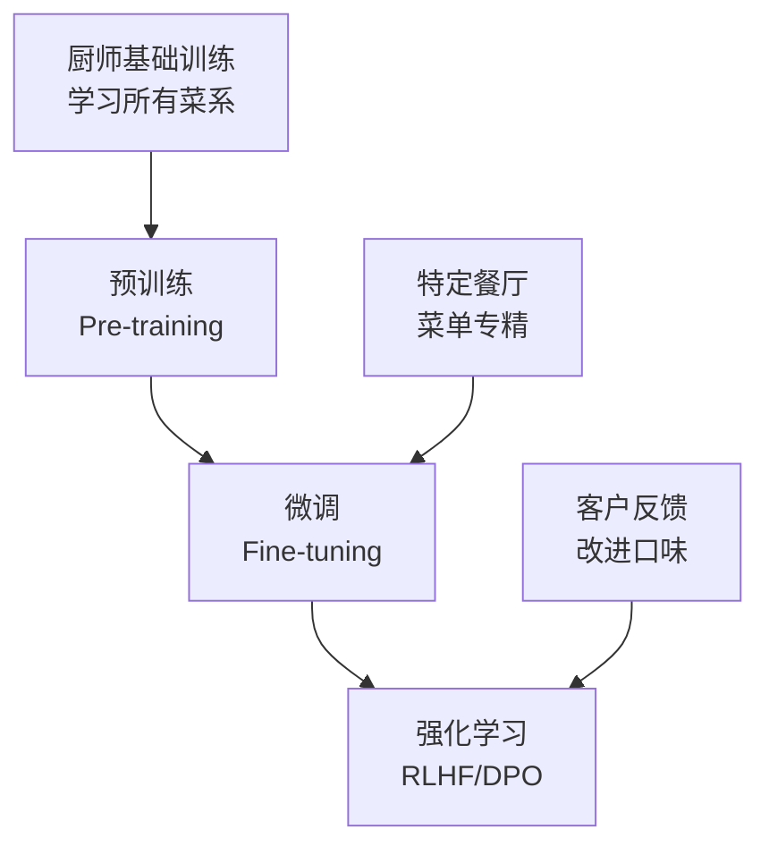
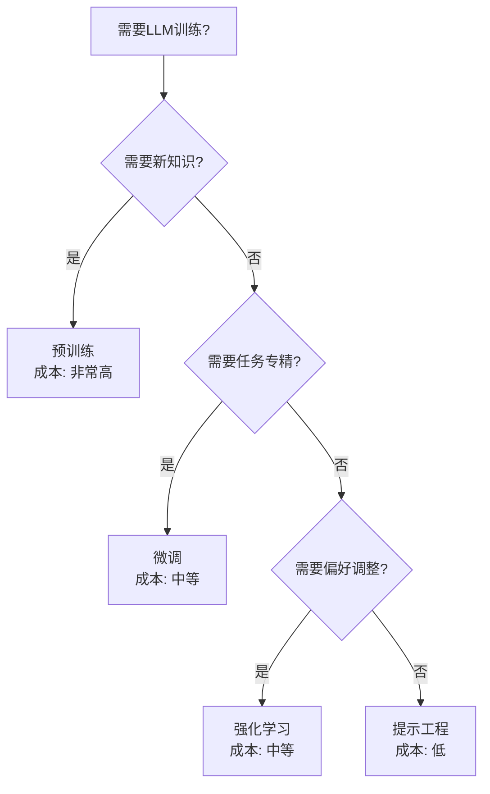
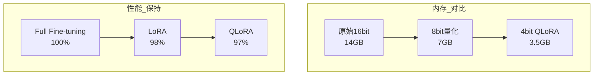
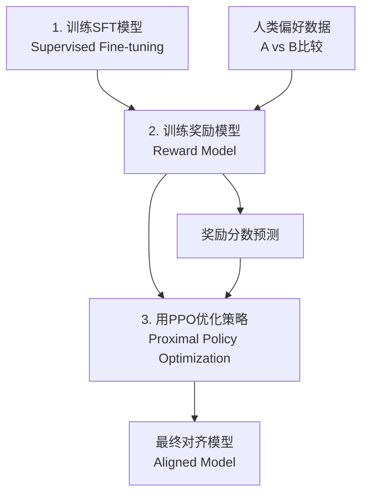
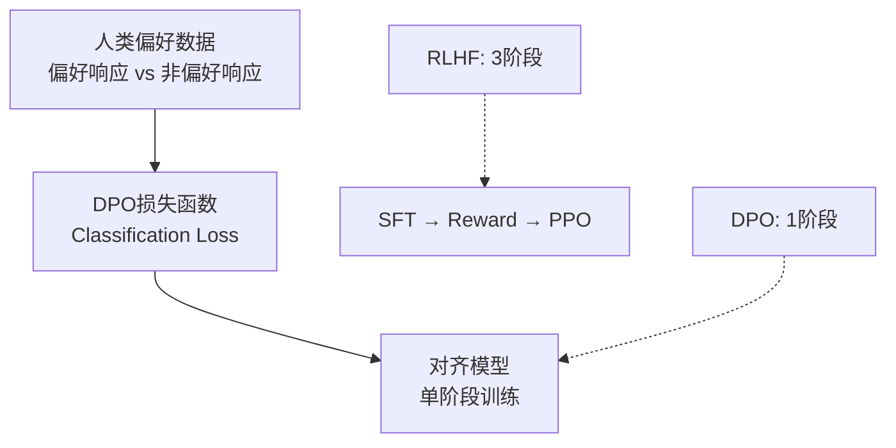
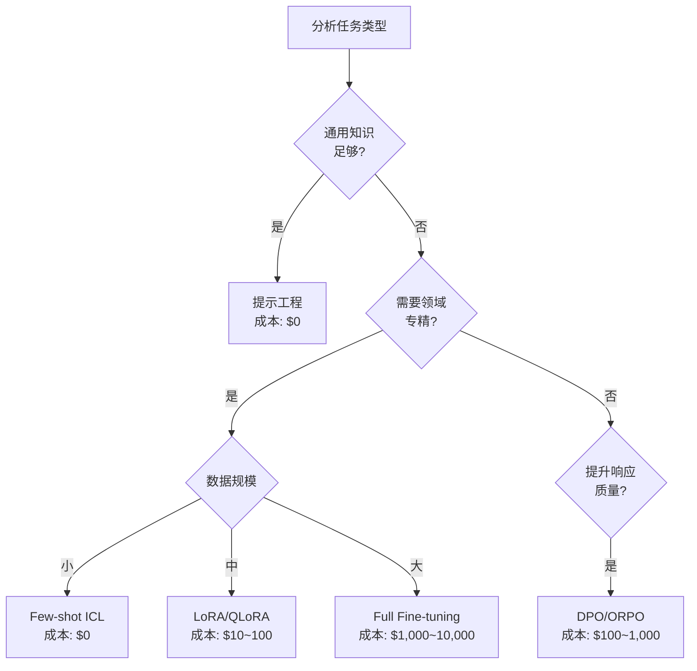

> <strong>系列: DeNA LLM 研究</strong> (3/5)
>
> 1. [Part 1: LLM基础与2025年AI现状](/zh/blog/zh/dena-llm-study-part1-fundamentals)
> 2. [Part 2: 结构化输出与多LLM管道](/zh/blog/zh/dena-llm-study-part2-structured-output)
> 3. <strong>Part 3: 模型训练方法论</strong> ← 当前文章
> 4. [Part 4: RAG架构与最新趋势](/zh/blog/zh/dena-llm-study-part4-rag)
> 5. [Part 5: 智能体设计与多智能体编排](/zh/blog/zh/dena-llm-study-part5-agent-design)

## 引言

DeNA的LLM研究资料Part 3涵盖了LLM的多种学习方法论。我们将探索预训练(Pre-training)、微调(Fine-tuning)和强化学习(Reinforcement Learning)之间的区别，以及LoRA、QLoRA、DPO等最新高效学习技术的原理和实际应用方法。

本文基于DeNA研究资料，并补充了2025年的最新趋势和实践经验。

## 预训练 vs 微调 vs 强化学习

### 通过餐厅比喻理解

DeNA资料通过餐厅运营比喻来解释三种学习方式:



<strong>预训练 (Pre-training)</strong>

- <strong>目的</strong>: 获得通用语言理解能力
- <strong>数据</strong>: 数十至数百TB的网络数据
- <strong>成本</strong>: 数亿至数千亿元 (GPT-4估计超1000亿元)
- <strong>比喻</strong>: 在烹饪学校学习所有烹饪技法的过程

<strong>微调 (Fine-tuning)</strong>

- <strong>目的</strong>: 专门化特定任务/领域
- <strong>数据</strong>: 数千至数万个任务特定数据
- <strong>成本</strong>: 数十万至数百万元
- <strong>比喻</strong>: 成为意大利餐厅意大利面专家的过程

<strong>强化学习 (Reinforcement Learning)</strong>

- <strong>目的</strong>: 生成符合人类偏好的响应
- <strong>数据</strong>: 数千至数万个偏好数据
- <strong>成本</strong>: 数百万至数千万元
- <strong>比喻</strong>: 根据客户反馈调整菜品口味的过程

### 实务决策指南



<strong>决策检查清单</strong>:

1. <strong>能用提示解决吗?</strong> → 首先尝试提示优化
2. <strong>现有模型理解任务吗?</strong> → 是: 强化学习，否: 微调
3. <strong>是全新领域吗?</strong> → 考虑预训练 (但注意成本)

## PEFT: 高效微调的兴起

### 传统微调的问题

更新所有参数的Full Fine-tuning的局限性:

- <strong>内存使用</strong>: 微调7B模型需要80GB+ VRAM
- <strong>时间成本</strong>: 需要数小时至数天
- <strong>部署困难</strong>: 每个任务需要存储整个模型 (数十GB)

### PEFT的核心理念

参数高效微调(PEFT)通过<strong>仅训练部分参数</strong>来最大化效率:


<strong>PEFT主要方法</strong>:

1. <strong>Adapter</strong>: 在层之间插入小型网络
2. <strong>Prefix Tuning</strong>: 向输入添加可训练的前缀
3. <strong>LoRA</strong>: 通过低秩分解更新权重 (最受欢迎)
4. <strong>Prompt Tuning</strong>: 仅训练软提示

## LoRA: 低秩适应原理

### 数学背景

LoRA(Low-Rank Adaptation)基于以下数学洞察:

```python
# 原始权重更新 (Full Fine-tuning)
W_new = W_original + ΔW  # ΔW为 d×d 大小

# LoRA的低秩分解
ΔW = B @ A  # B为 d×r，A为 r×d (r << d)

# 实际应用
output = (W_original + B @ A) @ input
```

<strong>核心理念</strong>:

- 预训练权重已包含丰富信息
- 微调所需的变化量(ΔW)具有<strong>低内在维度(intrinsic dimension)</strong>
- 因此ΔW可以表示为两个小矩阵(B, A)的乘积

### LoRA超参数配置指南

```yaml
# LoRA配置示例 (HuggingFace PEFT)
lora_config:
  r: 8 # 秩 (内在维度)
  lora_alpha: 16 # 缩放参数
  lora_dropout: 0.1 # Dropout比率
  target_modules: # 应用层
    - q_proj # Query投影
    - v_proj # Value投影
  bias: "none" # 是否训练偏置
```

<strong>超参数选择指南</strong>:

| 参数                            | 推荐值         | 说明                                              |
| ------------------------------- | -------------- | ------------------------------------------------- |
| <strong>r (Rank)</strong>       | 4〜16          | 越小越节省内存，越大表达能力越强。大多数情况8合适 |
| <strong>lora_alpha</strong>     | r〜2r          | 类似学习率的作用。通常为r的1〜2倍                 |
| <strong>lora_dropout</strong>   | 0.05〜0.1      | 防止过拟合。小数据集设置高一些                    |
| <strong>target_modules</strong> | q_proj, v_proj | Attention的Query/Value最有效                      |

### LoRA变体

<strong>DoRA (Weight-Decomposed Low-Rank Adaptation, 2024)</strong>

```python
# DoRA: 将权重分解为幅度(magnitude)和方向(direction)
W = m * (V + B @ A)
# m: 可训练幅度，V: 归一化权重，B@A: LoRA
```

- <strong>优点</strong>: 性能更接近Full Fine-tuning
- <strong>缺点</strong>: 比LoRA稍慢

<strong>GaLore (Gradient Low-Rank Projection, 2024)</strong>

```python
# 将梯度投影到低秩空间以节省内存
gradient_lowrank = project_to_lowrank(gradient)
optimizer.step(gradient_lowrank)
```

- <strong>优点</strong>: 优化器状态也低秩压缩 → 额外节省50%内存
- <strong>缺点</strong>: 实现复杂度高

<strong>LoRA+ (2024)</strong>

```python
# 对矩阵A、B应用不同学习率
lr_A = lr * eta  # A使用较高学习率
lr_B = lr        # B使用基本学习率
```

- <strong>优点</strong>: 收敛速度提升1.5〜2倍
- <strong>缺点</strong>: 需要超参数调优

## QLoRA: 量化与PEFT结合

### 4bit量化的革新

QLoRA结合<strong>4bit量化</strong>和LoRA，大幅减少内存使用:



<strong>QLoRA核心技术</strong>:

1. <strong>4bit NormalFloat (NF4)</strong>: 针对正态分布优化的量化
2. <strong>Double Quantization</strong>: 量化常数也量化
3. <strong>Paged Optimizers</strong>: CPU-GPU内存自动管理

### QLoRA实务工作流

```python
from transformers import AutoModelForCausalLM, BitsAndBytesConfig
from peft import LoraConfig, get_peft_model

# 1. 4bit量化配置
bnb_config = BitsAndBytesConfig(
    load_in_4bit=True,
    bnb_4bit_quant_type="nf4",      # NormalFloat 4bit
    bnb_4bit_compute_dtype="float16", # 计算使用float16
    bnb_4bit_use_double_quant=True,   # Double quantization
)

# 2. 加载模型
model = AutoModelForCausalLM.from_pretrained(
    "meta-llama/Llama-2-7b-hf",
    quantization_config=bnb_config,
    device_map="auto"  # 自动设备分配
)

# 3. LoRA配置
lora_config = LoraConfig(
    r=8,
    lora_alpha=16,
    target_modules=["q_proj", "v_proj"],
    lora_dropout=0.1,
    bias="none",
    task_type="CAUSAL_LM"
)

# 4. 创建PEFT模型
model = get_peft_model(model, lora_config)

# 5. 检查可训练参数
trainable_params = sum(p.numel() for p in model.parameters() if p.requires_grad)
print(f"可训练参数: {trainable_params:,} ({trainable_params/7e9*100:.2f}%)")
# 输出: 可训练参数: 4,194,304 (0.06%)
```

<strong>QLoRA实务技巧</strong>:

- <strong>GPU内存</strong>: 单张RTX 3090 (24GB)可训练7B模型
- <strong>批量大小</strong>: 使用梯度累积 (如: batch_size=1, gradient_accumulation_steps=16)
- <strong>训练时间</strong>: 比Full Fine-tuning慢1.5〜2倍 (量化开销)

## RLHF与DPO: 学习人类偏好

### RLHF的复杂性

人类反馈强化学习(RLHF)强大但复杂:



<strong>RLHF的问题</strong>:

1. <strong>3阶段流程</strong>: SFT → Reward Model → RL优化
2. <strong>不稳定性</strong>: PPO对超参数敏感
3. <strong>高成本</strong>: 奖励模型训练 + RL采样
4. <strong>调试困难</strong>: RL收敛失败时难以诊断原因

### DPO: 直接偏好优化

直接偏好优化(DPO)<strong>无需奖励模型</strong>直接学习人类偏好:



<strong>DPO损失函数</strong>:

```python
# DPO Loss (公式简化)
loss = -log(σ(β * (log π(y_w|x) - log π(y_l|x))))

# y_w: 偏好响应 (chosen)
# y_l: 非偏好响应 (rejected)
# β: 超参数 (通常为0.1)
# σ: Sigmoid函数
```

<strong>DPO的优势</strong>:

- <strong>简单性</strong>: 无需奖励模型，一次训练完成
- <strong>稳定性</strong>: Classification loss比PPO更稳定
- <strong>效率</strong>: 内存和时间减少50%
- <strong>性能</strong>: 与RLHF相当或更好

### DPO实务实现

```python
from trl import DPOTrainer

# DPO训练配置
training_args = TrainingArguments(
    output_dir="./dpo_model",
    per_device_train_batch_size=4,
    learning_rate=5e-5,
    num_train_epochs=3,
    gradient_accumulation_steps=4,
)

# 初始化DPO Trainer
dpo_trainer = DPOTrainer(
    model=model,
    args=training_args,
    train_dataset=preference_dataset,  # (prompt, chosen, rejected)格式
    tokenizer=tokenizer,
    beta=0.1,  # DPO超参数
)

# 执行训练
dpo_trainer.train()
```

<strong>偏好数据格式</strong>:

```python
preference_dataset = [
    {
        "prompt": "如何在Python中排序列表?",
        "chosen": "使用sorted()函数即可: sorted([3,1,2])",
        "rejected": "直接用sort()就行"
    },
    # ...
]
```

### DPO变体

<strong>ORPO (Odds Ratio Preference Optimization, 2024)</strong>

- <strong>同时</strong>执行SFT和偏好学习
- 无需单独的SFT阶段
- 进一步缩短训练时间

<strong>IPO (Identity Preference Optimization, 2024)</strong>

- 可以无参考模型训练
- 进一步减少内存使用

<strong>KTO (Kahneman-Tversky Optimization, 2024)</strong>

- 使用<strong>单独反馈</strong>(好/坏)代替成对比较
- 大幅降低数据收集成本

## 任务别训练方法选择指南

### 成本-性能权衡



### 实务建议

<strong>1. 聊天机器人/对话系统</strong>

```
提示 → SFT (LoRA) → DPO
```

- 领域知识注入: 用LoRA高效微调
- 对话质量改善: 用DPO偏好对齐

<strong>2. 文档分类/标注</strong>

```
提示 → LoRA (可选)
```

- 大多数情况提示足够
- 极限性能需求时添加LoRA

<strong>3. 代码生成</strong>

```
提示 → SFT (QLoRA) → RLHF/DPO
```

- 代码风格学习: 用QLoRA训练大量代码
- 可执行性改善: 用RLHF惩罚编译错误

<strong>4. 摘要/翻译</strong>

```
提示 → DPO
```

- 基础模型往往足够
- 风格调整: 用DPO学习期望的语气/长度

### 内存需求对比

| 方法                              | 7B模型                | 13B模型               | 70B模型                |
| --------------------------------- | --------------------- | --------------------- | ---------------------- |
| <strong>Full Fine-tuning</strong> | 80GB                  | 160GB                 | 800GB+                 |
| <strong>LoRA</strong>             | 40GB                  | 80GB                  | 400GB                  |
| <strong>QLoRA</strong>            | <strong>24GB</strong> | <strong>40GB</strong> | <strong>200GB</strong> |

<strong>消费级GPU可行性</strong>:

- <strong>RTX 4090 (24GB)</strong>: 用QLoRA训练7B，用LoRA训练3B
- <strong>RTX 3090 (24GB)</strong>: 用QLoRA训练7B
- <strong>RTX 4060 Ti (16GB)</strong>: 用QLoRA训练3B

## 启示与感想

### LLM微调的民主化

DeNA资料最令人印象深刻的是<strong>LLM微调不再是大公司专属</strong>。随着QLoRA和DPO的出现:

- 24GB VRAM可以微调7B模型
- 数百美元预算可以构建领域专用模型
- 可以使用简单的DPO代替复杂的RLHF

### 效率的范式转变

最近，<strong>效率(Efficiency)</strong>成为热门话题:

- LoRA: 用0.1%参数达到Full Fine-tuning 98%性能
- QLoRA: 用1/4内存达到相同性能
- DPO: 用1/3复杂度达到RLHF相当性能

这不仅是优化，更是<strong>新数学洞察</strong>的结果。低秩假设、量化理论、隐式奖励模型等学术研究正在快速转化为实践。

### 对实践者的启示

1. <strong>从提示开始</strong>: 80%可以用提示解决
2. <strong>LoRA为基础</strong>: 需要微调时首先尝试LoRA
3. <strong>用QLoRA节省资源</strong>: 性能差异微小，内存节省4倍
4. <strong>用DPO对齐</strong>: RLHF是遗留技术，DPO是新标准
5. <strong>测量并改进</strong>: 关注实际任务性能而非基准分数

### 2025年展望

预期趋势:

- <strong>更小但强大的模型</strong>: Phi-3、Gemma 2等小型模型的崛起
- <strong>设备端微调</strong>: 智能手机上也能微调的时代
- <strong>自动化超参数调优</strong>: AutoML for LLM Fine-tuning
- <strong>多模态PEFT</strong>: 图像+文本同时微调

## 参考资料

### 论文

- [LoRA: Low-Rank Adaptation of Large Language Models](https://arxiv.org/abs/2106.09685) (Microsoft, 2021)
- [QLoRA: Efficient Finetuning of Quantized LLMs](https://arxiv.org/abs/2305.14314) (University of Washington, 2023)
- [Direct Preference Optimization](https://arxiv.org/abs/2305.18290) (Stanford, 2023)
- [DoRA: Weight-Decomposed Low-Rank Adaptation](https://arxiv.org/abs/2402.09353) (NVIDIA, 2024)
- [GaLore: Memory-Efficient LLM Training](https://arxiv.org/abs/2403.03507) (CMU, 2024)

### 库

- [HuggingFace PEFT](https://github.com/huggingface/peft) - LoRA、QLoRA实现
- [HuggingFace TRL](https://github.com/huggingface/trl) - RLHF、DPO实现
- [Unsloth](https://github.com/unslothai/unsloth) - 2倍快的LoRA训练

### 教程

- [QLoRA Fine-tuning Tutorial](https://colab.research.google.com/drive/1VoYNfYDKcKRQRor98Zbf2-9VQTtGJ24k)
- [DPO Training Example](https://huggingface.co/docs/trl/dpo_trainer)
- [实战LLM微调指南](https://product.kyobobook.co.kr/detail/S000214934825) (教保文库)

---

<strong>下期预告</strong>: "DeNA LLM研究Part 4: 生产部署与监控"将介绍将微调模型部署到实际服务的策略、监控方法和成本优化技术。
