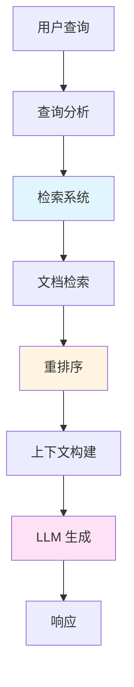
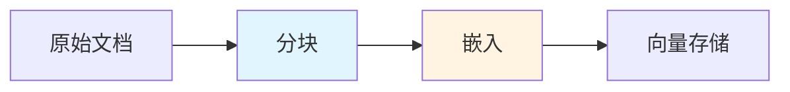
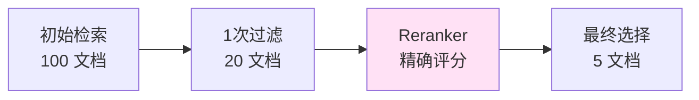
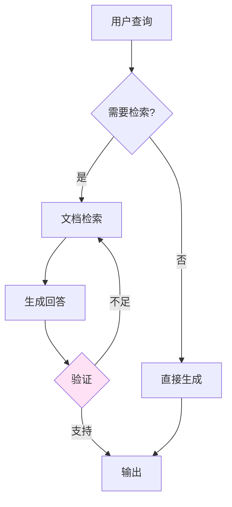
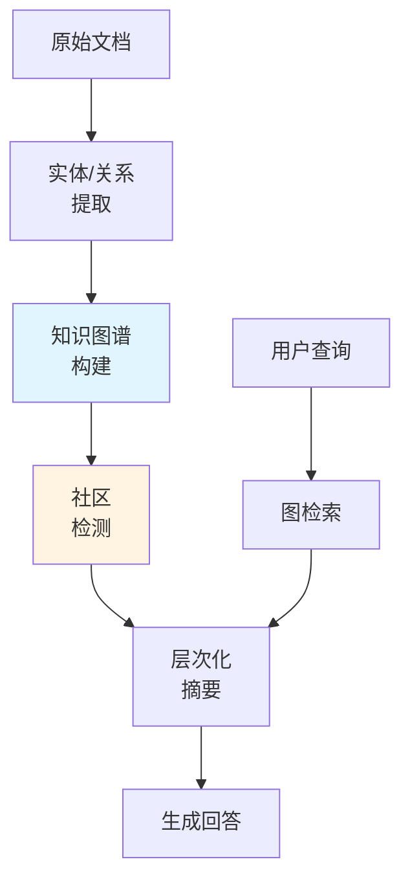
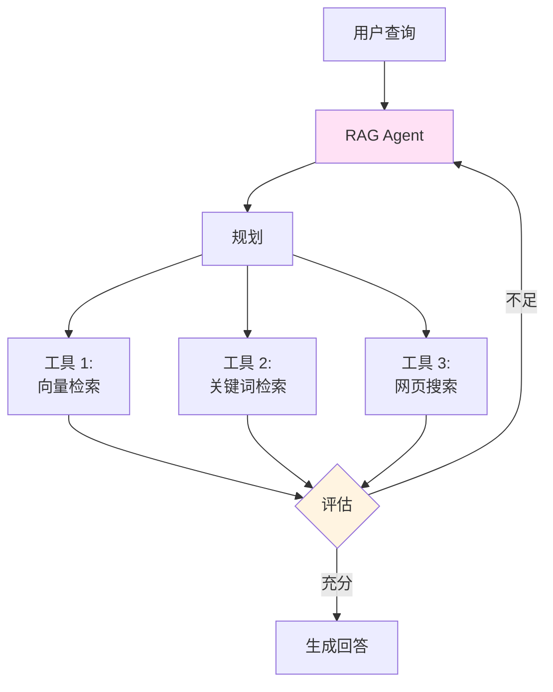
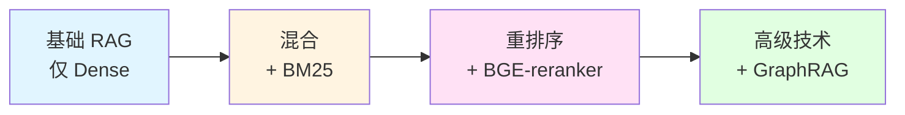
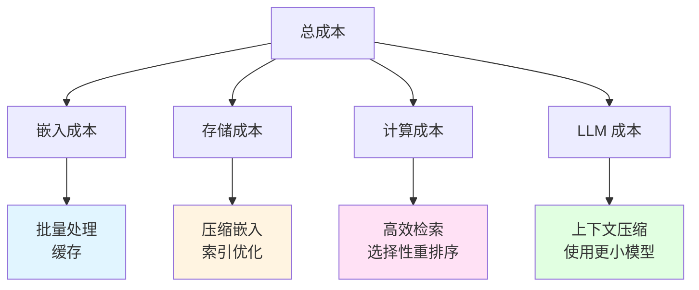

> <strong>系列: DeNA LLM 研究</strong> (4/5)
>
> 1. [Part 1: LLM基础与2025年AI现状](/zh/blog/zh/dena-llm-study-part1-fundamentals)
> 2. [Part 2: 结构化输出与多LLM管道](/zh/blog/zh/dena-llm-study-part2-structured-output)
> 3. [Part 3: 模型训练方法论](/zh/blog/zh/dena-llm-study-part3-model-training)
> 4. <strong>Part 4: RAG架构与最新趋势</strong> ← 当前文章
> 5. [Part 5: 智能体设计与多智能体编排](/zh/blog/zh/dena-llm-study-part5-agent-design)

## 概述

DeNA 的 LLM 研究系列 Part 4 涵盖了 RAG（检索增强生成）从核心概念到最新趋势的全面内容。我们学习了如何超越简单的提示工程，设计能够有效利用外部知识的系统。

本文基于 DeNA 研究资料，整理了完整的 RAG 架构、混合检索策略、重排序技术，以及 GraphRAG 和 Agentic RAG 等最新发展方向。

## 上下文工程: LLM 是接口

DeNA 研究强调的核心概念是<strong>"LLM 只是接口，检索系统才是真正的核心"</strong>。

### 超越提示工程

传统的提示工程专注于向 LLM 提供更好的指令。但在 RAG 系统中：

- <strong>检索质量</strong>决定响应质量
- <strong>上下文选择</strong>防止幻觉
- <strong>系统设计</strong>优化性能和成本



### RAG 的核心价值

1. <strong>最新信息</strong>：可访问训练后的知识
2. <strong>领域知识集成</strong>：利用内部文档和专业知识
3. <strong>幻觉预防</strong>：生成有依据的响应
4. <strong>可追溯性</strong>：通过引用建立信任

## 完整 RAG 架构

DeNA 研究将 RAG 分为五个阶段：

### 1. 文档索引 (Indexing)



<strong>分块策略</strong>：

- <strong>固定大小</strong>：按 512 token 单位分割
- <strong>语义基础</strong>：按段落或章节分割
- <strong>重叠</strong>：50〜100 token 重叠以保持上下文

<strong>嵌入选择</strong>：

- <strong>OpenAI text-embedding-3</strong>：通用性、API 便利性
- <strong>Cohere Embed v3</strong>：多语言支持、压缩嵌入
- <strong>BGE 系列</strong>：开源、可定制

### 2. 查询扩展 (Query Expansion)

丰富简短用户查询的技术：

```python
# HyDE (假设文档嵌入)
query = "如何改进 RAG 性能?"

# 1. LLM 生成假设答案
hypothetical_answer = llm.generate(f"""
请对以下问题写详细答案:
{query}
""")

# 2. 使用假设答案进行嵌入和搜索
embedding = embed_model.encode(hypothetical_answer)
results = vector_store.search(embedding, top_k=5)
```

<strong>查询扩展技术</strong>：

- <strong>HyDE</strong>：生成假设文档后搜索
- <strong>Multi-Query</strong>：从多个角度生成查询
- <strong>Query Decomposition</strong>：将复杂查询分解为子查询

### 3. 混合检索 (Hybrid Search)

DeNA 研究的核心强调点：<strong>BM25 + Dense + Sparse 组合</strong>

```python
# 混合检索实现示例
def hybrid_search(query, alpha=0.5):
    # 1. BM25 (关键词基础)
    bm25_scores = bm25_retriever.search(query, top_k=20)

    # 2. Dense Vector (语义基础)
    dense_embedding = dense_model.encode(query)
    dense_scores = vector_store.search(dense_embedding, top_k=20)

    # 3. Sparse Vector (重要 token 基础)
    sparse_embedding = splade_model.encode(query)
    sparse_scores = sparse_store.search(sparse_embedding, top_k=20)

    # 4. 分数组合 (加权平均)
    combined_scores = (
        alpha * bm25_scores +
        (1 - alpha) * 0.7 * dense_scores +
        (1 - alpha) * 0.3 * sparse_scores
    )

    return combined_scores.top_k(10)
```

<strong>各方法特点</strong>：

| 方法                    | 优势                 | 劣势           |
| ----------------------- | -------------------- | -------------- |
| <strong>BM25</strong>   | 精确关键词匹配、快速 | 缺乏语义理解   |
| <strong>Dense</strong>  | 捕获语义相似度       | 可能遗漏关键词 |
| <strong>Sparse</strong> | 强调重要 token       | 计算成本高     |

### 4. 重排序 (Reranking)

更精确地重新排列检索到的文档的阶段：



<strong>重排序模型选择</strong>：

1. <strong>ColBERT (后期交互)</strong>
   - 查询和文档的 token 级相似度计算
   - 速度和准确度平衡
   - 优点：快速且有效

2. <strong>Cross-Encoder</strong>
   - 一起编码查询和文档
   - 最高准确度
   - 缺点：慢（需要计算所有对）

3. <strong>BGE-reranker</strong>
   - 开源 Cross-Encoder
   - 多语言支持
   - 实践中广泛使用

```python
# BGE-reranker 使用示例
from FlagEmbedding import FlagReranker

reranker = FlagReranker('BAAI/bge-reranker-large', use_fp16=True)

# 重排序检索到的文档
pairs = [[query, doc.text] for doc in retrieved_docs]
scores = reranker.compute_score(pairs)

# 按分数排序
reranked_docs = sorted(
    zip(retrieved_docs, scores),
    key=lambda x: x[1],
    reverse=True
)[:5]
```

### 5. 生成 (Generation)

使用最终选择的上下文生成 LLM 响应：

```python
def generate_with_citations(query, top_docs):
    # 组装上下文
    context = "\n\n".join([
        f"[{i+1}] {doc.text}\n来源: {doc.source}"
        for i, doc in enumerate(top_docs)
    ])

    prompt = f"""
请根据以下上下文回答问题。
务必引用来源编号 (例如: [1], [2])。

上下文:
{context}

问题: {query}

回答:"""

    response = llm.generate(prompt)
    return response
```

## 嵌入模型比较

DeNA 研究涉及的主要嵌入模型：

### OpenAI text-embedding-3

```python
from openai import OpenAI

client = OpenAI()

# Small 模型 (便宜、快速)
response = client.embeddings.create(
    model="text-embedding-3-small",
    input="Your text here"
)
embedding_small = response.data[0].embedding  # 1536 维

# Large 模型 (高质量)
response = client.embeddings.create(
    model="text-embedding-3-large",
    input="Your text here",
    dimensions=3072  # 最大 3072 维
)
embedding_large = response.data[0].embedding
```

<strong>特点</strong>：

- API 基础，易于使用
- 高通用性
- 成本效益高 (small: $0.02/1M tokens)

### Cohere Embed v3

```python
import cohere

co = cohere.Client('your-api-key')

# 多语言嵌入
response = co.embed(
    texts=["韩语文本", "English text", "日本語テキスト"],
    model="embed-multilingual-v3.0",
    input_type="search_query"  # or "search_document"
)

embeddings = response.embeddings  # 1024 维
```

<strong>特点</strong>：

- 支持 100+ 语言
- 按输入类型优化 (query vs document)
- 压缩嵌入支持 (128〜1024 维)

### BGE (北京人工智能学院) 系列

```python
from FlagEmbedding import FlagModel

# BGE-M3: 多功能嵌入
model = FlagModel('BAAI/bge-m3', use_fp16=True)

# Dense 嵌入
dense_vecs = model.encode(
    ["Query text"],
    return_dense=True,
    return_sparse=False,
    return_colbert_vecs=False
)

# Sparse 嵌入 (类似 SPLADE)
sparse_vecs = model.encode(
    ["Query text"],
    return_dense=False,
    return_sparse=True,
    return_colbert_vecs=False
)

# ColBERT 风格 multi-vector
colbert_vecs = model.encode(
    ["Query text"],
    return_dense=False,
    return_sparse=False,
    return_colbert_vecs=True
)
```

<strong>特点</strong>：

- 开源（允许商业使用）
- 支持所有 3 种检索方法 (Dense, Sparse, Multi-vector)
- 长上下文支持（最多 8192 tokens）
- 支持 100+ 语言

## Grounding: 幻觉预防策略

RAG 最重要的目标之一是<strong>防止幻觉</strong>。

### 1. 强制引用 (Citation Enforcement)

```python
system_prompt = """
您是仅使用提供的上下文回答的 AI。
严格遵守以下规则:

1. 所有主张都标注来源编号 [1], [2] 等
2. 对于不在上下文中的信息，说明"提供的信息中没有"
3. 不确定时表达"不确定"
4. 只陈述事实，不推测
"""
```

### 2. 不确定性表达

```python
def generate_with_confidence(query, context):
    prompt = f"""
上下文: {context}

问题: {query}

请按以下格式回答:
- 回答: [您的回答]
- 置信度: [高/中/低]
- 依据: [引用上下文相关部分]
"""
    return llm.generate(prompt)
```

### 3. Self-RAG: 自我验证

Self-RAG 允许 LLM 自主判断检索必要性并验证响应。



```python
def self_rag(query):
    # 1. 判断检索必要性
    need_retrieval = llm.classify(
        f"回答以下问题需要外部信息吗? {query}"
    )

    if need_retrieval:
        # 2. 检索文档
        docs = retriever.search(query)

        # 3. 生成回答
        response = llm.generate_with_context(query, docs)

        # 4. 验证回答
        is_supported = llm.verify(
            f"以下回答是否得到上下文充分支持? 回答: {response}"
        )

        if not is_supported:
            # 需要重新检索或更多文档
            return self_rag(query)  # 递归调用
    else:
        response = llm.generate(query)

    return response
```

## 最新 RAG 趋势

DeNA 研究涉及的最新 RAG 发展方向：

### 1. GraphRAG

Microsoft 于 2024 年发布的基于知识图谱的 RAG：



<strong>GraphRAG 优势</strong>：

- <strong>关系推理</strong>：利用实体间的连接
- <strong>多跳推理</strong>：处理"认识 A 的 B 的 C"等复杂问题
- <strong>整体上下文</strong>：理解文档间的连接

<strong>使用案例</strong>：

- 基于组织架构图的问答
- 法律文档的判例引用
- 学术论文的引用关系分析

### 2. Agentic RAG

最近在"Agent 时代"出现的自主 RAG：



<strong>传统 RAG vs Agentic RAG</strong>：

| 传统 RAG       | Agentic RAG    |
| -------------- | -------------- |
| 单一检索步骤   | 迭代检索       |
| 固定管道       | 动态工具选择   |
| 仅响应用户查询 | 规划和执行     |
| 检索失败时终止 | 重试并改变策略 |

<strong>实现示例</strong> (LangGraph)：

```python
from langgraph.graph import StateGraph, END
from langchain.tools import Tool

# 定义 RAG agent
class RAGAgent:
    def __init__(self):
        self.tools = [
            Tool(name="vector_search", func=self.vector_search),
            Tool(name="keyword_search", func=self.keyword_search),
            Tool(name="web_search", func=self.web_search)
        ]

    def plan(self, query):
        # LLM 确定检索策略
        plan = self.llm.generate(f"""
        制定检索策略以回答以下问题:
        {query}

        可用工具: {[tool.name for tool in self.tools]}
        """)
        return plan

    def execute(self, query):
        max_iterations = 3
        context = []

        for i in range(max_iterations):
            # 制定计划
            plan = self.plan(query)

            # 执行工具
            results = self.execute_tools(plan)
            context.extend(results)

            # 评估信息是否充分
            is_sufficient = self.evaluate(query, context)

            if is_sufficient:
                break

        # 生成最终响应
        return self.generate_response(query, context)
```

### 3. Long RAG

用于长上下文处理的 RAG 变体：

<strong>问题</strong>：传统 RAG 在有限的上下文窗口（4K〜8K tokens）内运作

<strong>解决方案</strong>：

1. <strong>层次化检索</strong>：从章节 → 小节 → 段落逐步缩小
2. <strong>流式上下文</strong>：仅顺序加载必要部分
3. <strong>基于摘要的检索</strong>：长文档先通过摘要检索

```python
def long_rag(query, long_documents):
    # 阶段 1: 通过文档摘要选择候选
    summaries = [doc.summary for doc in long_documents]
    candidate_docs = vector_search(query, summaries, top_k=3)

    # 阶段 2: 在选定文档内详细检索
    detailed_chunks = []
    for doc in candidate_docs:
        chunks = chunk_document(doc, chunk_size=512)
        relevant_chunks = vector_search(query, chunks, top_k=5)
        detailed_chunks.extend(relevant_chunks)

    # 阶段 3: 用最终上下文生成回答
    return generate_response(query, detailed_chunks)
```

### 4. 多模态 RAG (ColPali)

不仅检索文本，还检索图像、表格和图表：

<strong>ColPali</strong>：将整个文档页面嵌入为图像

```python
from colpali import ColPali

# 嵌入文档页面图像
model = ColPali()
page_embeddings = model.encode_images([
    "doc1_page1.png",
    "doc1_page2.png",
    "doc2_page1.png"
])

# 用文本查询搜索图像
query_embedding = model.encode_text("财务报表中的净利润是多少?")
similar_pages = vector_search(query_embedding, page_embeddings)

# 将检索到的页面图像传递给 Vision LLM
response = vision_llm.generate_with_image(
    query="财务报表中的净利润是多少?",
    images=similar_pages
)
```

<strong>多模态 RAG 优势</strong>：

- <strong>保留布局</strong>：维护原始 PDF 表格和图表
- <strong>无需 OCR</strong>：直接处理图像
- <strong>视觉上下文</strong>：利用图表和图形

## 实践应用启示

从 DeNA 研究获得的实际应用见解：

### 1. 增量优化策略



1. <strong>阶段 1: 基础 RAG</strong>
   - 仅使用 dense 向量检索
   - 快速构建原型
   - 测量基线性能

2. <strong>阶段 2: 混合检索</strong>
   - 添加 BM25 改进关键词匹配
   - 预期 10〜20% 性能提升

3. <strong>阶段 3: 重排序</strong>
   - 用 BGE-reranker 提高精度
   - 额外 15〜25% 改进

4. <strong>阶段 4: 高级技术</strong>
   - 根据领域应用 GraphRAG、Agentic RAG
   - 增强复杂问题处理能力

### 2. 评估指标设置

衡量 RAG 系统性能的关键指标：

```python
# 检索质量指标
def evaluate_retrieval(queries, ground_truth):
    metrics = {
        'recall@k': [],  # 前 k 个中正确文档的包含率
        'mrr': [],       # Mean Reciprocal Rank
        'ndcg': []       # Normalized Discounted Cumulative Gain
    }

    for query, truth in zip(queries, ground_truth):
        retrieved = retriever.search(query, top_k=10)

        # Recall@10
        recall = len(set(retrieved) & set(truth)) / len(truth)
        metrics['recall@k'].append(recall)

        # MRR
        for i, doc in enumerate(retrieved):
            if doc in truth:
                metrics['mrr'].append(1 / (i + 1))
                break

    return {k: sum(v) / len(v) for k, v in metrics.items()}

# 生成质量指标
def evaluate_generation(responses, references):
    from ragas import evaluate

    return evaluate(
        responses=responses,
        references=references,
        metrics=['answer_relevancy', 'faithfulness', 'context_precision']
    )
```

<strong>目标值</strong> (DeNA 研究建议)：

- <strong>Recall@10</strong>: 0.8+ (检索 80%+ 的正确文档)
- <strong>MRR</strong>: 0.6+ (平均在前 2 个中有正确答案)
- <strong>Answer Relevancy</strong>: 0.9+
- <strong>Faithfulness</strong>: 0.95+ (最小化幻觉)

### 3. 成本优化

RAG 系统成本结构：



<strong>成本削减策略</strong>：

1. <strong>嵌入优化</strong>

   ```python
   # 通过批量处理减少 API 调用
   batch_size = 100
   embeddings = []
   for i in range(0, len(texts), batch_size):
       batch = texts[i:i+batch_size]
       embeddings.extend(embed_model.encode(batch))

   # 缓存嵌入
   import pickle
   with open('embeddings_cache.pkl', 'wb') as f:
       pickle.dump(embeddings, f)
   ```

2. <strong>上下文压缩</strong>

   ```python
   def compress_context(docs, max_tokens=2000):
       # 仅提取重要句子
       sentences = extract_sentences(docs)
       scores = compute_relevance(sentences, query)

       # 在 token 限制内选择最相关的句子
       selected = []
       total_tokens = 0
       for sent, score in sorted(zip(sentences, scores),
                                  key=lambda x: x[1],
                                  reverse=True):
           sent_tokens = count_tokens(sent)
           if total_tokens + sent_tokens <= max_tokens:
               selected.append(sent)
               total_tokens += sent_tokens

       return " ".join(selected)
   ```

3. <strong>缓存策略</strong>

   ```python
   from functools import lru_cache

   @lru_cache(maxsize=1000)
   def cached_retrieval(query_hash):
       return retriever.search(query_hash)

   # 使用
   query_hash = hash(query)
   results = cached_retrieval(query_hash)
   ```

### 4. 安全与隐私

RAG 系统的安全考虑：

<strong>数据隔离</strong>：

```python
def secure_rag(query, user_id):
    # 验证用户文档访问权限
    allowed_docs = get_user_documents(user_id)

    # 搜索过滤的向量存储
    results = vector_store.search(
        query,
        filter={"doc_id": {"$in": allowed_docs}}
    )

    return results
```

<strong>敏感信息过滤</strong>：

```python
import re

def sanitize_response(response):
    # 删除个人信息模式
    patterns = {
        'email': r'\b[A-Za-z0-9._%+-]+@[A-Za-z0-9.-]+\.[A-Z|a-z]{2,}\b',
        'phone': r'\b\d{3}[-.]?\d{3,4}[-.]?\d{4}\b',
        'id': r'\b\d{6}[-]?\d{7}\b'
    }

    for name, pattern in patterns.items():
        response = re.sub(pattern, f'[{name.upper()}_REDACTED]', response)

    return response
```

## 思考与下一步

通过 DeNA 的 LLM 研究 Part 4，我深刻理解到 RAG 不仅仅是"检索后生成"，而是需要精密系统设计的工程领域。

### 核心见解

1. <strong>检索是核心</strong>：LLM 是接口，真正的价值在于准确的上下文检索
2. <strong>混合方法</strong>：结合 Dense、Sparse、BM25 以获得最佳性能
3. <strong>重排序必不可少</strong>：精确过滤初始检索结果
4. <strong>幻觉预防</strong>：通过引用、验证、Self-RAG 确保可靠性
5. <strong>演进范式</strong>：持续向 GraphRAG、Agentic RAG 发展

### 实践应用计划

基于此次学习，我计划进行以下改进：

1. <strong>引入混合检索</strong>
   - 当前仅使用 Dense 向量 → 添加 BM25
   - 应用 BGE-M3 模型进行多功能嵌入

2. <strong>构建重排序管道</strong>
   - 集成 BGE-reranker-large
   - 两阶段检索 (100 → 20 → 5 文档)

3. <strong>建立评估框架</strong>
   - 测量 Recall@10、MRR、NDCG
   - 构建 A/B 测试框架

4. <strong>实验 Agentic RAG</strong>
   - 使用 LangGraph 实现动态检索策略
   - 处理复杂的多步骤问题

### 下一步学习: Part 5 - 生产部署与监控

在 DeNA 研究系列的最后 Part 5 中，我们将涵盖：

- LLM 系统的生产部署策略
- 性能监控和日志记录
- A/B 测试和持续改进
- 成本优化和可扩展性

## 参考资料

### 论文与调查

- [Retrieval-Augmented Generation for LLMs: A Survey](https://arxiv.org/abs/2312.10997) (2023)
- [RAG and Beyond: A Comprehensive Survey](https://arxiv.org/abs/2409.14924) (2024)
- [Self-RAG: Learning to Retrieve, Generate, and Critique](https://arxiv.org/abs/2310.11511) (2023)

### 开源项目

- [FlagEmbedding (BGE 模型)](https://github.com/FlagOpen/FlagEmbedding)
- [LangChain RAG 教程](https://python.langchain.com/docs/tutorials/rag/)
- [LlamaIndex](https://github.com/run-llama/llama_index)

### 工具与平台

- [Weaviate (混合检索)](https://weaviate.io/)
- [Qdrant (向量数据库)](https://qdrant.tech/)
- [Pinecone (托管向量数据库)](https://www.pinecone.io/)

### 其他学习资源

- [RAGFlow Blog: RAG in 2025](https://ragflow.io/blog/rag-at-the-crossroads-mid-2025-reflections-on-ai-evolution)
- [Advanced RAG Variants Explained](https://www.glukhov.org/post/2025/11/advanced-rag-variants-longrag-self-rag-graphrag/)
- [The Ultimate RAG Blueprint 2025/2026](https://langwatch.ai/blog/the-ultimate-rag-blueprint-everything-you-need-to-know-about-rag-in-2025-2026)

---

<strong>系列继续</strong>: [Part 5: 智能体设计与多智能体编排](/zh/blog/zh/dena-llm-study-part5-agent-design)
