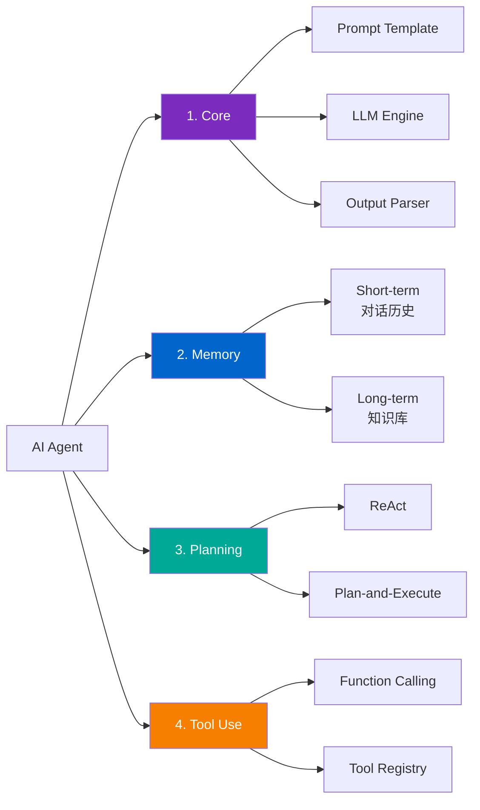
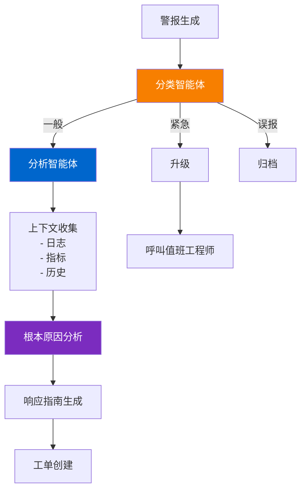

> <strong>系列: DeNA LLM 研究</strong> (5/5 - 最终篇)
>
> 1. [Part 1: LLM基础与2025年AI现状](/zh/blog/zh/dena-llm-study-part1-fundamentals)
> 2. [Part 2: 结构化输出与多LLM管道](/zh/blog/zh/dena-llm-study-part2-structured-output)
> 3. [Part 3: 模型训练方法论](/zh/blog/zh/dena-llm-study-part3-model-training)
> 4. [Part 4: RAG架构与最新趋势](/zh/blog/zh/dena-llm-study-part4-rag)
> 5. <strong>Part 5: 智能体设计与多智能体编排</strong> ← 当前文章

## 概述

这是 DeNA LLM 研究系列的最终篇。Part 5 涵盖利用 LLM 的<strong>智能体设计</strong>和<strong>多智能体编排</strong>。超越简单的提示工程，探索如何构建自主运行的智能体系统，以及在生产环境中需要考虑的成本、性能和可靠性问题。

### Part 5 主要话题

1. <strong>利用 n8n 的 LLM 工作流</strong> - 使用无代码/低代码自动化平台构建智能体
2. <strong>智能体设计原则</strong> - 核心组件和自愈模式
3. <strong>多智能体编排</strong> - 6 种模式和框架比较（LangGraph、AutoGen、CrewAI）
4. <strong>内存和状态管理</strong> - MemGPT、A-MEM（基于 Zettelkasten）
5. <strong>生产案例研究</strong> - DeNA NOC Alert Agent
6. <strong>成本和性能优化</strong> - 语义缓存、批处理、SLM 应用

本文基于 DeNA 官方研究资料，结合最新研究成果和生产案例进行综合整理。

## 1. 利用 n8n 的 LLM 工作流

### n8n 是什么？

[n8n](https://n8n.io/) 是一个<strong>无代码/低代码工作流自动化平台</strong>。截至 2025 年，支持 422+ 集成，并提供专门用于构建 LLM 智能体的功能。

**主要特点**:

- 可视化工作流构建器
- LangChain、Ollama 等主要 LLM 框架集成
- 原生 ReAct Agent 模式支持
- 可自托管（保证数据隐私）

### ReAct Agent 实现

在 n8n 中实现 ReAct（推理与行动）模式的示例：

```typescript
// n8n ReAct Agent 工作流示例
{
  "nodes": [
    {
      "type": "n8n-nodes-langchain.agent",
      "name": "ReAct Agent",
      "parameters": {
        "agentType": "react",
        "systemMessage": "您是数据分析专家。分析用户问题并选择适当的工具回答。",
        "tools": ["webSearch", "calculator", "database"]
      }
    }
  ]
}
```

### 2025 年趋势：编排 > 完全自主

根据 DeNA 研究资料和最新研究，2025 年智能体系统的核心趋势是<strong>从"完全自主"向"编排"转变</strong>。

**原因**:

1. <strong>成本爆炸</strong>：自主智能体的无限 API 调用
2. <strong>不可预测性</strong>：难以控制智能体行为
3. <strong>可靠性问题</strong>：生产环境中的不稳定性

n8n 等工作流工具受到关注的原因，正是因为它们提供<strong>显式编排</strong>。

## 2. 智能体设计原则

### 核心组件

LLM 智能体由 4 个核心组件组成：



#### 1. Core（核心）

智能体的中央引擎。

**组成部分**:

- <strong>Prompt Template</strong>：系统消息、角色定义
- <strong>LLM Engine</strong>：Claude、GPT-4、Gemini 等
- <strong>Output Parser</strong>：将 LLM 输出转换为结构化数据

#### 2. Memory（内存）

智能体的记忆系统。

**Short-term Memory**:

- 当前对话会话的历史
- 通常是最后 N 条消息（N=5〜10）
- 直接包含在 Context Window 中

**Long-term Memory**:

- 持久化知识库
- Vector Database（Pinecone、Weaviate 等）
- 需要时通过 RAG 模式检索

#### 3. Planning（规划）

智能体执行复杂任务的策略。

**ReAct 模式**:

```
Thought: 用户请求公司收入数据。
Action: query_db
Action Input: SELECT revenue FROM sales WHERE year=2024
Observation: [结果: $1.5M]
Thought: 需要与去年比较。
Action: query_db
Action Input: SELECT revenue FROM sales WHERE year=2023
Observation: [结果: $1.2M]
Thought: 需要计算增长率。
Action: calculate
Action Input: ((1.5 - 1.2) / 1.2) * 100
Observation: 25%
Final Answer: 2024 年收入为 $1.5M，比上年增长 25%。
```

#### 4. Tool Use（工具使用）

LLM 与外部工具交互的机制。

### 函数调用可靠性问题

DeNA 研究资料中指出的重要问题：<strong>LLM 的函数调用不是 100% 可靠的</strong>。

**问题案例**:

1. <strong>错误参数</strong>：缺少必填字段、类型不匹配
2. <strong>幻觉</strong>：调用不存在的工具
3. <strong>无限循环</strong>：重复调用相同工具

### 自愈模式

智能体自动从错误中恢复的机制。

```typescript
class SelfHealingAgent {
  async execute(task: Task): Promise<Result> {
    const maxRetries = 3;
    let attempt = 0;

    while (attempt < maxRetries) {
      try {
        const result = await this.runTask(task);
        return result;
      } catch (error) {
        attempt++;

        // 错误分析
        const analysis = await this.analyzeError(error);

        // 选择恢复策略
        if (analysis.recoverable) {
          task = await this.adjustTask(task, analysis);
          console.log(`Retry ${attempt}: ${analysis.suggestion}`);
        } else {
          throw new UnrecoverableError(error);
        }
      }
    }

    throw new Error("Max retries exceeded");
  }
}
```

## 3. 多智能体编排

### 6 种编排模式

跨多个智能体分布处理复杂任务的模式。

#### 1. Sequential（顺序）

一个智能体的输出成为下一个智能体输入的线性结构。

**用例**:

- 博客文章创建：研究 → 草稿 → 编辑 → 发布
- 数据管道：收集 → 清洗 → 分析 → 可视化

**优点**:

- 实现简单
- 易于调试
- 成本可预测

#### 2. Parallel（并行）

多个智能体同时独立工作的结构。

**用例**:

- 内容审核：质量检查 + 法律审查 + 事实核查并行执行
- 多模态分析：文本 + 图像 + 音频并行处理

#### 3. Supervisor（监督者）

中央监督者分配任务并整合结果的结构。

**用例**:

- 复杂研究：监督者将子主题分配给多个工作者
- 代码生成：监督者将模块实现分配给工作者

#### 4. Hierarchical（层次化）

多级监督者-工作者关系形成树结构的方式。

**用例**:

- 大规模项目管理：PM → 团队负责人 → 开发者
- 复杂系统设计：架构师 → 模块设计者 → 实现者

#### 5. Network（网络）

智能体以 P2P 方式自由通信的结构。

**用例**:

- 创意协作：想法头脑风暴
- 民主决策：基于投票的共识

#### 6. Custom（自定义）

针对特定问题优化的独特模式。

### 框架比较：LangGraph vs AutoGen vs CrewAI

比较三大多智能体框架的特点。

| 特征                        | LangGraph      | AutoGen          | CrewAI         |
| --------------------------- | -------------- | ---------------- | -------------- |
| <strong>核心概念</strong>   | 基于图的工作流 | 基于对话的智能体 | 基于角色的团队 |
| <strong>状态管理</strong>   | 显式状态图     | 对话历史         | 内置内存       |
| <strong>学习曲线</strong>   | 中             | 高               | 低             |
| <strong>生产就绪度</strong> | ⭐⭐⭐⭐⭐     | ⭐⭐⭐⭐         | ⭐⭐⭐         |

#### LangGraph

**理念**：<strong>用图表达一切</strong>

**优点**:

- <strong>清晰的控制流</strong>：所有路径在图中明确定义
- <strong>易于调试</strong>：可以追踪状态
- <strong>生产稳定性</strong>：行为可预测

#### AutoGen

**理念**：<strong>通过智能体对话解决问题</strong>

**优点**:

- <strong>自然协作</strong>：模仿人类团队对话
- <strong>灵活性</strong>：动态对话流
- <strong>涌现行为</strong>：意外的问题解决

**缺点**:

- 成本爆炸风险（无限对话）
- 不可预测
- 难以调试

#### CrewAI

**理念**：<strong>基于角色的团队组成</strong>

**优点**:

- <strong>直观</strong>：角色概念易于理解
- <strong>快速原型</strong>：用最少代码实现
- <strong>内置内存</strong>：自动上下文管理

**缺点**:

- 日志不足（调试困难）
- 复杂工作流的限制
- 难以进行细粒度控制

### 模式选择的成本影响

分析实际项目中模式选择如何影响成本。

**场景**：博客文章生成（研究 + 撰写 + 编辑）

| 模式               | API 调用次数                         | 预期成本     | 处理时间    |
| ------------------ | ------------------------------------ | ------------ | ----------- |
| Sequential         | 3 次                                 | $0.15        | 90 秒       |
| Parallel           | 3 次（同时）                         | $0.15        | 30 秒       |
| Supervisor         | 7 次（监督者 2 + 工作者 3 + 整合 2） | $0.35        | 60 秒       |
| Network（AutoGen） | 15〜50 次（对话）                    | $0.75〜$2.50 | 120〜300 秒 |

**生产建议**:

1. 存在<strong>明确工作流</strong> → Sequential 或 Parallel
2. 需要<strong>动态任务分配</strong> → Supervisor
3. 需要<strong>创意协作</strong> → Network（但必须设置成本限制！）

## 4. 内存和状态管理

### MemGPT 模式

[MemGPT](https://arxiv.org/abs/2310.08560) 是将操作系统虚拟内存概念应用于 LLM 的创新方法。

**核心思想**:

- <strong>Main Context（主内存）</strong>：LLM 的 Context Window
- <strong>External Storage（外部存储）</strong>：向量数据库、关系型数据库
- <strong>Memory Manager（内存管理器）</strong>：根据重要性进行 swap in/out

#### Push vs Pull 混合

MemGPT 结合两种内存策略。

**Push（主动）**:

- LLM 自动保存它认为重要的信息
- 例如："此用户偏好 TypeScript" → 保存

**Pull（被动）**:

- 需要时从外部存储检索
- 例如：用户说"考虑我的偏好" → 检索

#### 分层内存结构

MemGPT 提出 3 层内存层次结构。

```
L1: Working Memory（Context Window）
    ├─ 当前对话（5〜10 条消息）
    ├─ 活动任务状态
    └─ 系统提示

L2: Recent Memory（短期存储）
    ├─ 最近会话（1 周）
    ├─ 频繁引用的信息
    └─ 临时任务数据

L3: Long-term Memory（长期存储）
    ├─ 用户档案
    ├─ 领域知识
    └─ 累积学习数据
```

### A-MEM（基于 Zettelkasten）

[A-MEM](https://arxiv.org/abs/2502.12110) 是 Rutgers 大学在 2025 年提出的创新内存系统。它将 Zettelkasten（德语"笔记盒"）方法论应用于 LLM 智能体。

**什么是 Zettelkasten？**

- 社会学家 Niklas Luhmann 开发的笔记整理方法
- 为每个笔记分配唯一 ID
- 通过笔记之间的连接（链接）构建知识网络
- 产生涌现性洞察

#### A-MEM 架构

A-MEM 的核心是<strong>智能体自己组织内存</strong>。

**实现示例**:

```typescript
class AMem {
  notes: Map<string, Note>;
  graph: Graph;

  async createNote(content: string, metadata: Metadata): Promise<string> {
    const noteId = generateId();
    const note = new Note(noteId, content, metadata);

    // 自动标记
    const tags = await this.extractTags(content);
    note.tags = tags;

    // 计算与现有笔记的相似度
    const similar = await this.findSimilarNotes(note);

    // 自动生成连接（相似度 > 0.7）
    for (const [relatedNote, similarity] of similar) {
      if (similarity > 0.7) {
        this.linkNotes(noteId, relatedNote.id, {
          type: "related",
          strength: similarity,
        });
      }
    }

    this.notes.set(noteId, note);
    return noteId;
  }
}
```

**A-MEM 的优势**:

1. <strong>动态组织</strong>：无需手动结构化
2. <strong>基于相关性的搜索</strong>：直接匹配 + 间接连接
3. <strong>涌现性洞察</strong>：发现笔记之间的新连接
4. <strong>可扩展性</strong>：知识增长时效率保持

## 5. 生产案例研究：DeNA NOC Alert Agent

DeNA 在生产环境中实际部署的<strong>NOC（网络运营中心）Alert Agent</strong>案例。

### 问题定义

**背景**:

- 运营团队每天收到 100〜200 个警报
- 70% 的警报是误报
- 工程师手动分类和响应警报

**目标**:

- 自动警报分类和优先级排序
- 误报过滤
- 自动生成响应指南

### 工作流设计



### 生产部署注意事项

实际部署过程中发现的问题及其解决方案。

#### 1. 幻觉问题

**问题**：LLM 提到不存在的日志或指标

**解决方案**:

```typescript
// 工具调用结果验证
class ToolExecutor {
  async execute(toolName: string, input: any): Promise<any> {
    const tool = this.registry.get(toolName);

    // 输入验证
    if (!this.validateInput(tool, input)) {
      return {
        error: "Invalid input",
        suggestion: "Please check the tool documentation",
      };
    }

    // 执行
    const result = await tool.execute(input);

    // 输出验证
    if (this.isEmpty(result)) {
      return {
        error: "No data found",
        suggestion: "Try different search parameters",
      };
    }

    return result;
  }
}
```

#### 2. 延迟问题

**问题**：警报 → 响应平均需要 45 秒（目标：10 秒）

**解决方案**:

- <strong>并行处理</strong>：同时收集日志/指标/历史
- <strong>缓存</strong>：缓存常用查询结果
- <strong>流式传输</strong>：立即显示部分结果

#### 3. 成本问题

**问题**：200 个警报/天 × $0.20 = $40/天（$1,200/月）

**解决方案**:

- <strong>误报预过滤</strong>：首先用规则过滤明显的误报
- <strong>批处理</strong>：将类似警报批量处理
- <strong>SLM 应用</strong>：简单分类使用小模型

### 成果

运行 6 个月后：

- <strong>误报过滤准确率</strong>：92%
- <strong>响应时间缩短</strong>：平均 15 分钟 → 3 分钟
- <strong>工程师负担减轻</strong>：每周节省 20 小时
- <strong>月运营成本</strong>：$1,200 → $350（优化后）

## 6. 成本和性能优化

LLM 智能体系统的最大挑战是<strong>成本</strong>和<strong>延迟</strong>。四种核心优化技术：

### 1. 语义缓存（90% 成本降低）

**概念**：对语义相似的查询重用缓存响应

```typescript
// 语义缓存实现
class SemanticCache {
  private cache: Map<string, CacheEntry> = new Map();
  private embeddings: EmbeddingModel;

  async get(query: string): Promise<string | null> {
    // 查询嵌入
    const queryEmbedding = await this.embeddings.encode(query);

    // 相似度搜索
    for (const [cachedQuery, entry] of this.cache) {
      const similarity = cosineSimilarity(queryEmbedding, entry.embedding);

      // 相似度 > 0.95 则缓存命中
      if (similarity > 0.95) {
        console.log(`Cache hit! (similarity: ${similarity})`);
        return entry.response;
      }
    }

    return null;
  }
}
```

**效果**:

- 60% 缓存命中率 → 60% 成本降低
- 95% 延迟降低（消除网络延迟）

### 2. 批处理（50% 降低）

**概念**：将多个请求捆绑在一起处理

**效果**:

- 批量大小为 10 → 大约 50% 成本降低
- 但延迟略有增加（等待时间）

### 3. SLM（小型语言模型，14 倍降低）

**概念**：简单任务使用较小模型

```typescript
// 模型路由
class ModelRouter {
  private smallModel: SLM; // Llama 3.2 (8B)
  private largeModel: LLM; // Claude Sonnet 4

  async route(task: Task): Promise<Response> {
    const complexity = this.assessComplexity(task);

    if (complexity < 0.3) {
      // 简单任务：SLM ($0.001)
      return await this.smallModel.execute(task);
    } else {
      // 复杂任务：Large Model ($0.014)
      return await this.largeModel.execute(task);
    }
  }
}
```

**效果**:

- 如果 70% 的任务可以由 SLM 处理
- 成本：70% × $0.001 + 30% × $0.014 = $0.0049（平均）
- 仅使用 Large Model：$0.014
- <strong>降低率：65%</strong>（单独使用 SLM 时约便宜 14 倍）

### 4. 量化

**概念**：降低模型权重精度以减小大小和成本

| 量化级别     | 模型大小 | 精度损失 | 推理速度 | 用例             |
| ------------ | -------- | -------- | -------- | ---------------- |
| FP16（原始） | 16GB     | 0%       | 1x       | 基准             |
| 8bit         | 8GB      | ~1%      | 1.5x     | 生产（精度重要） |
| 4bit         | 4GB      | ~3%      | 2x       | 本地执行、实验   |
| 2bit         | 2GB      | ~10%     | 3x       | 原型、演示       |

### 综合成本优化策略

结合所有四种技术的实际案例。

**优化前**:

```typescript
// 使用 Claude Sonnet 4 处理所有请求
const response = await claude.generate(query);
// 成本：每次请求 $0.014
// 延迟：2 秒
```

**优化后**:

```typescript
async function optimizedQuery(query: string): Promise<string> {
  // 1. 语义缓存（60% 命中率）
  const cached = await cache.get(query);
  if (cached) return cached; // 成本：$0，延迟：50ms

  // 2. 复杂度评估和模型路由
  const complexity = assessComplexity(query);

  let response: string;

  if (complexity < 0.3) {
    // 3. SLM 使用（70% 请求）
    response = await smallModel.generate(query);
    // 成本：$0.001，延迟：500ms
  } else {
    // 4. Large Model（30% 请求）
    response = await largeModel.generate(query);
    // 成本：$0.014，延迟：2 秒
  }

  // 缓存保存
  await cache.set(query, response);

  return response;
}
```

**成本计算**:

```
缓存命中（60%）：$0 × 0.6 = $0
缓存未命中：
  - SLM（28%）：$0.001 × 0.28 = $0.00028
  - Large（12%）：$0.014 × 0.12 = $0.00168

平均成本：每次请求 $0.00196
降低率：86%（优化前 $0.014 → 优化后 $0.00196）
```

## 关键见解与思考

完成 DeNA LLM 研究 Part 5 获得的核心见解。

### 1. "编排"优于"完全自主"

这是 2025 年趋势的核心。与其让智能体完全自主决策，<strong>在明确工作流中实现自主性</strong>在生产中更有效。

### 2. 内存创造真正的智能体智能

MemGPT、A-MEM 等高级内存系统将智能体从简单的"提示执行器"转变为<strong>"学习和进化的系统"</strong>。

### 3. 根据问题选择多智能体模式

6 种模式中没有"万能"。每种都有明确的优缺点。

### 4. 成本优化是必需的，不是可选的

生产中 LLM 智能体系统的最大障碍是<strong>成本</strong>。

**核心策略**:

1. <strong>语义缓存</strong> - 应用于所有系统（仅 60% 命中率就有显著效果）
2. <strong>SLM 路由</strong> - 简单任务（70%）使用小模型
3. <strong>批处理</strong> - 不需要实时的任务批量处理
4. <strong>预过滤</strong> - 明显的案例用规则过滤

### 5. 生产智能体需要"自愈"

LLM 是概率系统。100% 准确的响应是不可能的。

## 系列回顾

我们完成了 DeNA LLM 研究 Part 1〜5。回顾整个学习旅程。

### 整个系列的见解

1. <strong>LLM 是工具</strong>：不是万能的。针对问题的正确使用很重要。
2. <strong>提示 > 微调</strong>：90% 的问题可以用提示解决。
3. <strong>RAG 是必需的</strong>：对于最新信息和领域知识，RAG 是答案。
4. <strong>智能体需要内存</strong>：为无状态 LLM 添加内存创建真正的智能体。
5. <strong>从设计阶段开始优化成本</strong>：后期优化成本高 10 倍。

## 参考资料

### DeNA 官方资料

- [DeNA 技术博客](https://engineering.dena.com/)
- DeNA LLM 研究演示文稿（内部资料，2024）

### n8n 和工作流

- [n8n 官方文档](https://docs.n8n.io/)
- [n8n AI Agent 指南](https://blog.n8n.io/llm-agents/)

### 多智能体框架

- [LangGraph 官方文档](https://langchain-ai.github.io/langgraph/)
- [AutoGen GitHub](https://github.com/microsoft/autogen)
- [CrewAI 官方网站](https://www.crewai.com/)

### 内存系统

- [MemGPT 论文](https://arxiv.org/abs/2310.08560)
- [A-MEM 论文](https://arxiv.org/abs/2502.12110)
- [A-MEM GitHub](https://github.com/agiresearch/A-mem)

### 成本优化

- [语义缓存论文](https://arxiv.org/abs/2508.07675)
- [LLM 成本优化指南](https://ai.koombea.com/blog/llm-cost-optimization)

---

<strong>DeNA LLM 研究系列完成！</strong> 希望本系列对您的 LLM 智能体开发之旅有所帮助。
