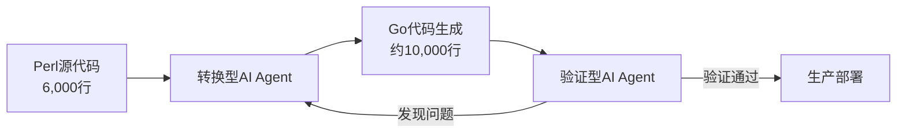
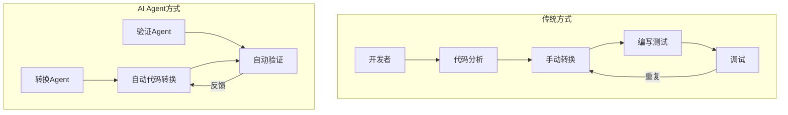

## 概述

将大规模遗留代码迁移到现代语言，是每个组织都认为重要却总在优先级中被推迟的课题。DeNA通过活用AI Agent戏剧性地解决了这一问题。在将Perl编写的6,000行服务器资产管理API迁移至Go的过程中，他们并行运用了<strong>转换型Agent</strong>和<strong>验证型Agent</strong>两种类型，将通常需要半年的工作在<strong>仅1个月内完成</strong>。

## 背景：为什么需要迁移

DeNA的服务器资产管理API于2018年用Perl构建，管理着数千台服务器的名称、用途、IP地址等信息，是公司的核心基础设施系统。

系统本身并没有重大缺陷，但出于以下原因，切换到现代语言成为必然：

- <strong>Perl的前景</strong>：对语言未来发展和社区萎缩的担忧
- <strong>可维护性问题</strong>：招聘有Perl经验的新开发者越来越困难
- <strong>工时问题</strong>：虽然认识到迁移的必要性，但由于需要大量工时，始终被其他优先事项挤压

DeNA IT本部IT基础设施部副部长小池启辅表示："很明显需要投入大量工时，因优先级问题怎么也无法着手。"

## DeNA的"AI All-In"战略

2025年2月，DeNA创始人南场智子会长发布了<strong>"AI All-In"宣言</strong>——承诺彻底运用AI提升生产力，构建能以半数人员运营现有业务的体制。

作为该战略的一环，服务器资产管理API的现代化被选为AI试点项目之一。

## 核心策略：两种AI Agent的分工体制

本项目最具创新性的是<strong>根据特性将AI Agent分为两种类型运用</strong>。

### 1. 转换型AI Agent

- <strong>角色</strong>：将Perl代码转换为Go代码
- <strong>特性</strong>：专注于代码生成的Agent
- <strong>成果</strong>：Perl约6,000行 → Go约10,000行

### 2. 验证型AI Agent

- <strong>角色</strong>：验证转换后Go代码的正确性
- <strong>特性</strong>：专注于测试和质量验证的Agent
- <strong>流程</strong>：发现问题时向转换型Agent反馈

通过这种两种Agent的分工体制，实现了<strong>转换→验证→修正</strong>循环的快速迭代，将人工需要半年以上的工作压缩到了1个月。

## 项目时间线

| 时期 | 内容 |
|------|------|
| 2025年10月底~11月底 | Perl→Go迁移执行（1个月） |
| 2025年12月~2026年1月 | 开发环境运行验证（约2个月） |
| 2026年1月底 | 生产环境上线 |

## 启示：如何将AI应用于遗留系统迁移

### Agent分工的效果

关键不是让单一AI"既做转换又做验证"，而是<strong>明确分离角色</strong>，最大化每个Agent的优势。

### 适用场景

此案例在以下场景中特别有参考价值：

1. <strong>从遗留语言向现代语言迁移</strong>：COBOL→Java、PHP→Go、Ruby→Rust等
2. <strong>大规模代码库转换</strong>：涉及数千至数万行的代码迁移
3. <strong>因工时问题无法解决的技术债务</strong>：AI显著改善成本效益比

### 需要注意的要点

- 值得关注的是DeNA另外预留了<strong>2个月的验证期</strong>。即使是AI转换的代码，在投入生产前也必须进行充分验证。
- Agent角色分配的设计是成功的关键，需要根据项目特性谨慎设计Agent配置。

## 结论

DeNA的案例表明，AI Agent不仅仅是编码辅助工具，更可以作为<strong>项目层面的战略资源</strong>加以活用。核心要点有三：

1. <strong>Agent角色分工</strong>：将转换与验证分离，分别最大化质量
2. <strong>迭代循环自动化</strong>：AI自动执行转换→验证→修正的循环
3. <strong>确保充分的验证期</strong>：对AI转换结果进行人工最终验证

正如小池副部长所说："如果AI能实现这种程度的效率提升，那些过去因工时问题无法触及的项目也能开始推进了。"AI Agent有望成为解决技术债务的全新突破口。

## 参考资料

- [DeNAがPerl6000行を1カ月でGo言語へ、特性異なるAIエージェント駆使 - 日経クロステック](https://xtech.nikkei.com/atcl/nxt/column/18/00001/11469/)
