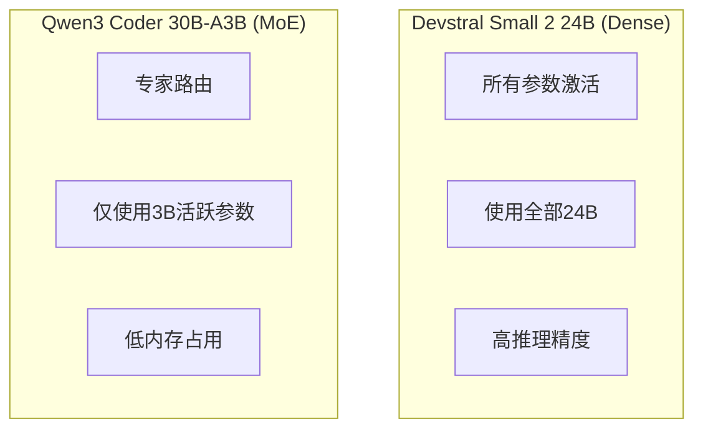
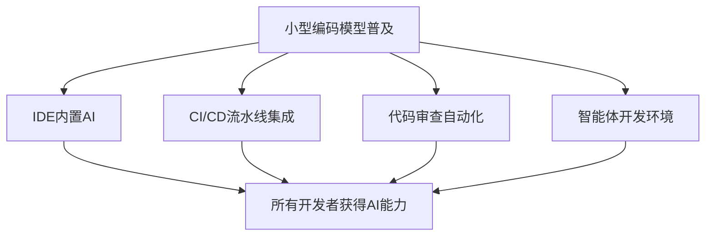

## 概述

2026年初，编码专用AI模型市场正在发生引人注目的变化。Mistral AI的<strong>Devstral Small 2 24B</strong>和阿里巴巴的<strong>Qwen3 Coder 30B</strong>几乎同时登场，开启了"在任何硬件上运行编码模型"的时代。

这两款模型的优势不仅仅在于体积小。它们可以在一张RTX 4090或32GB RAM的Mac上运行，却能超越数百B参数大型模型的编码性能。本文将对两款模型的架构、基准测试和实际应用进行比较分析。

## Devstral Small 2 24B — Mistral的智能体编码模型

### 核心特点

Devstral是Mistral AI与[All Hands AI](https://www.all-hands.dev/)合作打造的<strong>软件工程专用模型</strong>。

- <strong>参数量</strong>：24B（Dense模型）
- <strong>许可证</strong>：Apache 2.0（完全开源）
- <strong>SWE-Bench Verified</strong>：46.8%（开源SOTA）
- <strong>最低硬件</strong>：RTX 4090或Mac 32GB RAM
- <strong>专注领域</strong>：真实GitHub Issue解决、智能体编码

### 为何值得关注

Devstral最令人惊叹的是其<strong>性能与体积之比</strong>。在SWE-Bench Verified上超越了DeepSeek-V3-0324（671B）和Qwen3 232B-A22B。模型体积小了20倍以上，但实际代码问题解决能力更为出色。

```bash
# 使用Ollama运行Devstral
ollama pull devstral
ollama run devstral

# LM Studio也可直接使用
# MLX格式支持Apple Silicon优化
```

### 什么是智能体编码

Devstral不专注于简单的代码生成，而是聚焦于<strong>智能体编码</strong>。这意味着模型能够理解整个代码库，把握组件间的关系，自主解决复杂的bug。


它在OpenHands或SWE-Agent等代码智能体框架上运行，无需人工干预即可自动解决GitHub Issue。

## Qwen3 Coder — 阿里巴巴的智能体编码模型

### 核心特点

Qwen3 Coder是阿里巴巴推出的编码专用模型系列，除旗舰版480B-A35B外，还提供多种规格的变体。

- <strong>旗舰版</strong>：Qwen3-Coder-480B-A35B（MoE，活跃参数35B）
- <strong>小型变体</strong>：Qwen3-Coder-30B-A3B（MoE，活跃参数3B）
- <strong>上下文</strong>：256K Token（原生）、1M Token（YaRN扩展）
- <strong>许可证</strong>：开源
- <strong>专注领域</strong>：智能体编码、浏览器操作、工具调用

### 训练技术创新

Qwen3 Coder训练过程中最值得关注的是<strong>强化学习（RL）的大规模应用</strong>。

1. <strong>Code RL</strong>：针对真实编码任务而非竞赛编程的大规模强化学习
2. <strong>Long-Horizon RL（Agent RL）</strong>：在多轮环境中使用工具解决问题的长期强化学习
3. <strong>环境扩展</strong>：利用阿里云基础设施并行运行20,000个独立环境

```python
# Qwen3 Coder API使用示例
from openai import OpenAI

client = OpenAI(
    api_key="your_api_key",
    base_url="https://dashscope-intl.aliyuncs.com/compatible-mode/v1",
)

# 调用qwen3-coder-plus模型
completion = client.chat.completions.create(
    model="qwen3-coder-plus",
    messages=[
        {"role": "system", "content": "You are a helpful coding assistant."},
        {"role": "user", "content": "请找出这个函数中的bug。"}
    ],
)
```

### Qwen Code CLI

随Qwen3 Coder一同开源的还有名为<strong>Qwen Code</strong>的CLI工具。它从Gemini CLI fork而来，针对Qwen模型优化了提示词和函数调用协议。

```bash
# 安装Qwen Code
npm i -g @qwen-code/qwen-code

# 环境配置
export OPENAI_API_KEY="your_api_key"
export OPENAI_BASE_URL="https://dashscope-intl.aliyuncs.com/compatible-mode/v1"
export OPENAI_MODEL="qwen3-coder-plus"

# 开始使用
qwen
```

同时支持与Claude Code集成，可以自然融入现有开发工作流。

## 两款模型对比分析

### 规格对比

| 项目 | Devstral Small 2 24B | Qwen3 Coder 30B-A3B |
|------|---------------------|---------------------|
| <strong>参数量</strong> | 24B（Dense） | 30B（MoE，活跃3B） |
| <strong>架构</strong> | Dense Transformer | Mixture of Experts |
| <strong>许可证</strong> | Apache 2.0 | 开源 |
| <strong>SWE-Bench</strong> | 46.8%（已验证） | SOTA级（旗舰版基准） |
| <strong>上下文</strong> | 标准 | 256K（原生） |
| <strong>最小VRAM</strong> | ~16GB（Q4） | ~4GB（活跃3B） |
| <strong>运行环境</strong> | RTX 4090、Mac 32GB | Raspberry Pi级可用 |
| <strong>智能体框架</strong> | OpenHands、SWE-Agent | Qwen Code、Claude Code |

### 架构差异

两款模型最大的区别在于<strong>架构</strong>。



- <strong>Devstral</strong>：作为Dense模型，全部24B参数都参与推理。精度更高，但需要更多计算资源。
- <strong>Qwen3 Coder 30B-A3B</strong>：采用MoE（Mixture of Experts）架构，30B参数中每次推理仅激活3B。内存效率极高，在Raspberry Pi等小型设备上也能运行。

### 按使用场景推荐

| 使用场景 | 推荐模型 | 原因 |
|---------|---------|------|
| <strong>本地开发（Mac/PC）</strong> | Devstral | 精度高、硬件充足 |
| <strong>边缘设备</strong> | Qwen3 Coder | MoE实现超低配运行 |
| <strong>GitHub Issue自动化</strong> | Devstral | SWE-Bench验证性能 |
| <strong>CLI集成开发</strong> | Qwen3 Coder | Qwen Code CLI支持 |
| <strong>注重隐私的企业</strong> | Devstral | Apache 2.0、本地运行 |
| <strong>长上下文任务</strong> | Qwen3 Coder | 256K原生支持 |

## 本地AI编码的未来

### 为什么小型编码模型很重要

这两款模型的出现具有超越新产品发布本身的意义。

1. <strong>隐私保护</strong>：无需将代码发送到外部服务器即可获得AI辅助
2. <strong>成本节约</strong>：在自有硬件上无限使用，无需API费用
3. <strong>离线工作</strong>：即使没有网络连接也能使用AI编码助手
4. <strong>定制化</strong>：在自有代码库上微调，构建定制模型

### 量化与优化

社区已经提供了各种量化版本。特别是使用针对编码模型定制的校准数据集，实现了对工具调用和代码生成的优化量化。

```bash
# Q4量化节省VRAM
# Devstral: ~16GB → ~8GB
# Qwen3 Coder 30B-A3B: 活跃3B，原本就只需~4GB

# 在Ollama中使用量化模型
ollama pull devstral:q4_k_m
```

### 开发者生态系统变革

随着小型编码模型的普及，开发工具生态系统也将迎来重大变化。



## 结论

Devstral Small 2 24B和Qwen3 Coder 30B的同时登场，象征着<strong>编码AI的民主化</strong>。无需大型GPU集群或昂贵的API订阅，普通开发者的笔记本电脑甚至Raspberry Pi都能运行生产级编码AI。

尤其值得关注的是，两款模型采用了不同的架构（Dense vs MoE），却都朝着"本地可运行的智能体编码"这同一目标前进。这预示着小型编码模型的多种方案将在竞争中快速演进。

本地AI编码的时代已经开始。

## 参考资料

- [Mistral AI - Devstral官方公告](https://mistral.ai/news/devstral)
- [Qwen3-Coder官方博客](https://qwenlm.github.io/blog/qwen3-coder/)
- [r/LocalLLaMA社区讨论](https://www.reddit.com/r/LocalLLaMA/comments/1r85o89/devstral_small_2_24b_qwen3_coder_30b_coders_for/)
- [OpenHands - 本地LLM使用指南](https://docs.all-hands.dev/modules/usage/llms/local-llms)
