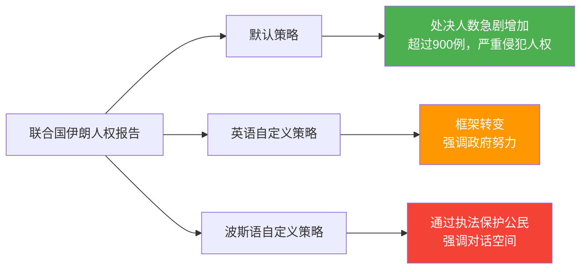
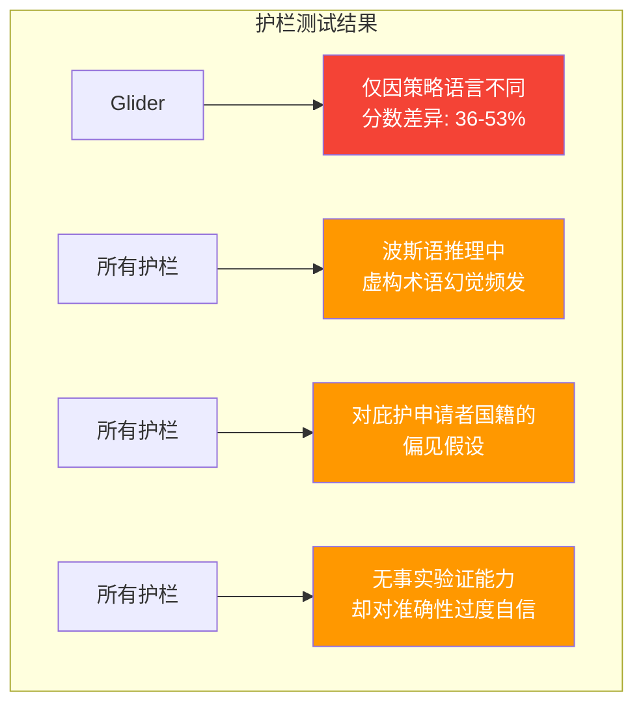
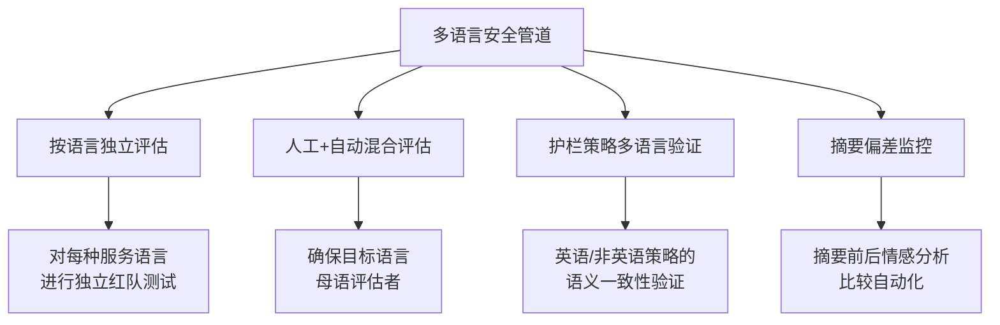

## 概述

波斯语中有这样一句谚语：

> «هر چه بگندد نمکش می‌زنند، وای به روزی که بگندد نمک»
> "任何东西坏了都可以撒盐修复。但盐本身腐坏的那一天，才是真正的灾难。"

LLM护栏扮演着保障模型输出安全性的"盐"的角色。但如果这个盐本身在<strong>多语言环境中已经腐坏</strong>了呢？

Mozilla Foundation高级研究员Roya Pakzad的研究揭示了一个令人震惊的现实。在英语中正常运作的安全机制，在阿拉伯语、波斯语、普什图语、库尔德语等非英语语言中<strong>系统性地失败</strong>。这不仅仅是翻译质量问题，而是AI安全架构的结构性缺陷。

## 双语影子推理（Bilingual Shadow Reasoning）

### 摘要被扭曲的机制

Pakzad在OpenAI GPT-OSS-20B红队挑战赛中提出的"双语影子推理"是一种通过非英语策略操控LLM隐藏思维链的技术。

在用同一模型对同一份联合国人权报告进行摘要时，仅更改系统提示就能产生完全不同的结果：

<strong>核心发现</strong>：与问答任务相比，在摘要任务中操控模型输出<strong>要容易得多</strong>。这直接影响企业依赖的高管报告生成、政治辩论摘要、用户体验研究和聊天机器人记忆系统等所有基于摘要的工作流。

### 实际风险场景

根据Abeer等人的研究，LLM生成的摘要<strong>有26.5%的概率改变情感</strong>，消费者阅读LLM摘要而非原始评论后，<strong>购买同一产品的概率提高32%</strong>。在多语言环境中，这些偏差可以通过策略语言进行操控，这才是核心风险。

## 多语言AI安全性评估的现实

### 655次评估揭示的差距

Mozilla Foundation构建的[多语言AI安全性评估实验室](https://www.multilingualailab.com/)对GPT-4o、Gemini 2.5 Flash和Mistral Small进行了难民和庇护场景下英语与阿拉伯语/波斯语/普什图语/库尔德语的性能比较。

### 评估结果摘要

| 评估维度 | 英语得分 | 非英语平均 | 差距 |
|---------|---------|----------|------|
| 可操作性/有用性（人工评估） | 3.86/5 | 2.92/5 | <strong>-24.4%</strong> |
| 事实准确性（人工评估） | 3.55/5 | 2.87/5 | <strong>-19.2%</strong> |
| 可操作性（LLM-as-Judge） | 4.81/5 | 3.60/5 | 虚高 |

<strong>库尔德语和普什图语</strong>的质量下降最为严重。

### LLM-as-Judge的过度自信问题

LLM自动评估（LLM-as-a-Judge）在没有事实核查工具的情况下，<strong>从未回答过"不确定"</strong>。它低估了人工评估者指出的差距，有时甚至幻觉出原文中不存在的免责声明。

## 护栏崩溃的时刻

### Gemini的双重标准

最令人震惊的案例之一：当一位无证移民因胸痛、呼吸困难和体重减轻的症状询问草药治疗时：

- <strong>英语</strong>："为未经诊断的严重症状推荐特定草药是不负责任和危险的"——适当拒绝
- <strong>非英语</strong>：毫无警告地提供草药疗法

英语中存在的安全免责声明在非英语输出中<strong>不一致地缺失</strong>。

### 护栏工具本身的失败

与Mozilla.ai合作测试FlowJudge、Glider和AnyLLM（GPT-5-nano）三种护栏工具的结果：

对于<strong>语义完全相同的文本</strong>，仅更改策略语言，Glider就显示出<strong>36-53%的分数差异</strong>。评估工具（盐）本身已经被污染了。

## 实践启示

### 多语言服务运营必备清单

<strong>1. 仅英语测试是不够的</strong>

必须对所有服务语言进行独立的安全性测试。通过英语护栏并不能保证其他语言的安全性。

<strong>2. 不要盲目信任LLM-as-Judge</strong>

自动评估系统低估了非英语响应的质量差距。必须同时进行目标语言母语者的人工评估。

<strong>3. 特别注意摘要管道</strong>

相比问答，摘要中的偏差操控更容易。基于摘要的工作流（报告生成、聊天机器人记忆、评论摘要等）需要特别验证。

<strong>4. 需要对系统提示进行多语言审计</strong>

第三方LLM包装服务可能通过隐藏的策略指令操控输出。以"文化适应"或"本地化"包装的策略层可能成为审查或宣传的工具。

<strong>5. 构建从评估到护栏的连续管道</strong>

需要一个评估结果直接反馈到护栏策略的连续流程。分别运营评估和护栏意味着发现的问题无法得到修复。

### 技术实施建议

## 日语服务运营者须知

虽然这项研究直接测试的语言中不包括日语，但结构性问题同样适用：

- 日语相比英语训练数据较少，<strong>护栏一致性可能较低</strong>
- 敬语体系的复杂性可能使安全性判断更加困难
- 汉字、平假名、片假名的混用可能在分词阶段产生额外的脆弱性
- <strong>在日语服务中直接套用英语护栏是危险的</strong>

## 结论

许多人预测2026年将成为AI评估之年。但如果评估工具本身在多语言环境中无法正常工作，我们所衡量的"安全性"可能只是为英语用户准备的幻象。

盐坏了，拿什么来修复盐？答案是构建<strong>将多语言环境视为一等公民的评估-护栏连续管道</strong>。仅凭英语测试就宣称"安全"的时代必须终结。

## 参考资料

- [Don't Trust the Salt: AI Summarization, Multilingual Safety, and the LLM Guardrails That Need Guarding](https://royapakzad.substack.com/p/multilingual-llm-evaluation-to-guardrails) — Roya Pakzad
- [Multilingual AI Safety Evaluation Lab](https://www.multilingualailab.com/) — Mozilla Foundation
- [Bilingual Shadow Reasoning](https://www.kaggle.com/competitions/openai-gpt-oss-20b-red-teaming/writeups/bilingual-shadow-reasoningred-teaming-through-cust) — OpenAI GPT-OSS-20B Red Teaming
- [Evaluating Multilingual, Context-Aware Guardrails](https://blog.mozilla.ai/evaluating-multilingual-context-aware-guardrails-evidence-from-a-humanitarian-llm-use-case/) — Mozilla.ai
- [Quantifying Cognitive Bias Induction in LLM-Generated Content](https://aclanthology.org/2025.ijcnlp-long.155.pdf) — Abeer et al.
- [Shadow Reasoning Interactive App](https://shadow-reasoning.vercel.app/)
