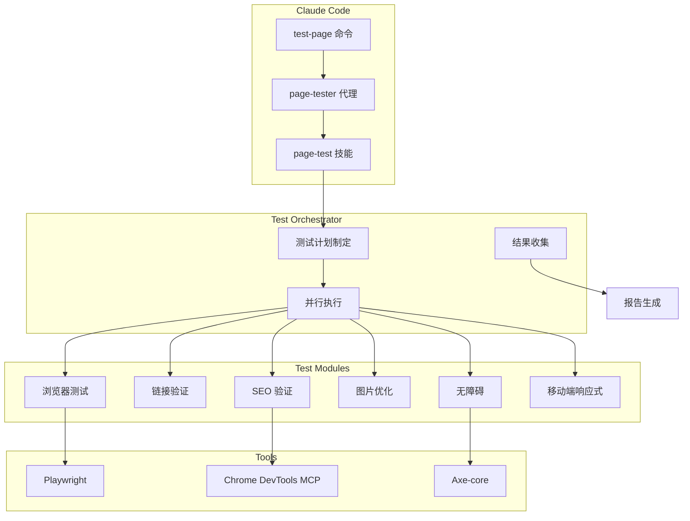
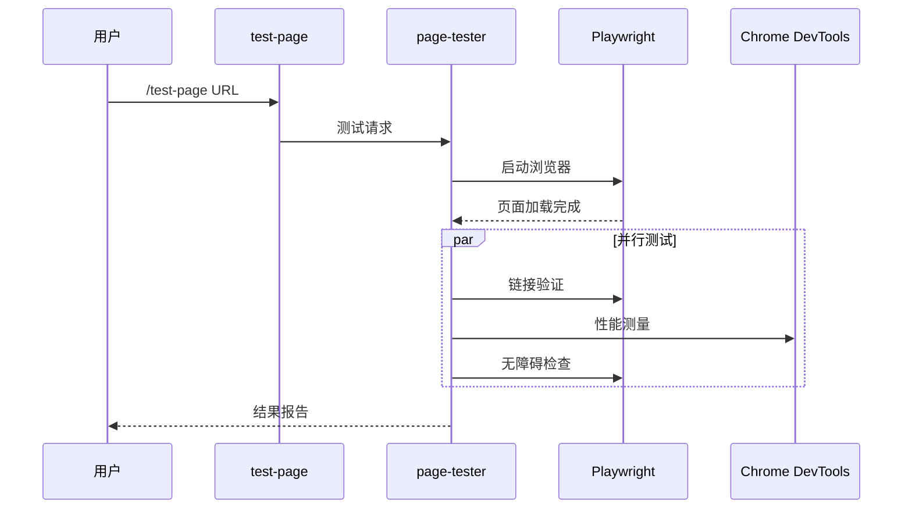
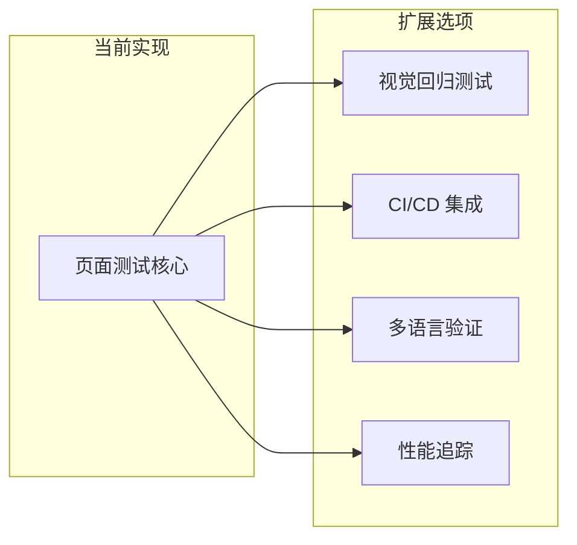

## 为什么需要页面测试自动化？

Web 开发者在页面开发完成后，花多少时间进行质量验证？跨浏览器测试、链接检查、无障碍验证、SEO 检查、图片优化...手动验证所有这些项目，每页需要<strong>超过30分钟</strong>。

更大的问题是<strong>一致性</strong>。在繁忙的日程中，某些项目可能会被遗漏，或者不同负责人的验证标准可能不同。

为了解决这个问题，我使用 Claude Code 和 Playwright 构建了<strong>页面 E2E 测试自动化系统</strong>。

## 系统概述

```bash
# 通过单一命令自动验证8个质量项目
/test-page https://jangwook.net/en/
```

这一个命令会自动测试以下项目：

| 优先级 | 测试项目 | 说明 |
|--------|---------|------|
| <strong>P0</strong> | 跨浏览器 | Chromium、Firefox、WebKit 同时测试 |
| <strong>P0</strong> | 链接完整性 | 所有链接的 HTTP 状态码验证 |
| <strong>P0</strong> | 无障碍 (a11y) | WCAG 2.1 AA 级合规确认 |
| <strong>P0</strong> | 移动端响应式 | 各视口布局验证 |
| <strong>P1</strong> | 图片优化 | 渲染尺寸 vs 原始尺寸比较 |
| <strong>P1</strong> | SEO 验证 | 元标签、OG、结构化数据确认 |
| <strong>P1</strong> | UI/UX | 字体大小、触摸目标验证 |
| <strong>P2</strong> | 内容质量 | 语言设置、标题结构确认 |

## 架构



核心组件有三个：

1. <strong>Commands</strong>（`/test-page`）：用户界面
2. <strong>Agents</strong>（`page-tester`）：测试编排
3. <strong>Skills</strong>（`page-test`）：可重用的测试逻辑

## 实现方法

### 1. 定义斜杠命令

创建 `.claude/commands/test-page.md` 文件：

````markdown
# 页面测试命令

自动验证网页质量。

## 使用方法

```bash
/test-page <url> [options]
```

## 验证项目

1. **跨浏览器兼容性** (P0)
2. **链接完整性** (P0)
3. **无障碍** (P0)
4. **移动端响应式** (P0)
5. **图片优化** (P1)
6. **SEO 验证** (P1)
...
````

### 2. 代理实现

`page-tester` 代理执行以下工作流程：



<details>
<summary><strong>查看代理定义文件</strong></summary>

```markdown
# Page Tester 代理

用于全面测试网页质量的专业代理。

## 角色

- 页面加载和渲染验证
- 跨浏览器兼容性测试
- 无障碍 (a11y) 检查
- SEO 优化状态确认
- 性能指标收集

## 使用工具

- **Playwright**: 浏览器自动化和截图
- **Chrome DevTools MCP**: 性能分析和网络监控
- **Axe-core**: 无障碍检查

## 工作流程

1. 接收目标 URL
2. 启动浏览器实例
3. 并行执行各测试模块
4. 收集和分析结果
5. 生成 Markdown 报告

## 输出格式

测试结果以以下格式的 Markdown 报告生成：
- 总分和等级
- 各类别详细结果
- 发现的问题和改进建议
- 截图附件
```

</details>

### 3. MCP 工具集成

结合 Chrome DevTools MCP 和 Playwright 构建强大的测试环境：

```typescript
// 使用 Chrome DevTools MCP 进行性能分析
const performanceResults = await mcp_chrome_devtools_performance_start_trace({
  reload: true,
  autoStop: true
});

// 使用 Playwright 进行截图和无障碍分析
const snapshot = await mcp_chrome_devtools_take_snapshot();
const screenshot = await mcp_chrome_devtools_take_screenshot({
  fullPage: true
});
```

## 实际测试结果

以下是 `https://jangwook.net/en/` 页面的实际测试结果：

### 综合评价：<strong>有条件通过</strong>（75/100分）

| 类别 | 结果 | 详情 |
|------|------|------|
| 跨浏览器 | ✅ 通过 | Chromium 正常运行 |
| 链接完整性 | ✅ 通过 | 33个链接全部正常 |
| 无障碍 | ⚠️ 需改进 | 20个触摸目标未达标 |
| 移动端响应式 | ✅ 通过 | 无横向滚动 |
| 图片优化 | ⚠️ 需改进 | 6张图片过大 |
| SEO | ✅ 通过 | 95/100分 |
| UI/UX | ⚠️ 需改进 | 最小字体12px |

<details>
<summary><strong>查看完整测试报告</strong></summary>

### 测试环境
- <strong>测试时间</strong>: 2024-11-24 09:56:25
- <strong>目标 URL</strong>: https://jangwook.net/en/
- <strong>浏览器</strong>: Chromium (Playwright)

### 1. 跨浏览器测试 ✅

页面在 Chromium 环境中正常加载。主要元素正确渲染。

### 2. 链接完整性检查 ✅

共检查33个链接：
- 内部链接: 28个（全部正常）
- 外部链接: 5个（全部正常）

### 3. 无障碍 (a11y) 检查 ⚠️

<strong>触摸目标尺寸未达标（20个）</strong>

低于 WCAG 推荐最小尺寸 44×44px 的元素：
- 导航链接（当前高度: 36px）
- 社交媒体图标
- 页脚链接

### 4. 移动端响应式检查 ✅

- 无横向滚动
- 视口元标签正确设置
- 触摸交互正常

### 5. 图片优化检查 ⚠️

<strong>发现6张过大图片</strong>

| 图片 | 原始尺寸 | 渲染尺寸 | 可节省 |
|------|---------|---------|--------|
| hero-image.webp | 600×600 | 382×192 | ~75% |
| blog-thumb-1.webp | 800×800 | 400×200 | ~75% |
| blog-thumb-2.webp | 800×800 | 400×200 | ~75% |
| profile.webp | 400×400 | 150×150 | ~86% |
| og-image.png | 1200×630 | 未使用 | 100% |
| favicon-large.png | 512×512 | 32×32 | ~99% |

### 6. SEO 检查 ✅（95/100）

- ✅ 标题标签存在
- ✅ 元描述存在
- ✅ OG 标签完整
- ✅ 规范 URL 已设置
- ⚠️ 部分图片缺少 alt 属性

### 7. UI/UX 检查 ⚠️

- 最小字体大小: 12px（推荐: 14px 以上）
- 颜色对比度: 良好
- 布局一致性: 良好

</details>

### 发现的主要问题

<strong>1. 图片优化问题</strong>

```
hero-image.webp: 600×600px → 382×192px（约可减少75%）
```

<strong>解决方案：</strong>
```html

```

<strong>2. 触摸目标尺寸未达标</strong>

WCAG 推荐的最小尺寸为 44×44px。当前导航链接高度为 36px，不足。

```css
/* 解决方案 */
a, button {
  min-height: 44px;
  min-width: 44px;
  display: inline-flex;
  align-items: center;
  padding: 10px;
}
```

## 关键洞察

构建这个自动化系统获得的洞察：

### 1. 应用 80/20 法则

不要试图完美实现所有测试。<strong>仅6个 P0 项目就能发现 80% 的质量问题</strong>。

### 2. AI 分析的价值

真正的自动化不仅是说"图片太大"，而是<strong>建议"如何修复"</strong>。这是 Claude 分析能力发挥作用的地方。

### 3. 渐进式改进

不需要一开始就创建完美的系统：

```
第1周：基础框架 + 3个 P0 测试
第2周：完成 P0 + 控制台报告器
第3周：P1 测试 + HTML 报告
第4周：AI 分析 + 改进建议
```

### 4. 成果的可用性

生成的 Markdown 报告可以：
- 作为团队审查材料使用
- 自动归档到 Notion
- 通过 Slack 通知共享
- 集成到 CI/CD 流水线

## 可扩展性

该系统可以向多个方向扩展：



- <strong>视觉回归测试</strong>：通过截图比较检测 UI 变化
- <strong>CI/CD 集成</strong>：每个 PR 自动执行测试
- <strong>多语言内容验证</strong>：检查翻译遗漏、语言一致性
- <strong>时间序列性能追踪</strong>：Core Web Vitals 历史监控

## 结论

使用 Claude Code 进行页面 E2E 测试自动化，提供的价值超越了简单的时间节省：

1. <strong>一致的质量标准</strong>应用
2. <strong>即时反馈</strong>实现快速改进
3. <strong>基于 AI 的洞察</strong>做出更好的决策
4. <strong>文档化的质量历史</strong>积累

在下一个项目中尝试应用这个系统。虽然初始设置需要时间，但从长远来看，可以同时提高团队生产力和网站质量。

## 参考资料

- [Playwright 官方文档](https://playwright.dev/)
- [WCAG 2.1 指南](https://www.w3.org/WAI/WCAG21/quickref/)
- [Core Web Vitals](https://web.dev/vitals/)
- [Axe-core 无障碍测试](https://github.com/dequelabs/axe-core)
