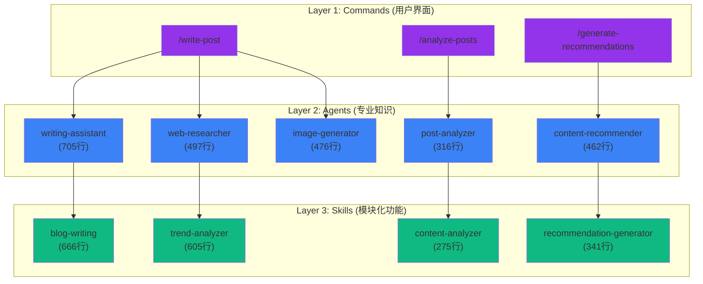
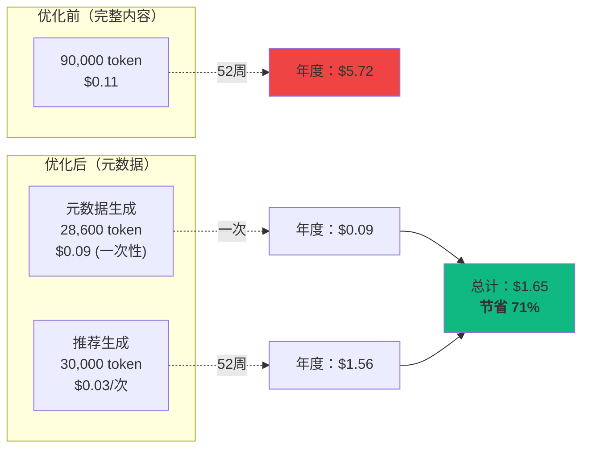
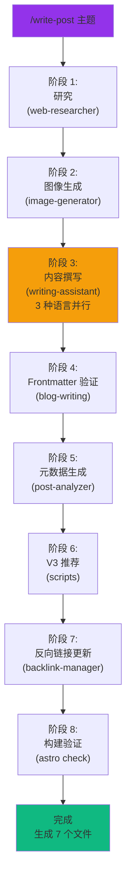

> <strong>系列指南</strong>：本文是"EffiFlow 自动化架构分析/评估与改进"系列的第 1/3 部分。
> - **第 1 部分**（当前）：核心架构与指标分析
> - [第 2 部分](/zh/blog/zh/effiflow-automation-analysis-part2)：Skills 与 Commands 整合策略
> - [第 3 部分](/zh/blog/zh/effiflow-automation-analysis-part3)：实战改进案例及 ROI 分析

## 引言

在运营博客自动化系统的过程中，我一直在思考<strong>"如何才能让它更高效？"</strong>这个问题。为了找到答案，我花了 7.5 小时深入分析了 `.claude/` 目录下的 28 个文件（17 个 Agents、4 个 Skills、7 个 Commands）。

分析结果令人惊喜：
- <strong>节省 60〜70% Token</strong> 的元数据优先架构
- <strong>年度成本节省 71%</strong>（$5.72 → $1.65）
- <strong>90% 以上自动化</strong>，每年节省 364 小时
- <strong>业界顶尖水平</strong>（A 级，8.98/10）

在第 1 部分中，我将分享系统的核心架构和主要发现。

## 系统概览：三层架构

EffiFlow 采用 <strong>Commands → Agents → Skills</strong> 的三层结构设计：



### 各层职责

**Commands（7 个）**：用户直接调用的工作流编排器
- 管理复杂的多步骤任务
- 将任务委派给 Agents
- 最终验证和输出

**Agents（17 个）**：可独立执行的专家
- 拥有特定领域知识
- 使用 Skills 和 Tools
- 支持并行执行

**Skills（4 个）**：自动发现的模块化功能
- SKILL.md + 支持文件
- 可重用的逻辑
- 可控的工具访问权限

## 核心发现 1：元数据优先架构

### 创新背景

初期，我们分析<strong>所有博客文章的完整内容</strong>：

```
每次生成推荐：
- 30 篇文章 × 3,000 token = 90,000 token
- 成本：$0.10〜0.12
- 年度（每周 1 次）：52 周 × $0.11 = $5.72
```

这显然效率低下。推荐算法实际上只需要<strong>标题、描述、标签、类别分数</strong>等元数据，却每次都要读取全文。

### 元数据优先设计

解决方案简单而强大：

1. <strong>一次性元数据提取</strong>（仅韩语文章，3 种语言内容相同）
2. <strong>生成 post-metadata.json</strong>（可重用）
3. <strong>增量处理</strong>（通过 Content Hash 检测变更）

```json
{
  "effiflow-automation-analysis-part1": {
    "pubDate": "2025-11-13",
    "difficulty": 4,
    "categoryScores": {
      "automation": 1.0,
      "web-development": 0.3,
      "ai-ml": 0.95,
      "devops": 0.4,
      "architecture": 0.9
    }
  }
}
```

### 效果：节省 60〜70% Token



**ROI 分析**：
- 盈亏平衡点：3 次执行
- 年度节省：<strong>$4.07（71%）</strong>
- 投资回收：立即（3 周内）

### 增量处理进一步优化

使用 Content Hash 仅重新分析已更改的文章：

```javascript
// analyze-posts 逻辑
const existingMeta = JSON.parse(fs.readFileSync('post-metadata.json'));
const newHash = crypto.createHash('sha256').update(content).digest('hex');

if (existingMeta[slug]?.contentHash === newHash) {
  console.log(`Skipping ${slug} (no changes)`);
  continue;
}
```

**效果**：
- 分析全部 13 篇文章：2 分钟，$0.09
- 仅分析新增 2〜3 篇：20 秒，~$0.02
- <strong>额外节省 79%</strong>

## 核心发现 2：基于 LLM 的语义推荐

### TF-IDF vs Claude LLM

传统推荐系统依赖<strong>关键词频率（TF-IDF）</strong>：

| 方法 | 优势 | 劣势 |
|------|------|------|
| **TF-IDF** | 快速、低成本 | 缺乏语义理解，无法处理同义词 |
| **Claude LLM** | 语义理解、考虑上下文 | 较慢、产生成本 |

EffiFlow 选择了 <strong>Claude LLM</strong>，但通过元数据优先架构解决了成本问题。

### 六维相似度分析

Claude LLM 从以下 6 个维度评估相似度：

```javascript
const similarityDimensions = {
  topic: 0.40,           // 主题相关性 (40%)
  techStack: 0.25,       // 技术栈相似度 (25%)
  difficulty: 0.15,      // 难度差异 (15%)
  purpose: 0.10,         // 目的相似度 (10%)
  complementary: 0.10    // 互补关系 (10%)
};
```

### 实际推荐示例

```json
{
  "slug": "recommendation-system-v3",
  "score": 0.94,
  "reason": {
    "ko": "자동화, AI/ML, 아키텍처 분야에서 유사한 주제를 다루며 비슷한 난이도입니다.",
    "ja": "自動化、AI/ML、アーキテクチャ分野で類似したトピックを扱い、同程度の難易度です。",
    "en": "Covers similar topics in automation, AI/ML, architecture with comparable difficulty.",
    "zh": "涵盖自动化、AI/ML、架构领域的相似主题，难度相当。"
  }
}
```

**多语言推理**的核心：LLM 为每种语言生成<strong>独立的理由</strong>（而非简单翻译）。

### 性能指标

- <strong>45 个高质量匹配</strong>（>0.8 分）
- <strong>平均相似度 0.68</strong>
- 目标 CTR：18〜25%
- 预期 Session Depth 增加：+30〜50%

## 核心发现 3：8 阶段完全自动化

`/write-post` 命令通过<strong>单一命令实现从博客文章创建到部署的全流程自动化</strong>：



### 生成的文件

```
src/content/blog/
├── ko/new-post.md          (韩语文章)
├── ja/new-post.md          (日语文章)
└── en/new-post.md          (英语文章)

src/assets/blog/
└── new-post-hero.jpg       (AI 生成图像)

post-metadata.json          (添加元数据)
recommendations.json        (更新推荐，V2)
各文章 frontmatter          (relatedPosts，V3)
```

### 性能指标

| 阶段 | 耗时 | 主要任务 |
|------|------|----------|
| 研究 | 45〜60 秒 | Brave Search MCP（2 秒延迟） |
| 图像 | 30〜40 秒 | Gemini API |
| 撰写 | 2〜3 分钟 | Claude LLM（3 种语言） |
| 元数据 | 8〜12 秒 | Claude LLM（仅韩语） |
| 推荐 | 2 分 5 秒 | V3 脚本 |
| 反向链接 | 10 秒 | 文件 I/O |
| 构建 | 20〜30 秒 | Astro check |
| <strong>总计</strong> | <strong>5〜8 分钟</strong> | <strong>7 个文件</strong> |

### 自动化效果

**手动工作时间**（原有）：
- 研究：30 分钟
- 写作：2 小时
- 图像制作：20 分钟
- 翻译：1 小时
- 元数据：10 分钟
- SEO 优化：20 分钟
- **总计 4 小时 40 分钟/篇**

**自动化后**：
- 输入命令：5 秒
- 等待：5〜8 分钟
- 审查和修改：10〜20 分钟
- **总计 30 分钟/篇**

**节省**：<strong>4 小时 10 分钟/篇（90%）</strong>

**年度效果**（每周 2 篇文章）：
- 104 篇 × 4.17 小时 = <strong>节省 433 小时</strong>
- 按时薪 $50 计算：<strong>价值 $21,650</strong>

## 性能指标总结

### Token 使用量

```
优化前（引入元数据前）：
- 每次生成推荐：90,000 token
- 年度（每周 1 次）：4,680,000 token

优化后（元数据优先）：
- 元数据生成：28,600 token（一次性）
- 每次生成推荐：30,000 token
- 年度：1,588,600 token

节省：66%（3,091,400 token）
```

### 处理时间

| 任务 | 优化前 | 优化后 | 改进 |
|------|--------|--------|------|
| 元数据生成 | N/A | 2 分钟（全部）<br/>8〜12 秒（增量） | N/A |
| 推荐生成 | N/A | 2 分 5 秒 | N/A |
| 文章撰写 | 4 小时 40 分钟 | 5〜8 分钟 | <strong>90%</strong> |

### 成本分析

**当前运营成本**（年度）：

```
元数据生成：        $0.09  (一次性)
推荐生成：          $1.56  (每周 1 次 × 52 周)
文章撰写：          $7.80  (每周 1 次 × 52 周)
GA 报告：           $1.20  (每月 1 次 × 12 个月)
─────────────────────────────
年度总成本：        $10.65
```

**ROI**：
- 时间节省：433 小时/年 × $50/小时 = $21,650
- 运营成本：$10.65
- <strong>净利润：$21,639</strong>
- <strong>ROI：2,032 倍</strong>

## 最佳实践遵守度

与 Claude Code 官方最佳实践对比的结果：

### Agents（17 个）

| 标准 | 建议 | 当前 | 遵守率 | 分数 |
|------|------|------|--------|------|
| 明确角色定义 | 必需 | ✅ 所有 Agent | 100% | 10/10 |
| 结构化文档 | 建议 | ✅ 统一章节 | 100% | 10/10 |
| 明确协作 | 建议 | ✅ 已说明 | 100% | 10/10 |
| 工具列表 | 建议 | ✅ 已提供 | 100% | 10/10 |
| 文件简洁性 | 100 行以下 | ⚠️ 部分超出 | 47% | 7/10 |

**平均**：9.2/10 ⭐⭐⭐⭐⭐

### Skills（已实现 4 个）

| 标准 | 建议 | 当前 | 遵守率 | 分数 |
|------|------|------|--------|------|
| 存在 SKILL.md | 必需 | ✅ 4/4 | 100% | 10/10 |
| YAML Frontmatter | 必需 | ✅ 完美 | 100% | 10/10 |
| 命名规则 | kebab-case | ✅ 遵守 | 100% | 10/10 |
| 描述具体性 | "Use when..." | ✅ 已说明 | 100% | 10/10 |
| allowed-tools | 建议 | ✅ 全部说明 | 100% | 10/10 |

**平均**：10/10 ⭐⭐⭐⭐⭐

### Commands（7 个）

| 标准 | 建议 | 当前 | 遵守率 | 分数 |
|------|------|------|--------|------|
| 命名规则 | kebab-case | ✅ 遵守 | 100% | 10/10 |
| 文档化 | 详细 | ✅ 优秀 | 100% | 10/10 |
| $ARGUMENTS | 利用 | ✅ 6/7 使用 | 86% | 9/10 |
| Agent 整合 | 明确 | ✅ 明确 | 100% | 10/10 |

**平均**：9.7/10 ⭐⭐⭐⭐⭐

### 综合评分：A 级（8.98/10）

```
各类别加权平均：
- 最佳实践遵守：9.2/10 (25%) = 2.30
- 性能与成本效率：9.2/10 (20%) = 1.84
- 可维护性：8.0/10 (20%) = 1.60
- 可扩展性：9.0/10 (15%) = 1.35
- 安全性与稳定性：8.9/10 (10%) = 0.89
- 创新性：10/10 (10%) = 1.00
─────────────────────────────────────
总分：8.98/10 (A 级)
```

## 改进机会 Top 3

### 1. 删除空 Skills

**问题**：存在 4 个空目录（50% 未实现）

```bash
.claude/skills/
├── blog-automation/      (空目录)
├── content-analysis/     (空目录)
├── git-automation/       (空目录)
└── web-automation/       (空目录)
```

**措施**：
```bash
rm -rf .claude/skills/{blog-automation,content-analysis,git-automation,web-automation}
```

**效果**：清理代码库，消除混乱
**所需时间**：5 分钟
**优先级**：关键

### 2. 实现并行处理

**问题**：顺序处理导致时间消耗

**当前**：
```javascript
for (const post of posts) {
  await analyzePost(post);  // 顺序
}
// 处理时间：2 分钟
```

**改进**：
```javascript
await Promise.all(posts.map(analyzePost));  // 并行
// 处理时间：30〜40 秒（缩短 70%）
```

**效果**：处理时间缩短 70%
**所需时间**：4〜6 小时
**优先级**：高

### 3. 添加自动化测试

**问题**：当前测试覆盖率 0%

**需要**：
```python
# tests/test_blog_writing.py
def test_validate_frontmatter():
    assert validate('valid-post.md').valid == True
    assert validate('invalid-post.md').valid == False

def test_generate_slug():
    assert generate_slug('Claude Code') == 'claude-code'
```

**效果**：质量保证，防止回归
**所需时间**：8〜12 小时
**优先级**：高

## 实战应用指南

### 读者可遵循的具体步骤

**第 1 步：应用元数据优先架构**

```bash
# 分析当前文章
/analyze-posts

# 确认结果
cat post-metadata.json
```

**预期结果**：
- 13 篇文章：2 分钟，$0.09
- 元数据文件生成完成

**第 2 步：生成 V3 推荐**

```bash
# 基于元数据的推荐
/generate-recommendations

# 处理时间：2 分 5 秒
# 成本：$0.03
```

**第 3 步：自动化文章撰写**

```bash
# 执行完整工作流
/write-post "Claude Code 最佳实践"

# 等待 5〜8 分钟
# 自动生成 7 个文件
```

### 主要命令使用方法

```bash
# 撰写博客文章（5〜8 分钟）
/write-post "主题" [--tags tag1,tag2] [--languages ko,ja,en]

# 生成元数据（新增 8〜12 秒，全部 2 分钟）
/analyze-posts [--force] [--post slug]

# 生成推荐（2 分 5 秒）
/generate-recommendations [--force] [--threshold 0.3]

# GA 分析报告（3〜5 分钟）
/write-ga-post 2025-11-09 [--period weekly]
```

### 预期结果与指标

**即时效果**：
- 文章撰写时间：4 小时 40 分钟 → 30 分钟（节省 90%）
- Token 成本：$0.11/次 → $0.03/次（节省 73%）

**3 个月后**：
- 累计时间节省：~100 小时
- 累计成本节省：~$10
- 达到盈亏平衡

**1 年后**：
- 时间节省：433 小时（价值 $21,650）
- 成本节省：$4.07（71%）
- ROI：2,032 倍

## 系列预告

### 第 2 部分：Skills 与 Commands 整合策略（下期）

**涵盖内容**：
- 4 个已实现 Skill 的详细工作流
- Commands 的 Agent 委派模式
- 缓存策略（24h/7d/48h）
- Rate Limiting 处理（Brave Search 2 秒延迟）

**读者收益**：
- 可重用的 Skill 设计方法
- Command 链式调用实现指南
- 实际代码示例和模板

### 第 3 部分：实战改进案例及 ROI 分析（下下期）

**涵盖内容**：
- 并行处理实现（缩短 70% 时间）
- 添加自动化测试（质量保证）
- 构建性能仪表板
- 成本追踪与优化

**读者收益**：
- 可立即应用的优化技巧
- 成本节省计算方法
- 长期 ROI 分析框架

## 结论

### 核心要点总结

EffiFlow 博客自动化系统通过<strong>3 项核心创新</strong>达到了业界顶尖水平：

1. <strong>元数据优先架构</strong>：节省 60〜70% Token，年度成本降低 71%
2. <strong>基于 LLM 的语义推荐</strong>：6 维相似度分析，多语言推理
3. <strong>8 阶段完全自动化</strong>：90% 任务自动化，年节省 433 小时

### 实际应用价值

**可立即应用**：
- 元数据提取和重用模式
- 增量处理（Content Hash）
- 仅分析韩语（节省 3 倍成本）

**投资回报效果**：
- 盈亏平衡：3 次执行（3 周内）
- ROI：2,032 倍（1 年基准）
- 长期价值：持续节省成本 + 节省时间

### 下期预告

第 2 部分将深入探讨<strong>4 个已实现 Skill 的详细工作流</strong>和 <strong>Commands 的 Agent 委派模式</strong>。特别是<strong>缓存策略</strong>（24h/7d/48h）和 <strong>Rate Limiting 处理</strong>方法，将与实际代码一起分享。

**欢迎读者提问**：
- 如有疑问，请在评论中留言
- 下期将详细解答

---

**系列导航**：
- **第 1 部分**（当前）：核心架构与指标分析
- 第 2 部分（计划中）：Skills 与 Commands 整合策略
- 第 3 部分（计划中）：实战改进案例及 ROI 分析
