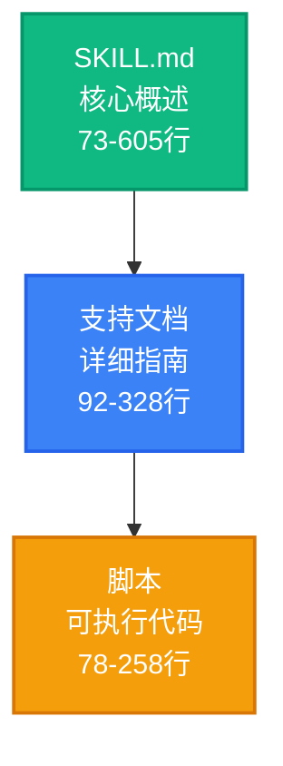
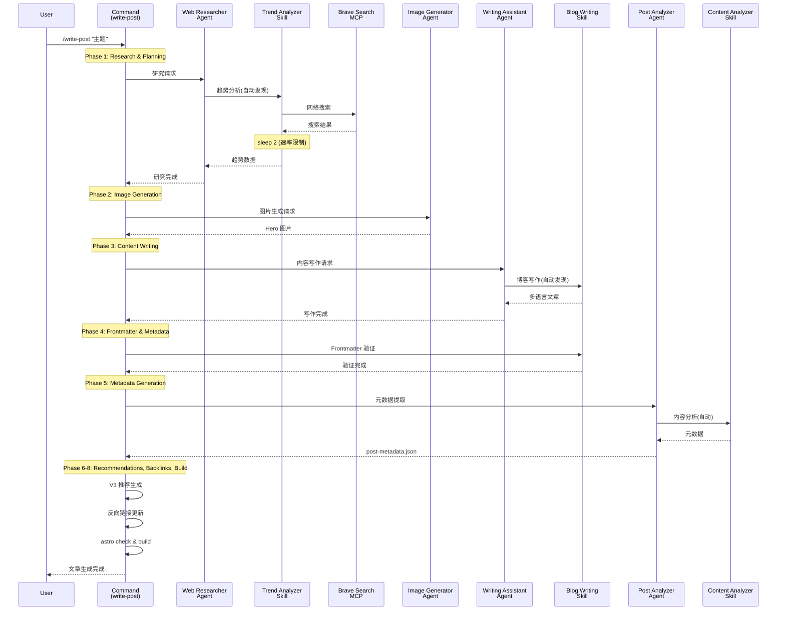
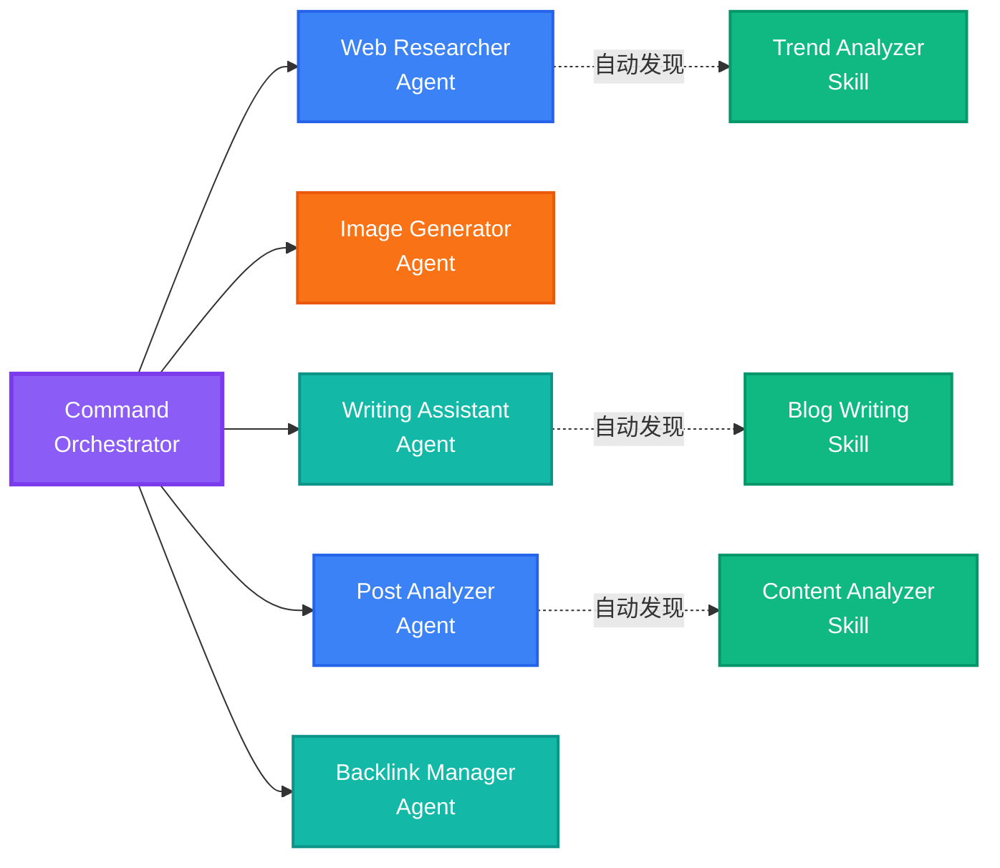
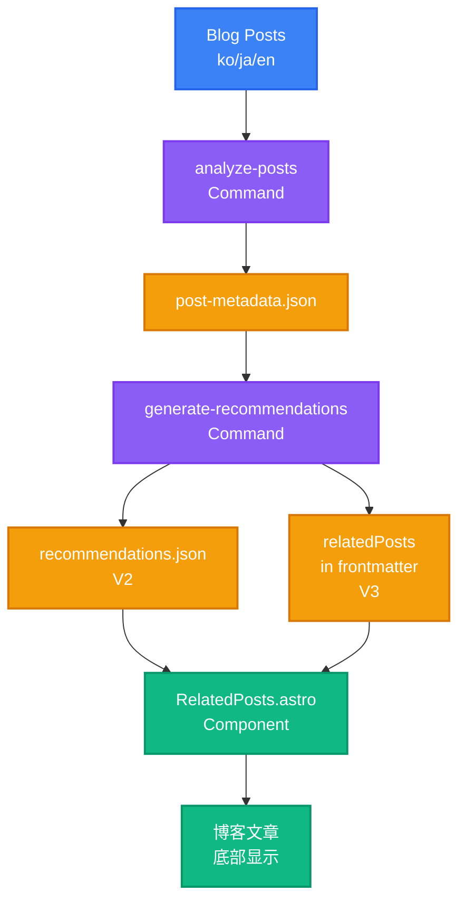
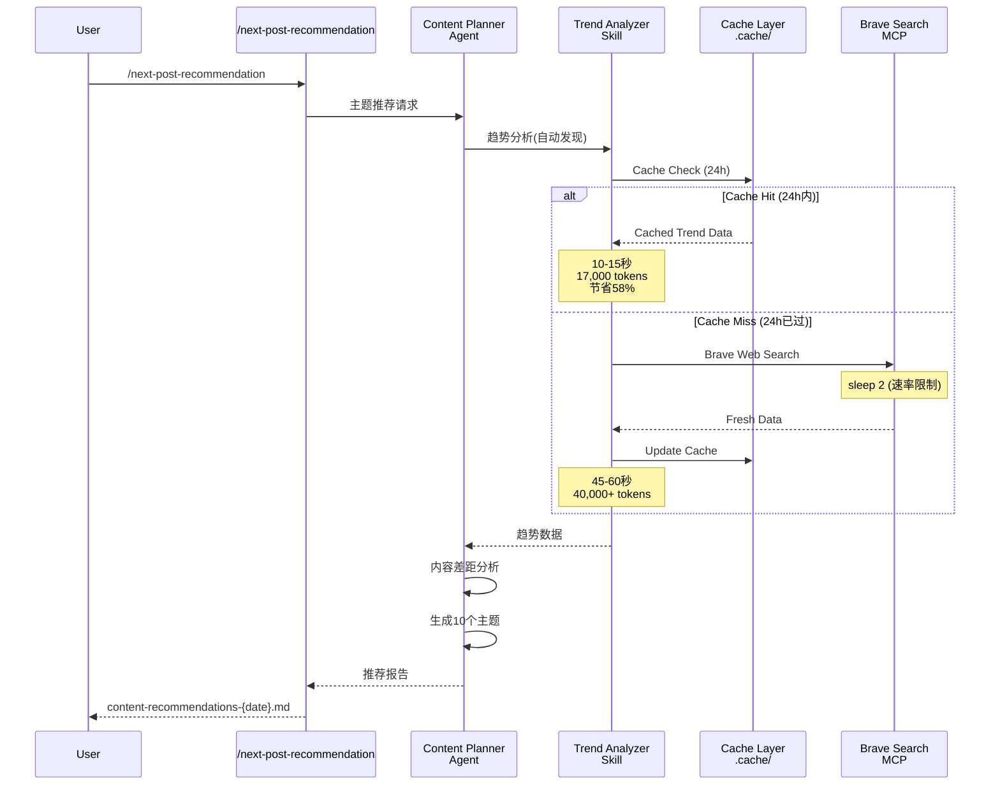

## 系列导读

> <strong>EffiFlow 自动化架构分析/评估及改进系列</strong> (2/3)
>
> 1. [第一部分：通过元数据实现 71% 成本节省](/zh/blog/zh/effiflow-automation-analysis-part1) - 三层架构与整体系统概述
> 2. <strong>第二部分：Skills 与 Commands 集成策略</strong> ← 当前文章
> 3. [第三部分：实战改进案例与 ROI 分析](/zh/blog/zh/effiflow-automation-analysis-part3)

## 引言

在第一部分中,我们探讨了 EffiFlow 的三层架构(Agents → Skills → Commands)以及通过元数据优先策略实现 71% 成本节省。在第二部分中,我们将深入分析该系统的核心——<strong>Skills 的自动发现机制</strong>和<strong>Commands 的编排模式</strong>。

核心问题如下："Model-Invoked 和 User-Invoked 的区别是什么,如何实现 58% 的 Token 节省?"

## Skills：可自动发现的模块化功能

### 什么是 Model-Invoked?

Skills 以<strong>Model-Invoked</strong>方式运行。这意味着即使用户没有明确调用,Claude 也会根据上下文自动激活。

例如,当用户提到"blog post"或"frontmatter"等关键词时,Claude 会自动加载 `blog-writing` Skill。这就像专家听到对话主题后自动拿出相关工具一样。

### SKILL.md 结构分析

所有 Skill 都通过包含 YAML frontmatter 的 `SKILL.md` 文件定义:

```yaml
---
name: blog-writing
description: Create SEO-optimized multi-language blog posts with proper frontmatter, hero images, and content structure. Use when writing blog posts, creating content, or managing blog metadata.
allowed-tools: [Read, Write, Edit, Bash, Grep, Glob]
---
```

<strong>核心要素</strong>:

- <strong>name</strong>: 小写字母,使用连字符,不超过 64 个字符
- <strong>description</strong>: 功能描述 + 使用时机("Use when...")
- <strong>allowed-tools</strong>: 通过工具限制增强安全性,可实现只读 Skills

description 中的"Use when..."语句尤其重要。Claude 通过这个语句判断何时应该激活 Skill。

### 已实现的 4 个 Skills 详解

#### 1. blog-writing (666 行)

<strong>文件结构</strong>:

- SKILL.md (73 行): 核心概述
- content-structure.md (328 行): 文章结构指南
- frontmatter-schema.md (173 行): 模式详细说明
- seo-guidelines.md (92 行): SEO 优化规则
- 3 个 Python 脚本 (464 行): generate_slug.py, get_next_pubdate.py, validate_frontmatter.py

<strong>核心功能</strong>:

- Frontmatter 验证(日期格式、必填字段、图片路径)
- SEO 优化(各语言的标题/描述长度限制)
  - 韩语: title 40 字符, description 120 字符
  - 英语: title 60 字符, description 160 字符
  - 日语: title 35 字符, description 110 字符
- 多语言支持(韩语、英语、日语)
- Slug 自动生成和 pubDate 计算

#### 2. content-analyzer (275 行)

<strong>输出元数据</strong>:

```json
{
  "summary": "100-150字摘要",
  "topics": ["主题1", "主题2", "主题3", "主题4", "主题5"],
  "techStack": ["技术1", "技术2", "技术3"],
  "difficulty": 3,
  "categoryScores": {
    "automation": 0.8,
    "web-development": 0.6,
    "ai-ml": 0.9,
    "devops": 0.3,
    "architecture": 0.5
  },
  "contentHash": "abc123..."
}
```

<strong>Token 效率</strong>:

- 完整内容分析: ~40,000 tokens
- 基于元数据: ~12,000-16,000 tokens
- <strong>节省 60〜70%</strong>

<strong>增量处理</strong>: 通过 Content Hash 检测变化,避免不必要的重新分析

#### 3. recommendation-generator (341 行)

<strong>基于 LLM 的语义推荐</strong>:

与传统的 TF-IDF 方法不同,使用 Claude LLM 实现真正的语义理解:

```
TF-IDF (传统)         →  LLM (现代)
关键词频率计算         →  全面内容理解
余弦相似度            →  语义相似性
基于关键词重复         →  基于上下文推荐
```

<strong>六维相似度分析</strong>:

- topic: 主题相似性 (40%)
- techStack: 技术栈 (25%)
- purpose: 目的对齐 (10%)
- complementary: 互补关系 (10%)
- difficulty: 难度 (15%)
- category: 类别对齐

<strong>多语言推理</strong>:

```json
{
  "reason": {
    "ko": "두 글 모두 MCP 서버를 활용한 브라우저 자동화...",
    "ja": "両記事ともMCPサーバーを活用した...",
    "en": "Both posts cover MCP server-based...",
    "zh": "两篇文章都涵盖基于 MCP 服务器的..."
  }
}
```

#### 4. trend-analyzer (605 行)

<strong>Brave Search MCP 集成</strong>:

```bash
# 每次搜索后必须延迟 2 秒(遵守速率限制)
brave_web_search "AI automation tools 2025"
sleep 2
brave_web_search "Claude Code trends 2025"
sleep 2
```

<strong>缓存策略</strong>:

| 数据类型 | 缓存周期 | 文件位置                   | 效果               |
| -------- | -------- | -------------------------- | ------------------ |
| 趋势数据 | 24小时   | .cache/trend-data.json     | 防止同日重复搜索   |
| 技术数据 | 7天      | .cache/technology-data.json | 每周去重           |
| 关键词数据 | 48小时   | .cache/keyword-data.json    | 2天内重用         |

<strong>性能对比</strong>:

**Before (缓存前)**:

- 每次调用 Brave Search
- 40,000+ tokens
- 成本: ~$0.05/次

**After (缓存后)**:

- 24小时内重用缓存
- 17,000 tokens
- 成本: ~$0.02/次
- <strong>节省 58%</strong>

### Progressive Disclosure 模式

Skills 采用分层上下文提供方式:



<strong>效果</strong>: 按需加载,最大化上下文效率

## Commands：用户调用的工作流编排器

### 什么是 User-Invoked?

Commands 以<strong>User-Invoked</strong>方式运行。用户使用 `/command` 斜杠明确调用,并可通过 `$ARGUMENTS` 传递参数。

```bash
/write-post "Claude Code MCP 集成指南"
/analyze-posts --force
/next-post-recommendation --count 10
```

### 复杂度分布

| 复杂度                     | Commands                                                                                  | 平均行数 |
| -------------------------- | ----------------------------------------------------------------------------------------- | ------------ |
| <strong>Very High</strong> | write-post (1,080行), write-post-ko (1,063行), write-ga-post (745行)                      | 963 行     |
| <strong>High</strong>      | analyze-posts (444行), generate-recommendations (514行), next-post-recommendation (551行) | 503 行     |
| <strong>Low</strong>       | commit (11行)                                                                             | 11 行      |

### Phase-Based Execution 模式

复杂的 Commands 划分为清晰的 Phase。让我们看看 `write-post` 的 8 个 Phases:



<strong>Phase 详细内容</strong>:

**Phase 1: Research & Planning**

- 调用 Web Researcher 代理
- 自动发现 Trend Analyzer Skill
- 通过 Brave Search MCP 收集最新信息
- 2秒延迟遵守速率限制

**Phase 2: Image Generation**

- Image Generator 代理
- 使用 Gemini API(需要 GEMINI_API_KEY)
- 基于主题生成 Hero 图片

**Phase 3: Content Writing**

- Writing Assistant 代理
- 自动发现 Blog Writing Skill
- 同时创建韩语、日语、英语版本
- 本地化(非翻译)

**Phase 4: Frontmatter & Metadata**

- 使用 Blog Writing Skill 验证 Frontmatter
- pubDate: 'YYYY-MM-DD' 格式(单引号)
- heroImage: 相对路径验证

**Phase 5: Metadata Generation**

- Post Analyzer 代理
- 自动激活 Content Analyzer Skill
- 计算 difficulty (1-5) 和 categoryScores

**Phase 6: V3 Recommendations**

- 执行 scripts/generate-recommendations-v3.js
- 基于元数据计算相似度
- 选择前 5 篇相关文章

**Phase 7: Backlink Updates**

- Backlink Manager 代理(可选)
- 相关文章互联

**Phase 8: Validation & Build**

- npm run astro check
- npm run build
- 返回文件路径和元数据摘要

### Agent Orchestration 模式

Commands 充当编排器角色,实际工作委派给 Agents:



<strong>效果</strong>:

- <strong>关注点分离</strong>: Command 仅定义工作流
- <strong>可重用性</strong>: Agent 和 Skill 可在多个 Command 中使用
- <strong>可维护性</strong>: 各组件可独立修改
- <strong>可测试性</strong>: 可按层测试

## 缓存策略：58% Token 节省机制

### trend-analyzer 的三层缓存

trend-analyzer Skill 对 3 种类型的数据实施不同周期的缓存:

```typescript
// 缓存算法(伪代码)
async function getTrendData(topic: string) {
  const cacheKey = `trend-${topic}`;
  const cached = cache.get(cacheKey);

  // 缓存命中: 有效期内
  if (cached && !isExpired(cached, 24 * 60 * 60)) {
    console.log("Cache hit: Returning cached data");
    return cached.data; // 立即返回,无 API 调用
  }

  // 缓存未命中: 需要新搜索
  console.log("Cache miss: Fetching from Brave Search");
  const data = await braveSearch(topic);
  await sleep(2000); // 遵守速率限制

  // 保存缓存
  cache.set(cacheKey, {
    data,
    timestamp: Date.now(),
    expiresAt: Date.now() + 24 * 60 * 60 * 1000,
  });

  return data;
}
```

### 缓存效果场景

**场景 1: 同一天搜索多个主题**

```bash
# 第一个主题(缓存未命中)
/next-post-recommendation --category ai-ml
# → 调用 Brave Search 15次
# → 耗时: 45-60秒
# → Tokens: 40,000+

# 第二个主题(缓存命中 80%)
/next-post-recommendation --category web-development
# → 调用 Brave Search 3次(仅新查询)
# → 耗时: 10-15秒
# → Tokens: 17,000 (节省 58%)
```

**场景 2: 次日相同主题**

```bash
# 24小时已过(缓存过期)
/next-post-recommendation --category ai-ml
# → 再次调用 Brave Search 15次
# → 反映最新趋势
```

### 性能对比表

| 项目                       | 缓存前 | 缓存后    | 节省 |
| -------------------------- | ------- | ---------- | ---- |
| <strong>Token 使用</strong> | 40,000+ | 17,000     | 58%  |
| <strong>API 调用</strong>  | 15次    | 3次(平均) | 80%  |
| <strong>耗时</strong> | 45-60秒 | 10-15秒    | 75%  |
| <strong>成本</strong>      | ~$0.05  | ~$0.02     | 60%  |

## 集成工作流实战示例

### 示例 1: 博客文章创作 (/write-post)

完整调用链可视化:

```mermaid
flowchart TD
    Start([User: /write-post 'Claude Code MCP']) --> CMD{Command<br/>write-post}

    CMD --> P1[Phase 1: Research & Planning]
    P1 --> WR[Web Researcher Agent]
    WR --> TA[Trend Analyzer Skill<br/>自动发现]
    TA --> BS[Brave Search MCP]
    BS --> Sleep1[sleep 2<br/>速率限制]
    Sleep1 --> Cache1{Cache<br/>Check}
    Cache1 -->|Hit| Return1[Cached Data<br/>17K tokens]
    Cache1 -->|Miss| Search1[New Search<br/>40K+ tokens]
    Search1 --> Return1
    Return1 --> P1Done[Research Complete]

    P1Done --> P2[Phase 2: Image Generation]
    P2 --> IG[Image Generator Agent]
    IG --> Gemini[Gemini API]
    Gemini --> P2Done[Hero Image Saved]

    P2Done --> P3[Phase 3: Content Writing]
    P3 --> WA[Writing Assistant Agent]
    WA --> BW[Blog Writing Skill<br/>自动发现]
    BW --> Multi[生成3种语言文章<br/>ko, ja, en]
    Multi --> P3Done[Content Created]

    P3Done --> P4[Phase 4: Frontmatter]
    P4 --> Validate[Frontmatter 验证]
    Validate --> P4Done[Validation Pass]

    P4Done --> P5[Phase 5: Metadata]
    P5 --> PA[Post Analyzer Agent]
    PA --> CA[Content Analyzer Skill<br/>自动]
    CA --> Hash{Content<br/>Hash}
    Hash -->|Changed| Analyze[New Analysis<br/>12K tokens]
    Hash -->|Unchanged| Skip[Skip Analysis<br/>0 tokens]
    Analyze --> P5Done[Metadata Saved]
    Skip --> P5Done

    P5Done --> P6[Phase 6: Recommendations]
    P6 --> Script[generate-recommendations-v3.js]
    Script --> Sim[Similarity Calculation]
    Sim --> P6Done[Top 5 Related Posts]

    P6Done --> P7[Phase 7: Backlinks]
    P7 --> BM[Backlink Manager]
    BM --> Update[Update Related Posts]
    Update --> P7Done[Cross-links Created]

    P7Done --> P8[Phase 8: Build]
    P8 --> Check[astro check]
    Check --> Build[npm run build]
    Build --> End([Posts Published])

    style Start fill:#8B5CF6,stroke:#7C3AED,stroke-width:2px,color:#fff
    style CMD fill:#8B5CF6,stroke:#7C3AED,stroke-width:3px,color:#fff
    style WR fill:#3B82F6,stroke:#2563EB,stroke-width:2px,color:#fff
    style IG fill:#F97316,stroke:#EA580C,stroke-width:2px,color:#fff
    style WA fill:#14B8A6,stroke:#0D9488,stroke-width:2px,color:#fff
    style PA fill:#3B82F6,stroke:#2563EB,stroke-width:2px,color:#fff
    style BM fill:#14B8A6,stroke:#0D9488,stroke-width:2px,color:#fff
    style TA fill:#10B981,stroke:#059669,stroke-width:2px,color:#fff
    style BW fill:#10B981,stroke:#059669,stroke-width:2px,color:#fff
    style CA fill:#10B981,stroke:#059669,stroke-width:2px,color:#fff
    style Cache1 fill:#F59E0B,stroke:#D97706,stroke-width:2px,color:#fff
    style Return1 fill:#F59E0B,stroke:#D97706,stroke-width:2px,color:#fff
    style End fill:#10B981,stroke:#059669,stroke-width:2px,color:#fff
```



<strong>Token 使用量分析</strong>:

| Phase                 | 主要任务   | Token 使用               | 优化                         |
| --------------------- | ----------- | ----------------------- | ------------------------------ |
| Phase 1               | 网络研究   | 17,000 (缓存命中)      | 节省 58%                       |
| Phase 3               | 内容写作 | 15,000                  | -                              |
| Phase 5               | 元数据  | 12,000 (增量处理)      | 节省 70%                       |
| Phase 6               | 推荐生成   | 3,000 (基于元数据) | 节省 60%                       |
| <strong>合计</strong> |             | <strong>47,000</strong> | <strong>平均节省 63%</strong> |

### 示例 2: 元数据和推荐流水线



<strong>数据流</strong>:

1. <strong>/analyze-posts</strong>: 仅分析韩语文章(节省 3 倍成本)

   - 通过 Content Hash 检测变化
   - 仅重新分析已更改的文章
   - 更新 post-metadata.json

2. <strong>/generate-recommendations</strong>: 基于 LLM 的语义推荐

   - 基于元数据分析(节省 60-70% tokens)
   - 六维相似度计算
   - V2: 生成 recommendations.json(旧版)
   - V3: 直接添加到 frontmatter 的 relatedPosts(当前)

3. <strong>RelatedPosts Component</strong>: 在博客文章中显示推荐

### 示例 3: 基于趋势的主题推荐

利用缓存的流程:



## $ARGUMENTS 使用模式

Commands 通过 `$ARGUMENTS` 支持灵活的参数传递。

### 简单模式 (analyze-posts)

```markdown
/analyze-posts $ARGUMENTS

# 使用示例

/analyze-posts --force # 完全重新生成
/analyze-posts --post my-slug # 仅特定文章
/analyze-posts --verify # 验证模式
```

### 复杂模式 (write-post)

```markdown
Topic: $ARGUMENTS

# 解析逻辑

topic = args[0] # 第一个参数: 主题
flags = parseFlags(args[1:]) # 其余: 标志

# 使用示例

/write-post "Claude Code MCP 集成指南" --tags ai,mcp,automation --languages ko,ja
```

<strong>标志解析示例</strong>:

```typescript
function parseArguments(args: string[]) {
  const result = {
    topic: args[0],
    tags: [],
    languages: ["ko", "ja", "en"], // 默认值
    description: "",
  };

  for (let i = 1; i < args.length; i++) {
    if (args[i] === "--tags" && args[i + 1]) {
      result.tags = args[i + 1].split(",");
      i++;
    } else if (args[i] === "--languages" && args[i + 1]) {
      result.languages = args[i + 1].split(",");
      i++;
    } else if (args[i] === "--description" && args[i + 1]) {
      result.description = args[i + 1];
      i++;
    }
  }

  return result;
}
```

## 实战应用指南

### 创建 Skill (分步指南)

<strong>步骤 1: 创建目录</strong>

```bash
mkdir -p .claude/skills/my-skill
cd .claude/skills/my-skill
```

<strong>步骤 2: 编写 SKILL.md</strong>

```markdown
---
name: my-skill
description: Brief description of what this skill does. Use when [specific trigger condition].
allowed-tools: [Read, Write, Bash]
---

# My Skill

## Core Capabilities

1. **Feature 1**: Description
2. **Feature 2**: Description

## Workflow

### Phase 1: Input Processing

...

### Phase 2: Main Logic

...

### Phase 3: Output Generation

...

## Examples

...
```

<strong>步骤 3: 添加支持文件(可选)</strong>

```bash
# 详细指南
touch detailed-guide.md

# 脚本
mkdir scripts
touch scripts/helper.py
```

<strong>步骤 4: 测试</strong>

```bash
# 在与 Claude 的对话中使用触发关键词
"Please use my-skill to process this data..."
```

### 创建 Command (分步指南)

<strong>步骤 1: 创建文件</strong>

```bash
touch .claude/commands/my-command.md
```

<strong>步骤 2: 定义工作流</strong>

```markdown
# My Command

Execute [specific workflow] with [parameters].

## Usage

\`\`\`bash
/my-command $ARGUMENTS
\`\`\`

## Arguments

- \`<required>\`: Description
- \`--optional\`: Description

## Workflow

### Phase 1: Preparation

1. Parse arguments
2. Validate inputs
3. Load dependencies

### Phase 2: Execution

1. Call Agent A
2. Process results
3. Call Agent B

### Phase 3: Finalization

1. Validate outputs
2. Save results
3. Return summary

## Example

\`\`\`bash
/my-command "input" --flag value
\`\`\`

## Output

...

## Related Files

- Agent: `.claude/agents/my-agent.md`
- Skill: `.claude/skills/my-skill/SKILL.md`
```

<strong>步骤 3: Agent 调用模式</strong>

```markdown
### Phase 2: Main Processing

Delegate to specialized agent:

\`\`\`
@my-agent "Process this data with specific instructions"
\`\`\`

The agent will:

1. Automatically discover relevant skills
2. Execute the workflow
3. Return structured results
```

<strong>步骤 4: 测试</strong>

```bash
# 在与 Claude 的对话中执行 Command
/my-command "test input" --verbose
```

## 性能优化技术

### 1. 缓存 (节省 58%)

<strong>实现方法</strong>:

```typescript
interface CacheEntry {
  data: any;
  timestamp: number;
  expiresAt: number;
}

class SimpleCache {
  private cache: Map<string, CacheEntry> = new Map();

  set(key: string, data: any, ttlSeconds: number) {
    this.cache.set(key, {
      data,
      timestamp: Date.now(),
      expiresAt: Date.now() + ttlSeconds * 1000,
    });
  }

  get(key: string): any | null {
    const entry = this.cache.get(key);
    if (!entry) return null;

    if (Date.now() > entry.expiresAt) {
      this.cache.delete(key);
      return null;
    }

    return entry.data;
  }
}
```

<strong>过期策略</strong>:

- 趋势数据: 24小时(快速变化)
- 技术文档: 7天(每周更新)
- 关键词: 48小时(中等速度)

### 2. 增量处理 (节省 70%)

<strong>Content Hash 实现</strong>:

```typescript
import crypto from "crypto";

function calculateContentHash(content: string): string {
  return crypto.createHash("sha256").update(content).digest("hex");
}

async function incrementalAnalysis(post: BlogPost) {
  const currentHash = calculateContentHash(post.content);
  const existingMetadata = await loadMetadata(post.slug);

  // 检测变化
  if (existingMetadata?.contentHash === currentHash) {
    console.log(`Skipping ${post.slug}: No changes`);
    return existingMetadata; // 重用现有元数据
  }

  // 已更改: 需要重新分析
  console.log(`Analyzing ${post.slug}: Content changed`);
  const metadata = await analyzeContent(post);
  metadata.contentHash = currentHash;

  await saveMetadata(post.slug, metadata);
  return metadata;
}
```

<strong>效果测量</strong>:

| 场景              | Before      | After       | 节省                 |
| --------------------- | ----------- | ----------- | -------------------- |
| 新文章 1篇       | 3,000 tokens  | 3,000 tokens  | 0%                   |
| 现有13篇 + 新1篇  | 42,000 tokens | 3,000 tokens  | 93%                  |
| 完全重新分析 (--force) | 42,000 tokens | 42,000 tokens | 0%                   |
| <strong>平均</strong> |             |             | <strong>70%</strong> |

### 3. 并行执行 (预告)

将在第三部分详细介绍:

```typescript
// 顺序处理(当前)
for (const post of posts) {
  await analyzePost(post); // 2分钟
}

// 并行处理(改进方案)
await Promise.all(posts.map((post) => analyzePost(post))); // 30秒(缩短70%)
```

## 最佳实践

### Skills 编写

✅ <strong>SKILL.md 必需</strong>

- 建议 100 行以下(长的话分离到支持文档)
- YAML frontmatter 高完成度

✅ <strong>清晰的 description</strong>

- 包含"Use when..."语句
- 明确触发条件

✅ <strong>使用 allowed-tools 限制权限</strong>

- 安全: 排除不必要的工具
- 只读 Skills: 仅 [Read, Grep, Glob]

✅ <strong>Progressive Disclosure</strong>

- SKILL.md: 核心概述
- 支持文档: 详细指南
- 脚本: 执行逻辑

### Commands 编写

✅ <strong>基于 Phase 的执行</strong>

- 清晰的阶段划分
- Phase 1-8 格式

✅ <strong>Agent 委派模式</strong>

- Command 仅作为编排器
- 实际工作交给 Agent

✅ <strong>包含验证步骤</strong>

- Phase 最后: 始终验证
- 执行 astro check, build

✅ <strong>错误处理</strong>

- 明确前提条件
- 失败时提供恢复方法

## 系列下期预告

### 第三部分: 实战改进案例与 ROI 分析

<strong>涵盖内容</strong>:

1. <strong>并行处理实现</strong> (缩短 70% 时间)

   - Promise.all 活用
   - 并发执行控制
   - 错误处理

2. <strong>自动化测试</strong> (质量保证)

   - Skill 单元测试
   - Command 集成测试
   - CI/CD 集成

3. <strong>重试逻辑</strong> (提高稳定性)

   - 网络搜索失败恢复
   - Exponential Backoff
   - 部分失败处理

4. <strong>ROI 分析</strong> (投资 vs 效果)

   - 开发时间投资
   - 节省成本计算
   - 盈亏平衡点

5. <strong>Top 3 Quick Wins</strong> (立即可应用)
   - Dry-Run 模式
   - Interactive Mode
   - Cost Tracking Dashboard

<strong>预期效果</strong>:

- 处理时间: 2分钟 → 30秒(缩短 75%)
- 测试覆盖率: 0% → 80%
- 稳定性: 95% → 99%

## 结论

在第二部分中,我们深入分析了 EffiFlow 的核心——Skills 与 Commands 的集成策略。

<strong>核心洞察</strong>:

1. <strong>Skills 的自动发现</strong>: Model-Invoked 方式实现基于上下文的激活
2. <strong>Commands 的编排</strong>: User-Invoked,基于 Phase 的执行,Agent 委派
3. <strong>通过缓存节省 58%</strong>: 三层缓存策略 (24h/7d/48h)
4. <strong>Progressive Disclosure</strong>: 通过分层上下文最大化效率
5. <strong>元数据优先</strong>: 节省 60-70% tokens

<strong>实战应用</strong>:

- `/write-post`: 8-Phase 完全自动化
- `/analyze-posts`: 增量处理节省 70%
- `/next-post-recommendation`: 缓存节省 58%

在第三部分中,我们将进一步改进这一架构,将处理时间缩短 75%,将测试覆盖率提高到 80%,并将稳定性提升到 99%。

EffiFlow 的创新仍在继续。下期再见!
