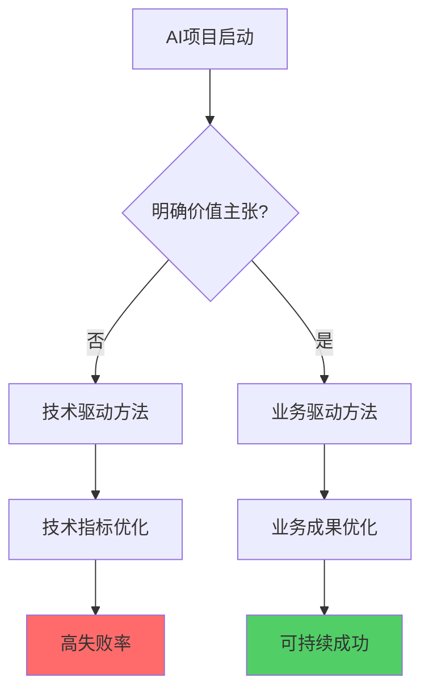
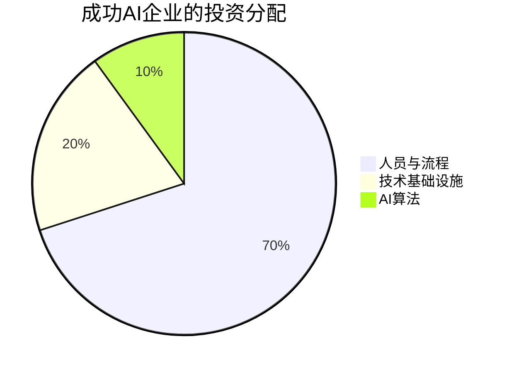

## AI导入热潮下的冷酷现实

2024年，生成式AI从技术实验室走向企业一线。ChatGPT的成功让无数企业看到了AI带来的生产力革命可能性。然而，在这场热潮背后，隐藏着一个令人震惊的事实：<strong>企业AI项目的失败率高达42%〜95%</strong>。

根据多家权威机构的研究：
- <strong>S&P Global</strong>: 2025年AI项目失败率将达到42%
- <strong>MIT</strong>: 95%的AI试点项目失败，仅5%实现收入加速
- <strong>Gartner</strong>: 到2025年，50%的生成式AI项目将在试点阶段被放弃

这些数字揭示了一个残酷的真相：<strong>AI导入不仅仅是技术问题，更是组织变革管理的挑战</strong>。本文将深入探讨为何自下而上的AI导入存在根本性局限，以及为何需要系统化的自上而下方法。

## 失败的三大根本原因

### 1. 数据质量问题：垃圾进，垃圾出

企业数据往往分散在各个系统中，格式不统一、质量参差不齐。没有经过系统化整理的数据，AI模型就像在沙滩上建造房子——基础不牢，地动山摇。

<strong>问题根源</strong>：
- 数据分散在ERP、CRM、Excel、纸质文档等多个来源
- 缺乏统一的数据标准和元数据管理
- 数据所有权不明确，跨部门协作困难

### 2. 集成复杂性：技术债务的重负

企业IT系统往往是多年积累的遗留系统拼凑而成。将AI集成到这些系统中，需要克服技术架构、API接口、安全协议等多重障碍。

<strong>典型挑战</strong>：
- 遗留系统缺乏现代API接口
- 安全合规要求导致数据访问受限
- 不同系统之间的数据格式转换成本高昂

### 3. 不明确的价值主张：技术与业务的脱节

许多AI项目是"为了AI而AI"，缺乏明确的业务价值衡量标准。技术团队关注模型精度，业务团队关注ROI，双方缺乏共同语言。

## 信任鸿沟：高层与基层的18%p差距

<strong>Writer 2024年AI报告</strong>揭示了一个关键问题：企业高层对AI的信心（71%）远高于一线员工（53%），差距高达18个百分点。这种信任鸿沟反映了组织内部对AI导入的根本性观点冲突。

### 高层视角：战略机遇

- 看到AI作为竞争优势的潜力
- 关注宏观ROI和市场定位
- 愿意为长期收益投资

### 基层视角：实际挑战

- 担心工作被替代的不安全感
- 质疑AI工具的实际效用
- 抵触额外的学习和适应成本

这种观点差异如果不能有效弥合，任何AI项目都难以成功。<strong>自下而上的方法往往低估了这种信任鸿沟，导致基层抵制和项目流产</strong>。

## 自下而上方法的根本局限

许多企业采用"让员工自发探索AI工具"的自下而上方法，希望通过基层创新推动组织变革。然而，这种方法存在三个根本性局限：

### 局限1：人性不总是理性的

<strong>行为经济学告诉我们</strong>：人类决策受到认知偏差、短期思维和风险厌恶的深刻影响。员工不会自动选择对组织最优的方案，而是倾向于：

- <strong>现状偏好</strong>：习惯的工作方式更舒适，改变意味着不确定性
- <strong>损失厌恶</strong>：担心新工具导致的失误风险，而非关注潜在收益
- <strong>从众心理</strong>：等待他人先行，避免成为"小白鼠"

### 局限2：不是所有人都追求成长

组织中的员工动机千差万别。<strong>并非每个人都把工作视为自我实现的途径</strong>：

- 部分员工只求稳定完成任务，避免额外麻烦
- 学习新工具需要时间和精力，许多人缺乏内在动力
- 绩效考核未与AI采用挂钩时，缺乏外在激励

### 局限3：缺乏系统化视角

个体员工往往局限于自己的岗位职责，难以看到：

- 跨部门的业务流程全貌
- AI导入对整体工作流的影响
- 数据安全、合规性等组织层面的问题

<strong>结果</strong>：自下而上的创新往往停留在"点状应用"，无法形成系统化的生产力提升。更糟糕的是，各部门各自为战，导致数据孤岛和工具碎片化。

## 自上而下方法：系统化的五步框架

基于<strong>BCG的研究</strong>（成功企业70%投资于人员/流程，20%投资于技术基础设施，10%投资于AI算法），我们提出以下自上而下的AI导入框架：

### 第1步：业务流程负责人主导

<strong>关键原则</strong>：不是技术专家，而是最了解业务流程的人来主导AI导入。

- 识别核心业务流程的痛点和瓶颈
- 明确AI能解决的具体问题
- 定义清晰的成功标准（不是技术指标，而是业务成果）

### 第2步：召集跨职能专家团队

组建包含以下角色的团队：

- <strong>业务专家</strong>：理解领域知识和实际需求
- <strong>技术专家</strong>：评估AI解决方案的可行性
- <strong>数据工程师</strong>：确保数据质量和可访问性
- <strong>变革管理专家</strong>：设计培训和推广策略
- <strong>法务/合规专家</strong>：确保符合监管要求

### 第3步：业务流程文档化

这是最容易被忽视但最关键的步骤。<strong>没有清晰的流程文档，AI导入就是无的放矢</strong>。

文档化内容包括：

1. <strong>当前流程图</strong>：详细记录每个步骤、决策点、输入输出
2. <strong>痛点分析</strong>：识别耗时、易错、重复性高的环节
3. <strong>数据流图</strong>：明确数据来源、传输路径、存储位置
4. <strong>角色与职责</strong>：谁在做什么，谁有决策权

<strong>案例</strong>：某制造企业通过流程文档化发现，订单处理流程中80%的时间花在等待不同部门的手工审批上。AI导入的关键不是自动化整个流程，而是优化审批环节的信息流转。

### 第4步：设定里程碑

将AI导入分解为可管理的阶段，每个阶段都有明确的交付物和成功标准。

<strong>典型里程碑设计</strong>：

| 阶段 | 目标 | 成功标准 | 时间 |
|------|------|----------|------|
| 试点 | 验证AI在特定场景的效果 | 准确率>90%，用户满意度>70% | 1〜3个月 |
| 扩展 | 推广到同类业务流程 | 覆盖率>50%，ROI>150% | 3〜6个月 |
| 标准化 | 建立最佳实践和工具套件 | 跨部门采用率>80% | 6〜12个月 |
| 优化 | 持续改进和创新 | 年度生产力提升>20% | 持续进行 |

### 第5步：标准化与推广

成功的AI导入不是一次性项目，而是形成可复制的模式。

<strong>标准化要素</strong>：
- <strong>工具套件</strong>：统一的AI工具和平台（避免各部门各自采购）
- <strong>数据标准</strong>：统一的数据格式、命名规范、质量标准
- <strong>培训体系</strong>：分级培训（基础使用 → 高级应用 → 专家认证）
- <strong>支持机制</strong>：内部AI帮助台、知识库、社区

<strong>推广策略</strong>：
- 建立"AI冠军"计划，培养各部门的AI倡导者
- 将AI使用纳入绩效考核（不是强制，而是激励）
- 定期分享成功案例和最佳实践
- 举办内部黑客松或创新挑战赛

## McKinsey的关键洞察：领导力是最大障碍

<strong>McKinsey的研究</strong>指出，AI成功的最大障碍不是技术，而是领导力。这意味着：

1. <strong>高层必须亲自参与</strong>：不能将AI导入完全委托给IT部门或创新团队
2. <strong>需要跨职能协作</strong>：打破部门墙，建立统一的AI治理体系
3. <strong>文化转型优先于技术部署</strong>：培养数据驱动和实验文化

<strong>反面案例</strong>：某金融企业的AI项目由IT部门主导，业务部门被动配合。结果开发的AI模型虽然技术先进，但与实际业务需求脱节，最终被束之高阁。

<strong>成功案例</strong>：某零售企业的CEO亲自担任AI转型委员会主席，每月审查进展，跨部门资源调配由其直接决策。结果18个月内实现了供应链成本降低15%、客户满意度提升20%的显著成果。

## 数据支撑：为何自上而下更有效

让我们用数据说话。根据<strong>BCG的研究</strong>，成功的AI企业的投资分配是：

这个分配揭示了关键洞察：<strong>AI成功的70%取决于人员和流程，而非算法本身</strong>。

对比自下而上与自上而下的方法：

| 维度 | 自下而上 | 自上而下 |
|------|----------|----------|
| 人员投资 | 低（依赖自发学习） | 高（系统化培训和变革管理） |
| 流程优化 | 局部优化 | 全局优化 |
| 技术基础设施 | 碎片化 | 统一平台 |
| 数据治理 | 缺乏 | 严格标准 |
| 成功率 | 5%〜10% | 40%〜60% |

## Writer报告的三大发现

<strong>Writer 2024年AI报告</strong>揭示了AI导入失败的三个常见原因，都指向自上而下方法的必要性：

### 发现1：内部权力斗争

不同部门对AI预算、资源和决策权的争夺导致项目停滞。

<strong>自上而下解决方案</strong>：由高层建立统一的AI治理体系，明确各部门的角色和职责，避免各自为战。

### 发现2：低ROI

缺乏明确的业务价值衡量导致投资难以持续。

<strong>自上而下解决方案</strong>：从业务流程出发，明确量化的成功指标（如成本降低%、时间节省%、错误率降低%），持续跟踪ROI。

### 发现3：管理层与员工观点冲突

高层看到战略机遇，员工看到工作威胁，缺乏共同愿景。

<strong>自上而下解决方案</strong>：通过变革管理，明确AI是"增强人类能力"而非"替代人类"，设计激励机制鼓励学习和适应。

## 实践建议：如何开始自上而下的AI导入

### 1. 从高影响、低风险的流程开始

不要一开始就试图革命性改造核心业务流程。选择：
- 痛点明确、易于量化的流程（如客服响应、文档处理）
- 失败成本可控的场景（如内部工具，而非面向客户的系统）
- 有明确负责人和利益相关者的业务领域

### 2. 建立AI卓越中心（AI Center of Excellence）

设立专门团队负责：
- 制定AI战略和路线图
- 评估和采购AI工具
- 建立数据治理和安全标准
- 提供培训和支持

<strong>关键</strong>：这个团队不是"做AI"的团队，而是"帮助业务部门成功使用AI"的团队。

### 3. 投资于变革管理

预算分配建议：
- 40%：人员培训和变革管理
- 30%：流程优化和文档化
- 20%：技术基础设施
- 10%：AI工具和算法

### 4. 建立快速反馈循环

- 每月审查AI项目进展（不是技术指标，而是业务成果）
- 设立"快速失败"文化：鼓励实验，但快速识别和终止无效项目
- 建立内部知识分享机制，让成功经验快速传播

### 5. 关注长期文化转型

AI导入不是一次性项目，而是组织能力的长期建设：
- 培养数据驱动决策文化
- 鼓励跨职能协作
- 建立持续学习机制
- 将AI素养纳入人才发展体系

## 结论：系统化方法是成功的关键

面对42%〜95%的高失败率，企业不能依赖自下而上的自发创新。<strong>生成式AI的成功导入需要系统化的自上而下方法</strong>：

1. <strong>由业务流程负责人主导</strong>：技术服务于业务，而非相反
2. <strong>通过文档化建立清晰基线</strong>：知道当前在哪里，才能规划去哪里
3. <strong>设定可衡量的里程碑</strong>：分阶段推进，持续验证价值
4. <strong>标准化与推广</strong>：将成功经验转化为可复制的模式
5. <strong>70%投资于人员和流程</strong>：技术只是实现手段，人和流程才是成功关键

<strong>最后的建议</strong>：AI导入是马拉松，不是短跑。不要期待立竿见影的革命性变化，而要专注于持续的渐进式改进。通过系统化的自上而下方法，企业可以将AI从"令人兴奋的实验"转化为"可持续的竞争优势"。

记住BCG的洞察：<strong>成功的AI企业将70%的精力投入到人员和流程上</strong>。技术会不断进步，但组织能力的建设才是长期成功的基石。

---

<strong>参考资料</strong>：
- S&P Global Market Intelligence (2024)
- MIT Sloan Management Review (2024)
- Gartner AI Hype Cycle Report (2024)
- BCG AI Adoption Study (2024)
- McKinsey AI Leadership Report (2024)
- Writer State of AI Report (2024)
