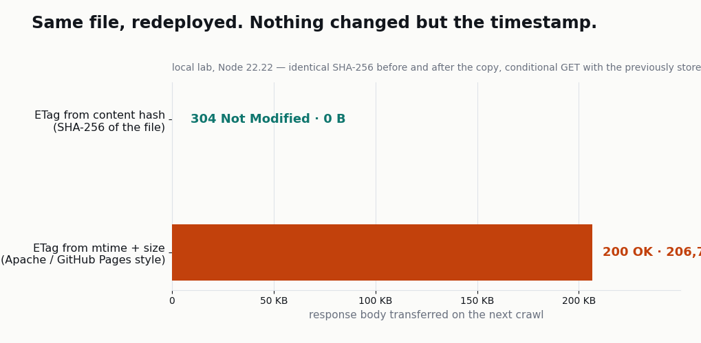

去年十月写的一篇文章，正文一个字都没改过。昨天顺手给那个 URL 发了个 `curl -I`，`Last-Modified` 显示的是昨天凌晨。

连错别字都没修过的页面。心里起疑，又戳了八个 URL：2025 年的文章、今年的文章、条款页、中文版、`robots.txt`。清一色 `Sun, 02 Aug 2026 16:08:29 GMT`，连秒都一样。这个时间不是页面变更的时刻，是我昨天部署的时刻。

到这儿为止都还是静态托管的常态。问题出在下一步。我用同一份源码重新构建了一次，1,346 个 HTML 文件按 SHA-256 比对<strong>一个不差，全部与上次构建相同</strong>。内容完全可复现，可挂在这些内容上的缓存校验值，每部署一次就整体换新。爬虫拿着昨天存下的校验值再来一次，服务器每次都回答"变了"。实际上一个字节都没变。

## 校验值指向的不是文件，是部署

先原样看响应头。这是一篇快一年没碰过的文章。

```bash
$ curl -sSI https://jangwook.net/ko/blog/ko/playwright-ai-testing/
HTTP/2 200
server: GitHub.com
last-modified: Sun, 02 Aug 2026 16:08:29 GMT
etag: "6a6f6b7d-3279e"
cache-control: max-age=600
content-length: 206750
```

把 `ETag` 拆开，来路一目了然。连字符两边各是一个十六进制数。

```text
0x6a6f6b7d = 1785686909  -> Sun, 02 Aug 2026 16:08:29 GMT （与 Last-Modified 相同）
0x3279e    = 206750      -> 与 Content-Length 相同
```

文件修改时间拼上文件大小。这是 Apache 和 nginx 用了很多年的默认 ETag 形式，GitHub Pages 也一样。也就是说，这个站的两个校验值 `ETag` 和 `Last-Modified` <strong>并不是两个独立信号，而是同一个事实（文件 mtime）被表述了两遍</strong>。一个失效，另一个必然跟着失效。

为了不停留在肉眼看几页的层面，我写了个审计脚本放进仓库。它从构建产物里取出真实 URL，收集响应头，再把拿到的校验值原样送回去，看条件请求能不能成立。

```bash
$ node scripts/audit-cache-validators.mjs --n=8
base                 https://jangwook.net
urls sampled         8
sends a validator    8/8
304 on revalidate    8/8
cache-control        max-age=600
distinct Last-Modified values across the sample: 1  <-- one shared timestamp: this is a deploy stamp, not a content date
ETags shaped "<hex>-<hex>" (mtime+size): 8/8  <-- validators will reset on the next deploy
  304  W/"6a6f6b7d-1c3"        Sun, 02 Aug 2026 16:08:29 GMT  /deepdiner/
  304  W/"6a6f6b7d-10147"      Sun, 02 Aug 2026 16:08:29 GMT  /en/blog/en/hindsight-mcp-agent-memory-learning/
  304  W/"6a6f6b7d-7e2e"       Sun, 02 Aug 2026 16:08:29 GMT  /en/social/
  304  W/"6a6f6b7d-10803"      Sun, 02 Aug 2026 16:08:29 GMT  /ja/blog/ja/heterogeneous-llm-agent-fleet-cost-optimization/
  304  W/"6a6f6b7d-810b"       Sun, 02 Aug 2026 16:08:29 GMT  /ja/social/
  304  W/"6a6f6b7d-1191a"      Sun, 02 Aug 2026 16:08:29 GMT  /ko/blog/ko/hindsight-mcp-agent-memory-learning/
  304  W/"6a6f6b7d-7791"       Sun, 02 Aug 2026 16:08:29 GMT  /ko/terms/
  304  W/"6a6f6b7d-1e36c"      Sun, 02 Aug 2026 16:08:29 GMT  /zh/blog/zh/hono-typescript-api-2026/
```

八个样本只有一个 `Last-Modified`。2025 年写的英文文章、久未改动的条款页，指的都是同一秒。

这次跑还捎带发现一件事。`fetch()` 会自动带上 `Accept-Encoding: gzip`，于是 ETag 回来时带了 `W/` 前缀，成了弱校验值。不要求压缩，拿到的就是强校验值。同一个 URL、同一个文件，协商结果不同，校验值的强度也不同。

```bash
$ curl -sSI https://jangwook.net/deepdiner/ | grep -i etag
etag: "6a6f6b7d-1c3"
$ curl -sSI -H 'Accept-Encoding: gzip' https://jangwook.net/deepdiner/ | grep -iE 'etag|content-encoding'
etag: W/"6a6f6b7d-1c3"
content-encoding: gzip
```

`0x1c3` 是 451，而这个文件压缩前正好 451 字节。标签挂在压缩后的表示上，值却来自原始大小。`If-None-Match` 用的是弱比较，所以重新验证本身没问题。真正吃亏的是需要强校验值的场景，比如范围请求里的 `If-Range`。

## 条件请求到底在交换什么

如果没亲手配过条件请求，上面日志里那些 `304` 的分量是看不出来的。

爬虫或浏览器第一次取到某个 URL 时，会把响应里带的 `ETag` 和 `Last-Modified` 存下来，作为这个 URL 的标记。下次再请求同一个 URL，就把存下的标记放进请求头：ETag 放 `If-None-Match`，日期放 `If-Modified-Since`。服务器拿它跟当前值比对，一致就回一个不带正文的 `304 Not Modified`，客户端直接复用手上那份副本。

Google 在官方博客里写明了自家抓取基础设施支持这套机制。引自 [Crawling December: HTTP caching](https://developers.google.com/search/blog/2024/12/crawling-december-caching)（2024 年 12 月 9 日）：

> Google's crawlers that support caching will send the `ETag` value returned for a previous crawl of that URL in the `If-None-Match header`. If the `ETag` value sent by the crawler matches the current value the server generated, your server should return an HTTP `304` (Not modified) status code with no HTTP body.

不带正文是关键。同一篇文章（[原文](https://developers.google.com/search/blog/2024/12/crawling-december-caching)）接着解释：服务器不用花算力生成内容，也不用花带宽传正文。两种机制该用哪个，官方也给了明确倾向。

> We strongly recommend using `ETag` because it's less prone to errors and mistakes (the value is not structured unlike the `Last-Modified` value).

而对本文最要紧的是这一句（[原文](https://developers.google.com/search/blog/2024/12/crawling-december-caching)）：

> Our recommendation is that you require a cache refresh on significant changes to your content; if you only updated the copyright date at the bottom of your page, that's probably not significant.

页脚版权年份改了一下，不值得让缓存失效。可我的站连版权年份都没动，却让全站缓存整体失效。一次部署就够了。

差距有多大，测一下就知道。同一个 URL 发三种请求。

```bash
$ curl -sS -o /dev/null -w 'code=%{http_code} down=%{size_download} header=%{size_header} t=%{time_total}\n' \
    https://jangwook.net/ko/blog/ko/playwright-ai-testing/
code=200 down=206750 header=660 t=0.133967

# 把当前有效的 ETag 原样送回
code=304 down=0 header=365 t=0.041801

# 用部署之前的日期发 If-Modified-Since
code=200 down=206750 t=0.064747
```

206,750 字节对 0 字节。连响应头一起算也是 660 字节对 365 字节。就这一个页面，爬虫每回访一次就要走 200 KB。协商 gzip 能降到 30,246 字节，可跟 0 比，仍然是 30 KB。

第三个请求才是本文的主题。爬虫带着部署之前拿到的值回来，文件哪怕一模一样，服务器也会把整份正文重发一遍。

## 字节相同，重新部署一次，照样回 200

线上站没法随手造出"部署之前的校验值"，所以我在临时沙箱里复现了同样的条件。两台服务器，除了校验值的生成方式之外全部一致。一台用 mtime 加大小生成 ETag（GitHub Pages 和 Apache 的做法），另一台用文件内容的 SHA-256。

```js
// mtime 方式：校验值来自文件属性
const st = statSync(file);
const mtime = Math.floor(st.mtimeMs / 1000);
etag = `"${mtime.toString(16)}-${st.size.toString(16)}"`;

// 内容哈希方式：校验值来自字节本身
etag = `"${createHash('sha256').update(body).digest('hex').slice(0, 16)}"`;
```

流程分三步。先请求一次拿到校验值存起来；再把文件按字节原样重新部署一遍（删掉目录，从原始副本重新拷贝）；然后用存下的校验值发条件请求。运行日志照贴。

```text
===== validator mode: mtime =====
1) first crawl        -> ETag="6a703515-3279e"  Last-Modified=Mon, 03 Aug 2026 06:28:37 GMT
200 206750B first crawl (unconditional GET)
304 0B revisit, nothing deployed  [If-None-Match]
304 0B revisit, nothing deployed  [If-Modified-Since]
2) redeploy: same bytes, fresh checkout (sha256 unchanged)
   sha256 before/after: c3f104574859d427 / c3f104574859d427
   new ETag: "6a703519-3279e"
200 206750B after redeploy             [If-None-Match]
200 206750B after redeploy             [If-Modified-Since]
3) real edit: one byte appended
200 206766B after real edit            [If-None-Match]

===== validator mode: content =====
1) first crawl        -> ETag="c3f104574859d427"  Last-Modified=Mon, 03 Aug 2026 06:28:42 GMT
200 206750B first crawl (unconditional GET)
304 0B revisit, nothing deployed  [If-None-Match]
304 0B revisit, nothing deployed  [If-Modified-Since]
2) redeploy: same bytes, fresh checkout (sha256 unchanged)
   sha256 before/after: c3f104574859d427 / c3f104574859d427
   new ETag: "c3f104574859d427"
304 0B after redeploy             [If-None-Match]
304 0B after redeploy             [If-Modified-Since]
3) real edit: one byte appended
200 206766B after real edit            [If-None-Match]
```

mtime 方式下，重新部署后 ETag 从 `"6a703515-3279e"` 变成 `"6a703519-3279e"`。大小那一段（`3279e`）没动，只有前面的时间往前走了 4 秒。这 4 秒让 206,750 字节又跑了一遍。内容哈希方式重新部署后仍是 `"c3f104574859d427"`，回的是 304；等我真的追加了一个字节，它才切成 200。该失效的时候失效，不该的时候不动。



RFC 9110 对这两种做法都放行。[8.8.3.1](https://www.rfc-editor.org/rfc/rfc9110.html#section-8.8.3.1) 把"表示内容的抗碰撞哈希、若干文件属性的组合、具备亚秒精度的修改时间"并列举例，所以 mtime 型 ETag 不算违规。但同一份文档的 [8.8.1](https://www.rfc-editor.org/rfc/rfc9110.html#section-8.8.1) 补了一句：

> A strong validator might change for reasons other than a change to the representation data, such as when a semantically significant part of the representation metadata is changed (e.g., Content-Type), but it is in the best interests of the origin server to only change the value when it is necessary to invalidate the stored responses held by remote caches and authoring tools.

可以因为别的原因变，但只在真需要让远端缓存失效时才变，对源站自己最有利。同一节还直接点名了替代方案："A collision-resistant hash function applied to the representation data is also sufficient."

## 同一份源码重新构建，1,346 个文件一模一样

换成内容哈希，本身并不会让校验值自动稳定下来。如果每次构建吐出的 HTML 都有细微差别，哈希照样每次都变，问题只是换了个地方。嵌进去的时间戳、随机 ID、顺序不定的类名列表，都是常见原因。

于是我一行源码都没改，直接重新构建。

```bash
$ find dist -name '*.html' -print0 | xargs -0 shasum -a 256 | sort -k2 > before.txt
$ TEST_FLG=false npm run build     # real 85.30s
$ find dist -name '*.html' -print0 | xargs -0 shasum -a 256 | sort -k2 > after.txt

before=1346 after=1346
identical bytes : 1346 (100.0%)
changed bytes   : 0 (0.0%)
```

1,346 个文件按字节全部一致。这个站的构建是完全可复现的，也就是说用内容哈希做校验值，部署一百次它也不会动。

两个数字放在一起，这篇文章的意思就说尽了。<strong>内容的复现率 100%，已部署校验值的稳定性 0%。</strong>一条完全确定性的流水线，把产物交到投递层，然后每次都被重新发一张身份证。

顺带给个量级：全站 HTML 共 1,346 个，未压缩 109.4 MB，gzip -6 后 26.4 MB，单页平均分别是 85,207 字节和 20,537 字节。全站重新抓取一轮，这些流量就要走一遍。如果条件请求全部成立，同样一轮只需每页 365 字节的 304 响应头，合计不到 0.5 MB。

## 每天 5.25 次部署带来的 0%

不过，"部署就重置校验值"这一条本身还说明不了损失有多大。真正决定数值的是两个间隔的关系：爬虫的回访间隔，和你的部署间隔。爬虫再来时想拿到 304，前提是<strong>上次访问之后一次部署都没发生过</strong>。所以条件请求的成功率，等于"回访窗口内部署次数为 0"的概率。

这个能算。我取了近 30 天的提交记录，把 5 分钟以内的连续提交合并成一次部署。这个仓库每次向 main 推送，GitHub Actions 就会构建并部署。

```text
commits: 178
deploys (5-min clustering): 154
span days: 29.3  -> 5.25 deploys/day
gap hours: median=2.75 mean=4.60 p10=0.17 p90=15.84 max=16.80
```

部署间隔中位数 2 小时 45 分，最长也只有 16 小时 48 分。整整 30 天里，没有一天是空着的。在这条时间线上以 10 分钟为步长滑动窗口，数"窗口内部署次数是否为 0"，结果如下。

| 爬虫回访间隔 | 期间没有部署的概率 | 条件请求结果 |
|---|---|---|
| 1 小时 | 83.7% | 多数是 304 |
| 3 小时 | 60.9% | 略多于一半是 304 |
| 6 小时 | 37.0% | 多数是 200 |
| 12 小时 | 12.0% | 几乎全是 200 |
| 24 小时 | 0.0% | 全是 200 |
| 72 小时 | 0.0% | 全是 200 |
| 7 天 | 0.0% | 全是 200 |

一旦跨过一天就是 0。不是四舍五入到 0，而是观测到的时间线上根本没有这样的窗口。对一个每天写、每天部署的站来说，爬虫昨天来过的页面今天再来，条件请求 100% 失败。哪怕那篇文章一年没改过一个字。

我最初怀疑到这一层，是在做另一件事的时候：[一半内部链接被 301 弹开的那次审计](/zh/blog/zh/internal-link-trailing-slash-redirect-audit-2026)。那次构建产物也没问题，漏的是投递层。这次是同一类毛病。源码打磨得再精细，最后一跳把值换掉，前面的精确度就传不到对面。

## 这笔浪费什么时候才真的算问题

上面的数字看着扎眼，但那不等于我的站出了急事。

Google 的[抓取预算管理指南](https://developers.google.com/search/docs/crawling-indexing/large-site-managing-crawl-budget)明确圈定了该操心这件事的对象："Large sites (1 million+ unique pages) with content that changes moderately often (once a week)"，以及 "Medium or larger sites (10,000+ unique pages) with very rapidly changing content (daily)"。我的站是 1,346 个页面，两条线都够不着。同一份文档对 304 的承诺也只有一句："Support `304 (Not Modified)` HTTP status codes. If a page hasn't changed since Google last crawled it, returning a `304` code tells Google to reuse the cached version, saving your server bandwidth and resources." 说的是省带宽和资源，跟排名无关。

老实列一遍：

- <strong>与排名无关。</strong>没有任何官方依据说 304 变多能提升搜索排名。我没测到，也没有能测的手段。
- <strong>真实的爬虫行为我没测到。</strong>GitHub Pages 不提供访问日志。上面那张概率表是"如果回访间隔为 X 小时"的条件计算，不是对 Googlebot 实际回访频率的观测。如果托管环境能拿到服务器日志，这一块就能从假设换成实测。
- <strong>AI 爬虫是否发条件请求，没能确认。</strong>没有日志，就没办法按 user agent 拆开看。[爬虫不执行 JavaScript](/zh/blog/zh/ai-crawlers-dont-render-javascript-csr-2026) 这件事光靠响应就能验证，重新验证的习惯不行。
- <strong>不是规范违规。</strong>前面引的 RFC 9110 8.8.3.1 允许基于 mtime 的标签。不是托管方做错了，只是这套方案跟"每天部署"的站不搭。
- <strong>5 分钟聚合是近似值。</strong>真实部署次数可能更少也可能更多。但 24 小时窗口为 0% 这个结论几乎不受聚合方式影响，因为这一个月里没有哪天是不部署的。

即便如此，把这个值摸清楚仍有意义。GitHub Docs 的 [GitHub Pages limits](https://docs.github.com/en/pages/getting-started-with-github-pages/github-pages-limits) 写着 "GitHub Pages sites have a soft bandwidth limit of 100 GB per month"，说明带宽不是无限资源。另外 Google 那篇缓存文章公布过可走缓存的抓取占比："10 years ago about 0.026% of the total fetches were cacheable, which is already not that impressive; today that number is 0.017%." 换句话说，整个 Web 都在把这块空间白白扔掉，而且趋势还在往下走。

## 三分钟判断自己的托管

三步就能给自己的托管定性。

<strong>第一步。看它到底发不发校验值。</strong>

```bash
curl -sSI https://example.com/ | grep -iE 'etag|last-modified|cache-control'
```

什么都没输出，说明条件请求根本无从谈起。这种情况反而是提升空间最大的。

<strong>第二步。看这些值是不是来自内容。</strong>把几个不同 URL 的 `Last-Modified` 收集到一起。如果全指向同一秒，那就是部署时间。ETag 如果长成 `"<十六进制>-<十六进制>"`，多半来自 mtime 和大小。仓库里那个脚本能一次给出这两个判断。

```bash
node scripts/audit-cache-validators.mjs --base=https://example.com --n=12
```

<strong>第三步。重新部署一次，看值动不动。</strong>跑一次不改内容的部署，前后对比同一个 URL 的 ETag。值变了，就说明这家托管的校验值指向的是部署，不是内容。

判断结果不同，该做的事也不同。

| 情况 | 判断 | 该做什么 |
|---|---|---|
| 源站在自己手里（自建服务器、CDN worker） | 能改，成本也低 | ETag 改用文件内容哈希；静态资源在构建期算好并缓存 |
| 托管型静态托管 + 页面不足一万 | 知道就行，不必着急 | 把数值记下来，规模上来再重新评估 |
| 托管型静态托管 + 规模大或带宽吃紧 | 瓶颈在托管这一层 | 前面加一层能重写响应头的 CDN，或者换托管 |
| 自己用 rsync 部署 | 能改一部分 | `rsync -a` 保留 mtime。但 CI 每次重新构建的话时间戳照样刷新，等于没用 |

源站在自己手里的话，代码短得很，就是沙箱里用的那段。

```js
import { createHash } from 'node:crypto';

// 构建期算一次，存成「文件路径 -> ETag」的映射，
// 就不必每个请求都重新哈希
const etagOf = (buf) => `"${createHash('sha256').update(buf).digest('hex').slice(0, 16)}"`;
```

有一点要留神：`Last-Modified` 得一起改。只把 ETag 换成内容哈希、`Last-Modified` 还照抄文件 mtime，那么用 `If-Modified-Since` 重新验证的客户端依旧每次都拿 200。两个值必须指向同一个事实。我在沙箱里验证的做法是，把某个内容哈希第一次出现的时间单独记到一个文件里，再拿它当 `Last-Modified`。这跟[让 sitemap 的 lastmod 变得可信](/zh/blog/zh/sitemap-lastmod-crawl-scheduling-2026)是同一个思路。日期值无论用在哪里，含义都该是"内容改变的时刻"。

## 收尾：校验值该指向内容，而不是部署

今天测到的东西，压成五行。

- 这个站的 `ETag` 是 `hex(mtime)-hex(size)`，跟 `Last-Modified` 表述的是同一个事实。八个样本 URL 的 `Last-Modified` 连秒都一致。
- 同一份源码重新构建出的 1,346 个 HTML 100% 字节一致。内容可复现，校验值不可复现。
- 沙箱里做字节相同的重新部署，mtime 校验值重发 206,750 字节，内容哈希校验值只花 0 字节。
- 在每天 5.25 次部署的节奏下，回访间隔一旦超过 24 小时，条件请求成功率就是 0%。
- 这跟排名无关。它是带宽和源站算力的事，不足一万页的站知道有这回事就够了。

落成清单是这样：

- [ ] 用 `curl -sSI` 确认 `ETag`、`Last-Modified`、`Cache-Control` 是否存在
- [ ] 确认不同 URL 的 `Last-Modified` 是否全都一样（一样就是部署时间）
- [ ] 做一次不改内容的部署，看前后 ETag 是否变化
- [ ] 源站在自己手里的话，把 ETag 换成内容哈希，`Last-Modified` 换成内容变更时间
- [ ] 先确认构建是否确定性（构建两次比哈希）；不确定的话内容哈希照样会抖

挑托管的时候，我们看价格，看部署顺不顺手。没人会问一句：响应头有没有如实指向内容。我做的就是先把这个问题抛出来，再用数字给答案。联系方式放在[个人页](/zh/about/)。

---

*来源：Google Search Central 的 [Crawling December: HTTP caching](https://developers.google.com/search/blog/2024/12/crawling-december-caching)（2024 年 12 月 9 日）、[Large site owner's guide to managing your crawl budget](https://developers.google.com/search/docs/crawling-indexing/large-site-managing-crawl-budget)，IETF [RFC 9110](https://www.rfc-editor.org/rfc/rfc9110.html) 8.8.1 与 8.8.3.1，GitHub Docs 的 [GitHub Pages limits](https://docs.github.com/en/pages/getting-started-with-github-pages/github-pages-limits)（均为官方）。测量环境：jangwook.net 线上响应（GitHub Pages，2026 年 8 月 3 日）、自有 Astro 构建产物 HTML 1,346 个、Node 22.22、curl 8.7，沙箱为 macOS 本地 HTTP 服务器。部署统计取自近 29.3 天的 178 次 git 提交，按 5 分钟聚合。所有数值均来自本站与该托管环境，不构成对 Google 抓取调度行为的论断。*
