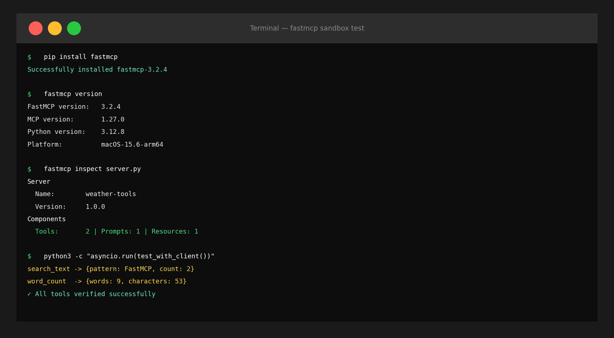

从零开始实现MCP（Model Context Protocol）服务器比想象中要麻烦。你得处理stdio传输，序列化JSON-RPC 2.0，再把每个处理器逐一注册。如果你走过用Streamable HTTP直接实现MCP服务器的过程，就知道那种感觉："我只是想添加一个AI工具，为什么需要这么多样板代码？"

FastMCP正是为了解决这个问题而生的框架。今天，我在沙盒中用pip安装，并在30分钟内启动了一个实际可用的MCP服务器。

## 它到底是什么：MCP SDK之上的一层

FastMCP是构建在MCP Python SDK之上的高层框架，类似于Express.js封装Node的http模块。官方描述：「The fast, Pythonic way to build MCP servers and clients」。实际用下来，这句话是准确的。

先确认版本：

```
$ fastmcp version

FastMCP version:   3.2.4
MCP version:       1.27.0
Python version:    3.12.8
Platform:          macOS-15.6-arm64
```

我之前在待办列表里记的是「v2.0」，但已经到了3.x。MCP协议本身也到了1.27.0。这个版本差距说明：API发生了变化，文档未必跟上了。我不得不通过实际运行代码来验证，而不是相信旧文章。

## 安装和第一个服务器: 真的就这些

```bash
pip install fastmcp
```

安装大约十秒。下面是我在沙盒中构建的第一个服务器，两个天气相关工具：

```python
from fastmcp import FastMCP
from datetime import datetime

mcp = FastMCP("weather-tools", version="1.0.0")

@mcp.tool()
def get_current_time(timezone: str = "UTC") -> str:
    """返回当前时间。"""
    return f"当前时间 ({timezone}): {datetime.now().strftime('%Y-%m-%d %H:%M:%S')}"

@mcp.tool()
def calculate_temp(celsius: float) -> dict:
    """将摄氏度转换为华氏度和开尔文。"""
    return {
        "celsius": celsius,
        "fahrenheit": round(celsius * 9/5 + 32, 2),
        "kelvin": round(celsius + 273.15, 2)
    }

@mcp.resource("data://server-info")
def server_info() -> str:
    """返回服务器信息。"""
    return "FastMCP 3.x 天气服务器"

@mcp.prompt()
def weather_analysis(location: str) -> str:
    """天气分析提示模板。"""
    return f"分析{location}的天气并推荐合适的穿着。"

if __name__ == "__main__":
    mcp.run()  # 以stdio模式运行
```

就这些。给Python函数添加一个装饰器，它就成了MCP工具。类型提示自动转换为JSON Schema传递给Claude。

用CLI检查服务器配置：

```
$ fastmcp inspect server.py

Server
  Name:         weather-tools
  Version:      1.0.0
  Generation:   2

Components
  Tools:        2
  Prompts:      1
  Resources:    1
  Templates:    0
```

## 三个核心构建块：Tool、Resource、Prompt

FastMCP有三个核心概念。区分清楚这三者是设计好服务器的第一步。

**@mcp.tool()**: Claude直接调用的函数。接收参数、执行操作、返回结果。搜索、计算、文件操作、API调用等都放这里。当我想让Claude直接操作我的文件系统或API时，用`@mcp.tool()`。

**@mcp.resource()**: 只读数据源。用`data://`、`file://`、`https://`等URI注册，Claude将其作为上下文读取。与工具不同，这是「读取」而非「执行」的概念。数据库模式、配置文件、文档等放这里，会进入Claude的上下文窗口。

**@mcp.prompt()**: 可复用的提示模板。接收参数，返回结构化的提示消息。在Claude Desktop或claude.ai中可以像斜杠命令一样使用。

Tool和Resource的区别让初学者困惑。我的标准很简单：**有副作用就是Tool，只读就是Resource**。

## 用Context向客户端发送进度信息

当工具执行耗时操作时，可以实时向客户端推送进度。添加`Context`参数，FastMCP自动注入。

```python
from fastmcp import FastMCP, Context

mcp = FastMCP("dev-tools")

@mcp.tool()
async def list_files(directory: str, ctx: Context) -> list[str]:
    """返回指定目录的文件列表。"""
    import os
    await ctx.info(f"正在读取目录: {directory}")  # 向客户端发送日志
    
    try:
        files = os.listdir(directory)
        await ctx.report_progress(100, 100, "complete")  # 报告进度
        return sorted(files)
    except FileNotFoundError:
        raise ValueError(f"目录不存在: {directory}")
```

我在沙盒中实际运行，确认了`ctx.info()`确实向客户端实时发送日志：

```
INFO  Received INFO from server: {'msg': '正在读取目录: /tmp', 'extra': None}
```

这在Claude Desktop中运行时，用户可以实时看到工具执行的步骤。从UX角度来看，这是相当重要的功能。

## 用FastMCP Client测试

不需要实际的Claude Desktop就能测试服务器。FastMCP提供了进程内客户端。在实现智能体工作流模式时，这种方式也能让测试保持自包含。

```python
import asyncio
from fastmcp import FastMCP
from fastmcp.client import Client

mcp = FastMCP("dev-tools")

@mcp.tool()
def search_text(text: str, pattern: str) -> dict:
    """在文本中搜索模式。"""
    import re
    matches = re.findall(pattern, text)
    return {"pattern": pattern, "matches": matches, "count": len(matches)}

@mcp.tool()
def word_count(text: str) -> dict:
    """返回单词数、字符数和行数。"""
    words = text.split()
    return {
        "words": len(words),
        "characters": len(text),
        "lines": len(text.splitlines())
    }

async def test():
    async with Client(mcp) as client:
        tools = await client.list_tools()
        print(f"已注册工具 ({len(tools)}个):")
        for t in tools:
            print(f"  [{t.name}] {t.description}")
        
        result = await client.call_tool("search_text", {
            "text": "FastMCP is fast. FastMCP is easy.",
            "pattern": "FastMCP"
        })
        print(f"\nsearch_text结果: {result.data}")
        # → {'pattern': 'FastMCP', 'matches': ['FastMCP', 'FastMCP'], 'count': 2}
        
        result2 = await client.call_tool("word_count", {
            "text": "Hello World from FastMCP 3.x"
        })
        print(f"word_count结果: {result2.data}")
        # → {'words': 5, 'characters': 27, 'lines': 1}

asyncio.run(test())
```

通过`result.data`直接访问结构化返回值。实际运行，零错误。



## 以HTTP服务器方式远程部署

除了本地stdio模式，还可以作为HTTP服务器运行。在Cursor实例之间共享MCP服务器或远程部署时很有用。

```python
# HTTP模式（默认端口8000）
if __name__ == "__main__":
    mcp.run(transport="http", host="0.0.0.0", port=8000)
```

```bash
# 或直接用uvicorn运行
uvicorn server:mcp.http_app() --host 0.0.0.0 --port 8000
```

FastMCP的HTTP应用基于Starlette（内部是`StarletteWithLifespan`），可以挂载到FastAPI应用中：

```python
from fastapi import FastAPI
from fastmcp import FastMCP

app = FastAPI()
mcp = FastMCP("my-tools")

@mcp.tool()
def my_tool() -> str:
    return "result"

# 将MCP服务器挂载到FastAPI应用
app.mount("/mcp", mcp.http_app())
```

Claude Desktop连接HTTP服务器的配置很简单：

```json
{
  "mcpServers": {
    "my-tools": {
      "url": "http://localhost:8000/mcp/"
    }
  }
}
```

## fastmcp CLI: 开发工作流中的实用命令

FastMCP附带CLI，我一开始不知道。运行`fastmcp --help`后发现功能相当丰富：

```
Commands:
  inspect      — 输出服务器组件摘要
  list         — 列出已注册的工具
  call         — 直接调用工具（调试用）
  install      — 自动注册到Claude Desktop / Cursor
  dev          — 启动带热重载的开发服务器
  discover     — 发现编辑器中配置的MCP服务器
  run          — 运行服务器
```

`fastmcp install server.py --client claude`据说会自动修改Claude Desktop配置，不用再手动编辑JSON。不过我没能在沙盒环境中直接测试（没有安装Claude Desktop），`--client`选项修改的具体路径建议查阅官方文档。

`fastmcp dev`看起来更实用。开发时代码修改不需要手动重启服务器。

## 类型提示就是API Schema

FastMCP中让我印象最深的功能：类型提示自动转换为JSON Schema。使用原始SDK，你需要为每个工具手写`inputSchema`字典。FastMCP将这个任务交给Python的类型系统来完成。

```python
from typing import Literal
from pydantic import BaseModel

class FileFilter(BaseModel):
    extension: str
    min_size_kb: int = 0
    exclude_hidden: bool = True

@mcp.tool()
def list_files_advanced(
    directory: str,
    filter: FileFilter | None = None,
    sort_by: Literal["name", "size", "modified"] = "name",
    limit: int = 50
) -> list[dict]:
    """返回带过滤器和排序选项的文件列表。"""
    import os
    files = []
    for f in os.scandir(directory):
        if filter and filter.exclude_hidden and f.name.startswith("."):
            continue
        if filter and not f.name.endswith(f".{filter.extension}"):
            continue
        info = f.stat()
        size_kb = info.st_size / 1024
        if filter and size_kb < filter.min_size_kb:
            continue
        files.append({"name": f.name, "size_kb": round(size_kb, 2), "modified": info.st_mtime})
    key_map = {"name": "name", "size": "size_kb", "modified": "modified"}
    files.sort(key=lambda x: x[key_map[sort_by]])
    return files[:limit]
```

用`@mcp.tool()`注册这个函数后，Claude自动知道`FileFilter`的结构、`sort_by`的有效值（name/size/modified）以及`limit`的默认值。支持Pydantic模型，所以复杂的嵌套输入也能直接使用。

文档字符串自动成为Claude看到的工具描述。一个写得好的docstring就是你发给模型的使用说明书。

## 实战示例：代码分析MCP服务器

这是一个我会实际使用的例子，分析Python文件的开发工具MCP服务器：

```python
from fastmcp import FastMCP, Context
import ast
import os

mcp = FastMCP("code-analyzer", version="1.0.0")

@mcp.tool()
async def analyze_python_file(filepath: str, ctx: Context) -> dict:
    """用AST分析Python文件，返回函数和类的列表。"""
    await ctx.info(f"正在分析: {filepath}")
    if not os.path.exists(filepath):
        raise ValueError(f"文件不存在: {filepath}")
    with open(filepath, "r", encoding="utf-8") as f:
        source = f.read()
    tree = ast.parse(source)
    functions, classes = [], []
    for node in ast.walk(tree):
        if isinstance(node, ast.FunctionDef):
            functions.append({
                "name": node.name, "line": node.lineno,
                "args": [a.arg for a in node.args.args],
                "docstring": ast.get_docstring(node)
            })
        elif isinstance(node, ast.ClassDef):
            classes.append({"name": node.name, "line": node.lineno})
    await ctx.report_progress(100, 100, "complete")
    return {"total_lines": source.count("\n") + 1, "functions": functions, "classes": classes}

@mcp.tool()
def count_todo_comments(filepath: str) -> dict:
    """查找文件中的TODO/FIXME/HACK注释。"""
    markers = ["TODO", "FIXME", "HACK", "XXX"]
    results = {m: [] for m in markers}
    with open(filepath, "r", encoding="utf-8") as f:
        for i, line in enumerate(f, 1):
            for marker in markers:
                if f"# {marker}" in line:
                    results[marker].append({"line": i, "text": line.strip()})
    return {k: v for k, v in results.items() if v}

@mcp.resource("data://project-structure")
def project_structure() -> str:
    """返回当前目录的Python文件列表。"""
    py_files = []
    for root, dirs, files in os.walk("."):
        dirs[:] = [d for d in dirs if not d.startswith(".")]
        for f in files:
            if f.endswith(".py"):
                py_files.append(os.path.join(root, f))
    return "\n".join(py_files[:50])

if __name__ == "__main__":
    mcp.run()
```

将这个服务器连接到Claude Desktop后，可以用自然语言问：「显示这个文件的所有类」或「有多少个TODO注释？」用户不需要写一行Python。这就是MCP工具服务器的意义所在。

## 与直接使用MCP SDK相比有什么不同

与直接用Streamable HTTP实现MCP服务器相比，差异很明显。

直接实现：
- 创建`Server`实例
- 分别注册`@server.list_tools()` / `@server.call_tool()`
- 手动解析输入参数
- 用`anyio.run()` + `stdio_server()`组合运行

FastMCP：
- 一个`FastMCP`实例
- `@mcp.tool()`直接将函数注册为工具
- 从类型提示自动生成JSON Schema
- `mcp.run()`一行搞定

代码行数减少是次要的。核心是**可以专注于业务逻辑**，不需要关心传输层如何工作。

不过我也感受到了限制。FastMCP以控制自由度为代价换取便利性。如果需要自定义低级MCP消息、使用非标准传输，就得从FastMCP的抽象层下面重新挖出被隐藏的东西。这种情况还是直接用MCP Python SDK，就像MCP代码执行实战案例那种需要精细控制的场景。

## 可行性判断: 什么时候选FastMCP

我的结论是：

**使用FastMCP的场景**：构建与标准MCP客户端（Claude、Cursor、VS Code）集成的服务器时。特别是快速原型化团队内AI工具，或者将现有Python函数作为MCP工具暴露时。

**直接使用SDK的场景**：需要自定义传输、非标准消息格式，或者FastMCP不支持的MCP功能时。像需要精细控制的MCP代码执行场景一样。

FastMCP有一点令人遗憾。3.x版本代码变化快，文档没有完全跟上。文档里像`get_tools()`这样的方法看似存在，但实际已经改成`list_tools()`了。建议养成直接看源代码或`dir(mcp)`的习惯，而不是依赖旧文章。

上线前还有一点。建议同时看看用MCP Gateway控制智能体流量的方法。暴露服务器后，迟早需要控制哪些工具被如何调用的层。

## 30分钟跑起一个服务器，然后呢

FastMCP 3.x是Python开发者构建MCP服务器的最快方式。`pip install fastmcp`一行，`@mcp.tool()`一个装饰器，`mcp.run()`一行。30分钟内就能构建Claude Desktop可调用的AI工具服务器。

MCP生态系统正在快速成熟。我的MCP服务器工具包涵盖了已有的工具。构建之前先看看是否已有现成的，但如果需要自定义，FastMCP让这件事真的很快。

今天在沙盒中确认的版本：FastMCP 3.2.4、MCP 1.27.0。这个领域变化很快 — 正式使用前请查阅[FastMCP官方文档](https://gofastmcp.com)确认最新API。
