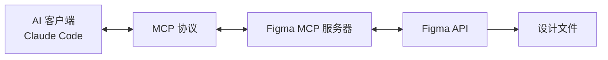
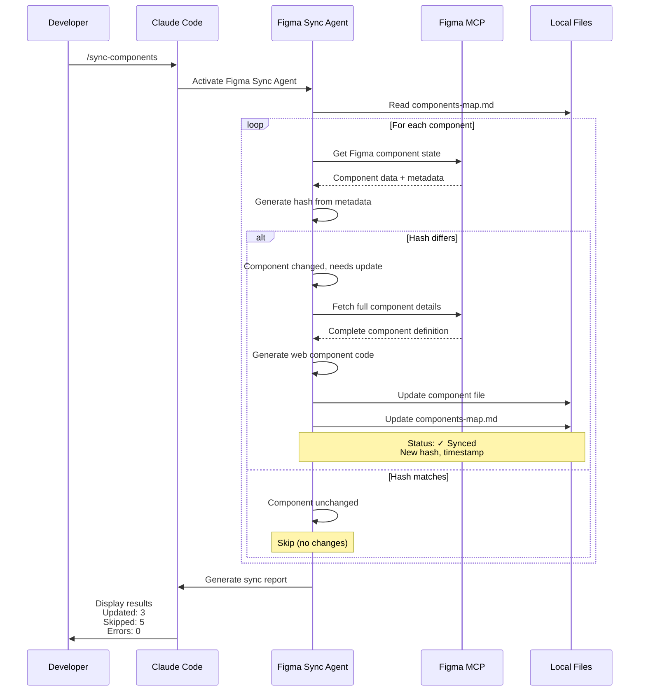

## 概述

设计与代码之间的鸿沟是所有开发团队都面临的永恒挑战。当设计师在 Figma 中修改按钮时,开发者需要手动更新 CSS。当组件库更新时,需要在所有项目中逐一反映变更。

本文通过实战研究介绍<strong>如何利用 Figma MCP(Model Context Protocol,模型上下文协议)将设计系统自动转换为 Web 组件并持续同步</strong>。这不是简单的理论,而是 2025 年现在实际可运行的生产级解决方案。

## 理解 Figma MCP

### 什么是 Model Context Protocol?

<strong>Model Context Protocol(MCP,模型上下文协议)</strong>是 Anthropic 开发的开放标准,允许 AI 代理连接外部工具和数据源。Figma 的 MCP 实现使 AI 代理能够直接访问 Figma 文件的设计上下文。

<strong>官方说明:</strong>
> "MCP 是一个开源标准,定义了不同 AI 代理和应用程序如何相互通信或与 Figma 等外部系统通信。"



### 两种部署模式

Figma MCP 可以通过两种方式使用:

#### 1. Remote Server(Figma 托管)

```javascript
// Claude Desktop 配置
{
  "mcpServers": {
    "figma-remote": {
      "url": "https://mcp.figma.com/mcp"
    }
  }
}
```

<strong>特点:</strong>
- 基于 OAuth 的认证(一键设置)
- 无需本地安装
- 需要 Professional/Organization/Enterprise 计划 + Dev seat
- 应用 Tier 1 Figma REST API 限制

#### 2. Desktop Server(本地)

```javascript
// VS Code/Cursor 配置
{
  "mcpServers": {
    "figma-desktop": {
      "url": "http://127.0.0.1:3845/mcp"
    }
  }
}
```

<strong>特点:</strong>
- 在本地运行 `http://127.0.0.1:3845/mcp`
- 需要最新版 Figma 桌面应用
- 使用本地认证
- 所有计划类型均可使用
- Starter 计划每月限制 6 次工具调用

### 认证方法

<strong>Personal Access Token(推荐):</strong>

```bash
# 设置环境变量
export FIGMA_API_KEY="your-personal-access-token"

# 或作为 CLI 参数传递
--figma-api-key "your-token"
```

<strong>令牌发放方法:</strong>
1. 进入 Figma 账户设置
2. 选择 "Personal Access Tokens" 菜单
3. 使用所需权限创建新令牌
4. 安全保存令牌(像密码一样对待)

### 可用工具和 API

Figma MCP 服务器为 AI 代理提供以下工具:

<strong>设计上下文工具:</strong>
- `get_figma_file` - 查询完整 Figma 文件结构
- `get_node` - 获取特定设计节点详细信息
- `get_components` - 访问组件库
- `get_styles` - 查询设计样式
- `get_variables` - 访问设计令牌/变量
- `get_comments` - 读取文件注释
- `search_files` - 在团队内搜索文件

<strong>Code Connect 集成:</strong>
- 将 Figma 组件连接到实际代码
- 提供生产就绪的代码片段
- 将组件属性映射到代码 props
- 通过 GitHub Actions 自动同步

## 构建 Figma 组件库

### Atomic Design 结构

为了系统化地组织设计系统,遵循 Atomic Design 原则:

```
Design System File
├── 📄 Foundations(基础)
│   ├── Colors(颜色)
│   ├── Typography(排版)
│   ├── Spacing(间距)
│   └── Grid(网格)
├── 📄 Atoms(原子)
│   ├── Buttons(按钮)
│   ├── Icons(图标)
│   └── Inputs(输入)
├── 📄 Molecules(分子)
│   ├── Form Fields(表单字段)
│   ├── Cards(卡片)
│   └── Navigation Items(导航项)
└── 📄 Organisms(有机体)
    ├── Headers(头部)
    ├── Forms(表单)
    └── Modals(模态框)
```

<strong>核心原则:</strong>
> "在 Figma 文件中为不同类别的组件创建单独的页面。例如:'Atoms'、'Molecules'、'Organisms'"

### 命名规范(Slash Notation,斜杠表示法)

一致的命名规范决定了设计系统的可扩展性和可维护性:

```
Component/Variant/State
└─ Button/Primary/Default
└─ Button/Primary/Hover
└─ Button/Primary/Disabled
└─ Button/Secondary/Default
```

<strong>优点:</strong>
- 在 Assets 面板中自动排序
- 下拉菜单中清晰的层级结构
- 便于搜索和替换
- 与代码命名规范保持一致

<strong>最佳实践指南:</strong>
- 使用描述性和一致的名称
- 记录命名结构
- 避免使用缩写
- 一致使用 PascalCase 或 kebab-case

### 组件属性和 Variants

<strong>现代方法(2021 年后):</strong>

```
Properties:
├── Type: [Primary, Secondary, Tertiary]
├── Size: [Small, Medium, Large]
├── State: [Default, Hover, Disabled]
└── Icon: [Boolean]
```

<strong>Variants vs Properties:</strong>
- <strong>Variants:</strong> 视觉差异(Primary vs Secondary)
- <strong>Properties:</strong> 行为切换(Icon: Yes/No)
- <strong>最佳实践:</strong> 结合两者实现灵活组件

### 库组织策略

<strong>单库方法(小型团队):</strong>

```
Design-System.fig
└── 所有组件、样式、变量
```

<strong>多库方法(大型团队):</strong>

```
Design-System-Foundations.fig
Design-System-Components.fig
Design-System-Patterns.fig
Design-System-Icons.fig
```

<strong>Figma 的建议:</strong>
> "Figma 通常建议团队在可管理范围内保持文件尽可能具体和集中。"

## 原生 JavaScript Web 组件

### 2025 年浏览器支持现状

<strong>重要消息:不再需要 polyfill!</strong>

截至 2025 年,所有主流浏览器都完全支持 Web Components 标准:

- ✅ Chrome: 100% 支持
- ✅ Firefox: 100% 支持
- ✅ Safari: 100% 支持
- ✅ Edge: 100% 支持

<strong>官方声明:</strong>
> "截至 2025 年,所有主流浏览器(Chrome、Firefox、Safari、Edge)都完全支持 Web Components 标准,无需 polyfill。"

### Custom Elements API

Web 组件的核心是 Custom Elements API:

```javascript
// 基本按钮组件示例
class MyButton extends HTMLElement {
  constructor() {
    super();
    // 组件初始化
  }

  connectedCallback() {
    // 元素添加到 DOM 时调用
    this.render();
  }

  disconnectedCallback() {
    // 从 DOM 移除时清理
  }

  attributeChangedCallback(name, oldValue, newValue) {
    // 响应属性变化
    this.render();
  }

  static get observedAttributes() {
    return ['size', 'variant', 'disabled'];
  }

  render() {
    this.innerHTML = `
      <button class="btn btn--${this.getAttribute('variant')}">
        <slot></slot>
      </button>
    `;
  }
}

// 注册自定义元素
customElements.define('my-button', MyButton);
```

<strong>使用方法:</strong>

```html
<my-button variant="primary" size="large">
  点击这里
</my-button>
```

### 利用 Shadow DOM

Shadow DOM 通过封装样式和 DOM 提供真正的组件隔离:

```javascript
class MyCard extends HTMLElement {
  constructor() {
    super();
    // 附加 Shadow DOM
    this.attachShadow({ mode: 'open' });
  }

  connectedCallback() {
    this.shadowRoot.innerHTML = `
      <style>
        :host {
          display: block;
          border: 1px solid var(--card-border);
          border-radius: var(--card-radius);
          padding: var(--card-padding);
        }

        ::slotted(h2) {
          margin-top: 0;
          color: var(--card-title-color);
        }
      </style>

      <div class="card">
        <slot name="header"></slot>
        <slot></slot>
        <slot name="footer"></slot>
      </div>
    `;
  }
}

customElements.define('my-card', MyCard);
```

<strong>Shadow DOM 的优缺点:</strong>

<strong>优点:</strong>
- 完美的 CSS 封装
- 无样式冲突
- 真正的组件隔离
- 框架独立

<strong>缺点:</strong>
- 无法从外部设置样式(这是有意的设计)
- 全局样式不会渗透
- 调试可能更困难
- 可访问性考虑

### 通过 CSS Custom Properties 集成设计令牌

将设计令牌作为 CSS 变量使用可保持 Figma 与代码之间的一致性:

```javascript
class MyButton extends HTMLElement {
  connectedCallback() {
    this.attachShadow({ mode: 'open' });
    this.shadowRoot.innerHTML = `
      <style>
        :host {
          --button-bg: var(--primary-color, #007bff);
          --button-text: var(--on-primary, white);
          --button-padding: var(--space-md, 12px 24px);
        }

        button {
          background: var(--button-bg);
          color: var(--button-text);
          padding: var(--button-padding);
          border: none;
          border-radius: var(--radius-md, 4px);
          cursor: pointer;
          font-size: var(--text-md, 16px);
          font-weight: var(--weight-medium, 500);
          transition: background 0.2s ease;
        }

        button:hover {
          background: var(--button-bg-hover, #0056b3);
        }

        button:disabled {
          background: var(--button-bg-disabled, #6c757d);
          cursor: not-allowed;
          opacity: 0.6;
        }
      </style>

      <button>
        <slot></slot>
      </button>
    `;
  }
}
```

## Figma → Web 组件转换

### 组件映射文件系统

与传统的手动转换不同,构建<strong>组件映射文件(Component Mapping File)</strong>系统可实现持续同步。

#### 映射文件结构

```markdown
<!-- components-map.md -->
# Component Mapping

## Button Component
- Figma URL: https://figma.com/file/ABC123/Design-System?node-id=1:234
- Component Path: src/components/Button.ts
- Last Synced: 2025-11-10T10:30:00Z
- Version Hash: abc123def456
- Status: ✓ Synced

## Card Component
- Figma URL: https://figma.com/file/ABC123/Design-System?node-id=2:345
- Component Path: src/components/Card.ts
- Last Synced: 2025-11-09T15:20:00Z
- Version Hash: xyz789abc123
- Status: ⚠ Needs Update

## Input Component
- Figma URL: https://figma.com/file/ABC123/Design-System?node-id=3:456
- Component Path: src/components/Input.ts
- Last Synced: 2025-11-08T09:15:00Z
- Version Hash: def456ghi789
- Status: ✓ Synced
```

<strong>映射文件的优点:</strong>
- 作为单一真实来源跟踪所有组件
- 通过版本哈希检测变更
- 记录最后同步时间戳
- 同时支持手动审查和自动化

### 提取 Figma 组件元数据

通过 MCP 获取 Figma 组件的元数据:

```typescript
// scripts/extract-figma-metadata.ts
import axios from 'axios';
import crypto from 'crypto';

interface FigmaComponent {
  id: string;
  name: string;
  description?: string;
  properties?: Record<string, any>;
  lastModified: string;
}

async function getFigmaComponent(fileKey: string, nodeId: string): Promise<FigmaComponent> {
  const response = await axios.get(
    `https://api.figma.com/v1/files/${fileKey}/nodes?ids=${nodeId}`,
    {
      headers: {
        'X-Figma-Token': process.env.FIGMA_API_KEY
      }
    }
  );

  const node = response.data.nodes[nodeId];
  return {
    id: nodeId,
    name: node.document.name,
    description: node.document.description,
    properties: extractProperties(node.document),
    lastModified: response.data.lastModified
  };
}

function extractProperties(node: any): Record<string, any> {
  // 提取 Figma 组件的属性(variants, properties)
  const properties: Record<string, any> = {};

  if (node.componentPropertyDefinitions) {
    for (const [key, prop] of Object.entries(node.componentPropertyDefinitions)) {
      properties[key] = prop;
    }
  }

  return properties;
}

// 生成版本哈希(用于变更检测)
function generateHash(component: FigmaComponent): string {
  const content = JSON.stringify({
    name: component.name,
    properties: component.properties,
    lastModified: component.lastModified
  });

  return crypto.createHash('sha256').update(content).digest('hex').substring(0, 12);
}
```

### 变更检测逻辑

比较组件的当前状态与本地状态,判断是否需要更新:

```typescript
// scripts/check-component-changes.ts
interface ComponentMapping {
  name: string;
  figmaUrl: string;
  componentPath: string;
  lastSynced: string;
  versionHash: string;
  status: 'synced' | 'needs-update' | 'new';
}

async function needsUpdate(
  mapping: ComponentMapping,
  figmaComponent: FigmaComponent
): Promise<boolean> {
  const currentHash = generateHash(figmaComponent);

  // 如果哈希不同则需要更新
  if (currentHash !== mapping.versionHash) {
    console.log(`Component "${mapping.name}" has changes`);
    console.log(`  Old hash: ${mapping.versionHash}`);
    console.log(`  New hash: ${currentHash}`);
    return true;
  }

  return false;
}

async function scanAllComponents(mappingFile: string): Promise<ComponentMapping[]> {
  const mappings = await parseComponentMap(mappingFile);
  const componentsToUpdate: ComponentMapping[] = [];

  for (const mapping of mappings) {
    const { fileKey, nodeId } = parseFigmaUrl(mapping.figmaUrl);
    const figmaComponent = await getFigmaComponent(fileKey, nodeId);

    if (await needsUpdate(mapping, figmaComponent)) {
      componentsToUpdate.push({
        ...mapping,
        status: 'needs-update'
      });
    }
  }

  return componentsToUpdate;
}
```

### 提取和转换设计令牌

将 Figma Variables 转换为 CSS 变量:

```typescript
// scripts/extract-design-tokens.ts
interface DesignToken {
  name: string;
  value: string;
  type: 'color' | 'dimension' | 'fontFamily' | 'fontWeight' | 'number';
  mode?: string;
}

async function extractDesignTokens(fileKey: string): Promise<DesignToken[]> {
  const response = await axios.get(
    `https://api.figma.com/v1/files/${fileKey}/variables/local`,
    {
      headers: {
        'X-Figma-Token': process.env.FIGMA_API_KEY
      }
    }
  );

  const tokens: DesignToken[] = [];
  const collections = response.data.meta.variableCollections;

  for (const collection of Object.values(collections) as any[]) {
    for (const variable of collection.variables || []) {
      tokens.push({
        name: variable.name,
        value: variable.resolvedValue,
        type: variable.resolvedType,
        mode: collection.defaultModeId
      });
    }
  }

  return tokens;
}

function tokensToCSS(tokens: DesignToken[]): string {
  let css = ':root {\n';

  for (const token of tokens) {
    const varName = token.name.toLowerCase().replace(/\s+/g, '-');
    css += `  --${varName}: ${token.value};\n`;
  }

  css += '}\n';
  return css;
}
```

### 组件代码生成

基于 Figma 组件元数据生成 Web 组件代码:

```typescript
// scripts/generate-component-code.ts
function generateWebComponent(figmaComponent: FigmaComponent): string {
  const className = toPascalCase(figmaComponent.name);
  const tagName = toKebabCase(figmaComponent.name);

  return `
class ${className} extends HTMLElement {
  static get observedAttributes() {
    return [${generateAttributes(figmaComponent.properties)}];
  }

  constructor() {
    super();
    this.attachShadow({ mode: 'open' });
  }

  connectedCallback() {
    this.render();
  }

  attributeChangedCallback(name, oldValue, newValue) {
    if (oldValue !== newValue) {
      this.render();
    }
  }

  render() {
    this.shadowRoot.innerHTML = \`
      <style>
        ${generateStyles(figmaComponent)}
      </style>

      <div class="${tagName}">
        <slot></slot>
      </div>
    \`;
  }
}

customElements.define('${tagName}', ${className});
`.trim();
}

function generateAttributes(properties: Record<string, any>): string {
  return Object.keys(properties || {})
    .map(key => `'${toKebabCase(key)}'`)
    .join(', ');
}

function generateStyles(component: FigmaComponent): string {
  // 将 Figma 样式信息转换为 CSS
  return `
    :host {
      display: block;
    }

    .${toKebabCase(component.name)} {
      /* 从 Figma 提取的样式 */
    }
  `;
}
```

## 实现持续同步

### Claude Code 自动化集成

利用 Claude Code 可以自动化 Figma 组件同步流程。通过代理和斜杠命令智能检测和更新变更。

#### 定义 Figma Sync Agent

创建 `.claude/agents/figma-sync.md` 文件定义专门代理:

```markdown
# Figma Component Sync Agent

您是专门同步 Figma 组件和 Web 组件的代理。

## 可用工具

- `mcp__figma__get_component` - 查询 Figma 组件
- `mcp__figma__get_node` - Figma 节点详细信息
- `Read`, `Write`, `Edit` - 文件操作
- `Bash` - 脚本执行

## 工作流程

1. 读取 `components-map.md` 文件
2. 查询每个组件的当前 Figma 状态
3. 与本地 Web 组件比较
4. 如有变更则生成更新的代码
5. 使用新哈希和时间戳更新 `components-map.md`

## 状态比较逻辑

```typescript
async function compareComponentState(
  figmaUrl: string,
  localPath: string,
  lastHash: string
): Promise<{ needsUpdate: boolean; newHash?: string }> {
  // 1. 从 Figma URL 提取文件键和节点 ID
  const { fileKey, nodeId } = parseFigmaUrl(figmaUrl);

  // 2. 通过 MCP 获取 Figma 组件状态
  const figmaComponent = await getFigmaComponent(fileKey, nodeId);

  // 3. 生成并比较哈希
  const currentHash = generateComponentHash(figmaComponent);

  if (currentHash !== lastHash) {
    return { needsUpdate: true, newHash: currentHash };
  }

  return { needsUpdate: false };
}
```

## 选择性更新策略

- ✓ 哈希不同时:重新生成组件
- ✓ 哈希相同时:跳过(输出日志)
- ✓ 新组件:添加到映射文件
- ✓ 删除的组件:显示警告

## 结果报告

同步后生成包含以下信息的详细报告:
- 更新的组件列表
- 跳过的组件(已是最新)
- 发生的错误
- 总执行时间
```

#### 实现斜杠命令

创建 `.claude/commands/sync-components.md` 文件,通过简单命令执行同步:

```markdown
# Sync Components Command

读取 `components-map.md` 文件并同步所有状态为 "Needs Update" 的组件。

## 使用方法

```bash
/sync-components
```

## 操作流程

1. 解析 `components-map.md`
2. 检查每个组件的状态
3. 仅处理需要更新的组件
4. 提交变更(可选)

## 委托

此命令将工作委托给 Figma Sync Agent:

```
@figma-sync "同步 components-map.md 中的所有组件。
仅更新有变更的组件,跳过最新状态的组件。"
```

## 选项

- `--all`:强制更新所有组件,不考虑状态
- `--component <name>`:仅同步特定组件
- `--dry-run`:仅模拟执行,不实际修改文件
```

### 智能更新逻辑

实现变更检测和选择性更新:

```typescript
// scripts/smart-sync.ts
interface SyncResult {
  updated: string[];
  skipped: string[];
  errors: Array<{ component: string; error: string }>;
  duration: number;
}

async function smartSync(mappingFile: string = 'components-map.md'): Promise<SyncResult> {
  const startTime = Date.now();
  const result: SyncResult = {
    updated: [],
    skipped: [],
    errors: [],
    duration: 0
  };

  // 1. 解析映射文件
  const mappings = await parseComponentMap(mappingFile);
  console.log(`Found ${mappings.length} components to check`);

  // 2. 检查每个组件
  for (const mapping of mappings) {
    try {
      const { fileKey, nodeId } = parseFigmaUrl(mapping.figmaUrl);
      const figmaComponent = await getFigmaComponent(fileKey, nodeId);
      const currentHash = generateHash(figmaComponent);

      // 3. 比较哈希
      if (currentHash === mapping.versionHash) {
        console.log(`✓ ${mapping.name} is up to date (skipped)`);
        result.skipped.push(mapping.name);
        continue;
      }

      // 4. 需要更新
      console.log(`⚠ ${mapping.name} needs update`);
      console.log(`  Old: ${mapping.versionHash}`);
      console.log(`  New: ${currentHash}`);

      // 5. 重新生成组件代码
      const componentCode = generateWebComponent(figmaComponent);
      await writeFile(mapping.componentPath, componentCode);

      // 6. 更新映射文件
      await updateComponentMapping(mappingFile, mapping.name, {
        versionHash: currentHash,
        lastSynced: new Date().toISOString(),
        status: 'synced'
      });

      result.updated.push(mapping.name);
      console.log(`✓ ${mapping.name} updated successfully`);

    } catch (error) {
      console.error(`✗ ${mapping.name} failed:`, error.message);
      result.errors.push({
        component: mapping.name,
        error: error.message
      });
    }
  }

  result.duration = Date.now() - startTime;
  return result;
}

// 更新映射文件
async function updateComponentMapping(
  mappingFile: string,
  componentName: string,
  updates: Partial<ComponentMapping>
): Promise<void> {
  const content = await readFile(mappingFile, 'utf-8');
  const lines = content.split('\n');

  let inComponent = false;
  const updatedLines: string[] = [];

  for (const line of lines) {
    if (line.startsWith(`## ${componentName}`)) {
      inComponent = true;
      updatedLines.push(line);
      continue;
    }

    if (inComponent && line.startsWith('## ')) {
      inComponent = false;
    }

    if (inComponent) {
      if (line.startsWith('- Last Synced:') && updates.lastSynced) {
        updatedLines.push(`- Last Synced: ${updates.lastSynced}`);
      } else if (line.startsWith('- Version Hash:') && updates.versionHash) {
        updatedLines.push(`- Version Hash: ${updates.versionHash}`);
      } else if (line.startsWith('- Status:') && updates.status) {
        const statusIcon = updates.status === 'synced' ? '✓' : '⚠';
        const statusText = updates.status === 'synced' ? 'Synced' : 'Needs Update';
        updatedLines.push(`- Status: ${statusIcon} ${statusText}`);
      } else {
        updatedLines.push(line);
      }
    } else {
      updatedLines.push(line);
    }
  }

  await writeFile(mappingFile, updatedLines.join('\n'));
}
```

### 技能实现:状态比较

创建 `.claude/skills/component-comparison.md` 文件定义为可重用技能:

```markdown
# Component Comparison Skill

此技能比较 Figma 组件和本地 Web 组件的状态。

## 输入

- `figmaUrl`: Figma 组件 URL
- `localPath`: 本地组件文件路径
- `lastHash`: 最后已知的版本哈希

## 输出

```typescript
{
  needsUpdate: boolean;
  currentHash: string;
  changes?: {
    properties: string[];
    styles: string[];
    structure: boolean;
  };
}
```

## 实现

```typescript
async function compareComponent(
  figmaUrl: string,
  localPath: string,
  lastHash: string
) {
  // 1. 获取 Figma 组件
  const { fileKey, nodeId } = parseFigmaUrl(figmaUrl);
  const figmaComponent = await getFigmaComponent(fileKey, nodeId);

  // 2. 计算当前哈希
  const currentHash = generateHash(figmaComponent);

  // 3. 比较哈希
  if (currentHash === lastHash) {
    return { needsUpdate: false, currentHash };
  }

  // 4. 分析详细变更
  const localComponent = await readFile(localPath, 'utf-8');
  const changes = analyzeChanges(figmaComponent, localComponent);

  return {
    needsUpdate: true,
    currentHash,
    changes
  };
}
```

## 使用示例

```typescript
const result = await compareComponent(
  'https://figma.com/file/ABC123/Design?node-id=1:234',
  'src/components/Button.ts',
  'abc123def456'
);

if (result.needsUpdate) {
  console.log('Component needs update');
  console.log('Changes:', result.changes);
} else {
  console.log('Component is up to date');
}
```
```

### 基于 Webhook 的自动化(可选)

与 Claude Code 自动化配合使用 Figma Webhooks 可实现实时同步。

#### Webhook 事件类型

```javascript
// 可用的 Webhook 事件
{
  "FILE_UPDATE": "文件修改时触发",
  "FILE_VERSION_UPDATE": "创建新命名版本时",
  "FILE_DELETE": "文件删除时",
  "LIBRARY_PUBLISH": "设计库发布时",
  "PING": "Webhook 连接测试"
}
```

#### 创建 Webhook

```javascript
// 使用 Figma REST API
const axios = require('axios');

async function createWebhook() {
  const response = await axios.post(
    'https://api.figma.com/v2/webhooks',
    {
      event_type: 'LIBRARY_PUBLISH',
      team_id: 'YOUR_TEAM_ID',
      endpoint: 'https://your-server.com/webhook',
      passcode: 'YOUR_SECRET_PASSCODE',
      description: 'Design System Sync'
    },
    {
      headers: {
        'X-Figma-Token': process.env.FIGMA_API_KEY
      }
    }
  );

  return response.data;
}
```

#### 实现 Webhook 处理器

```javascript
// Node.js/Express Webhook 处理器
const express = require('express');
const crypto = require('crypto');
const { exec } = require('child_process');

const app = express();
app.use(express.json());

app.post('/figma-webhook', async (req, res) => {
  const { event_type, passcode, file_key } = req.body;

  // 1. 验证 Webhook 认证
  if (passcode !== process.env.FIGMA_WEBHOOK_SECRET) {
    return res.status(401).json({ error: 'Invalid passcode' });
  }

  // 2. 处理 PING 事件(创建 Webhook 时)
  if (event_type === 'PING') {
    return res.status(200).json({ message: 'Webhook verified' });
  }

  // 3. 处理 LIBRARY_PUBLISH 事件
  if (event_type === 'LIBRARY_PUBLISH') {
    console.log(`Design library updated: ${file_key}`);

    // 触发同步工作流
    try {
      // 选项 A: 触发 GitHub Actions 工作流
      await triggerGitHubAction(file_key);

      // 选项 B: 直接执行同步脚本
      // exec(`npm run sync-tokens -- --file=${file_key}`);

      res.status(200).json({ message: 'Sync initiated' });
    } catch (error) {
      console.error('Sync failed:', error);
      res.status(500).json({ error: 'Sync failed' });
    }
  }
});

async function triggerGitHubAction(fileKey) {
  const axios = require('axios');

  await axios.post(
    `https://api.github.com/repos/OWNER/REPO/actions/workflows/sync-figma.yml/dispatches`,
    {
      ref: 'main',
      inputs: {
        figma_file_key: fileKey
      }
    },
    {
      headers: {
        'Authorization': `Bearer ${process.env.GITHUB_TOKEN}`,
        'Accept': 'application/vnd.github.v3+json'
      }
    }
  );
}

app.listen(3000, () => {
  console.log('Webhook server listening on port 3000');
});
```

### GitHub Actions CI/CD 流水线

配置完整的自动化工作流:

````yaml
# .github/workflows/sync-figma-tokens.yml
name: Sync Figma Design Tokens

on:
  # 从 Webhook 触发
  repository_dispatch:
    types: [figma-library-publish]

  # 手动触发
  workflow_dispatch:
    inputs:
      figma_file_key:
        description: 'Figma file key to sync'
        required: false

  # 定期同步(每天凌晨 2 点)
  schedule:
    - cron: '0 2 * * *'

jobs:
  sync-tokens:
    runs-on: ubuntu-latest

    steps:
      # 1. 检出仓库
      - name: Checkout code
        uses: actions/checkout@v4
        with:
          token: ${{ secrets.GITHUB_TOKEN }}

      # 2. 设置 Node.js
      - name: Setup Node.js
        uses: actions/setup-node@v4
        with:
          node-version: '20'
          cache: 'npm'

      # 3. 安装依赖
      - name: Install dependencies
        run: npm ci

      # 4. 获取 Figma variables
      - name: Fetch Figma variables
        env:
          FIGMA_API_KEY: ${{ secrets.FIGMA_API_KEY }}
          FIGMA_FILE_KEY: ${{ github.event.inputs.figma_file_key || vars.DEFAULT_FIGMA_FILE_KEY }}
        run: |
          npm run fetch-figma-tokens

      # 5. 使用 Style Dictionary 转换令牌
      - name: Transform tokens
        run: npm run build-tokens

      # 6. 生成 Web 组件(如适用)
      - name: Generate components
        run: npm run generate-components

      # 7. 运行测试
      - name: Test components
        run: npm test

      # 8. 提交变更
      - name: Commit changes
        run: |
          git config user.name "Figma Sync Bot"
          git config user.email "bot@company.com"
          git add .
          git diff --staged --quiet || git commit -m "chore: sync design tokens from Figma [skip ci]"
          git push

      # 9. 创建 Pull Request(替代方案)
      - name: Create Pull Request
        if: github.ref != 'refs/heads/main'
        uses: peter-evans/create-pull-request@v5
        with:
          token: ${{ secrets.GITHUB_TOKEN }}
          commit-message: 'chore: sync design tokens from Figma'
          title: 'Design Tokens Update from Figma'
          body: |
            从 Figma 自动同步的设计令牌更新。

            **变更:**
            - 设计令牌更新
            - Web 组件重新生成
            - 组件样式更新

            请审查确认一切正常后合并。
          branch: figma-sync/${{ github.run_id }}
          base: main
````

### Figma 令牌获取脚本

```javascript
// scripts/fetch-figma-tokens.js
const axios = require('axios');
const fs = require('fs').promises;

async function fetchFigmaVariables() {
  const fileKey = process.env.FIGMA_FILE_KEY;
  const apiKey = process.env.FIGMA_API_KEY;

  console.log('Fetching Figma variables...');

  // 获取文件 variables
  const response = await axios.get(
    `https://api.figma.com/v1/files/${fileKey}/variables/local`,
    {
      headers: {
        'X-Figma-Token': apiKey
      }
    }
  );

  const variables = response.data.meta.variableCollections;

  // 转换为 Style Dictionary 格式
  const tokens = transformToTokens(variables);

  // 保存到文件
  await fs.writeFile(
    './design-tokens/figma-raw.json',
    JSON.stringify(tokens, null, 2)
  );

  console.log('✅ Figma variables fetched successfully');
}

function transformToTokens(variables) {
  const tokens = {};

  for (const [collectionId, collection] of Object.entries(variables)) {
    const collectionName = collection.name.toLowerCase();
    tokens[collectionName] = {};

    for (const variable of collection.variables) {
      const tokenPath = variable.name.split('/');
      let current = tokens[collectionName];

      for (let i = 0; i < tokenPath.length - 1; i++) {
        const segment = tokenPath[i];
        if (!current[segment]) current[segment] = {};
        current = current[segment];
      }

      const tokenName = tokenPath[tokenPath.length - 1];
      current[tokenName] = {
        value: variable.resolvedValue,
        type: variable.resolvedType
      };
    }
  }

  return tokens;
}

fetchFigmaVariables().catch(console.error);
```

### 基于轮询的替代方案

当无法使用 Webhook 时,可以使用定期同步方式:

```yaml
# 定期检查工作流
on:
  schedule:
    # 每 6 小时
    - cron: '0 */6 * * *'

  # 手动触发
  workflow_dispatch:

jobs:
  check-and-sync:
    runs-on: ubuntu-latest
    steps:
      - name: Get latest Figma version
        id: figma-version
        run: |
          VERSION=$(curl -H "X-Figma-Token: ${{ secrets.FIGMA_API_KEY }}" \
            "https://api.figma.com/v1/files/${{ vars.FIGMA_FILE_KEY }}" \
            | jq -r '.lastModified')
          echo "version=$VERSION" >> $GITHUB_OUTPUT

      - name: Check if update needed
        id: check-update
        run: |
          LAST_SYNC=$(cat .figma-last-sync || echo "")
          if [ "${{ steps.figma-version.outputs.version }}" != "$LAST_SYNC" ]; then
            echo "update-needed=true" >> $GITHUB_OUTPUT
          fi

      - name: Sync tokens
        if: steps.check-update.outputs.update-needed == 'true'
        run: npm run sync-tokens

      - name: Update last sync timestamp
        if: steps.check-update.outputs.update-needed == 'true'
        run: |
          echo "${{ steps.figma-version.outputs.version }}" > .figma-last-sync
          git add .figma-last-sync
          git commit -m "chore: update Figma sync timestamp"
          git push
```

## 实战实现示例

### 完整工作流(基于 Claude Code)



### 实用使用示例

#### 初始设置

在项目中设置组件映射系统:

```bash
# 1. 在项目根目录创建映射文件
touch components-map.md

# 2. 创建 Claude Agents 和 Commands 目录
mkdir -p .claude/agents .claude/commands .claude/skills

# 3. 创建脚本目录
mkdir -p scripts

# 4. 安装所需包
npm install --save-dev axios crypto
```

#### 初始化映射文件

```markdown
<!-- components-map.md -->
# Design System Component Mapping

此文件跟踪 Figma 设计系统组件与 Web 组件的映射。

## Button Component
- Figma URL: https://figma.com/file/ABC123/Design-System?node-id=1:234
- Component Path: src/components/ds-button.ts
- Last Synced: 2025-11-10T10:30:00Z
- Version Hash: abc123def456
- Status: ✓ Synced

## Card Component
- Figma URL: https://figma.com/file/ABC123/Design-System?node-id=2:345
- Component Path: src/components/ds-card.ts
- Last Synced: (not yet synced)
- Version Hash: (none)
- Status: ⚠ Needs Update
```

#### 使用 Claude Code 执行同步

```bash
# 开发者执行的命令
/sync-components
```

<strong>预期输出:</strong>

```
✓ Figma Sync Agent activated
✓ Reading components-map.md...
  Found 2 components to check

Checking Button Component...
  Fetching from Figma: ABC123/1:234
  Current hash: abc123def456
  Status: ✓ Up to date (skipped)

Checking Card Component...
  Fetching from Figma: ABC123/2:345
  Status: ⚠ Not yet synced
  Generating web component code...
  Writing to: src/components/ds-card.ts
  ✓ Component created successfully
  Updating components-map.md...
  New hash: xyz789abc123
  ✓ Mapping updated

--- Sync Report ---
Duration: 3.2s
Updated: 1 (Card Component)
Skipped: 1 (Button Component)
Errors: 0

✓ Sync completed successfully!
```

#### 生成的组件示例

自动生成的 Card 组件:

```typescript
// src/components/ds-card.ts
class DSCard extends HTMLElement {
  static get observedAttributes() {
    return ['variant', 'elevated'];
  }

  constructor() {
    super();
    this.attachShadow({ mode: 'open' });
  }

  connectedCallback() {
    this.render();
  }

  attributeChangedCallback(name: string, oldValue: string, newValue: string) {
    if (oldValue !== newValue) {
      this.render();
    }
  }

  get variant() {
    return this.getAttribute('variant') || 'default';
  }

  get elevated() {
    return this.hasAttribute('elevated');
  }

  render() {
    const variantClass = `card--${this.variant}`;
    const elevatedClass = this.elevated ? 'card--elevated' : '';

    this.shadowRoot!.innerHTML = `
      <style>
        /* 从 Figma 提取的设计令牌 */
        :host {
          --card-bg: var(--color-surface, #ffffff);
          --card-border: var(--color-border, #e0e0e0);
          --card-radius: var(--radius-lg, 8px);
          --card-padding: var(--space-lg, 24px);
          --card-shadow: var(--shadow-sm, 0 2px 4px rgba(0,0,0,0.1));
        }

        .card {
          background: var(--card-bg);
          border: 1px solid var(--card-border);
          border-radius: var(--card-radius);
          padding: var(--card-padding);
          box-sizing: border-box;
        }

        .card--elevated {
          box-shadow: var(--card-shadow);
          border: none;
        }

        .card--outlined {
          border-width: 2px;
        }

        ::slotted([slot="header"]) {
          margin-bottom: var(--space-md, 16px);
          font-weight: var(--weight-bold, 700);
        }

        ::slotted([slot="footer"]) {
          margin-top: var(--space-md, 16px);
          border-top: 1px solid var(--card-border);
          padding-top: var(--space-md, 16px);
        }
      </style>

      <div class="card ${variantClass} ${elevatedClass}">
        <slot name="header"></slot>
        <slot></slot>
        <slot name="footer"></slot>
      </div>
    `;
  }
}

// 注册自定义元素
if (!customElements.get('ds-card')) {
  customElements.define('ds-card', DSCard);
}

export default DSCard;
```

<strong>使用示例:</strong>

```html
<!DOCTYPE html>
<html lang="zh-CN">
<head>
  <link rel="stylesheet" href="/styles/tokens.css">
  <script type="module" src="/components/ds-card.js"></script>
</head>
<body>
  <ds-card variant="outlined" elevated>
    <h2 slot="header">卡片标题</h2>
    <p>卡片内容。</p>
    <div slot="footer">
      <button>确认</button>
    </div>
  </ds-card>
</body>
</html>
```

### 实际按钮组件示例

完整的生产就绪按钮组件:

```javascript
// components/ds-button.js
class DSButton extends HTMLElement {
  static get observedAttributes() {
    return ['variant', 'size', 'disabled', 'loading'];
  }

  constructor() {
    super();
    this.attachShadow({ mode: 'open' });
  }

  connectedCallback() {
    this.render();
    this.attachEventListeners();
  }

  attributeChangedCallback(name, oldValue, newValue) {
    if (oldValue !== newValue) {
      this.render();
    }
  }

  get variant() {
    return this.getAttribute('variant') || 'primary';
  }

  get size() {
    return this.getAttribute('size') || 'md';
  }

  get disabled() {
    return this.hasAttribute('disabled');
  }

  get loading() {
    return this.hasAttribute('loading');
  }

  render() {
    const variantClass = `btn--${this.variant}`;
    const sizeClass = `btn--${this.size}`;
    const disabledClass = this.disabled ? 'btn--disabled' : '';
    const loadingClass = this.loading ? 'btn--loading' : '';

    this.shadowRoot.innerHTML = `
      <style>
        /* 从设计令牌获取的样式 */
        :host {
          display: inline-block;
        }

        .btn {
          display: inline-flex;
          align-items: center;
          justify-content: center;
          gap: var(--space-xs);
          border: none;
          border-radius: var(--radius-md);
          cursor: pointer;
          font-family: var(--font-family-base);
          font-weight: var(--weight-medium);
          transition: all 0.2s ease;
          position: relative;
        }

        /* Sizes */
        .btn--sm {
          padding: var(--space-xs) var(--space-sm);
          font-size: var(--text-sm);
          min-height: 32px;
        }

        .btn--md {
          padding: var(--space-sm) var(--space-md);
          font-size: var(--text-md);
          min-height: 40px;
        }

        .btn--lg {
          padding: var(--space-md) var(--space-lg);
          font-size: var(--text-lg);
          min-height: 48px;
        }

        /* Variants */
        .btn--primary {
          background: var(--color-primary);
          color: var(--color-on-primary);
        }

        .btn--primary:hover:not(.btn--disabled) {
          background: var(--color-primary-hover);
        }

        .btn--secondary {
          background: var(--color-secondary);
          color: var(--color-on-secondary);
        }

        .btn--secondary:hover:not(.btn--disabled) {
          background: var(--color-secondary-hover);
        }

        .btn--tertiary {
          background: transparent;
          color: var(--color-primary);
          border: 1px solid var(--color-border);
        }

        .btn--tertiary:hover:not(.btn--disabled) {
          background: var(--color-surface-hover);
        }

        /* States */
        .btn--disabled {
          opacity: 0.6;
          cursor: not-allowed;
        }

        .btn--loading {
          pointer-events: none;
        }

        .btn--loading .btn__content {
          opacity: 0;
        }

        /* Spinner */
        .spinner {
          position: absolute;
          width: 16px;
          height: 16px;
          border: 2px solid currentColor;
          border-top-color: transparent;
          border-radius: 50%;
          animation: spin 0.6s linear infinite;
        }

        @keyframes spin {
          to { transform: rotate(360deg); }
        }
      </style>

      <button
        class="btn ${variantClass} ${sizeClass} ${disabledClass} ${loadingClass}"
        ${this.disabled ? 'disabled' : ''}
      >
        ${this.loading ? '<span class="spinner"></span>' : ''}
        <span class="btn__content">
          <slot></slot>
        </span>
      </button>
    `;
  }

  attachEventListeners() {
    const button = this.shadowRoot.querySelector('button');
    button.addEventListener('click', (e) => {
      if (this.disabled || this.loading) {
        e.preventDefault();
        e.stopPropagation();
        return;
      }

      // 发出自定义事件
      this.dispatchEvent(new CustomEvent('ds-click', {
        bubbles: true,
        composed: true,
        detail: { originalEvent: e }
      }));
    });
  }
}

// 注册组件
customElements.define('ds-button', DSButton);
```

<strong>使用示例:</strong>

```html
<!DOCTYPE html>
<html lang="zh-CN">
<head>
  <meta charset="UTF-8">
  <meta name="viewport" content="width=device-width, initial-scale=1.0">
  <title>Design System Demo</title>

  <!-- 设计令牌 -->
  <link rel="stylesheet" href="/styles/tokens.css">

  <!-- 组件 -->
  <script src="/components/ds-button.js"></script>
</head>
<body>
  <h1>按钮组件示例</h1>

  <!-- Primary 按钮 -->
  <ds-button variant="primary" size="md">
    Primary Button
  </ds-button>

  <!-- Secondary 按钮 -->
  <ds-button variant="secondary" size="lg">
    Secondary Button
  </ds-button>

  <!-- Tertiary 按钮 -->
  <ds-button variant="tertiary" size="sm">
    Tertiary Button
  </ds-button>

  <!-- Disabled 状态 -->
  <ds-button variant="primary" disabled>
    Disabled Button
  </ds-button>

  <!-- Loading 状态 -->
  <ds-button variant="primary" loading>
    Loading...
  </ds-button>

  <script>
    // 事件监听
    document.querySelectorAll('ds-button').forEach(btn => {
      btn.addEventListener('ds-click', (e) => {
        console.log('Button clicked!', e.detail);
      });
    });
  </script>
</body>
</html>
```

## 实际案例研究

### Case Study 1: IBM Carbon Design System

<strong>来源:</strong> Carbon and Figma Code Connect

<strong>方法:</strong>
- 官方 Code Connect 集成
- 自动化 GitHub Actions 工作流
- 从 @carbon/react 到 Figma 的实时同步

<strong>架构:</strong>

```
Carbon Design System
├── Figma Library(设计真实来源)
├── Code Connect Definitions
├── React Components(@carbon/react)
└── GitHub Actions(自动同步)
```

<strong>工作流:</strong>
1. 设计师在 Figma 中更新组件
2. Code Connect 映射 Figma → React props
3. GitHub Action 发布变更
4. 开发者在 Figma Dev Mode 中查看更新的代码片段

<strong>成果:</strong>
- 零手动文档化
- 始终保持最新的代码示例
- 设计-开发交接时间缩短 60%

### Case Study 2: Uber Design System

<strong>来源:</strong> YouTube - Deep Dive into Uber's Design Systems

<strong>规模:</strong>
- 200+ 组件
- 10+ 平台(iOS、Android、Web 等)
- 1,000+ 设计师和开发者

<strong>多库策略:</strong>

```
Uber Design System
├── Foundations.fig(颜色、排版、间距)
├── Components-Mobile.fig(iOS/Android 组件)
├── Components-Web.fig(Web 组件)
├── Patterns.fig(复杂模式)
└── Icons.fig(图标库)
```

<strong>令牌管理:</strong>
- 所有设计令牌使用 Figma Variables
- 使用 Style Dictionary 进行多平台导出
- 自动化 CI/CD 流水线
- 每周同步计划

### Case Study 3: Wealthsimple Design System

<strong>来源:</strong> Medium - From messy Figma files to a coded design system

<strong>挑战:</strong>
- 产品中 Figma 文件不一致
- 缺乏单一真实来源
- 手动设计-代码交接

<strong>解决方案:</strong>
1. 整合 Figma 组件库
2. 与工程团队每周组件演示
3. 建立命名规范
4. 实现 Figma → 代码工作流

<strong>核心学习:</strong>
> "我们学到了什么有效、什么无效。作为编码知识有限的设计师,在收到前端/QA 反馈之前,我们看到了一些带有技术假设的设计。"

<strong>结果:</strong>
- 产品间一致的视觉语言
- 更快的设计-开发交接
- 减少技术债务
- 更好的设计师-开发者协作

## 注意事项和故障排除

### 安全考虑

<strong>API 密钥管理:</strong>

```bash
# ❌ 绝对不要这样做
git add .env
git commit -m "Add API keys"

# ✅ 正确方法
# 添加到 .gitignore
echo ".env" >> .gitignore

# 使用 GitHub Secrets
# Settings → Secrets → Actions → New repository secret
```

<strong>保护环境变量:</strong>

```yaml
# 在 GitHub Actions 中
env:
  FIGMA_API_KEY: ${{ secrets.FIGMA_API_KEY }}
  # 绝不硬编码
```

<strong>验证 Webhook:</strong>

```javascript
// 使用 Passcode 验证 Webhook
if (req.body.passcode !== process.env.FIGMA_WEBHOOK_SECRET) {
  return res.status(401).json({ error: 'Unauthorized' });
}

// 仅使用 HTTPS
// 拒绝 HTTP Webhook 端点
```

### 性能优化

<strong>设计层:</strong>
- 保持 Figma 文件在 50MB 以下
- 使用组件而非帧
- 限制插件使用
- 定期文件清理

<strong>代码层:</strong>
- 组件懒加载
- JavaScript 最小化
- 使用纯 CSS 动画
- 优化打包大小

<strong>同步层:</strong>
- Webhook 调用防抖
- 实现速率限制
- 缓存 API 响应
- 仅执行增量更新

### 常见问题和解决方案

<strong>问题 1: Webhook 未触发</strong>

```javascript
// 解决方案:检查 Webhook 状态
async function checkWebhookStatus() {
  const response = await axios.get(
    'https://api.figma.com/v2/webhooks',
    {
      headers: {
        'X-Figma-Token': process.env.FIGMA_API_KEY
      }
    }
  );

  console.log('Active webhooks:', response.data);
}
```

<strong>问题 2: 令牌转换失败</strong>

```javascript
// 解决方案:转换前验证模式
function validateTokenSchema(tokens) {
  const requiredFields = ['colors', 'spacing', 'typography'];

  for (const field of requiredFields) {
    if (!tokens[field]) {
      throw new Error(`Missing required token collection: ${field}`);
    }
  }

  return true;
}
```

<strong>问题 3: 组件冲突</strong>

```javascript
// 解决方案:注册前检查组件
if (customElements.get('ds-button')) {
  console.warn('ds-button already registered');
} else {
  customElements.define('ds-button', DSButton);
}
```

## 结论

### 核心总结

截至 2025 年,Figma MCP 与 Web 组件的集成是成熟且生产就绪的方法:

<strong>核心成果:</strong>
- <strong>Figma MCP</strong> 获得官方支持且正在积极开发
- <strong>Web 组件</strong>在所有主流浏览器中无需 polyfill 即可支持
- <strong>设计令牌</strong>正在进行 W3C 标准化
- <strong>自动化工具</strong>(Webhook、GitHub Actions)稳定且文档完善

<strong>采用的收益:</strong>
- 弥合设计-代码鸿沟
- 一致的设计系统
- 提高开发生产力
- 降低维护成本
- 可扩展的架构

### 入门路线图

<strong>第 1 阶段:构建基础(1〜2 周)</strong>
- 设置 Figma 组件库
- 创建 `components-map.md` 映射文件
- 定义设计令牌结构
- 建立命名规范

<strong>第 2 阶段:Claude Code 设置(1 周)</strong>
- 定义 `.claude/agents/figma-sync.md` 代理
- 创建 `.claude/commands/sync-components.md` 斜杠命令
- 实现 `.claude/skills/component-comparison.md` 技能
- 连接和测试 Figma MCP

<strong>第 3 阶段:自动化脚本(2〜3 周)</strong>
- 组件元数据提取脚本
- 基于哈希的变更检测逻辑
- Web 组件代码生成器
- 映射文件更新逻辑

<strong>第 4 阶段:集成和测试(1〜2 周)</strong>
- 使用 `/sync-components` 命令测试完整工作流
- 验证选择性更新
- 错误处理和恢复机制
- 改进同步报告

<strong>第 5 阶段:高级功能(可选,2〜3 周)</strong>
- 通过 Webhook 实现实时同步
- 构建 GitHub Actions 流水线
- 自动 PR 创建
- Slack/Discord 通知集成

### 未来展望

<strong>预期发展(2025〜2026):</strong>

1. <strong>增强的 AI 集成</strong>
   - 更复杂的 MCP 工具
   - 更好的上下文理解
   - 更智能的代码生成
   - 自动化测试建议

2. <strong>改进的工具</strong>
   - 官方 Figma CLI
   - 更好的调试工具
   - 增强的 Code Connect 功能
   - 设计变更的可视化 diff 工具

3. <strong>标准成熟化</strong>
   - W3C Design Tokens 最终确定
   - 行业范围采用
   - 工具间互操作性
   - 更好的文档

4. <strong>平台演进</strong>
   - Figma Make 正式发布
   - 更多 MCP 服务器功能
   - 增强的 Webhook 功能
   - 更好的 API 速率限制

### 最后建议

构建设计系统是马拉松,不是短跑。<strong>从小处开始,频繁迭代,与团队沟通。</strong>

<strong>成功的关键:</strong>
- <strong>单一真实来源:</strong> 使用 `components-map.md` 文件集中管理所有组件
- <strong>智能自动化:</strong> 使用 Claude Code 代理进行变更检测和选择性更新
- <strong>基于哈希的验证:</strong> 最小化不必要的更新以最大化效率
- <strong>渐进式采用:</strong> 不要一次转换所有组件,从核心开始
- <strong>团队协作:</strong> 设计师和开发者共同管理映射文件

<strong>实战技巧:</strong>

1. <strong>从第一个组件开始:</strong> 使用 Button 或 Card 等简单组件验证工作流
2. <strong>定期同步:</strong> 将 `/sync-components` 命令纳入每周例行工作
3. <strong>审查变更:</strong> 即使是自动生成的代码也必须审查
4. <strong>版本控制:</strong> 使用 Git 跟踪映射文件和生成的组件
5. <strong>文档化:</strong> 在 README 中记录每个组件的用法和约束

<strong>应避免的错误:</strong>

- ✗ 没有映射文件手动创建组件(失去一致性)
- ✗ 强制更新所有组件(增加不必要的工作)
- ✗ 没有哈希验证生成代码(重复工作)
- ✗ 仅将 Figma 变更反映到代码(双向同步失败)
- ✗ 错误处理不足(部分失败时整个同步中断)

希望这个指南在构建现代设计-代码工作流的旅程中成为您坚实的伙伴。截至 2025 年,Claude Code 与 MCP 的组合是最实用且可维护的方法。

---

## 参考资料

### 官方文档
- [Figma MCP Server 官方文档](https://developers.figma.com/docs/figma-mcp-server/)
- [MDN Web Components](https://developer.mozilla.org/en-US/docs/Web/API/Web_components)
- [W3C Design Tokens](https://github.com/design-tokens/community-group)
- [Style Dictionary](https://amzn.github.io/style-dictionary)

### 工具和库
- [Code Connect](https://github.com/figma/code-connect)
- [Figmagic](https://github.com/mikaelvesavuori/figmagic)
- [Lit](https://lit.dev)
- [Tokens Studio](https://tokens.studio)

### 社区资源
- [Figma Design Systems Forum](https://forum.figma.com)
- [Web Components Community](https://webcomponents.org)
- [Design Tokens Community](https://designtokens.org)
