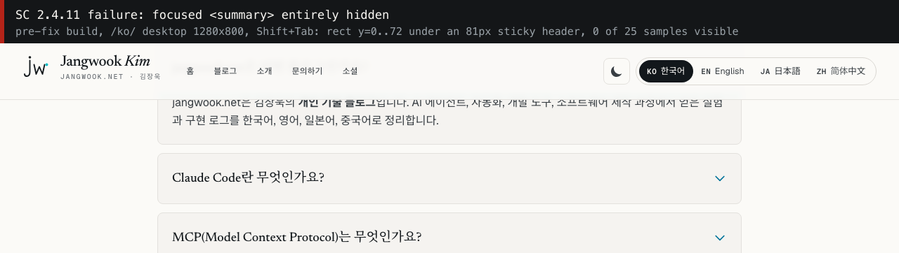
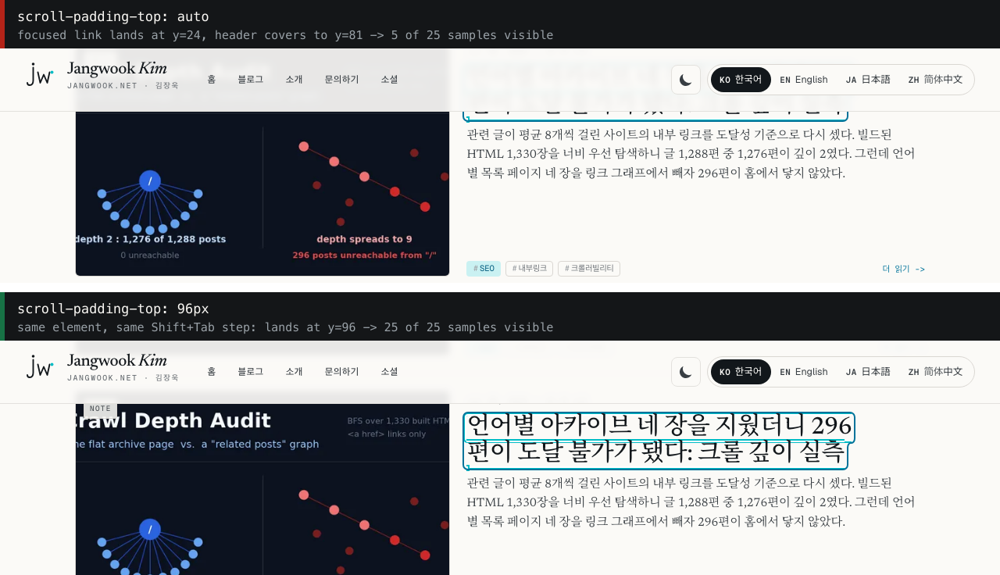

键盘可达性通常是这么查的：光标放在页面顶部，一路按 Tab 往下走，看焦点环有没有跟上。

我这么查过，结果干净。同一份判定逻辑、同样六个页面，往下走 1,072 个焦点停留点，WCAG 2.2 的 2.4.11 违规 0 条。然后我反过来，从页面底部按 Shift+Tab 往上走。1,069 个停留点，16 条。

两次之间，站点一个字节都没改。变的只有按键方向。

原因在浏览器把屏幕外的焦点目标拉进视口的那一步。它往最近的那条边上靠。往下走，元素贴在视口下沿，那里没有东西等着它；往上走，元素贴在上沿，而我这个站的上沿坐着一个 81 像素高的吸顶头部。

## 2.4.11 问的不是「有没有焦点环」

焦点标识存不存在，是个老标准。WCAG 2.2 新加的是这个标识会不会被页面上别的内容盖住。这是两回事。焦点环画到 3 像素、对比度调到位，仍然可能交付一个「按了 Shift+Tab 好像什么都没发生」的页面，因为环在头部底下。

达成标准的原文照录如下，出自 [W3C 建议标准](https://www.w3.org/TR/WCAG22/)（2024 年 12 月 12 日版）。

> When a user interface component receives keyboard focus, the component is not entirely hidden due to author-created content.

关键在 `entirely`。这条 AA 标准的意思是「全被盖住才算不通过」，部分被盖是允许的。要求完整可见的那条另有编号，是 AAA 的 2.4.12，同一份文档里写着。

> When a user interface component receives keyboard focus, no part of the component is hidden by author-created content.

AA 为什么容许一半被埋，[解释文档](https://www.w3.org/WAI/WCAG22/Understanding/focus-not-obscured-minimum.html)自己讲了。

> In recognition of the complex responsive designs common today, this AA criterion allows for the component receiving focus to be partially obscured by other author-created content.

同一份文档还点名了最常见的几个盖住焦点的东西。

> Typical types of content that can overlap focused items are sticky footers, sticky headers, and non-modal dialogs.

真实案例里，通常靠两个限定条件就能判完。一个是 `author-created content`：浏览器界面和用户自己装的扩展盖住组件，不算你的责任。另一个是对用户自己打开的内容留了口子。

> Content opened by the user may obscure the component receiving focus. If the user can reveal the focused component without advancing the keyboard focus, the component with focus is not considered visually hidden due to author-created content.

用户自己打开、并且不用移动焦点就能收掉的东西，不算不通过。吸顶头部两条都不符合：没人打开它，也没办法收掉它。

## 自动规则清单里没有这一条

我把 Deque 公开的 axe 规则清单过了一遍。判断焦点是否被其他内容遮住的规则，没有。WCAG 2.2 新增的标准里配了自动规则的，大概只有目标尺寸（2.5.8）。

我自己站上的结果也一样。两天前我用 axe-core 4.12.1 把 1,342 个构建产物 HTML 全量扫了一遍，报出来的违规规则是四类：标签、列表结构、文档标题、语言属性。焦点被遮挡从没在清单上露过面。那次全量扫描抓到了什么、又漏了什么，我另外写在[用 26 页抽样对照 1,342 页全量的那篇](/zh/blog/zh/wcag-em-2-sampling-vs-full-sweep-audit-2026/)里。

我不把「没有规则」读成「无法自动化」。没有规则是因为判断所需的信息不在静态 DOM 里：元素画在哪、它上面压着什么、页面滚到了什么位置。这些要布局引擎和命中测试，而这两样在你起一个真浏览器的那一刻就有了。所以我没等规则，直接写了测量。

## 真的按键，再用 25 个点去戳焦点矩形

判定逻辑很短。把获得焦点元素的客户端矩形按视口裁一遍，在里面铺 5×5 的网格取 25 个点，每个点调 `document.elementFromPoint` 看最上层是谁。25 个点全被别的元素接住，就是完全被盖；只有一部分被接住，就是部分被盖。

```js
const x0 = Math.max(0, r.left), y0 = Math.max(0, r.top);
const x1 = Math.min(innerWidth, r.right), y1 = Math.min(innerHeight, r.bottom);
let visible = 0, total = 0;
for (let i = 0; i < 5; i++) {
  for (let j = 0; j < 5; j++) {
    const x = x0 + (x1 - x0) * (i + 0.5) / 5;
    const y = y0 + (y1 - y0) * (j + 0.5) / 5;
    total++;
    const top = document.elementFromPoint(x, y);
    if (!top || top === el || el.contains(top) || top.contains(el)) { visible++; continue; }
    // 遮挡方记到最近的 sticky/fixed 祖先上，因为要改的是那个元素。
    const key = anchored(top) || desc(top);
    blockers[key] = (blockers[key] || 0) + 1;
  }
}
```

「接住的是祖先元素就不算被盖」这个条件比看上去重要。折成两行的行内链接，矩形会把两行整块包住，行与行之间的空白也在矩形里，那些点上接住的是链接的父元素。把这些算成遮挡，站内所有好好的多行链接都会变成违规。

走法上我摔了两次。第一版数的是按键次数。Shift+Tab 走过第一个元素之后会绕回最后一个，于是同一批元素被反复重测，本该 2,141 个的测量膨胀到 4,149 个。改法是开测前给所有可聚焦元素打上 `data-fidx` 编号，见过的编号就不再计入。

第二次更值得记。一开始我打算省事，直接调 `element.focus()` 遍历。那样什么都测不出来。对脚本调用的 `focus()`，Chromium 会把元素放到屏幕中间：800 像素高的视口里，落点是 y=367。而真正按 Tab 和 Shift+Tab 是往最近的边上靠，同一个元素落在 y=24。缺陷只在后一条路径上出现。

<strong>要找这个缺陷，脚本必须真的按键。</strong>用 `focus()` 遍历的审计工具，不管站点多糟都会报 0 条。这一点是这次测量里最能落地的收获。

## 换个方向，0 条变成 16 条

测量范围是 1,350 个构建文件里的六个页面（首页、文章列表、两篇长文、关于、联系），乘上桌面 1280×800 和移动 390×844 两种视口，共十二个组合。每个组合走一趟 Tab、一趟 Shift+Tab。

```text
$ node scripts/audit-focus-obscured.mjs --path /ko/ --path /ko/blog/ ...
  pages           6 x viewports 2   (chromium 1.57)
  focus stops     2141   (forward 1072 / reverse 1069)
  2.4.11  AA      16   forward 0 / reverse 16
  2.4.12  AAA     199   forward 6 / reverse 193
  invisible focus 4
  AA blockers     {"header.site-header.sticky[sticky]":16}
```

16 条 AA 违规，压在上面的东西 16 次都是同一个：吸顶头部。没有第二个候选。



上图就是不通过的样子。首页 FAQ 折叠面板的一个 `<summary>` 拿到焦点，矩形从 y=0 到 y=72，而头部覆盖到 y=81。25 个点里活下来 0 个。屏幕上只剩答案文字，对键盘用户来说，就是按了 Shift+Tab 而什么都没发生。

按元素种类数，卡片标题链接最多，9 条。这里得说我自己挖的坑。三天前我把「整张卡片包在 `<a>` 里」的写法改成了「只有标题是链接，再用 `::after` 覆盖层把点击区域撑回来」，起因是[入链锚文本被拉长到 367 个字符的那次修复](/zh/blog/zh/title-declaration-channels-anchor-text-audit-2026/)。副作用是链接的焦点矩形从整张卡片的三百多像素，缩到标题两行的 65 像素，比 81 像素的头部还矮。整张卡片当链接的年代，即使贴到上沿，下半截也还看得见。修好一个无障碍指标，顺手造出了另一条标准的不通过。

按方向和视口切开看：

| 分组 | 焦点停留点 | 2.4.11 (AA) | 2.4.12 (AAA) |
|---|---|---|---|
| Tab（往下） | 1,072 | 0 | 6 |
| Shift+Tab（往上） | 1,069 | 16 | 193 |
| 桌面 1280×800 | 1,093 | 10 | 174 |
| 移动 390×844 | 1,048 | 6 | 25 |

桌面和移动的差别，取决于同一个标题折成几行。行数上去、矩形比头部高了，下沿就能活下来。这个关系我没有逐个元素都测，所以只写到这里。

## 一行收尾的修复，和留下的 25 条

要改的地方在滚动这一侧，不在焦点那一侧。告诉浏览器：它认定的「视口内」区域从头部下方开始。定义这个区域的属性是 `scroll-padding`，[CSS Scroll Snap Module Level 1](https://www.w3.org/TR/css-scroll-snap-1/#propdef-scroll-padding) 的定义原样照录如下。

> This property specifies (for all scroll containers, not just scroll snap containers) offsets that define the optimal viewing region of a scrollport: the region used as the target region for placing things in view of the user. This allows the author to exclude regions of the scrollport that are obscured by other content (such as fixed-positioned toolbars or sidebars)

这个属性平时是作为「哈希链接跳转后标题被头部挡住」的解法被介绍的。它管的范围其实更宽：同一个区域也用于焦点移动引起的滚动，所以它是一个键盘无障碍的配置项。

我加进样式表的是这三行。

```css
html {
  --header-height: 5rem;
  scroll-padding-top: calc(var(--header-height) + 1rem);
}
```

头部实测桌面 81 像素、移动 82 像素，所以 5rem 再加 1rem 给焦点环留位，算出来 96 像素。头部高度写成变量，是为了设计一改两个数一起动。



同一个页面、同一趟走法的同一步，卡片链接的落点从 y=24 移到了 y=96。这个 96 跟刚写下的值分毫不差。25 个点里原本活 5 个，现在 25 个全活。

改完源码重新构建，同一个脚本原样再跑一遍。

| 指标 | 修复前 | 修复后 |
|---|---|---|
| 去重后的焦点停留点 | 2,141 | 2,133 |
| 2.4.11 (AA) 违规 | 16 | 0 |
| 2.4.12 (AAA) 违规 | 199 | 25 |
| 焦点到了但元素透明 | 4 | 0 |
| 盖住 AA 违规的元素 | 吸顶头部 16 次 | 无 |

AA 归零了。剩下的 25 条 AAA 我逐条手看，结论是这个数字不能直接拿来用。14 条是回到顶部的圆形按钮：直径 48 像素的圆，外接矩形的四个角在圆外，那四个点接住的是背后的内容。算出来 25 个点里遮了 4 个、也就是 16%，实际上一处重叠都没有。网格判错了非矩形的形状。10 条是相关文章列表里的行内链接，两行矩形的行间空白处接住了旁边那个链接。最后 1 条是联系页里嵌的一个高 1,000 像素的表单 `<iframe>`。视口只有 800 像素，这个元素怎么滚都不可能完整可见。比视口更大的组件，AAA 在结构上就到不了。

一句话：AA 这条轴一行 CSS 就关掉了，AAA 那条轴的数字得人分完类才算结论。

用 JavaScript 修也是一条路。接 `focusin` 再用 `scrollBy` 顶一下的代码我见过几次，我不推荐。浏览器滚完了你再滚一次，画面会看得出来跳，跟平滑滚动叠在一起还会错位。`scroll-padding` 改的是判断标准本身，第一次滚动就落对，算术还是浏览器自己做。

## 用 opacity: 0 藏起来的按钮还在 Tab 顺序里

这次测量还带出一件事。有 4 个停留点，焦点确实落到了元素上，但元素本身是透明的。就是那个回到顶部的按钮。

```css
/* 修复前 */
.back-to-top {
  @apply opacity-0 translate-y-4 pointer-events-none;
}
.back-to-top.visible {
  @apply opacity-100 translate-y-0 pointer-events-auto;
}
```

`opacity: 0` 和 `pointer-events: none` 都不会把元素从 Tab 顺序里摘出去。所以在页面顶部一直按 Tab，焦点会停在一个看不见的按钮上。`pointer-events` 只挡指针，这时按回车按钮照样生效。这不是被盖住的问题，是根本没画出来的问题，落在焦点可见性（2.4.7）那一侧，不在 2.4.11。

补一条 `visibility: hidden`，元素就从顺序焦点导航里退出了，而且 `visibility` 是离散切换，原来的淡入还留着。我最初用 Tailwind 的工具类写 `@apply invisible` 和 `@apply visible`，构建直接崩了：在 `.back-to-top.visible` 这个选择器里调 `visible` 工具类，等于引用自己，PostCSS 判成循环依赖拦下来了。改成直接写属性。

```css
/* 修复后 */
.back-to-top {
  @apply opacity-0 translate-y-4 pointer-events-none;
  visibility: hidden;
}
.back-to-top.visible {
  @apply opacity-100 translate-y-0 pointer-events-auto;
  visibility: visible;
}
```

改完之后，去重焦点停留点从 2,141 降到 2,133。少掉的这 8 个，就是按钮退出 Tab 顺序的证据。要藏一个控件，该动的是可见性、`display: none` 或 `inert`，不是不透明度。

## 这次测量说不了的事

命中测试不等于知觉。`elementFromPoint` 只回答某个坐标上最前面是哪个元素。半透明头部压着的文字还读不读得清、焦点环跟背后的东西对比度够不够，是另一个问题，得人来看。

5×5 网格在非矩形元素上会判错，上面那 14 条圆形按钮就是凭证。网格加密也没用，圆的四角始终在圆外。要判准得知道元素实际画出来的形状，而命中测试给不了这个。

解释文档留的那个口子，脚本判不了。用户自己打开、不移动焦点就能收掉的内容不算不通过，可什么是用户打开的，代码无从得知。站上有 Cookie 提示条或非模态对话框的话，这个脚本的输出是候选清单，不是判决书。

我只测了一个引擎。焦点目标的滚动对齐方式由用户代理自行决定，别的引擎落点可能不一样。不过 `scroll-padding` 是规范里写明的属性，方向上我认为是一致的。

最后，这跟搜索排名没关系。我没有测排名效果，也没有据可以那么讲。跟结构化数据不保证排名是同一个道理，无障碍的修复也不保证排名。它是符合性和可用性标准。

## 收尾清单：两个方向都走一遍，再确认那一行 CSS

要在自己站上跑同样的检查，顺序是这样：

1. <strong>先量吸顶或固定元素的实测高度。</strong>在桌面和移动分别读 `getBoundingClientRect().height`，再看 `getComputedStyle(document.documentElement).scrollPaddingTop`。这个值算出来是 `auto`、顶上又有吸顶头部，那违规候选已经存在了。
2. <strong>把 `scroll-padding-top` 设成头部高度加余量。</strong>头部高度放进 CSS 变量再引用。有吸底元素就配上 `scroll-padding-bottom`。我这边这三行把 16 条 AA 违规变成了 0 条。
3. <strong>审计脚本要真的按键。</strong>`element.focus()` 在 Chromium 里会把元素放到中间，复现不出这个缺陷。Tab 和 Shift+Tab 两个方向都走，并给元素编号去重。
4. <strong>找出用不透明度藏起来的控件。</strong>只靠 `opacity: 0` 或 `pointer-events: none` 隐藏的元素仍然可聚焦，要用 `visibility: hidden`、`display: none` 或 `inert`。
5. <strong>AAA 的数字先手工分类再引用。</strong>圆形元素、折成多行的行内元素、比视口更大的组件，在网格方法下必然报成部分被盖。

测量脚本已经放进仓库，叫 `scripts/audit-focus-obscured.mjs`。本地把静态构建起起来，扔几个路径进去就能跑。

换掉选择器，这个脚本在别的构建产物上照样能跑。把它接进别人的流程、再把输出整理成能拿去改代码的报告，这也是我做的事。入口在[个人简介](/zh/about/)。

---

*来源：W3C 的 [Web Content Accessibility Guidelines (WCAG) 2.2](https://www.w3.org/TR/WCAG22/)（W3C 建议标准，2024 年 12 月 12 日）、[Understanding SC 2.4.11: Focus Not Obscured (Minimum)](https://www.w3.org/WAI/WCAG22/Understanding/focus-not-obscured-minimum.html)、[CSS Scroll Snap Module Level 1](https://www.w3.org/TR/css-scroll-snap-1/#propdef-scroll-padding)（Candidate Recommendation Snapshot，2021 年 3 月 11 日）；自动规则清单是 Deque 的 [axe 规则清单](https://dequeuniversity.com/rules/axe/4.10)。以上均为官方来源。测量环境：自建 Astro 构建产物，Playwright 1.57 + Chromium，视口 1280×800 与 390×844，页面 6 个，去重焦点停留点修复前 2,141 个、修复后 2,133 个，判定依据是焦点矩形上 5×5 网格的 `document.elementFromPoint` 结果。所有数字都出自这个站点、这次构建、这个浏览器，不构成对其他用户代理滚动对齐行为的陈述。*
