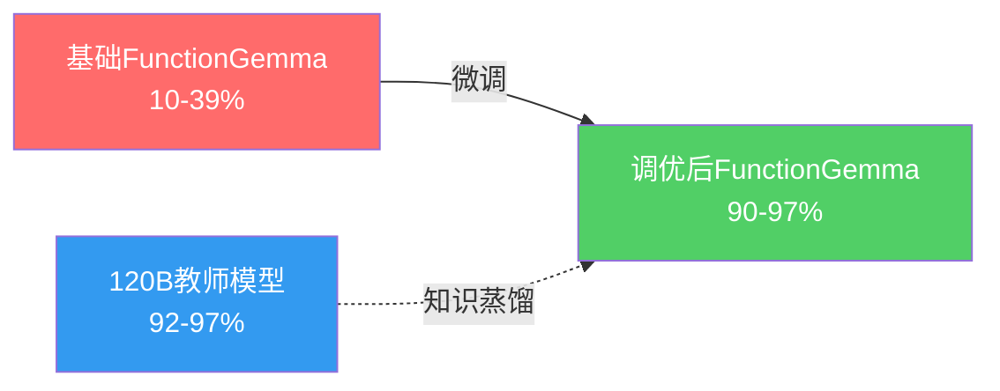

## 概述

Google发布的<strong>FunctionGemma 270M</strong>是一个专为function calling设计的270M参数超小型模型。它轻量到可以在智能手机CPU上以125 tok/s运行，但基础多轮tool calling精度仅为10-39%。

Distil Labs团队通过<strong>knowledge distillation</strong>对该模型进行微调后，达到了与120B教师模型相当甚至超越的<strong>90-97%精度</strong>。而模型大小仅为教师的1/445。

这是对"只有大模型才能解决问题"这一Scaling Law神话的有力反驳。

## 为什么多轮如此困难

单轮function calling相对简单。但多轮场景中以下问题会复合叠加：

- <strong>对话历史追踪</strong>：需要记住之前的function call结果
- <strong>意图变更处理</strong>：用户可能在对话中途改变意图
- <strong>累积误差</strong>：单轮80%精度在5轮后降至33%（0.8⁵）

基础FunctionGemma的5轮预测精度几乎不可用：

| 任务 | 单轮 | 5轮预测 |
|------|------|--------|
| 智能家居控制 | 38.8% | ~0.9% |
| 银行语音助手 | 23.4% | ~0.07% |
| Shell命令执行 | 9.9% | ~0.001% |

## 微调结果

Distil Labs使用120B GPT-oss教师模型进行knowledge distillation。结果令人惊叹：

### 各任务详细结果

| 任务 | 基础 | 调优后 | 教师(120B) |
|------|------|--------|-----------|
| 智能家居控制 | 38.8% | <strong>96.7%</strong> | 92.1% |
| 银行语音助手 | 23.4% | <strong>90.9%</strong> | 97.0% |
| Shell命令执行 | 9.9% | <strong>96.0%</strong> | 97.0% |

<strong>在智能家居控制和Shell命令执行任务上，调优后的模型超越了120B教师模型</strong>。仅银行任务未达到教师水平，但该任务包含14个复杂函数和ASR噪声，是难度最高的任务。

## 核心洞察

### 1. 数据质量 > 模型大小

同一高质量数据集让Qwen3-0.6B和FunctionGemma 270M都取得了优秀性能。<strong>关键不在于模型大小，而在于针对特定任务的高质量训练数据</strong>。

### 2. 小445倍模型的实用意义

| 项目 | 120B教师 | 270M调优 |
|------|---------|---------|
| 参数量 | 120,000M | 270M |
| 量化大小 | ~60GB+ | ~288MB |
| 运行环境 | GPU服务器 | 智能手机CPU |
| 推理速度 | - | 125 tok/s |

边缘设备、移动应用、浏览器内推理等场景中，<strong>无需GPU即可实现production-ready tool calling</strong>。

### 3. 对Scaling Law的反驳

结合近期DeepSeek、Qwen等开源模型的崛起，本次结果为<strong>"增加参数是提升性能的唯一途径"这一假设提供了又一反例</strong>。在特定任务上，适当的微调可以克服模型大小的限制。

## 开源资源

所有模型和数据集均已公开，可直接复现：

- <strong>智能家居模型</strong>：[distil-labs/distil-home-assistant-functiongemma](https://huggingface.co/distil-labs/distil-home-assistant-functiongemma)
- <strong>智能家居数据</strong>：[distil-labs/distil-smart-home](https://github.com/distil-labs/distil-smart-home)
- <strong>银行助手数据</strong>：[distil-labs/distil-voice-assistant-banking](https://github.com/distil-labs/distil-voice-assistant-banking)
- <strong>Shell命令数据</strong>：[distil-labs/distil-SHELLper](https://github.com/distil-labs/distil-SHELLper)

## 结论

FunctionGemma 270M的微调案例向AI行业传递了重要信息。<strong>270M参数可以击败120B模型</strong>，意味着并非所有问题都需要巨大模型。

随着边缘AI、移动部署、IoT设备等受限环境中tool calling需求的增长，这类超小型专用模型的潜力将受到更多关注。

## 参考资料

- [Making FunctionGemma Work: Multi-Turn Tool Calling at 270M Parameters](https://www.distillabs.ai/blog/making-functiongemma-work-multi-turn-tool-calling-at-270m-parameters) — Distil Labs官方博客
- [Reddit讨论](https://www.reddit.com/r/LocalLLaMA/comments/1r6gx75/finetuned_functiongemma_270m_for_multiturn_tool_calling/) — r/LocalLLaMA
- [FunctionGemma模型卡](https://huggingface.co/google/functiongemma-270m-it) — HuggingFace
