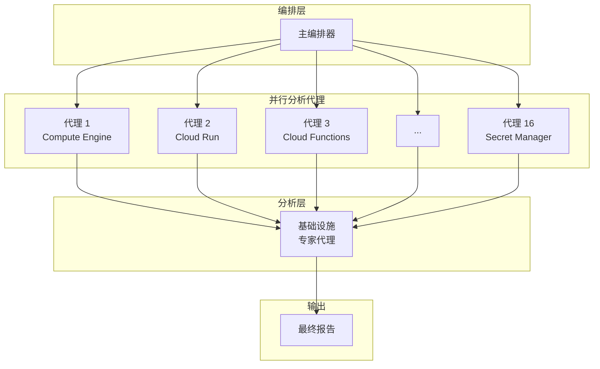
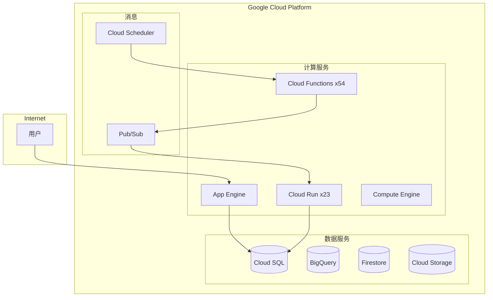

## 概述

云基础设施管理随着时间的推移变得越来越复杂。数十种服务、数百个资源，以及不断变化的配置。基础设施管理员每天都必须应对安全漏洞、成本浪费和配置错误。然而，手动检查既耗时又容易遗漏关键问题。

为了解决这个问题，我使用 <strong>gcloud MCP（Model Context Protocol）</strong>和 AI 代理构建了一个自动化基础设施审计系统。通过并行代理架构，它可以同时分析 16 个 GCP 服务，自动识别安全风险、成本优化机会和运营问题。

## 问题背景

### 基础设施管理员面临的挑战

生产环境中基础设施管理员面临的常见问题：

- <strong>服务蔓延</strong>：Cloud Run、Cloud Functions、App Engine、Compute Engine 等混合使用
- <strong>安全盲点</strong>：环境变量中暴露的 API 密钥、过于宽松的防火墙规则
- <strong>成本泄漏</strong>：未使用的资源、过度配置的实例
- <strong>技术债务</strong>：已停止支持的操作系统、已弃用的运行时版本

传统方法是逐个检查每个服务。但这有局限性：

```bash
# 传统方法：逐个服务顺序检查
gcloud compute instances list
gcloud run services list
gcloud functions list
gcloud sql instances list
# ... 手动运行数十个命令
```

使用这种方法检查整个基础设施可能需要数小时甚至数天。

### 现有工具的局限性

Google Cloud 的 Security Command Center 和 Cloud Asset Inventory 是出色的工具。但是：

- 它们依赖于静态的基于规则的检测
- 跨服务关系分析有限
- 难以根据业务上下文确定优先级
- 缺乏即时的修复建议

## 解决方案

### gcloud MCP 介绍

<strong>MCP（Model Context Protocol）</strong>是一种使 AI 模型能够与外部工具交互的协议。gcloud MCP 将 Google Cloud CLI 封装为 MCP 服务器，允许 AI 代理直接查询和管理 GCP 资源。

主要优势：

1. <strong>自然语言接口</strong>：使用自然语言查询，而不是复杂的 gcloud 命令
2. <strong>上下文感知</strong>：AI 理解并分析资源之间的关系
3. <strong>自动化报告</strong>：生成结构化的分析结果和改进建议

### 并行代理架构

我没有使用单个代理顺序检查所有服务，而是应用了并行子代理模式：



每个子代理独立分析特定服务：

| 代理 | 服务 | 分析项目 |
|------|------|----------|
| 代理 1 | Compute Engine | 虚拟机状态、操作系统版本、快照 |
| 代理 2 | Cloud Run | 服务配置、环境变量、扩展 |
| 代理 3 | Cloud Functions | 运行时、触发器、密钥 |
| 代理 4 | Cloud SQL | 数据库版本、备份、安全性 |
| ... | ... | ... |
| 代理 16 | App Engine | 版本管理、域名、资源 |

## 实施步骤

### 步骤 1：设置 gcloud MCP

首先，配置 gcloud MCP 服务器。它可以与 Claude Desktop 或其他兼容 MCP 的客户端一起使用：

```json
{
  "mcpServers": {
    "gcloud": {
      "command": "npx",
      "args": ["-y", "@anthropics/gcloud-mcp"],
      "env": {
        "GOOGLE_APPLICATION_CREDENTIALS": "/path/to/credentials.json"
      }
    }
  }
}
```

### 步骤 2：定义服务特定的分析代理

为每个 GCP 服务创建专门的分析提示：

```markdown
# Compute Engine 分析代理

## 目标
分析项目中的所有 Compute Engine 资源，识别安全和运营问题。

## 分析项目
1. 虚拟机实例列表和状态
2. 机器类型和资源分配
3. 操作系统镜像版本（EOL 状态）
4. 磁盘和快照配置
5. 网络接口和防火墙规则
6. 元数据（SSH 密钥、启动脚本等）

## 输出格式
- 资源摘要表
- 发现的问题列表（按严重程度）
- 建议的操作
```

### 步骤 3：并行执行编排

主编排器同时运行所有子代理：

```python
# 概念代码示例
async def run_infrastructure_audit():
    agents = [
        Agent("compute-engine", compute_prompt),
        Agent("cloud-run", cloud_run_prompt),
        Agent("cloud-functions", functions_prompt),
        # ... 16 个代理
    ]

    # 并行执行
    results = await asyncio.gather(*[
        agent.analyze() for agent in agents
    ])

    # 汇总结果
    return aggregate_results(results)
```

### 步骤 4：结果汇总和报告生成

基础设施专家代理综合所有结果，生成优先级报告：

```markdown
# 风险评估标准

## 严重（需要立即行动）
- 暴露在互联网上的凭证
- 完全开放的防火墙规则
- 已停止支持的操作系统

## 高（1 周内行动）
- 环境变量中的 API 密钥
- 未启用删除保护
- 没有备份的数据库

## 中（1 个月内行动）
- 已弃用的运行时版本
- 未使用的资源
- 标签不充分
```

## 实际案例

### 示例分析结果

运行并行代理系统会生成如下报告：

#### 基础设施概览

| 类别 | 服务 | 资源数量 | 状态 |
|------|------|----------|------|
| 计算 | Compute Engine 虚拟机 | 1 | 需要关注 |
| 计算 | Cloud Run 服务 | 23 | 需要安全审查 |
| 计算 | Cloud Functions | 54 | 需要运行时升级 |
| 数据库 | Cloud SQL | 2 | 1 个不活跃 |
| 存储 | Cloud Storage | 27 | 15 个存在安全漏洞 |
| 网络 | VPC | 2 | 需要防火墙审查 |

#### 发现的主要问题

<strong>安全漏洞（严重）</strong>

1. <strong>环境变量中暴露的 API 密钥</strong>
   - 位置：多个 Cloud Run/Functions 服务
   - 风险：凭证被盗可能导致服务滥用
   - 操作：立即迁移到 Secret Manager

2. <strong>RDP 端口完全开放</strong>
   - 位置：default VPC 防火墙规则
   - 风险：暴露于暴力破解攻击
   - 操作：限制到特定 IP 范围

3. <strong>已停止支持的操作系统</strong>
   - 位置：cdp-sftp-prod 虚拟机（CentOS 7）
   - 风险：没有安全补丁
   - 操作：迁移到 Rocky Linux 或 Ubuntu LTS

<strong>成本优化机会</strong>

1. <strong>停止的 MySQL 实例</strong>：只产生存储费用
2. <strong>80+ 个 App Engine 版本</strong>：未使用的版本需要清理
3. <strong>空的 BigQuery 数据集</strong>：10 个数据集可以删除

### 自动生成的 Mermaid 图表

系统还会自动生成 Mermaid 图表来可视化基础设施：



## 自动化定期扫描

### 定期审计的必要性

基础设施每天都在变化。新服务部署、配置更改、发现新漏洞。一次性审计是不够的。

### 使用 Cloud Scheduler 自动化

可以自动化定期基础设施审计：

```yaml
# 每周基础设施审计计划
schedule: "0 9 * * 1"  # 每周一上午 9 点
target:
  type: cloud-function
  function: infrastructure-audit-trigger
notification:
  - email: infra-team@company.com
  - slack: #infra-alerts
```

### 变更追踪和趋势分析

通过存储定期扫描结果：

- 追踪安全态势随时间的变化
- 识别新出现和已解决的问题
- 分析基础设施增长趋势
- 维护合规审计历史

## 即时修复

gcloud MCP 的另一个优势是能够立即修复发现的问题。

### 示例：Secret Manager 迁移

将环境变量中暴露的 API 密钥迁移到 Secret Manager：

```bash
# 1. 创建密钥
gcloud secrets create openai-api-key --replication-policy="automatic"

# 2. 设置密钥值
echo -n "sk-xxx..." | gcloud secrets versions add openai-api-key --data-file=-

# 3. 更新 Cloud Run 服务
gcloud run services update my-service \
  --update-secrets=OPENAI_API_KEY=openai-api-key:latest
```

AI 代理可以自动生成这些修复命令，并在批准后执行。

### 示例：防火墙规则加固

```bash
# 删除危险的 RDP 规则
gcloud compute firewall-rules delete allow-rdp-all

# 创建只允许特定 IP 的新规则
gcloud compute firewall-rules create allow-rdp-office \
  --allow tcp:3389 \
  --source-ranges="203.0.113.0/24" \
  --target-tags="windows-server"
```

## 结论

将 gcloud MCP 与并行代理架构结合可以实现：

- <strong>节省时间</strong>：手动需要数天的审计在几分钟内完成
- <strong>一致性</strong>：使用相同标准进行可重复的检查
- <strong>全面性</strong>：分析跨服务关系
- <strong>即时行动</strong>：为发现的问题自动生成修复命令

基础设施管理员从重复的检查任务中解放出来，可以专注于更重要的架构决策和战略工作。

### 下一步

1. <strong>安装 gcloud MCP</strong>：从 [GitHub 仓库](https://github.com/anthropics/gcloud-mcp) 开始
2. <strong>自定义分析代理</strong>：根据您组织的安全策略和合规要求进行调整
3. <strong>设置定期扫描</strong>：使用 Cloud Scheduler 配置每周/每月自动审计
4. <strong>集成通知</strong>：连接 Slack、Email、PagerDuty 以便即时响应

用 AI 代理开启云基础设施管理的新范式。
