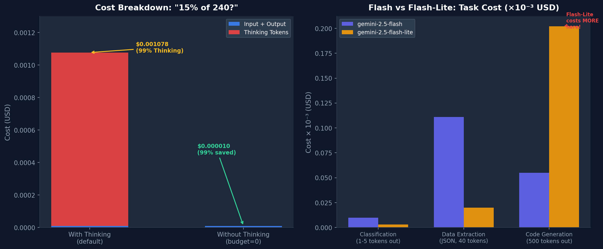

我直接调用了API，结果出乎意料。

我向Gemini 2.5 Flash发送了"240的15%是多少？只给数字。"。回答是"36"——共2个令牌。但使用日志显示了305个令牌的计费。差额的绝大部分是我既没有发送也没有收到的**Thinking（推理）令牌**。

算一下成本：输入+输出：$0.000010。仅Thinking：$0.001067。**总成本的99.1%来自我没有主动使用的令牌。**

这就是我写这篇文章的原因。Gemini 2.5 Flash是一个强大的模型，但使用默认设置会产生远高于预期的费用。以下是我通过实际实验验证的4种成本优化策略。

实验环境：macOS Darwin 24.6.0、Python 3.12.8、`google-genai` 1.72.0。

## 开始前：了解Gemini 2.5 Flash定价结构

优化之前，需要先了解什么在消耗资金。Gemini 2.5 Flash的定价结构（截至2026年5月）有三种类型：

| 令牌类型 | 价格（每1M令牌） |
|---------|---------------|
| 输入（Input） | $0.30 |
| 输出（Output） | $2.50 |
| Thinking | $3.50 |
| 缓存读取（Cache Read） | $0.075 |

还有一点：`gemini-2.5-flash-lite`是输入$0.10、输出$0.40。看起来便宜很多，但并非总是如此。这一点将在Step 3中结合实验结果解释。

先做好设置。如需了解跨服务商的价格对比，可参考[LLM API价格比较2026](/zh/blog/zh/llm-api-pricing-comparison-2026-gpt5-claude-gemini-deepseek)。今天专注于Flash。

```bash
pip install google-genai
```

```python
from google import genai
from google.genai import types

client = genai.Client(api_key="YOUR_GEMINI_API_KEY")
```

## Step 1: 控制Thinking令牌 — 简单任务节省99%

Gemini 2.5 Flash默认启用**Thinking（推理）模式**。模型在响应前会经过内部推理过程，而这个过程的每个令牌都会按$3.50/M计费——比输出还贵。

坦白说，我最初没想到差距会这么大。实测结果：一个简单的数学问题消耗了305个Thinking令牌，但回答只有2个令牌。

```python
# Thinking启用（默认）
response = client.models.generate_content(
    model="gemini-2.5-flash",
    contents="What is 15% of 240? Just give the number.",
    config=types.GenerateContentConfig(
        thinking_config=types.ThinkingConfig(thinking_budget=1024)
    )
)

usage = response.usage_metadata
print(f"Input: {usage.prompt_token_count}")         # 18
print(f"Output: {usage.candidates_token_count}")    # 2
print(f"Thinking: {usage.thoughts_token_count}")    # 305
print(f"Cost: ~$0.001078")                          # 99%来自Thinking
```

```python
# Thinking禁用（budget=0）
response = client.models.generate_content(
    model="gemini-2.5-flash",
    contents="What is 15% of 240? Just give the number.",
    config=types.GenerateContentConfig(
        thinking_config=types.ThinkingConfig(thinking_budget=0)
    )
)

usage = response.usage_metadata
print(f"Input: {usage.prompt_token_count}")         # 18
print(f"Output: {usage.candidates_token_count}")    # 2
print(f"Thinking: 0")
print(f"Cost: ~$0.000010")                          # 节省99%
```

**实际测量结果：**



| 设置 | 成本 | 响应时间 |
|-----|------|---------|
| Thinking ON（budget=1024） | $0.001078 | 2.36秒 |
| Thinking OFF（budget=0） | $0.000010 | 0.80秒 |
| **节省** | **99.1%** | **快66%** |

但某些情况下Thinking是必要的。按以下标准判断：

- **Thinking OFF**：分类、数据提取、简单转换、JSON解析、有固定答案的问题
- **Thinking ON**：代码调试、数学推理、多步逻辑、创意写作
- **预算调整**：将`thinking_budget`设为128〜512，按复杂度限制推理深度

```python
# 实用包装器：按任务类型分离thinking设置
def call_gemini(prompt: str, task_type: str = "simple") -> str:
    thinking_budget = 0 if task_type == "simple" else 1024
    response = client.models.generate_content(
        model="gemini-2.5-flash",
        contents=prompt,
        config=types.GenerateContentConfig(
            thinking_config=types.ThinkingConfig(thinking_budget=thinking_budget)
        )
    )
    return response.text
```

这是我会最先在生产环境中应用的优化。成本削减幅度最大，代码改动只有一行。

## Step 2: 使用Context Caching消除重复上下文成本

构建聊天机器人或RAG系统时，经常需要在每次请求中发送相同的长系统提示或文档。Context Caching将这部分内容存储在服务器端，后续请求只需支付缓存读取费用（正常输入价格的25%）。

实验过程中发现了一个重要限制。尝试Context Caching时出现了这样的错误：

```
400 INVALID_ARGUMENT: Cached content is too small.
total_token_count=524, min_total_token_count=1024
```

**只有1024个令牌以上的上下文才能使用Context Caching。**短系统提示无法应用。设计时若考虑缓存，需要将系统提示做得足够详细，或包含相关文档。

```python
# 创建Context Cache（缓存内容需要1024+令牌）
cache = client.caches.create(
    model="gemini-2.5-flash",
    config={
        "contents": [
            types.Content(
                role="user",
                parts=[types.Part(text=LONG_SYSTEM_PROMPT)]  # 1024+ tokens
            )
        ],
        "ttl": "3600s",  # 保留1小时
    }
)

# 使用缓存的请求
response = client.models.generate_content(
    model="gemini-2.5-flash",
    contents="用户问题",
    config=types.GenerateContentConfig(cached_content=cache.name)
)

# 删除缓存
client.caches.delete(cache.name)
```

缓存读取费用为$0.075/1M令牌——是普通输入（$0.30）的25%。同一上下文复用10次以上就已经值得了。

**Context Caching适用场景：**
- 每次请求都发送长系统提示（1000+令牌）的聊天机器人
- RAG中跨多个问题复用检索到的文档
- 将完整代码库或手册作为上下文的编程助手

与[Claude API的Prompt Caching](/zh/blog/zh/claude-api-prompt-caching-cost-optimization-guide)概念相同，但实现细节不同。Anthropic通过明确的缓存标记指定，而Gemini需要单独创建缓存对象。

## Step 3: Flash vs Flash-Lite — Lite并不总是更便宜

从价格表来看Flash-Lite似乎有压倒性优势：输入便宜3倍，输出便宜6倍。但我的实验结果不同。

对相同的3个任务（分类、代码生成、数据提取）在两个模型上运行的结果：

| 模型 | 总成本 | 总时间 |
|-----|--------|--------|
| gemini-2.5-flash | $0.000176 | 6.16秒 |
| gemini-2.5-flash-lite | $0.000224 | 4.57秒 |

**Flash-Lite贵了27%。**原因是什么？

在代码生成任务中，Flash返回了简洁的答案（20个令牌），而Flash-Lite生成的代码达到了`max_output_tokens=500`的上限。输出令牌增多后Flash-Lite的优势就消失了。

```python
# 输出长度控制：务必设置max_output_tokens
response = client.models.generate_content(
    model="gemini-2.5-flash-lite",
    contents=prompt,
    config=types.GenerateContentConfig(
        max_output_tokens=200,  # 明确上限
        temperature=0.0,        # 确定性响应
    )
)
```

**选择指南：**

| 任务类型 | 推荐模型 | 原因 |
|---------|---------|------|
| 情感分类、标签 | Flash-Lite | 1〜5令牌输出，简单 |
| JSON提取 | Flash-Lite | 结构化短输出 |
| 代码生成 | Flash | 长输出时单价逆转 |
| 复杂推理 | Flash | Thinking质量差异 |
| 高量批处理 | Batch API + 判断 | 50%折扣后重新计算 |

按任务选择模型的策略与[异构LLM架构成本优化](/zh/blog/zh/heterogeneous-llm-agent-fleet-cost-optimization)中介绍的多模型路由模式直接相关。

## Step 4: 使用Batch API享受50%折扣

对不需要实时响应的任务，可以使用Batch API。Google对批处理提供50%折扣——与[Anthropic Message Batches API实战指南](/zh/blog/zh/anthropic-message-batches-api-production-guide)是同样的思路。

```python
import json

# 创建批量请求文件
requests = [
    {"key": f"req_{i}", "request": {"contents": [{"parts": [{"text": prompt}]}]}}
    for i, prompt in enumerate(prompts_list)
]

with open("batch_requests.jsonl", "w") as f:
    for req in requests:
        f.write(json.dumps(req) + "\n")

# 提交批量作业
batch_job = client.batches.create(
    model="gemini-2.5-flash",
    src="gs://your-bucket/batch_requests.jsonl",  # 需要GCS路径
    config={"dest": "gs://your-bucket/results/"},
)
# 完成最多需要24小时
```

**适合批处理的任务：**大量文档摘要（夜间批次）、内容分类/标签管道、数据集标注、定期报告生成。

## Step 5: 用max_output_tokens设置成本上限

最简单但常被忽视的方法。限制输出令牌可以防止意外的冗长响应超出预算。

```python
config = types.GenerateContentConfig(
    max_output_tokens=500,   # 最大输出限制
    temperature=0.0,          # 确定性响应（减少重试）
    stop_sequences=["---"],   # 明确终止点
)
```

在提示中直接指示输出长度也很有效：

```
"只用JSON格式回复。保持在100个令牌以内。"
"用一句话总结。"
"只回答是或否。"
```

## Step 6: 使用量日志记录 — 优化的前提

优化之前，需要先了解哪里在消耗成本。创建一个从所有响应中收集`usage_metadata`的简单包装器：

```python
import time, logging, json
from dataclasses import dataclass, asdict

@dataclass
class CallRecord:
    model: str
    task_type: str
    input_tokens: int
    output_tokens: int
    thinking_tokens: int
    cost_usd: float
    latency_ms: int

PRICING = {
    "gemini-2.5-flash": {"input": 0.30, "output": 2.50, "thinking": 3.50},
    "gemini-2.5-flash-lite": {"input": 0.10, "output": 0.40, "thinking": 0.0},
}

def tracked_generate(client, model: str, prompt: str, task_type: str, **kwargs) -> str:
    start = time.time()
    response = client.models.generate_content(model=model, contents=prompt, **kwargs)
    elapsed_ms = int((time.time() - start) * 1000)
    
    u = response.usage_metadata
    p = PRICING.get(model, PRICING["gemini-2.5-flash"])
    thinking = getattr(u, "thoughts_token_count", None) or 0
    
    cost = (
        (u.prompt_token_count / 1e6) * p["input"]
        + (u.candidates_token_count / 1e6) * p["output"]
        + (thinking / 1e6) * p["thinking"]
    )
    
    record = CallRecord(
        model=model, task_type=task_type,
        input_tokens=u.prompt_token_count,
        output_tokens=u.candidates_token_count,
        thinking_tokens=thinking, cost_usd=cost, latency_ms=elapsed_ms,
    )
    logging.info(json.dumps(asdict(record)))
    return response.text
```

## 实验中的发现

直接实验发现了一些意想不到的事情。

**Thinking令牌数量不可预测。**相同模型对相似问题会产生差异很大的Thinking令牌数。"240的15%"消耗了305个令牌，而另一个简单问题可能少得多。唯一可靠的控制方法是明确设置`thinking_budget`上限。

**Context Caching的1024令牌最低要求会影响系统设计。**使用短系统提示的应用无法直接启用缓存——需要有意地丰富系统提示，加入示例、规则和文档。矛盾地，写更多系统提示内容实际上可以节省总体成本。

**Flash-Lite比Flash更贵的情况确实存在。**单价优势在长代码生成或长文摘要时会逆转。提交使用Flash-Lite之前，务必先测量实际的输出令牌分布。

## 成本优化决策矩阵

总结如下：

```
任务路由决策树：

1. 输出是否短？（< 50令牌）
   YES → Flash-Lite + thinking_budget=0
   NO  → Flash + 评估thinking_budget

2. 相同上下文是否复用10次以上？
   YES + 上下文 >= 1024令牌 → 添加Context Caching
   NO  → 单独调用

3. 是否需要实时响应？
   NO  → Batch API（50%折扣）
   YES → 保持以上设置

4. 是否需要复杂推理？
   NO  → thinking_budget=0（简单任务：节省99%）
   YES → 在128〜1024范围内调整thinking_budget
```

Gemini 2.5 Flash是一个足够强大的模型。但使用默认设置时，Thinking令牌会悄悄消耗大部分预算。这份指南的核心只有一条：**测量，然后控制。**

从在每次响应中记录`usage_metadata`开始，检查Thinking令牌占总成本的百分比。本文介绍的每种技巧都在特定条件下有效。先测量自己的工作负载，再选择合适的优化手段。

`google-genai` SDK在写本文时版本为1.72.0。API和定价可能会变更，请在[Google AI Studio定价页面](https://ai.google.dev/pricing)确认最新信息。
