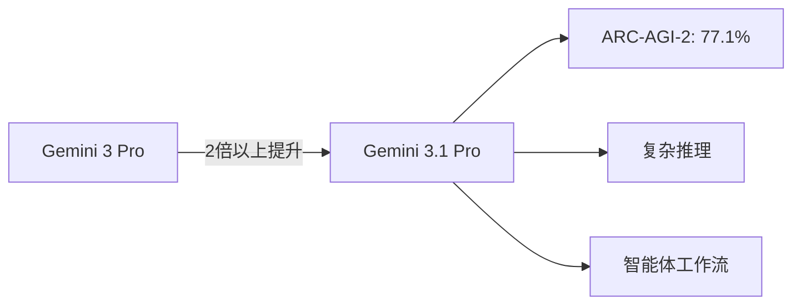
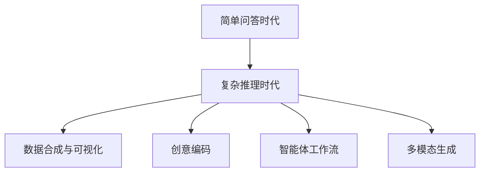

## 概述

2026年2月19日，Google发布了<strong>Gemini 3.1 Pro</strong>。该模型在Hacker News上获得391分的高度关注，相比前代Gemini 3 Pro，推理性能提升了<strong>2倍以上</strong>。本文将分析Gemini 3.1 Pro的核心性能指标、与Claude的对比，以及多模态进化的意义。

## 核心性能分析

### ARC-AGI-2基准测试：77.1%

Gemini 3.1 Pro最引人注目的成就是在<strong>ARC-AGI-2</strong>基准测试上的表现。ARC-AGI-2评估模型解决全新逻辑模式的能力，Gemini 3.1 Pro达到了<strong>经验证的77.1%</strong>。

这意味着相比Gemini 3 Pro，推理性能提升了<strong>2倍以上</strong>。这不仅仅是分数提升，而是"简单回答已不够"的复杂问题解决能力的根本性飞跃。

### 实践应用案例

Google展示了4个Gemini 3.1 Pro增强推理能力的实践案例：

- <strong>代码驱动动画</strong>：仅通过文本提示生成网站可用的动画SVG。基于代码而非像素，任何尺寸都清晰锐利
- <strong>复杂系统合成</strong>：构建实时航空航天仪表盘，通过API集成可视化国际空间站轨道
- <strong>交互式设计</strong>：编码3D椋鸟群舞（murmuration），集成手势追踪和生成式音乐
- <strong>创意编码</strong>：分析文学作品的氛围并转化为现代Web界面

## 与Claude的对比

### 当前竞争格局

随着Gemini 3.1 Pro的发布，AI模型竞争进一步加剧。将Claude 4 Opus/Sonnet与Gemini 3.1 Pro进行主要维度对比：

| 项目 | Gemini 3.1 Pro | Claude 4 Opus |
|------|---------------|---------------|
| ARC-AGI-2 | 77.1%（已验证） | 未公开 |
| 方法 | 原生多模态 | 文本为主 + 工具调用 |
| 图像生成 | 内置支持 | 外部工具集成 |
| 代码执行 | Antigravity平台 | Artifacts、MCP |
| 智能体功能 | Google Antigravity | Claude Code、MCP |

### 各模型的优势

<strong>Gemini 3.1 Pro的优势</strong>：
- 原生多模态（文本、图像、代码在单一模型中）
- 与Google生态系统深度集成（Vertex AI、Android Studio、NotebookLM）
- ARC-AGI-2标准下的高推理性能

<strong>Claude的优势</strong>：
- 长上下文任务中的精确性和稳定性
- 通过MCP（Model Context Protocol）实现灵活的工具集成
- 编码任务中的一致质量

## 多模态进化的意义

### "简单回答已不够"的时代

Gemini 3.1 Pro传达的信息很明确：<strong>"A simple answer isn't enough."</strong> 这表明AI模型的发展方向正从简单问答转向复杂问题解决。

### 开发者生态系统扩展

Gemini 3.1 Pro可通过多个平台访问：

- <strong>开发者</strong>：Google AI Studio、Gemini CLI、Google Antigravity、Android Studio
- <strong>企业</strong>：Vertex AI、Gemini Enterprise
- <strong>消费者</strong>：Gemini应用、NotebookLM

<strong>Google Antigravity</strong>智能体开发平台的出现尤其值得关注，它直接与Anthropic的MCP生态系统竞争。

## 实践启示

### 开发者关键要点

1. <strong>重新审视模型选择策略</strong>：对于需要复杂推理的任务，Gemini 3.1 Pro值得认真考虑
2. <strong>设计多模态工作流</strong>：文本 → 代码 → 可视化可作为单一管道构建
3. <strong>比较智能体开发平台</strong>：需要评估Antigravity vs MCP vs LangChain等智能体框架

### 注意事项

- 目前仍处于<strong>预览</strong>阶段，生产环境部署需要谨慎评估
- 基准测试分数并不完全代表实际性能
- 优先面向Google AI Pro/Ultra付费用户提供

## 结论

Gemini 3.1 Pro代表了Google在AI竞争中的明确进步。ARC-AGI-2上77.1%的出色成绩和实践应用案例，展示了在"推理能力"这一下一代AI核心竞争力上的重要突破。

不过，正如与Claude的对比所示，每个模型都有其独特优势，实际工作环境中的表现可能与基准测试不同。从开发者角度来看，同时利用两个生态系统是目前最明智的策略。

## 参考资料

- [Google Blog - Gemini 3.1 Pro官方公告](https://blog.google/innovation-and-ai/models-and-research/gemini-models/gemini-3-1-pro/)
- [Google AI Studio](https://aistudio.google.com/)
- [Google Antigravity](https://antigravity.google/)
- [Vertex AI - Gemini 3.1 Pro](https://cloud.google.com/blog/products/ai-machine-learning/gemini-3-1-pro-on-gemini-cli-gemini-enterprise-and-vertex-ai)
