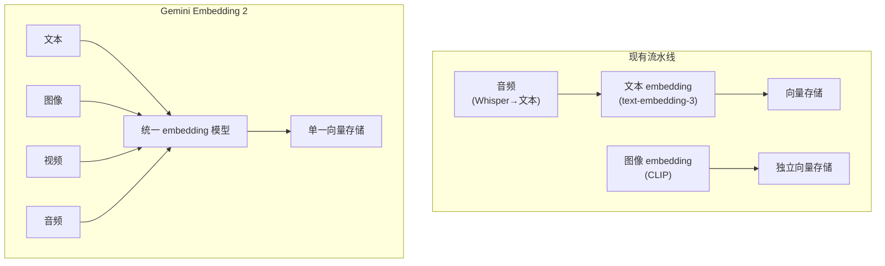
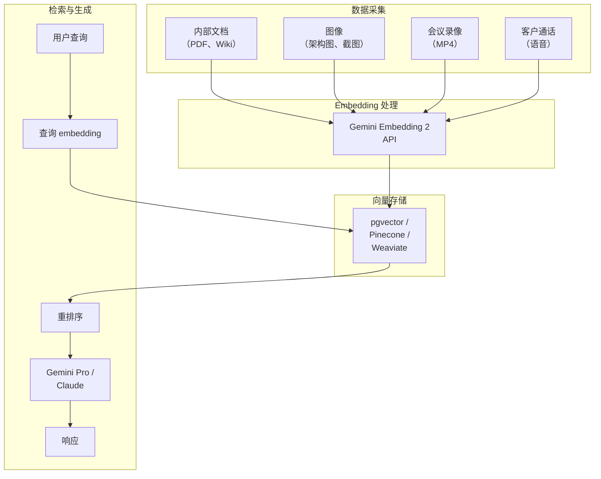

## 为什么需要多模态 embedding

2026年3月10日，Google 发布了 <strong>Gemini Embedding 2</strong>，称其为"我们的首个原生多模态 embedding 模型"。该模型能够将文本、图像、视频、音频和文档映射到<strong>同一个向量空间</strong>。

现有 RAG 流水线最大的限制在于只能处理文本。即使内部 Wiki 中有架构图，产品手册中有截图，在 embedding 阶段也会被全部忽略。结果导致明明存在与用户提问相关的信息，却无法被检索到的情况反复出现。

Gemini Embedding 2 从根本上解决了这个问题。

---

## Gemini Embedding 2 核心规格

### 输入模态

| 模态 | 支持范围 | 限制说明 |
|---------|---------|----------|
| 文本 | 最多 8,192 tokens | 支持 100+ 种语言 |
| 图像 | 每次请求最多 6 张 | PNG、JPEG |
| 视频 | 最长 120 秒 | MP4、MOV |
| 音频 | 原生处理 | 无需中间文字转换 |
| 文档 | PDF 等复合文档 | 文本+图像混合处理 |

### 输出维度

默认输出为 3,072 维向量。核心亮点在于应用了 <strong>Matryoshka Representation Learning（MRL）</strong>。如同套娃玩具一般，信息以嵌套结构排列，即使缩减维度，高层维度中仍保留核心信息。

```
3072维（最高精度）
 └── 1536维（高精度）
      └── 768维（通用）
           └── 256维（轻量，适合移动端/边缘设备）
```

这在实际工作中尤为重要，因为它允许灵活调整<strong>成本与精度的权衡</strong>。对数百万文档建立索引时，可以先用 256 维进行初筛，再对候选结果用 3,072 维重排序，实现两阶段策略。

### API 访问方式

提供两种访问入口：

- <strong>Gemini API（AI Studio）</strong>：适合原型开发和个人开发者，包含免费套餐。
- <strong>Vertex AI（Google Cloud）</strong>：企业级规模，支持 VPC-SC、CMEK 和 IAM 集成。

---

## 与现有 embedding 模型的对比

### 单模态 vs 多模态



现有方案的三个主要问题：

1. <strong>流水线复杂度</strong>：每种模态需要独立的模型、独立的存储和独立的检索逻辑
2. <strong>无法跨模态检索</strong>：无法处理"找出与这张架构图相关的代码"这类查询
3. <strong>中间转换损耗</strong>：音频转文本时会丢失语气和上下文信息

### 主要 embedding 模型规格对比

| 模型 | 模态 | 最大维度 | MRL | 价格（每百万 tokens） |
|------|---------|----------|-----|-----------------|
| OpenAI text-embedding-3-large | 仅文本 | 3,072 | O | $0.13 |
| Cohere embed-v4 | 文本+图像 | 1,024 | O | $0.10 |
| <strong>Gemini Embedding 2</strong> | <strong>文本+图像+视频+音频</strong> | <strong>3,072</strong> | <strong>O</strong> | <strong>免费（预览期）</strong> |
| Voyage AI voyage-3 | 仅文本 | 1,024 | X | $0.06 |

Gemini Embedding 2 的差异化优势十分明显：<strong>唯一原生支持 4 种模态</strong>，输出维度达到顶级水准，且预览期间免费。

---

## 实战应用：构建多模态 RAG 流水线

### 架构设计



### 代码示例：使用 Python SDK

```python
from google import genai

# 初始化客户端
client = genai.Client(api_key="YOUR_API_KEY")

# 文本 embedding
text_result = client.models.embed_content(
    model="gemini-embedding-exp-03-07",
    contents=["사내 보안 정책 문서의 핵심 조항"],
    config={
        "output_dimensionality": 768,  # 通过 MRL 缩减维度
        "task_type": "RETRIEVAL_DOCUMENT"
    }
)
print(f"텍스트 벡터 차원: {len(text_result.embeddings[0].values)}")
# 输出：텍스트 벡터 차원: 768

# 图像 embedding（同一向量空间）
from google.genai import types

image = types.Part.from_uri(
    file_uri="gs://my-bucket/architecture-diagram.png",
    mime_type="image/png"
)
image_result = client.models.embed_content(
    model="gemini-embedding-exp-03-07",
    contents=[image]
)

# 可计算文本与图像向量之间的余弦相似度
import numpy as np

def cosine_similarity(a, b):
    return np.dot(a, b) / (np.linalg.norm(a) * np.linalg.norm(b))

similarity = cosine_similarity(
    text_result.embeddings[0].values,
    image_result.embeddings[0].values
)
print(f"텍스트-이미지 유사도: {similarity:.4f}")
```

### Task Type 使用策略

Gemini Embedding 2 可通过 `task_type` 参数指定 embedding 目的：

| Task Type | 用途 | 应用场景 |
|-----------|------|-------------|
| `RETRIEVAL_DOCUMENT` | 文档索引 | RAG 文档入库时 |
| `RETRIEVAL_QUERY` | 查询编码 | 处理用户检索查询时 |
| `SEMANTIC_SIMILARITY` | 相似度比较 | 重复文档检测、聚类 |
| `CLASSIFICATION` | 分类 | 文档自动分类、标注 |
| `CLUSTERING` | 聚类 | 主题建模、分组 |

<strong>实践提示</strong>：索引和检索时必须使用不同的 task_type。文档入库时使用 `RETRIEVAL_DOCUMENT`，查询时使用 `RETRIEVAL_QUERY`，可以显著提升非对称检索性能。

---

## EM/CTO 视角：引入时的注意事项

### 1. 流水线简化 = 降低运营成本

引入多模态 embedding 最直接的效果是<strong>降低流水线复杂度</strong>。

如果原来针对各模态分别运营独立的 embedding 流水线：
- 模型数量：3〜4 个 → 1 个
- 向量存储：2〜3 个 → 1 个
- 消除同步逻辑
- 减少监控对象

根据 Google 官方博客，部分客户实现了<strong>延迟降低 70%</strong>的效果。

### 2. 评估供应商依赖风险

目前 Gemini Embedding 2 是 Google 专属产品。对于采用多云战略的企业而言：

- <strong>embedding 层抽象化</strong>：将 embedding 模型设计为可替换的接口
- <strong>向量格式兼容</strong>：3,072 维向量与大多数向量数据库兼容
- <strong>利用 MRL</strong>：通过缩减维度，可与其他模型进行维度匹配

### 3. 数据治理

将多模态数据发送至外部 API 涉及治理问题：

- 在 Vertex AI 中可使用 <strong>VPC Service Controls</strong> 设置数据边界
- 支持 <strong>CMEK（客户自管密钥）</strong>
- 建议对会议录像和客户通话语音进行 PII 脱敏后再进行 embedding 处理
- 若有 Data Residency 要求，必须确认区域选择

### 4. 成本模型预测

目前预览期免费，但 GA（正式发布）后预计将开始计费。成本优化策略：

```
索引时：256维（MRL）→ 存储成本降低 87%（相比 3072维）
一次检索：256维 ANN 检索 → 快速且低成本
二次重排序：3072维精确比较 → 仅对前 50 条结果
```

这种两阶段策略在数百万文档规模下可同时优化成本和精度。

---

## 实战迁移检查清单

从纯文本 RAG 迁移到多模态 RAG 时：

1. <strong>数据盘点</strong>：梳理组织内非文本数据（图像、视频、音频）的现状
2. <strong>优先级排序</strong>：从检索失败率较高的文档类型开始应用多模态索引
3. <strong>向量数据库兼容性</strong>：确认现有向量存储是否支持 3,072 维（pgvector、Pinecone、Weaviate 均支持）
4. <strong>A/B 测试</strong>：定量对比原有纯文本 embedding 与多模态 embedding 的检索精度
5. <strong>监控</strong>：跟踪跨模态检索比例、延迟和 embedding API 调用量
6. <strong>安全审查</strong>：获得多模态数据对外传输的安全/合规审批

---

## 结论

Gemini Embedding 2 不只是"一个新的 embedding 模型"，而是<strong>改变 RAG 流水线架构范式的转折点</strong>。

曾经只能处理文本的检索系统，现在可以将图像、视频和音频纳入同一向量空间进行统一检索。这不仅是技术上的进步，更是可以从根本上改变企业利用非结构化数据方式的变革。

从 Engineering Manager 视角出发的核心行动清单：

1. <strong>立即</strong>：在预览期内使用 Gemini API 进行 PoC（免费）
2. <strong>1〜2周内</strong>：整理组织内非文本数据清单
3. <strong>1个月内</strong>：设计对比现有 RAG 流水线与多模态 RAG 的 A/B 测试方案

---

## 参考资料

- [Gemini Embedding 2 官方发布博客](https://blog.google/innovation-and-ai/models-and-research/gemini-models/gemini-embedding-2/)
- [Gemini API 开发者文档](https://ai.google.dev/gemini-api/docs/models/gemini-embedding-2-preview)
- [Vertex AI Gemini Embedding 2 文档](https://docs.cloud.google.com/vertex-ai/generative-ai/docs/models/gemini/embedding-2)
- [VentureBeat：Gemini Embedding 2 分析报道](https://venturebeat.com/data/googles-gemini-embedding-2-arrives-with-native-multimodal-support-to-cut)
