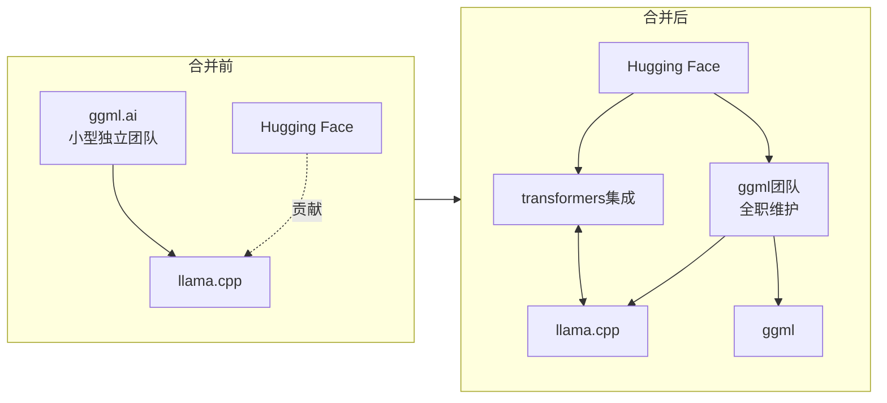
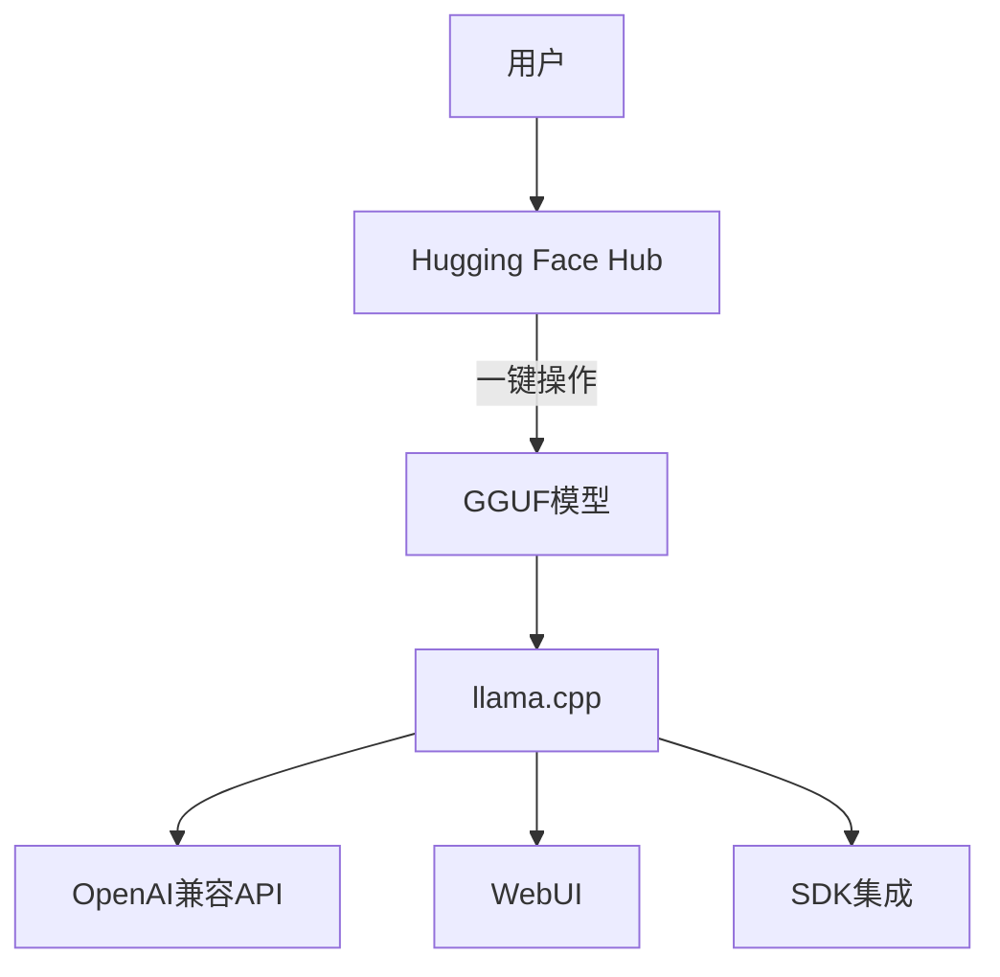
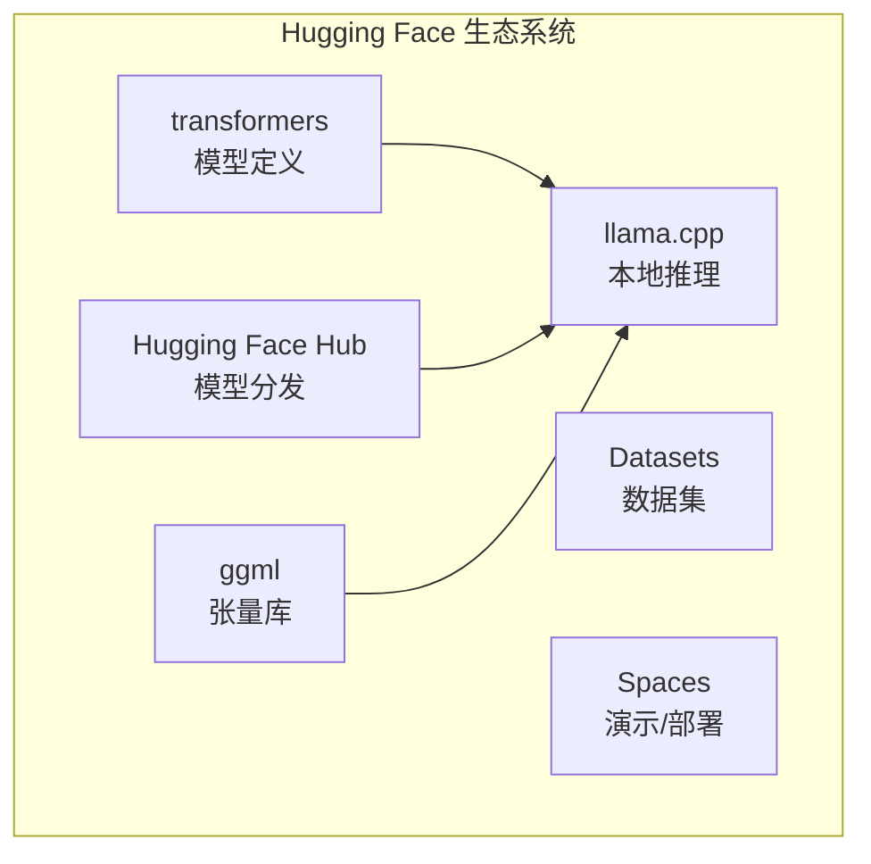

## 概述

2026年2月，开源AI历史迎来了重要转折点。<strong>ggml.ai（llama.cpp创始团队）正式宣布加入Hugging Face</strong>。该消息在Hacker News获得616分，Reddit r/LocalLLaMA总计超过480分，在社区引发了巨大反响。

本文将分析llama.cpp与GGML加入Hugging Face的背景、技术意义，以及本地AI推理生态系统的未来方向。

## llama.cpp与GGML的定位

### 本地AI推理的基础设施

llama.cpp自2023年问世以来，迅速成长为<strong>本地AI推理的事实标准</strong>。这个用C/C++编写的轻量级推理引擎，使得在消费级硬件上运行LLM成为可能，一直走在AI民主化的最前线。

GGML是llama.cpp底层的机器学习张量库。它承担着量子化（Quantization）技术的核心角色，GGUF格式已成为本地模型分发的事实标准。

```
ggml（张量库）
  └── llama.cpp（推理引擎）
        ├── GGUF（模型格式）
        ├── 量子化（Q4_K_M、IQ2_K等）
        └── 服务器功能（OpenAI兼容API）
```

### 数据说话

- GitHub星标：<strong>75,000+</strong>
- 依赖项目：数千个以上（ollama、LM Studio、koboldcpp等）
- 支持架构：LLaMA、Mistral、Qwen、Gemma等主要模型
- 支持硬件：CPU、CUDA、Metal、Vulkan、SYCL

## 合并详情与背景

### 发生了什么

根据[官方公告](https://github.com/ggml-org/llama.cpp/discussions/19759)，Georgi Gerganov及创始团队将加入Hugging Face。关键要点如下：

- <strong>ggml-org项目继续保持开放和社区驱动</strong>
- ggml团队继续全职负责ggml/llama.cpp的领导与维护
- 新合作关系确保项目的长期可持续性
- 重点加强与Hugging Face transformers库的集成

### 为什么选择Hugging Face

ggml.ai自2023年成立以来，一直以小团队支持ggml的开发和社区增长。然而，构建可持续的开发体系始终是一个挑战。

Hugging Face一直是最有力的合作伙伴：

- <strong>@ngxson</strong>和<strong>@allozaur</strong>为ggml和llama.cpp实现了核心功能
- 构建了具有精致UI的推理服务器
- 为llama.cpp引入了多模态支持
- 将llama.cpp集成到Hugging Face Inference Endpoints
- 改善了GGUF格式与Hugging Face平台的兼容性
- 实现了多种模型架构



## 技术重点与未来方向

### 1. 与transformers的无缝集成

最值得关注的技术方向是与Hugging Face transformers库的<strong>"一键"集成</strong>。transformers已确立为AI模型定义的"唯一可信来源（Single Source of Truth）"。

预期的变化包括：

- 新模型发布时GGUF转换速度加快
- 模型架构兼容性问题大幅减少
- 质量控制流程标准化

### 2. 用户体验改善

随着本地推理进入<strong>成为云推理现实替代方案</strong>的阶段，简化普通用户部署和访问本地模型变得至关重要。



### 3. 量子化与推理优化的演进

正如最近合并的IQ*_K/IQ*_KS量子化所示，量子化技术正在快速发展。借助Hugging Face的资源：

- <strong>量子化研究加速</strong>：更多研究人员可以参与
- <strong>基准测试标准化</strong>：与transformers生态系统的集成评估
- <strong>硬件优化</strong>：更容易针对多种后端进行优化

## 生态系统影响

### 对下游项目的影响

对于依赖llama.cpp的主要项目来说，这次合并是一个<strong>积极信号</strong>：

| 项目 | 影响 |
|---|---|
| <strong>ollama</strong> | 受益于llama.cpp持续稳定的开发 |
| <strong>LM Studio</strong> | GGUF格式标准化加速 |
| <strong>koboldcpp</strong> | 持续获得上游改进 |
| <strong>vLLM</strong> | GGML/GGUF互操作性可能提升 |

### 开源AI的结构性变化

这次合并暗示了开源AI生态系统的<strong>集中化趋势</strong>：



Hugging Face现在涵盖了模型的<strong>定义、分发和推理</strong>三大核心要素。

### 担忧与挑战

社区也提出了一些担忧：

- <strong>中心化风险</strong>：对单一企业依赖度增加的警惕
- <strong>潜在利益冲突</strong>：与Hugging Face商业策略的一致性
- <strong>社区治理</strong>：维持决策过程的透明度

不过，官方公告明确表示"社区将继续完全自主运营，并像往常一样做出技术和架构决策"。

## 量子化与推理优化的未来展望

### 短期展望（6个月内）

- 建立transformers到GGUF的<strong>自动转换管道</strong>
- 新模型发布时同步提供GGUF文件
- IQ系列量子化的进一步改进和新方法集成

### 中长期展望（1-2年）

- 利用ggml后端实现<strong>边缘AI推理</strong>标准化
- 浏览器/移动端推理体验大幅改善（WebAssembly集成等）
- 与硬件厂商直接合作关系扩展

## 结论

ggml.ai加入Hugging Face不仅仅是一次组织变更，更是<strong>本地AI推理基础设施归属发生变化的结构性转折点</strong>。

从积极面来看，llama.cpp的长期可持续性得到了保障，与transformers生态系统的集成预计将大幅改善用户体验。同时，对开源AI生态系统集中化的健康监督也是必要的。

本地AI推理的未来将因这次合并而<strong>更加稳定且加速地</strong>演进。

## 参考资料

- [官方公告：ggml.ai joins Hugging Face](https://github.com/ggml-org/llama.cpp/discussions/19759)
- [llama.cpp GitHub 仓库](https://github.com/ggml-org/llama.cpp)
- [Hugging Face transformers](https://github.com/huggingface/transformers)
