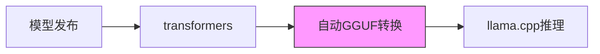
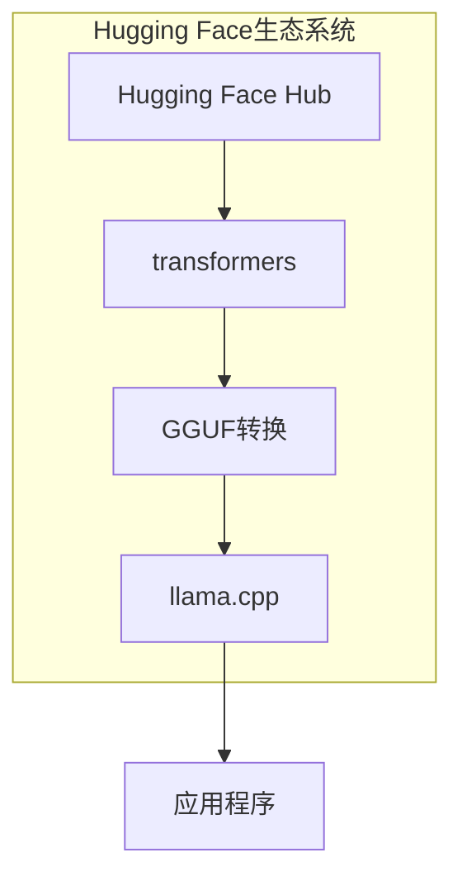

## 概述

2026年2月，<strong>ggml.ai创始团队宣布加入Hugging Face</strong>。随着llama.cpp创始人Georgi Gerganov和核心团队转入Hugging Face，本地AI推理生态系统迎来了结构性转折点。

此次合并并非简单的收购。这是关于<strong>开源项目可持续性</strong>和<strong>本地AI基础设施未来</strong>的战略性决定。该公告在Hacker News上获得616分，在Reddit r/LocalLLaMA上获得314+166分，引发了社区的热烈关注。

## 发布了什么

[官方公告](https://github.com/ggml-org/llama.cpp/discussions/19759)的要点如下：

- <strong>ggml-org项目保持开源且由社区驱动</strong>
- ggml团队继续全职领导、维护和支持ggml和llama.cpp
- 新的合作关系确保项目的长期可持续性
- 将额外关注与Hugging Face [transformers](https://github.com/huggingface/transformers)库的集成改进

## 为什么这次合并很重要

### 1. 解决开源可持续性问题

自2023年出现以来，llama.cpp已成为本地AI推理的事实标准。然而，小团队维护这个庞大项目在可持续性方面面临巨大挑战。有了Hugging Face的资源支持，这个问题从结构上得到了解决。

### 2. transformers-ggml生态系统整合

目前，当新模型发布时，从transformers格式到GGUF格式的转换过程中会出现延迟和兼容性问题。如果官方公告中提到的<strong>"single-click"集成</strong>得以实现：

- 从模型发布到本地推理的时间将大幅缩短
- GGUF文件格式与Hugging Face Hub的集成将更加紧密
- 量化质量控制可以在transformers层面进行

### 3. 用户体验改善

公告中特别值得注意的是面向<strong>"casual users"的部署简化</strong>。这意味着llama.cpp正从开发者工具向通用用户基础设施演进。

## 现有合作成果

Hugging Face的工程师们已经对llama.cpp做出了重大贡献：

| 贡献领域 | 内容 |
|----------|------|
| 核心功能 | 实现ggml和llama.cpp核心功能 |
| 推理服务器 | 构建具有完善UI的稳健推理服务器 |
| 多模态 | 为llama.cpp引入多模态支持 |
| 基础设施集成 | 将llama.cpp集成到HF Inference Endpoints |
| GGUF兼容性 | 改善HF平台与GGUF格式的兼容性 |
| 模型架构 | 实现多种模型架构 |

特别提到了[@ngxson](https://github.com/ngxson)和[@allozaur](https://github.com/allozaur)的突出贡献。

## 社区反应与担忧

### 积极反应

- 对项目长期稳定性得到保障感到欣慰
- 对通过transformers集成加速新模型支持感到期待
- 对Hugging Face友好的开源记录表示信任

### 担忧事项

- 企业合并后开源项目的独立性能否维持
- 商业利益对技术决策的影响
- 社区治理可能发生的变化

## 对本地AI生态系统的影响

此次合并意味着本地AI推理栈的垂直整合：

从<strong>模型仓库 → 模型定义 → 量化 → 推理引擎</strong>，一切都在单一生态系统中管理。这可能带来开发者体验的显著改善，但同时也需要讨论生态系统多样性的问题。

## 技术展望

官方公告中提出的技术目标非常明确：

1. <strong>与transformers的一键集成</strong>：由于transformers框架已确立为模型定义的"source of truth"，改善与ggml生态系统的兼容性是关键
2. <strong>用户体验改善</strong>：随着本地推理作为云推理的替代方案达到有意义的水平，提高普通用户的可访问性至关重要
3. <strong>开源超级智能</strong>：长期愿景提出了"open-source superintelligence accessible to the world"

## 结论

ggml.ai加入Hugging Face象征着本地AI推理生态系统<strong>进入成熟期</strong>。在将开源项目从个人级别提升到产业基础设施级别的过程中，获取可持续资源是必不可少的步骤。

对llama.cpp用户而言，预期将获得切实的收益：更快的模型支持、更好的用户体验以及项目的长期稳定性。同时，需要社区层面的持续关注，以确保开源治理的独立性得到维护。

## 参考资料

- [官方公告：ggml.ai joins Hugging Face](https://github.com/ggml-org/llama.cpp/discussions/19759)
- [llama.cpp GitHub](https://github.com/ggml-org/llama.cpp)
- [Hugging Face transformers](https://github.com/huggingface/transformers)
- [ggml GitHub](https://github.com/ggml-org/ggml)
