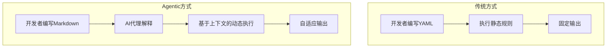
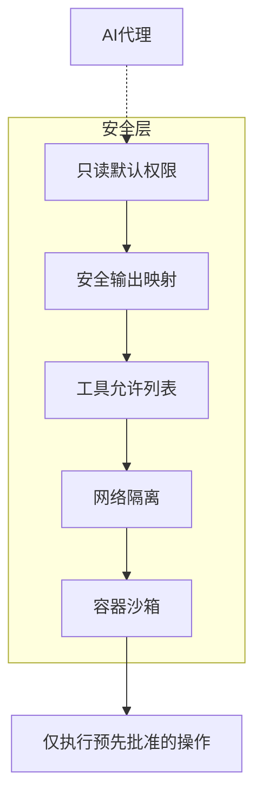
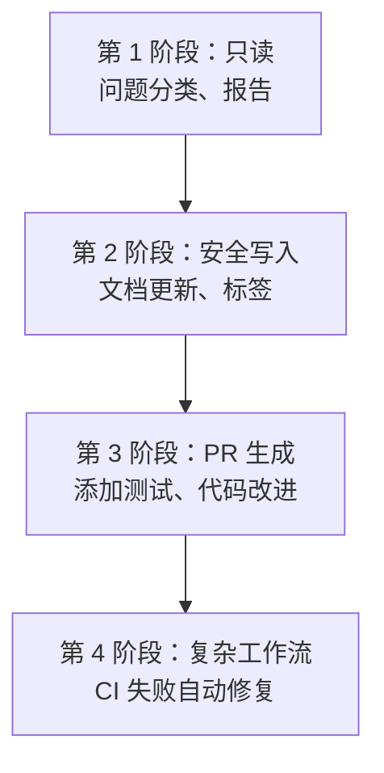

## 概述

2026年2月13日，GitHub 发布了<strong>Agentic Workflows</strong>技术预览。GitHub Actions 是 CI/CD 管道的核心，现在原生集成了 AI 代理，能够自动化以前 YAML 无法处理的领域。

本文分析 Agentic Workflows 的架构、安全模型和 6 种核心使用模式，并从工程经理（EM）的角度提出团队采用策略。

## 什么是 Agentic Workflows？

Agentic Workflows 是<strong>AI 代理执行由自然语言定义的意图的 GitHub Actions 工作流</strong>。不是用 YAML，而是用 Markdown 描述自动化，由 Copilot、Claude Code、Codex 等编码代理执行实际任务。



核心差异是从<strong>基于规则</strong>转变为<strong>基于意图</strong>。以前必须明确指定所有条件，例如"如果标签是 bug，则将分配者设置为 A"。现在只需传递意图："分析问题并分配给适当的负责人"。

## 架构分析

### 工作流文件结构

Agentic Workflows 由两个文件组成。

<strong>1. Markdown 文件 (.md)</strong> — 开发者编写的意图定义：

````markdown
---
on:
  schedule: daily
permissions: read-only
safe-outputs:
  - type: issue-comment
    params:
      title-prefix: "[Auto]"
  - type: label
    params:
      allowed: ["bug", "feature", "docs"]
tools:
  - github-api
---

# 自动分类问题

分析新创建的问题：
1. 根据内容分配适当的标签
2. 识别相关代码区域，基于 CODEOWNERS 建议负责人
3. 在注释中保存分类结果
````

<strong>2. Lock 文件 (.lock.yml)</strong> — CLI 编译的可执行 Actions 工作流：

此文件由 `gh aw compile` 命令自动生成，不直接修改。

### 支持的代理

当前技术预览中支持的代理如下：

| 代理 | 特性 | 成本 |
|------|------|------|
| GitHub Copilot CLI | GitHub 原生，默认配置 | 约 2 个高级请求/执行 |
| Claude Code | Anthropic 模型，复杂推理能力强 | 单独 API 密钥 |
| OpenAI Codex | OpenAI 模型，代码生成专长 | 单独 API 密钥 |

### 安全模型：深度防御

安全是 Agentic Workflows 的核心设计原则。



<strong>核心安全原则</strong>：

- <strong>只读默认</strong>：代理仅获得对存储库的只读访问权限
- <strong>安全输出</strong>：写入操作仅限于预定义的模式（注释、标签等）
- <strong>工具允许列表</strong>：明确限制代理可使用的工具
- <strong>无 PR 自动合并</strong>：保留人工审查权限

此模型比在传统 YAML 工作流中运行代理时更受限制，但更安全。

## 6 种持续 AI 模式

GitHub 将此功能定位为<strong>"持续 AI"</strong>的新概念。这是 AI 持续参与 CI/CD 的范式。

### 1. 持续分类 — 自动问题分类

AI 分析新创建的问题，分配标签，并根据 CODEOWNERS 将其路由到适当的负责人。

<strong>EM 视角</strong>：如果您的团队每周花 2〜3 小时分类问题，仅此模式就能节省大量时间。

### 2. 持续文档 — 自动文档同步

代码更改发生时，AI 自动更新 README 和相关文档。

<strong>EM 视角</strong>："忘记更新文档"这样的 PR 评论消失了。

### 3. 持续简化 — 代码改进建议

AI 定期扫描代码库，发现重构机会，并生成改进 PR。

### 4. 持续测试 — 扩展测试覆盖

分析覆盖率，为不足的区域自动生成测试。

### 5. 持续质量 — CI 失败自动调查

CI 失败时，代理分析日志、诊断原因并提议修复 PR。

<strong>EM 视角</strong>：深夜构建失败时，修复 PR 在第二天早上已经等着您了。

### 6. 持续报告 — 存储库健康报告

定期报告存储库活动、技术债务和测试健康状况。

## 入门指南：5 分钟设置

### 步骤 1：安装 CLI 扩展

```bash
gh extension install github/gh-aw
```

### 步骤 2：编写工作流 Markdown

创建 `.github/workflows/triage.md` 文件：

````markdown
---
on:
  issues:
    types: [opened]
permissions: read-only
safe-outputs:
  - type: issue-comment
  - type: label
    params:
      allowed: ["bug", "feature", "enhancement", "docs", "question"]
---

# 自动分类问题

当新问题打开时：
1. 分析问题标题和正文
2. 分配一个或多个适当的标签
3. 在注释中记录分类原因
````

### 步骤 3：编译并提交

```bash
gh aw compile
git add .github/workflows/triage.md .github/workflows/triage.lock.yml
git commit -m "feat: add agentic workflow for issue triage"
git push
```

### 步骤 4：配置密钥

根据使用的代理，将 API 密钥添加到存储库密钥中。

## EM/VPoE 视角：团队采用策略

### 分阶段采用路线图



### 第 1 阶段（1〜2 周）：从只读操作开始

从问题分类和存储库报告等无副作用的操作开始。这给团队时间评估 AI 代理判断的质量。

### 第 2 阶段（3〜4 周）：安全写入操作

添加文档自动更新和标签等由"安全输出"限制的写入操作。

### 第 3 阶段（1〜2 个月）：PR 生成

扩展到测试生成和代码改进 PR 生成。在此阶段，<strong>必须保留人工审查</strong>。

### 第 4 阶段（3 个月后）：复杂工作流

组成由多个步骤链接的复杂工作流，如 CI 失败自动修复。

### 成本考虑

| 项目 | 预期成本 |
|------|----------|
| Copilot（基础） | 约 2 个高级请求/执行 |
| Claude Code | 基于 API 令牌使用 |
| OpenAI Codex | 基于 API 令牌使用 |
| Actions 执行时间 | 按现有 Actions 计费标准 |

对于小型团队（5〜10 人），您可以以每月 $50〜200 的额外成本开始。

## 与现有 CI/CD 的比较

| 项目 | 传统 YAML 工作流 | Agentic Workflows |
|------|-----------------|------------------|
| 定义方式 | 声明式 YAML | 基于意图的 Markdown |
| 灵活性 | 固定规则 | 上下文自适应 |
| 复杂判断 | 不可能 | AI 推理可行 |
| 安全模型 | 令牌基权限 | 只读 + 安全输出 |
| 调试 | 检查日志 | 跟踪代理推理过程 |
| 成本 | Actions 按分钟计费 | Actions + AI API 成本 |

## 注意事项和限制

<strong>当前限制</strong>：

- 技术预览阶段，生产使用需谨慎
- 代理的判断不总是准确，需配合人工审查
- 成本难以预测（取决于输入令牌数）
- 在私有存储库中，代码上下文会发送给代理提供者

<strong>开源</strong>：

在 MIT 许可证下发布，支持自定义。这是 GitHub Next、Microsoft Research 和 Azure Core Upstream 的联合项目。

## 结论

GitHub Agentic Workflows 展示了 CI/CD 的下一个演进阶段。从"构建和测试代码"转变为"理解和改进代码"。

作为 EM，需要关注的三个核心要点是：

1. <strong>可以逐步采用</strong> — 从只读开始，最小化风险
2. <strong>安全设计强大</strong> — 安全输出和只读默认防止事故
3. <strong>代理选择灵活</strong> — 可在 Copilot、Claude、Codex 中选择适合团队的

从 YAML 到 Markdown、从规则到意图的这一转变很可能成为 2026 年 DevOps 团队的标准。

## 参考资源

- [GitHub Blog: Automate repository tasks with GitHub Agentic Workflows](https://github.blog/ai-and-ml/automate-repository-tasks-with-github-agentic-workflows/)
- [GitHub Changelog: Agentic Workflows Technical Preview](https://github.blog/changelog/2026-02-13-github-agentic-workflows-are-now-in-technical-preview/)
- [The New Stack: GitHub Agentic Workflows Overview](https://thenewstack.io/github-agentic-workflows-overview/)
- [InfoQ: GitHub Agentic Workflows Unleash AI-Driven Repository Automation](https://www.infoq.com/news/2026/02/github-agentic-workflows/)
