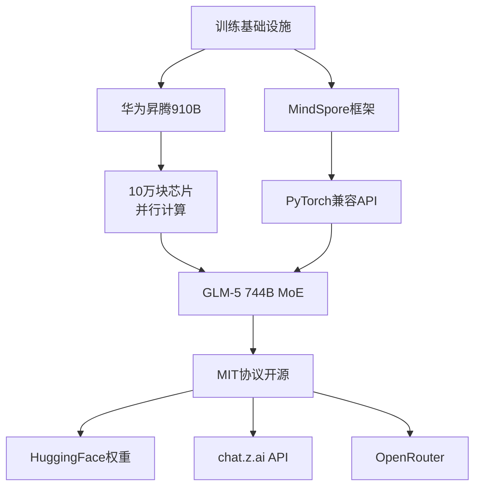
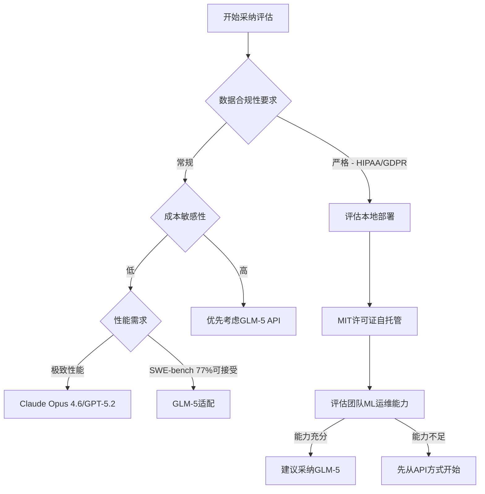

2026年2月13日，智谱AI发布了744B参数的GLM-5，采用MIT许可证完全开源。这不仅仅是一次模型发布，而是对企业AI战略的根本性挑战。一个完全基于华为昇腾芯片训练的前沿级模型，以MIT许可证实现商业自由度，意味着什么？

从Engineering Manager、VPoE、CTO的视角出发，我们来深度分析GLM-5，并推导出可实施的企业采纳战略。

## GLM-5的核心技术指标

### 架构与参数设计

GLM-5采用了<strong>MoE（Mixture of Experts）架构</strong>。总计744B参数中，推理时仅激活40B。这是在保证GPT-4级性能的同时，大幅降低推理成本的关键设计。

| 指标 | 数值 |
|------|------|
| 总参数数 | 744B |
| 活跃参数（推理） | 40B |
| 上下文长度 | 200K tokens |
| 训练数据 | 28.5T tokens |
| 训练硬件 | 华为昇腾910B（10万块） |
| 训练框架 | MindSpore |
| 开源协议 | MIT |

### 基准测试成绩

```
SWE-bench Verified:   77.8%  (Claude Opus 4.6: 80.9%)
BrowseComp:           75.9
Humanity's Last Exam: 50.4%
Vending-Bench 2:      开源第1名
MCP-Atlas:            开源第1名
```

在SWE-bench上达到Claude Opus 4.6（80.9%）的96%水准。考虑到这是开源且MIT许可证模型，行业竞争格局的变化不可小觑。

## "无NVIDIA的前沿AI"——游戏规则改写

GLM-5完全未使用任何NVIDIA GPU。10万块华为昇腾910B芯片配合MindSpore框架完成了这次训练。



这个事实的深层含义：

1. <strong>美国出口管制的实质性突破</strong>：美国商务部（BIS）针对AI芯片的出口限制并未阻止中国达到前沿水平，这反证了政策执行的局限性

2. <strong>NVIDIA生态独占的瓦解</strong>：证明前沿级AI模型可以脱离CUDA生态独立实现，打破硅谷对高性能计算的垄断局面

3. <strong>替代硬件生态的成熟化</strong>：昇腾+MindSpore作为实际可行的竞争栈正在崛起，为多元化基础设施提供了现实案例

从EM/CTO的角度，这不只是地缘政治话题。它成为企业AI基础设施多元化战略的实质性依据。

## 企业角度：成本-性能分析

### API定价对标（2026年3月）

| 模型 | 输入/1M tokens | 输出/1M tokens | 相对成本 |
|------|---------------|---------------|---------|
| Claude Opus 4.6 | $5.00 | $25.00 | 基准（1.0x） |
| GPT-5.2 | $6.00 | $24.00 | 约1.0x |
| GLM-5（API） | $1.00 | $3.20 | <strong>约0.15x</strong> |

GLM-5的API成本仅为Claude Opus 4.6的15%〜20%。在性能接近的前提下，这种成本优势在规模化应用中会产生决定性影响。主要LLM API的完整定价比较请参考[2026年LLM API价格对比：GPT-5、Claude、Gemini、DeepSeek](/zh/blog/zh/llm-api-pricing-comparison-2026-gpt5-claude-gemini-deepseek)。

### 自托管（Self-Hosting）的可行性

MIT许可证意味着企业可以直接下载模型权重，部署到本地或私有云环境。对于医疗、金融、法律等数据合规性要求极高的行业，这是改变游戏规则的一步。

```python
# 从HuggingFace下载GLM-5权重示例
from huggingface_hub import snapshot_download

# MIT许可证 — 商业使用、修改、再发布全部允许
model_path = snapshot_download(
    repo_id="zai-org/GLM-5",
    local_dir="./glm5-weights"
)

# OpenAI兼容API接口 — 现有代码迁移成本最小化
import openai

client = openai.OpenAI(
    base_url="https://open.bigmodel.cn/api/paas/v4/",
    api_key="YOUR_API_KEY"
)

response = client.chat.completions.create(
    model="glm-5",
    messages=[
        {"role": "user", "content": "用Python编写一个REST API服务"}
    ]
)
print(response.choices[0].message.content)
```

## EM/CTO的采纳决策框架

并非所有工作负载都适合GLM-5。按照以下判断标准评估采纳可能性。



### 最适配的使用场景

<strong>GLM-5优势领域：</strong>

- 代码生成、代码审查、测试自动化（SWE-bench 77.8%）
- 海量文档处理与理解（200K上下文窗口）
- 数据隐私规制严格的金融、医疗、法律部门（支持本地部署）
- 创业公司和中小企业的成本优化（相比Claude Opus节省85%）
- AI代理和MCP工作流应用（MCP-Atlas开源第1名）— 如果在评估与GLM-5配合使用的代理框架，请参考[2026年AI代理框架对比：LangGraph vs CrewAI vs Dapr](/zh/blog/zh/ai-agent-framework-comparison-2026-langgraph-crewai-dapr-production)

<strong>现有商用模型仍占优势的场景：</strong>

- 多模态能力是核心需求（Gemini 3.1 Pro领先）
- 实时信息检索的RAG系统
- 极限推理能力的复杂任务（Claude Opus 4.6仍有优势）
- 组织存在对中国AI模型的系统性顾虑

## 实战采纳路线图

### 第一阶段：试点评估（2〜4周）

```bash
# 通过OpenRouter进行快速测试，无需建立专门基础设施
curl https://openrouter.ai/api/v1/chat/completions \
  -H "Authorization: Bearer $OPENROUTER_API_KEY" \
  -H "Content-Type: application/json" \
  -d '{
    "model": "zhipuai/glm-5",
    "messages": [{"role": "user", "content": "评审当前代码库的代码质量"}]
  }'
```

将当前使用Claude Opus或GPT-5.2的工作负载中的10%〜20%切换到GLM-5测试，对比输出品质和成本。

### 第二阶段：工作负载分类与路由（4〜8周）

| 工作负载类型 | 推荐模型 | 原因 |
|-------------|---------|------|
| 代码生成与审查 | <strong>GLM-5</strong> | SWE-bench 77.8%领先，成本低 |
| 复杂推理任务 | Claude Opus 4.6 | 性能顶级 |
| 大规模文档处理 | <strong>GLM-5</strong> | 200K上下文，成本最低 |
| 实时检索RAG | Gemini 3.1 Pro | 最新信息集成 |
| AI代理系统 | <strong>GLM-5</strong> | MCP-Atlas排名第1 |

### 第三阶段：持续成本优化与治理

```python
# 智能模型路由：根据任务复杂度自动分配模型
def route_to_model(task_complexity: str, data_sensitivity: str) -> str:
    """
    根据任务复杂度和数据敏感性智能选择模型
    """
    if data_sensitivity == "high":
        return "glm-5-local"  # 本地部署GLM-5
    elif task_complexity == "simple":
        return "glm-5-api"    # 低成本API
    else:
        return "claude-opus-4-6"  # 保留复杂推理

# 成本节省计算
monthly_tokens = 100_000_000  # 月1亿tokens
claude_cost = monthly_tokens / 1_000_000 * 15  # 平均$15/1M
glm5_cost = monthly_tokens / 1_000_000 * 2.1   # 平均$2.1/1M

# 假设30%工作负载迁移到GLM-5
migrated_portion = 0.3
savings = (claude_cost * migrated_portion) - (glm5_cost * migrated_portion)
print(f"月度节省金额: ${savings:.0f}")  # 约$1,287节省
```

## 地缘政治风险与缓释策略

采纳GLM-5时，也需要同步考虑以下风险因素。

<strong>主要风险清单：</strong>

- 美国政府可能推出新规限制对中国AI模型的使用（政策不确定性）
- 智谱AI作为上市公司（上交所A股）受中国法律管辖（合规变数）
- MIT许可证虽开源，但其硬件基础（华为基础设施）的供应链透明性问题

<strong>风险缓释措施：</strong>

- 对业务关键功能实行多源供应策略（GLM-5 + Anthropic + OpenAI并行）
- 核心决策AI保持审计能力强的模型（Auditability与可解释性）
- 建立定期的监管环境扫描机制，及时应对政策变化

## 总结：GLM-5对EM/CTO的三层含义

GLM-5的出现向行业传递了三个核心信号：

1. <strong>开源前沿模型时代的到来</strong>：商用模型与开源模型的性能鸿沟事实上已经消失，成本曲线的拐点已经出现

2. <strong>NVIDIA垄断的实质性突破</strong>：华为昇腾在744B规模的成功验证证明了替代硬件堆栈的可行性，打破了单一厂商的生态垄断

3. <strong>成本压力的系统性解决</strong>：存在相比Claude Opus节省85%成本的MIT协议模型，这改变了成本与性能的权衡边界

当下无需将所有工作负载迁移到GLM-5。但代码助手、AI代理、大规模文档处理等领域立即启动试点已有充分的技术和经济学依据。

AI采纳已经进入了新的竞争维度：不再是<strong>"用最强的模型"</strong>，而是<strong>"按工作负载特征智能路由最优模型"</strong>。这成为了工程领导力的新标志。关于最新的GPT-5.5与Claude的能力对比，可参考[OpenAI GPT-5.5发布——与Claude的深度对比分析](/zh/blog/zh/openai-gpt-5-5-release-claude-comparison-april-2026)。

## 参考资源

- [GLM-5 HuggingFace模型卡](https://huggingface.co/zai-org/GLM-5)
- [GLM-5官方API文档（Apiyi）](https://help.apiyi.com/en/glm-5-api-guide-744b-moe-agent-tutorial-en.html)
- [China's GLM-5 Rivals GPT-5.2 on Zero Nvidia Silicon](https://awesomeagents.ai/news/glm-5-china-frontier-model-huawei-chips/)
- [GLM-5: 中国首家公开上市AI公司发布前沿模型（Medium）](https://medium.com/@mlabonne/glm-5-chinas-first-public-ai-company-ships-a-frontier-model-a068cecb74e3)
- [智谱AI官方网站](https://www.zhipuai.cn/en)
