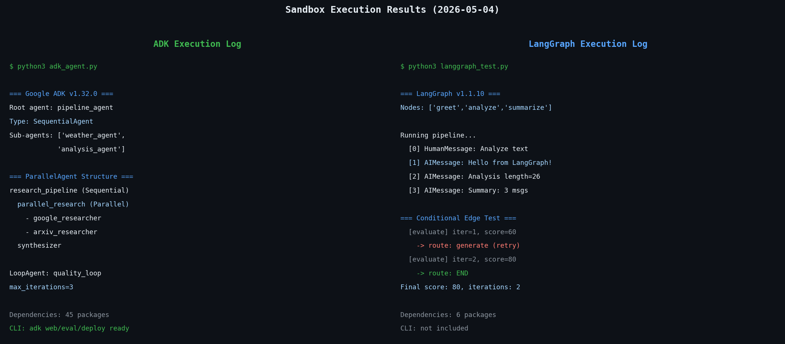

每次出现新的AI智能体框架，我的第一反应都是安装它，弄清楚到底有什么不同。Google开源ADK（Agent Development Kit）时也不例外。这个周末我专门搭建了一个沙盒环境，把Google ADK v1.32.0和LangGraph v1.1.10并排安装，实际运行了代码。这篇文章是实验结果的整理。



## 用代码组装管道，还是设计一张图

Google ADK的核心理念是"将软件开发原则应用于AI智能体"。实际用了之后，这句话的含义就清晰了。ADK用Python类和函数直接定义智能体，内置了`SequentialAgent`、`ParallelAgent`、`LoopAgent`等编排器，可以在代码中自然地声明流程。

```python
from google.adk.agents import Agent, SequentialAgent

weather_agent = Agent(
    name="weather_agent",
    model="gemini-2.5-flash",
    instruction="使用get_weather工具获取天气数据",
    tools=[get_weather],
)

analysis_agent = Agent(
    name="analysis_agent",
    model="gemini-2.5-flash",
    instruction="分析天气数据并给出预报",
)

# 顺序执行: weather → analysis
pipeline = SequentialAgent(
    name="weather_pipeline",
    sub_agents=[weather_agent, analysis_agent],
)
```

不需要单独定义图，也不需要声明边。Python代码本身就表达了流程。

LangGraph的方向截然不同。它将智能体工作流建模为**显式图**。节点代表处理阶段，边定义节点间的转换。先设计图，再在图上添加逻辑。

```python
from langgraph.graph import StateGraph, END
from langgraph.graph.message import add_messages
from langchain_core.messages import AIMessage

class State(TypedDict):
    messages: Annotated[list, add_messages]

def greet_node(state):
    return {"messages": [AIMessage(content="Hello from LangGraph!")]}

builder = StateGraph(State)
builder.add_node("greet", greet_node)
builder.add_node("analyze", analyze_node)
builder.set_entry_point("greet")
builder.add_edge("greet", "analyze")
builder.add_edge("analyze", END)

graph = builder.compile()
```

在我看来：ADK是"用代码组装管道"，LangGraph是"设计状态机"。不是哪个更好，而是哪个对你的问题更自然。

## 依赖数量差异令人吃惊

```bash
pip install google-adk langgraph
```

两者都能安装，但`pip show`一看依赖数量差距相当大：

**Google ADK v1.32.0 直接依赖：45个**
```
google-cloud-aiplatform, google-cloud-bigquery,
google-cloud-spanner, google-cloud-speech,
google-cloud-storage, opentelemetry-exporter-gcp-*,
fastapi, uvicorn, sqlalchemy, mcp ... (共45个)
```

**LangGraph v1.1.10 直接依赖：6个**
```
langchain-core, langgraph-checkpoint,
langgraph-prebuilt, langgraph-sdk,
pydantic, xxhash
```

整整差了39个。ADK这么重的原因很明确：它从一开始就包含了整个Google Cloud栈（BigQuery、Spanner、Pub/Sub、Speech等）。如果不使用Google Cloud，这39个额外依赖全是死重。从依赖列表里有`mcp`就能看出，ADK原生支持MCP服务器接入；至于自己动手做一个MCP服务器再接上去，我在[用FastMCP构建Python MCP服务器](/zh/blog/zh/fastmcp-python-mcp-server-build-guide-2026)里另作了整理。

LangGraph的哲学是"按需取用"。LLM客户端自己注入，检查点后端自己选。更轻量，但要配置的事也更多。

## 多智能体模式对比：条件分支是决定性差异

**ADK的并行执行**（我实际运行的代码）：

```python
parallel_research = ParallelAgent(
    name="parallel_research",
    sub_agents=[google_researcher, arxiv_researcher],
)

pipeline = SequentialAgent(
    name="research_pipeline",
    sub_agents=[parallel_research, synthesizer],
)
```

执行流程：`research_pipeline (SequentialAgent)` → `parallel_research (ParallelAgent)` → `synthesizer`。直观、可读性强。

**LangGraph的条件边**（ADK没有的功能）：

```python
def should_retry(state: State) -> str:
    if state.get("quality_score", 0) < 80:
        return "generate"  # 质量不足 → 重新生成
    return END              # 质量通过 → 结束

builder.add_conditional_edges("evaluate", should_retry)
```

实际运行结果：
```
=== 条件边执行结果 ===
  [evaluate] iteration=1, score=60 → 路由到: generate
  [evaluate] iteration=2, score=80 → 路由到: END
最终分数: 80, 总迭代次数: 2
```

智能体自动重试，直到质量通过。ADK的`LoopAgent`也支持迭代，但终止条件依赖`max_iterations`。"满足这个条件就走这边，否则走那边"的动态分支逻辑，LangGraph的条件边要强大得多。生成-验证-重试的循环就是典型例子。路由智能体、根据多个判断结果分流的场景也一样。这类需要复杂控制流的生产管道，LangGraph明显占优。

## ADK的杀手锏：CLI和内置评估框架

安装ADK时，`adk` CLI也会一起安装。这个意外地好用：

```
$ adk --help
Commands:
  api_server   为智能体启动FastAPI服务器
  create       创建带示例代码的新应用
  deploy       将智能体部署到托管环境
  eval         使用评估集对智能体进行评估
  eval_set     管理评估集
  run          运行智能体的交互式CLI
  web          启动带Web UI的FastAPI服务器
```

`adk web`特别实用——指定智能体代码路径，FastAPI服务器自动启动，可以可视化测试本地智能体。`adk eval`可以定义评估集文件，自动对智能体进行回归测试。LangGraph没有这样的内置CLI。

`adk deploy`支持直接部署到Google Cloud Run或Vertex AI Agent Builder。对于GCP用户，开发到部署都在同一个工具链内完成。

不过，这个CLI完全绑定在Google生态系统内是个遗憾。用AWS或Azure的团队根本用不上`adk deploy`。内置的追踪也是输出到GCP的Cloud Trace，想接入其他可观测性栈需要额外配置。

这方面，像[Langfuse这样的独立LLM追踪工具](/zh/blog/zh/langfuse-self-hosted-llm-tracing-setup-guide-2026)与LangGraph的结合会更自然、更灵活。

## 状态管理对比：会话 vs 检查点

**ADK的状态管理**基于会话：

```python
from google.adk.runners import InMemoryRunner
from google.adk.sessions import InMemorySessionService

session_service = InMemorySessionService()
runner = InMemoryRunner(agent=root_agent, app_name="my_app")
```

ADK通过`session_id`维护多轮对话状态。生产环境可以换用`VertexAiSessionService`实现持久化。

**LangGraph的状态管理**基于TypedDict + 检查点：

```python
from langgraph.checkpoint.memory import MemorySaver

checkpointer = MemorySaver()
graph = builder.compile(checkpointer=checkpointer)

config = {"configurable": {"thread_id": "user-123"}}
result = graph.invoke({"messages": [HumanMessage(content="你好")]}, config)
```

LangGraph的检查点系统更灵活。可以把`MemorySaver`换成PostgreSQL、Redis或SQLite后端，还支持时间旅行调试（回退到过去的检查点）。

只需要换个检查点后端，开发环境和生产环境就能用完全相同的代码运行。不绑定特定云厂商。这点上我认为LangGraph更强。

ADK在MCP工具服务器集成方面胜过LangGraph。`MCPToolset`开箱即用，与MCP服务器的集成简单得多。LangGraph用MCP还需要额外的包和适配代码。

## 核心对比表

| 对比项 | Google ADK v1.32.0 | LangGraph v1.1.10 |
|--------|-------------------|-------------------|
| 直接依赖数量 | 45个 | 6个 |
| 编排方式 | Sequential/Parallel/LoopAgent（代码声明） | StateGraph+节点/边（显式图） |
| 条件分支 | LoopAgent max_iterations（有限） | conditional_edges（强大） |
| 默认LLM | Gemini（支持其他模型） | 模型无关（注入任意LLM） |
| CLI | adk create/run/web/eval/deploy ✓ | 无 |
| 内置Web UI | adk web ✓ | 无 |
| 内置评估框架 | adk eval ✓ | 无（需要外部工具） |
| MCP支持 | MCPToolset内置 ✓ | 需要额外包 |
| 状态管理 | 会话（VertexAI后端） | TypedDict+Checkpoint（后端可替换） |
| 部署目标 | Google Cloud Run / Vertex AI | 云平台无关 |
| OpenTelemetry | GCP导出器内置 | 需手动配置 |
| 时间旅行调试 | 无 | ✓ |
| 多语言SDK | Python, Go, Java, TypeScript | Python（主要） |
| 许可证 | Apache 2.0 | MIT |

## 哪类团队适合哪个框架

**Google ADK适合**：
- 已有Google Cloud基础设施投入的团队
- 以Gemini为主力模型
- 希望从原型到部署在一个工具链内完成
- 不想单独构建智能体评估管道
- 团队有Go、Java或TypeScript成员的混合情况

**LangGraph适合**：
- 需要复杂分支逻辑的智能体工作流
- AWS、Azure或多云环境
- 混合使用OpenAI、Anthropic、Mistral等多种LLM
- 已有基于LangChain的代码库
- 需要时间旅行调试或特定检查点重放的开发流程
- 边缘部署需要最小化依赖

如果今天要开一个新项目，我倾向于选LangGraph。理由很实际：条件分支和检查点灵活性最终是生产级智能体必需的功能，如果之后再加，往往意味着重新设计整体结构。用ADK的`LoopAgent`开始，后来发现需要动态路由，可能就得大改。

话说回来，对于已经在GCP上的团队，ADK工具链是真的好用。`adk deploy`到Cloud Run加上`adk eval`回归测试，在LangGraph生态里复现这套体验要花不少力气。

## 用两个框架各跑一个最小智能体

只做对比意义不大，这里简单交代一下实际怎么上手。

<strong>用 ADK 起步</strong>：

`adk create` 命令以交互方式选择模型，不适合脚本自动化。不如自己建目录结构。

```bash
mkdir my_agent_project
cd my_agent_project
touch __init__.py
touch agent.py
```

`agent.py` 最小示例：

```python
from google.adk.agents import Agent

def simple_tool(text: str) -> dict:
    """处理文本的简单工具"""
    return {"result": f"Processed: {text}", "length": len(text)}

root_agent = Agent(
    name="my_agent",
    model="gemini-2.5-flash",
    description="简单的文本处理智能体",
    instruction="You are a helpful assistant. Use simple_tool to process text.",
    tools=[simple_tool],
)
```

之后运行 `adk web .` 会弹出本地 Web UI，也可以用 `adk run .` 在终端里直接测试。结构简单，新加入团队的人马上就能读懂代码。

<strong>用 LangGraph 起步</strong>：

LangGraph 从一张空图出发。

```python
from typing import TypedDict, Annotated
from langgraph.graph import StateGraph, END
from langgraph.graph.message import add_messages
from langchain_core.messages import HumanMessage, AIMessage
from langchain_openai import ChatOpenAI  # 或 ChatAnthropic

class AgentState(TypedDict):
    messages: Annotated[list, add_messages]

llm = ChatOpenAI(model="gpt-4o")  # 可以换成任意 LLM

def agent_node(state: AgentState):
    response = llm.invoke(state["messages"])
    return {"messages": [response]}

builder = StateGraph(AgentState)
builder.add_node("agent", agent_node)
builder.set_entry_point("agent")
builder.add_edge("agent", END)

graph = builder.compile()

# 运行
result = graph.invoke({
    "messages": [HumanMessage(content="你好！")]
})
print(result["messages"][-1].content)
```

LangGraph 可以用单独的 `langgraph-cli` 包启动本地开发服务器，但它不在主包里。Web UI 也要用 LangGraph Studio，需要另外安装。

简单的聊天机器人两边都能在 10 分钟内跑起来。但智能体越复杂，LangGraph 的显式图越容易推理和调试。ADK 的代码声明方式起初直观，但嵌套的智能体越深，就越难在脑子里追踪执行流。

## 用代码看 ADK 的 MCP 集成，以及生态差异

前面提到的 MCP 优势值得具体看一眼——内置的 `MCPToolset` 实际写起来是这样。

```python
from google.adk.tools.mcp_tool import MCPToolset, StdioServerParameters

mcp_tools = MCPToolset(
    connection_params=StdioServerParameters(
        command="python",
        args=["-m", "my_mcp_server"],
    )
)

agent = Agent(
    name="mcp_agent",
    model="gemini-2.5-flash",
    toolsets=[mcp_tools],
    instruction="Use MCP tools to complete tasks."
)
```

只需指定服务器启动参数，MCP 工具就能直接挂到智能体上；LangGraph 要达到同样效果需要 `langchain-mcp-adapters` 加适配代码。

另一方面，LangGraph 的生态更丰富：`langchain-anthropic`、`langchain-openai`、`langchain-google-genai` 等 LLM 适配器齐全，社区工具集成也多。ADK 为 Gemini 生态做了优化，用其他 LLM 需要额外配置。

从上下文工程的角度看，ADK 默认按会话注入状态，LangGraph 则在图层面用 TypedDict 显式声明全部上下文。如果生产系统需要追踪智能体之间流动的数据，LangGraph 的显式 State 定义对调试有利得多。

## 如果已经有 LangChain 代码库

已有 LangChain 代码的团队，选 LangGraph 自然得多。LangGraph 就是设计在 LangChain 之上运行的，现有的 `ChatOpenAI`、`ChatAnthropic`、`ChatGoogleGenerativeAI` 等 LLM 包装器可以原样复用。提示词模板、记忆类、输出解析器也都兼容。

ADK 则独立于 LangChain 生态运作。把现有 LangChain 代码迁到 ADK 几乎等于重写——ADK 的 `Agent` 类与 LangChain 的链、智能体抽象概念不同，移植并不容易。

选 ADK 的话，现实的做法是当作新项目开始。从一开始就以 Gemini API 和 Google Cloud 服务为中心来设计，才能发挥它的价值。

## 可观测性与调试体验对比

生产环境中智能体行为异常时，定位原因的难易程度在实务中非常重要。

<strong>ADK 的可观测性</strong>：
ADK 内置 OpenTelemetry，支持自动导出到 GCP 的 Cloud Trace、Cloud Monitoring。无需额外代码，智能体执行时间线就出现在 GCP 控制台。已经在用 Google Cloud 的话，零配置即可使用。

`adk web` 启动的本地 UI 也能查看执行历史和事件流。开发阶段能边看智能体流程边调试，是 ADK 的实用优势。

<strong>LangGraph 的可观测性</strong>：
LangGraph 提供自家 UI——LangGraph Studio。按节点可视化图的执行流，尤其有用的是时间旅行功能：回退到某个检查点重新执行。追查"为什么在这个节点分支到了这边"时非常强大。

集成 LangSmith（LangChain 的付费服务）可以获得更详细的追踪，但需要付费方案。想免费用就得自己配置 OpenTelemetry。

两个工具都没有完全内置全栈可观测性。已经在 GCP 技术栈上的话 ADK 占优；供应商中立的环境下，LangGraph 加独立可观测性工具的组合更好。

## 我的结论：设计哲学决定选择

2026年，两个框架都达到了生产可用的水平。区别在于各自优化的方向不同。

ADK优化的是"快速构建智能体系统并部署到GCP"，LangGraph优化的是"精细控制智能体的状态转换"。

比较框架时常见的错误是按功能数量排名。ADK有CLI、有eval、还能部署，所以更好？不对。我认为关键问题是：这个框架的扩展方向是否与我的智能体复杂度增长方向一致？

如果简单管道会进化成复杂分支，就从一开始选LangGraph。如果目标是在Google Cloud生态内快速交付，ADK能省掉很多麻烦。

关于ADK出现之前的LangGraph、CrewAI、Dapr三者比较，可以参考这篇生产KPI对比文章，有助于拓宽LangGraph的选择背景。

## 何时使用，何时避免

只看功能表会让判断变得模糊。真正的决策会收敛到"这个工具是否适合我们的情况"。下面整理在什么时候该选哪个框架，又在什么时候该放手。

**选择 Google ADK 的场景**:

- 基础设施已经建在 Google Cloud（Vertex AI、BigQuery、Cloud Run）之上。`adk deploy` 一行结束部署的价值很实在。
- Gemini 是主力模型，短期内没有更换计划。
- 没有时间自己搭建评估管道和 Web UI。`adk eval` 和 `adk web` 替你完成这些工作。
- 团队用 Go、Java、TypeScript 等非 Python 语言编写智能体。

**避免 Google ADK 的场景**:

- AWS、Azure 是主力，或者是多云环境。`adk deploy` 和绑定 GCP 的追踪会变成死重。
- 部署在 45 个依赖会拖累的轻量环境（无服务器冷启动、边缘）。
- 生成-验证-再生成这类动态条件分支是工作流的核心。`LoopAgent` 的 `max_iterations` 模型表达起来很别扭。
- 需要复用现有的 LangChain 代码库。ADK 要求近乎重写级别的移植。

**选择 LangGraph 的场景**:

- 工作流明显会演进出路由、分支和重试循环。`conditional_edges` 在这里是一等公民。
- 混用多个 LLM（OpenAI、Anthropic、Gemini），或希望保留以后替换的余地。
- 时间旅行调试和检查点重放在运维中很重要。
- 跨云厂商的可移植性很重要。只需替换检查点后端，同一份代码就能在任何地方运行。

**避免 LangGraph 的场景**:

- 是一次性的线性管道，今后也不会变复杂。先设计图的开销过大。
- 想用一个工具搞定部署、评估和 UI，却没有余力另外搭建基础设施。LangGraph 只提供运行时。
- 团队完全没有 LangChain 经验，主力语言又不是 Python。

如果难以抉择，可以在[Python AI 智能体库对比](/zh/blog/zh/python-ai-agent-library-comparison-2026)中一并查看更广的选项。如果是以 RAG 为中心的工作流，[LlamaIndex vs LangChain vs Haystack 对比](/zh/blog/zh/llamaindex-vs-langchain-vs-haystack-rag-2026)展示了框架决策的另一个维度。如果你把类型安全放在首位，[PydanticAI实战教程](/zh/blog/zh/pydantic-ai-type-safe-agent-tutorial-2026)则给出了另一种思路，值得一并对比。

## 一手来源

本文的实测数据和代码均以下列官方文档与仓库为准进行验证。

- [Google ADK 官方文档](https://google.github.io/adk-docs/) — 智能体定义、编排器、CLI 与部署指南
- [google/adk-python (GitHub)](https://github.com/google/adk-python) — ADK Python 源码，Apache 2.0 许可证
- [LangGraph 官方文档](https://langchain-ai.github.io/langgraph/) — StateGraph、检查点与条件边概念
- [langchain-ai/langgraph (GitHub)](https://github.com/langchain-ai/langgraph) — LangGraph 源码，MIT 许可证
