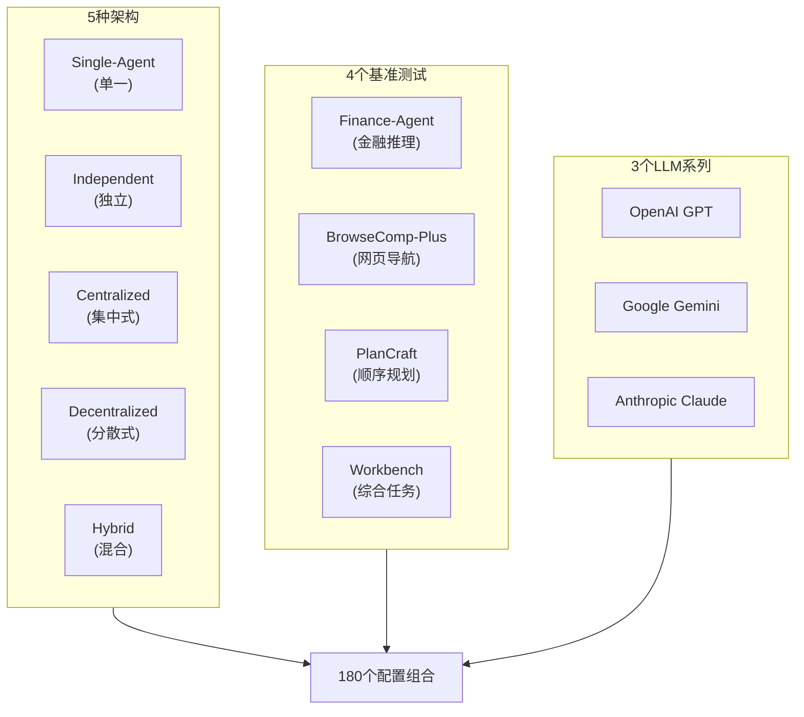
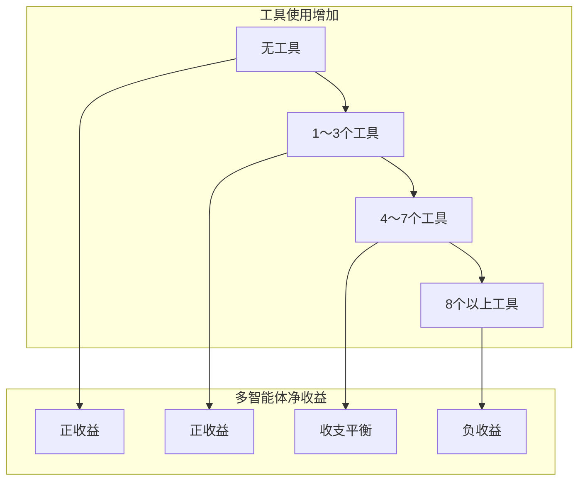

## "增加更多智能体性能就会提升" — 这个信念是错误的

2026年的AI智能体领域存在一个几乎已成教条的信念：<strong>"并行部署更多智能体，性能就会提升。"</strong> LangGraph、CrewAI、AutoGen等多智能体框架的爆炸式增长，以及企业在智能体团队构建上的投资增加，都建立在这一假设之上。

Google Research发表了一项正面推翻这一假设的研究。论文<strong>《Towards a Science of Scaling Agent Systems》</strong>对180个智能体配置进行了定量评估，发现<strong>多智能体系统在特定条件下可能比单一智能体性能降低多达70%</strong>。

对于Engineering Manager而言，这项研究不只是学术兴趣——它从根本上改变了智能体架构设计决策的依据。

---

## 实验设计：180配置、5种架构、4个基准测试

研究团队设计了系统性的控制实验。以往的智能体研究通常只报告特定架构在特定任务上的性能，而这项研究对<strong>任务类型 × 架构 × LLM组合</strong>进行了全面的交叉验证。



**5种架构分类：**

- <strong>Single-Agent</strong>：单一模型执行所有任务（基线）
- <strong>Independent</strong>：多个智能体无通信独立并行运行
- <strong>Centralized</strong>：编排器智能体指挥子智能体（Hub-and-Spoke）
- <strong>Decentralized</strong>：智能体以P2P方式相互通信
- <strong>Hybrid</strong>：集中式与分散式的混合结构

评估使用了OpenAI GPT、Google Gemini、Anthropic Claude三个LLM系列，以避免对特定模型的偏向。

---

## 核心发现1：可并行化 vs 顺序型 — 结果完全相反

研究中最令人震惊的发现是，<strong>多智能体的效果会根据任务类型完全反转</strong>。

### 可并行化任务：+81%提升

在像金融推理（Finance-Agent基准）这样<strong>可独立分解的任务</strong>中，集中式多智能体实现了比单一智能体81%的性能提升。多个智能体分别并行分析不同金融数据段并整合结果的结构确实有效。

### 顺序型任务：-39%〜-70%下降

然而，在PlanCraft这样<strong>具有严格顺序依赖性的任务</strong>中，所有多智能体变体无一例外地降低了性能。

```
单一智能体基线：100%（基准）

Independent 多智能体：-39%
Centralized 多智能体：-52%
Decentralized 多智能体：-61%
Hybrid 多智能体：-70%
```

研究团队将这一现象命名为<strong>"认知预算碎片化（Cognitive Budget Fragmentation）"</strong>。顺序推理需要在维持全局上下文的同时逐步思考的连续认知资源，而多智能体协调开销正好消耗了这些资源。


---

## 核心发现2：错误放大 — 独立智能体危险17.2倍

多智能体系统的另一个危险是<strong>错误传播</strong>。研究结果表明，不同架构类型的错误放大率差异显著。

| 架构 | 错误放大倍数 |
|-----|-----------|
| Single-Agent | 1.0×（基准） |
| Independent 多智能体 | <strong>17.2×</strong> |
| Centralized 多智能体 | <strong>4.4×</strong> |

独立架构错误放大17.2倍的原因很清晰：某个智能体的错误输出成为另一个智能体的输入，产生<strong>错误级联</strong>，错误沿流水线传播。集中式结构因为编排器承担了一定的过滤作用，将放大抑制在4.4倍。

这对生产智能体系统设计有重要启示：<strong>即使在性能方面独立并行执行看似有利，从错误容忍角度也会带来严重风险。</strong>

---

## 核心发现3：工具依赖度越高，多智能体开销越大

第三个原则是<strong>"工具-协调权衡"</strong>。任务所需的工具使用越多——API调用、网页操作、外部数据查询——多智能体协调成本超过收益的时间点就越早到来。



原因在于每个智能体独立调用工具时产生的<strong>上下文同步成本</strong>。如果智能体B需要知道智能体A的API调用结果，共享这一信息的过程会急剧增加LLM上下文窗口使用和推理成本。

---

## 预测框架：87%准确率确定最优架构

这项研究的实用核心是<strong>提前预测最优智能体架构的模型（R² = 0.513）</strong>。输入9个预测变量，可以以87%的准确率为未见任务推荐最优架构。

**9个预测变量：**

1. 基于LLM的性能水平（单一智能体基线）
2. 任务可分解性评分
3. 顺序依赖程度
4. 所需工具数量
5. 工具调用频率
6. 智能体数量
7. 协调复杂度指数
8. 错误容忍需求水平
9. 上下文共享必要性

在实际生产中完全实现这一框架虽然困难，但仅使用核心变量也可以大幅改善决策质量。

---

## 面向Engineering Manager的实战判断标准

基于这项研究，整理了智能体架构选择的实用检查清单。

### 应使用单一智能体的情况

```
✅ 任务是否要求严格的执行顺序？
   （例：代码分析 → 重构 → 测试 → 部署，只能按此顺序）

✅ 是否需要一致地维护完整上下文？
   （例：长文档摘要、复杂推理链）

✅ 每步结果是否强烈依赖上一步？
   （例：没有上一步结果就无法执行下一步）

✅ 错误容忍是否至关重要，必须最小化错误传播风险？

→ 使用单一强大模型
```

### 应使用多智能体（集中式）的情况

```
✅ 任务是否可分解为独立子任务？
   （例：分别分析多份文档后综合）

✅ 是否需要通过并行处理提升速度？

✅ 各子任务是否需要专业化处理？
   （例：代码智能体 + 文档智能体 + 测试智能体）

✅ 能否设计控制错误传播的编排器？

→ 使用集中式多智能体，避免Independent架构
```

### 应避免使用多智能体的情况

```
❌ 单一智能体基线已达到约45%以上性能？
   （性能饱和现象——多智能体无额外收益）

❌ 任务所需工具是否达到8个以上？
   （超过工具-协调权衡阈值）

❌ 任务是否必须进行顺序推理？
   （认知预算碎片化风险）

→ 替换为单一智能体或简单的顺序流水线
```

---

## 2026年智能体工程的新原则

这项研究传递的最重要信息是<strong>"增加智能体数量本身不是战略"</strong>。多智能体系统在正确条件下是强大的，但在错误条件下可能表现得比单一智能体差得多。

根据LangChain的State of Agent Engineering 2026报告，已有57%的组织将智能体部署到生产环境。但与部署速度同等重要的是<strong>为何选择特定架构的定量依据</strong>。

Google Research提供的预测框架并不完美（R² = 0.513）。但将<strong>可测量的变量和可预测的逻辑</strong>引入过去依赖"感觉"或"跟风"的智能体架构决策中，本身就是一大进步。

作为Engineering Manager在设计下一个智能体系统时，在选择多智能体之前，请先提出这个问题：<strong>"这个任务是可并行化的，还是顺序型的？"</strong> 这个答案应该成为架构决策的出发点。

---

## 参考资料

- [Towards a Science of Scaling Agent Systems — Google Research Blog](https://research.google/blog/towards-a-science-of-scaling-agent-systems-when-and-why-agent-systems-work/)
- [arXiv论文：2512.08296](https://arxiv.org/abs/2512.08296)
- [Google Publishes Scaling Principles for Agentic Architectures — InfoQ (2026.03)](https://www.infoq.com/news/2026/03/google-multi-agent/)
- [State of Agent Engineering 2026 — LangChain](https://www.langchain.com/state-of-agent-engineering)
- [Stop Blindly Scaling Agents: A Reality Check from Google & MIT — Medium](https://evoailabs.medium.com/stop-blindly-scaling-agents-a-reality-check-from-google-mit-0cebc5127b1e)
