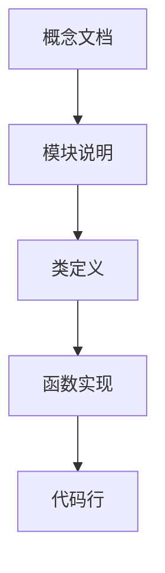
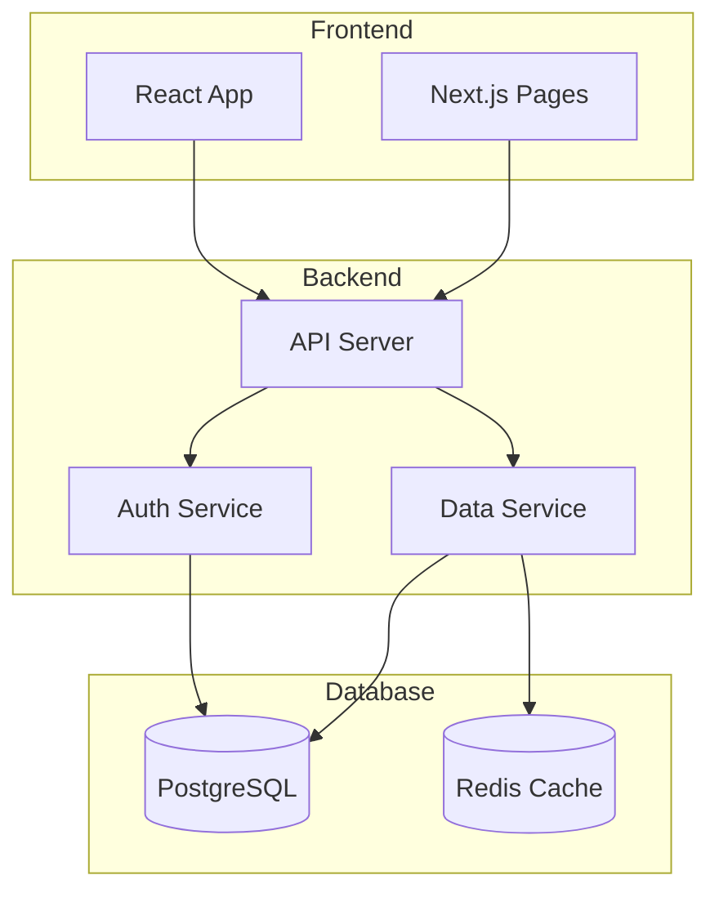
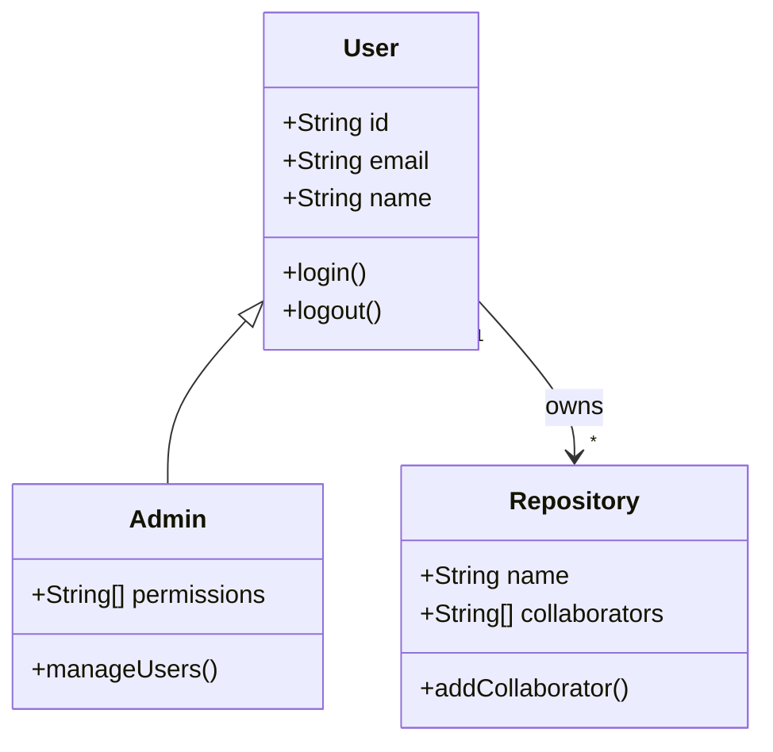
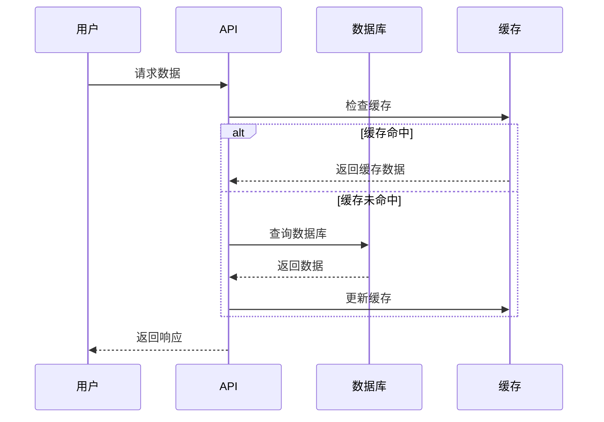

## 引言

代码文档一直是软件开发中的一大痛点。手动编写的文档往往跟不上代码的更新速度，最终变成过时的、误导性的信息。2025年11月13日，Google发布了<strong>Code Wiki</strong>的公开预览版，这是一个基于Gemini AI的革命性代码文档平台，旨在彻底解决这一问题。

本文将全面介绍Code Wiki的功能、使用方法以及实际应用场景，帮助开发者充分利用这一强大工具。

## Code Wiki 是什么？

Code Wiki是Google推出的AI驱动的代码文档平台，它能够<strong>自动扫描整个代码库</strong>并生成结构化、始终保持更新的Wiki文档。与传统的手动文档不同，Code Wiki会在代码变更后自动重新生成文档，确保文档始终与源代码保持同步。

### 与DeepWiki的对比

Code Wiki与2025年早些时候由Cognition Labs（Devin团队）推出的DeepWiki有相似之处，但存在关键差异：

| 特性 | Code Wiki | DeepWiki |
|------|-----------|----------|
| 开发商 | Google | Cognition Labs |
| AI模型 | Gemini | 专有模型 |
| 生态系统 | Google开发者生态 | 独立平台 |
| 私有仓库支持 | 即将推出 | 已支持 |

## 核心功能详解

### 1. 自动更新的结构化Wiki

Code Wiki的核心价值在于<strong>持续更新的文档系统</strong>。当代码库发生变更时，系统会自动重新生成相关文档，消除了手动维护的负担。

<strong>主要特点</strong>：
- 完整扫描整个代码库
- 自动识别代码结构和模式
- 生成层次化的文档结构
- 代码变更后自动更新

### 2. Gemini驱动的聊天代理

内置的对话式AI助手使用始终保持最新的Wiki作为知识库，让开发者能够即时询问关于特定仓库的高度具体的问题。

<strong>使用场景示例</strong>：
```
用户: "这个项目的认证系统是如何工作的？"
Code Wiki: [提供详细解释并指向相关代码文件]

用户: "UserService类的主要方法有哪些？"
Code Wiki: [列出方法并提供使用示例]
```

### 3. 超链接代码引用

Code Wiki提供<strong>深度链接的文档导航</strong>，允许用户从高层概念直接跳转到具体的代码文件、类和函数。



### 4. 自动生成的图表

这是Code Wiki最强大的功能之一。系统能够自动生成三种类型的图表：

#### 架构图（Architecture Diagrams）

展示系统的整体结构和组件之间的关系：



#### 类图（Class Diagrams）

可视化类之间的继承和关联关系：



#### 序列图（Sequence Diagrams）

展示操作流程和组件交互：



## 使用指南

### 步骤1：访问平台

访问 [codewiki.google](https://codewiki.google) 进入Code Wiki平台。

### 步骤2：搜索仓库

在搜索栏中输入GitHub仓库名称。目前，Code Wiki已经为<strong>数百个开源项目</strong>生成了文档。

<strong>支持的仓库类型</strong>：
- 公开的GitHub仓库
- 热门开源框架（React、Vue、Next.js等）
- 各种编程语言的项目

### 步骤3：浏览文档

进入项目页面后，您可以：
- 浏览自动生成的Wiki结构
- 查看架构、类和序列图
- 使用侧边栏导航到特定模块

### 步骤4：使用聊天代理

点击聊天图标，开始与AI助手对话。您可以询问：
- 代码的工作原理
- 特定函数的用途
- 最佳实践和使用模式
- 潜在的改进建议

## Gemini CLI扩展

### 私有仓库支持

Google即将推出<strong>Gemini CLI扩展</strong>，允许团队在本地运行Code Wiki，为私有仓库生成文档。这对于企业级应用尤为重要。

### 加入等待列表

目前，Gemini CLI扩展正在测试阶段。您可以通过以下步骤加入等待列表：

1. 访问Gemini CLI扩展门户
2. 登录Google账户
3. 填写申请表格
4. 等待审批通知

<strong>预期功能</strong>：
- 本地运行，数据不离开企业环境
- 与现有CI/CD管道集成
- 自定义文档生成规则
- 团队协作功能

## 实际应用示例

### 示例1：理解Next.js项目

假设您是一名刚加入团队的开发者，需要快速了解一个复杂的Next.js项目：

<strong>传统方式</strong>：
1. 阅读（可能过时的）README
2. 浏览源代码目录
3. 询问团队成员
4. 耗时：几天〜一周

<strong>使用Code Wiki</strong>：
1. 搜索项目仓库
2. 查看自动生成的架构图
3. 与聊天代理对话，了解关键模块
4. 耗时：30分钟〜2小时

### 示例2：代码审查准备

在进行代码审查前，使用Code Wiki快速了解相关模块：

```
用户: "解释一下这个PR涉及的AuthService的认证流程"

Code Wiki: "AuthService处理用户认证，主要流程如下：
1. validateCredentials() - 验证用户凭证
2. generateToken() - 生成JWT令牌
3. refreshToken() - 刷新过期令牌

相关代码位于 src/services/auth/AuthService.ts..."
```

### 示例3：技术债务识别

使用Code Wiki识别代码库中的潜在问题：

```
用户: "这个项目中有哪些可能需要重构的模块？"

Code Wiki: "根据代码分析，以下模块可能需要关注：
1. UserController.ts - 方法过多(15+)，建议拆分
2. dataUtils.js - 存在重复代码模式
3. legacy/ 目录 - 使用了过时的API..."
```

## 优势与局限

### 优势

<strong>1. 始终保持更新</strong>
- 自动跟踪代码变更
- 无需手动维护
- 消除文档滞后问题

<strong>2. 深度理解代码</strong>
- AI驱动的语义分析
- 不仅是文本搜索，而是真正理解代码含义
- 能够回答复杂问题

<strong>3. 可视化呈现</strong>
- 自动生成多种图表
- 复杂关系一目了然
- 便于新成员快速上手

<strong>4. 提升开发效率</strong>
- 减少阅读代码的时间
- 快速定位相关代码
- 加速入职和知识传递

### 局限

<strong>1. 公开仓库限制</strong>
- 目前仅支持公开仓库
- 私有仓库支持即将推出

<strong>2. 可能的误解</strong>
- AI生成的文档可能不够准确
- 复杂的业务逻辑可能难以完全理解
- 需要人工验证关键信息

<strong>3. 依赖网络连接</strong>
- 需要访问云服务
- 可能存在延迟

<strong>4. 定价未知</strong>
- Gemini CLI扩展的定价尚未公布
- 企业级功能可能需要付费

## 与其他工具的比较

### Code Wiki vs GitHub Copilot

| 功能 | Code Wiki | GitHub Copilot |
|------|-----------|----------------|
| 主要用途 | 代码理解和文档 | 代码生成 |
| 生成内容 | Wiki文档和图表 | 代码建议 |
| 交互方式 | 对话式问答 | 内联建议 |
| 适用场景 | 入职、代码审查、知识管理 | 日常编码 |

### Code Wiki vs 传统文档工具

| 功能 | Code Wiki | Confluence/Notion |
|------|-----------|-------------------|
| 更新方式 | 自动 | 手动 |
| 内容生成 | AI生成 | 人工编写 |
| 代码集成 | 深度集成 | 需要手动链接 |
| 维护成本 | 低 | 高 |

## 最佳实践建议

### 1. 结合使用，而非替代

Code Wiki不应完全替代人工编写的文档。<strong>最佳策略是结合使用</strong>：
- Code Wiki：技术细节、代码结构
- 人工文档：业务逻辑、决策背景、使用指南

### 2. 验证关键信息

对于关键的架构决策或安全相关的代码，务必：
- 验证AI生成的文档
- 与团队成员确认
- 保持批判性思考

### 3. 利用聊天代理

充分利用对话式交互：
- 提出具体问题
- 要求代码示例
- 请求解释复杂概念

### 4. 为私有仓库做准备

如果您的团队计划使用Gemini CLI扩展：
- 加入等待列表
- 评估安全需求
- 准备集成计划

## 未来展望

Code Wiki代表了代码文档的<strong>范式转变</strong>。随着AI技术的发展，我们可以期待：

<strong>短期（3〜6个月）</strong>：
- 私有仓库支持正式发布
- 更多语言和框架支持
- 更精确的图表生成

<strong>中期（6〜12个月）</strong>：
- IDE集成插件
- CI/CD管道集成
- 团队协作功能

<strong>长期（1〜2年）</strong>：
- 多仓库关联分析
- 代码质量建议
- 自动化重构建议

## 总结

Google Code Wiki是一个具有革命性潜力的工具，它通过AI技术解决了代码文档的核心痛点——<strong>保持更新</strong>。通过自动生成的Wiki、智能聊天代理和可视化图表，Code Wiki能够显著提升开发团队的代码理解和知识传递效率。

<strong>推荐使用场景</strong>：
- 新成员入职
- 代码审查
- 技术债务评估
- 开源项目探索

虽然目前还存在一些局限（如仅支持公开仓库），但随着Gemini CLI扩展的推出，Code Wiki将成为企业级开发流程中不可或缺的一部分。

现在就访问 [codewiki.google](https://codewiki.google) 开始体验，并考虑为您的团队加入Gemini CLI扩展的等待列表。

---

<strong>相关资源</strong>：
- [Google Developers Blog - Introducing Code Wiki](https://developers.googleblog.com/en/introducing-code-wiki-accelerating-your-code-understanding/)
- [Gemini CLI扩展等待列表](https://codewiki.google)
- [Code Wiki官方网站](https://codewiki.google)
