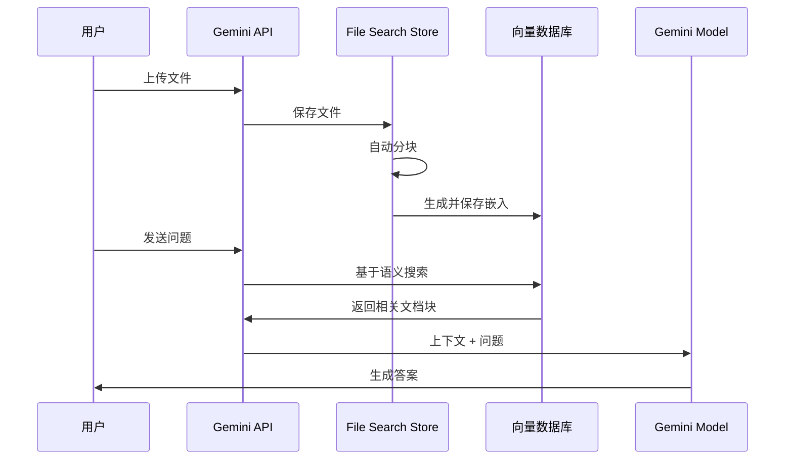
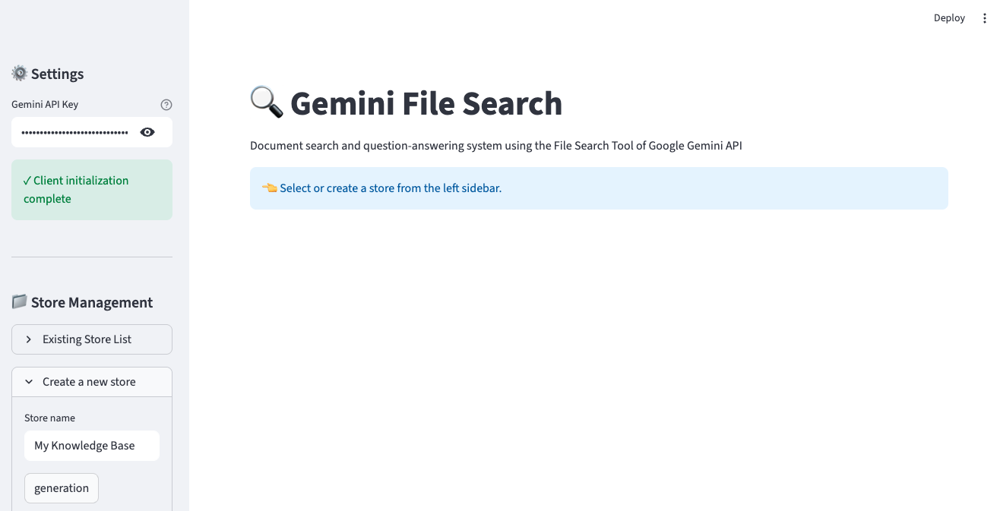
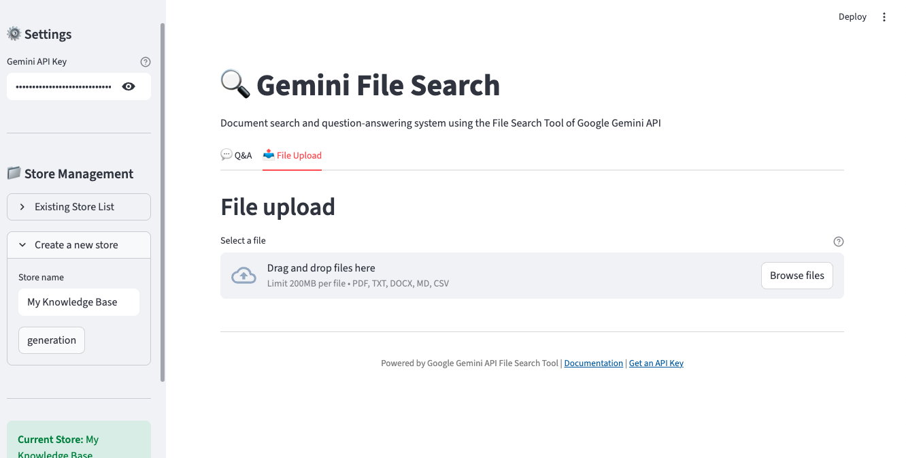
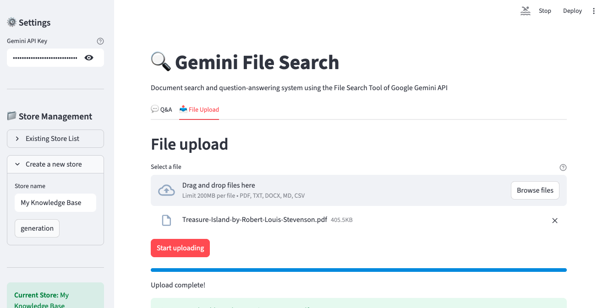
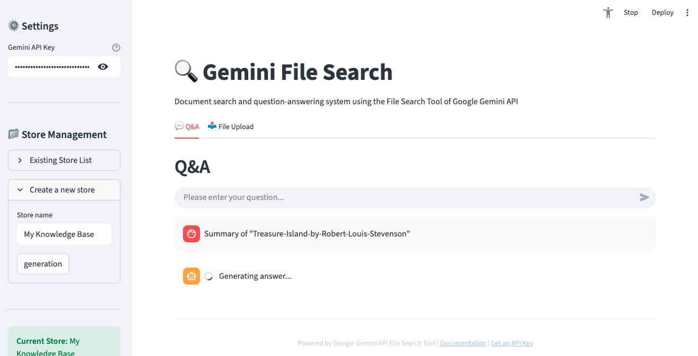
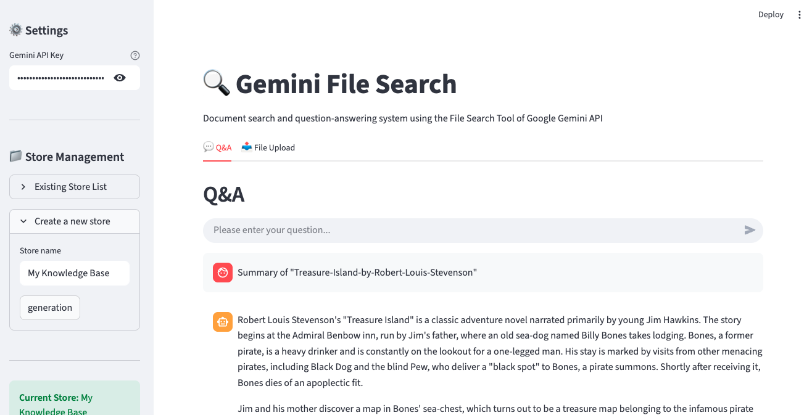

## 概述

2025年11月7日,Google发布了开发者期待已久的创新功能——<strong>Gemini API File Search Tool</strong>。这不仅仅是一个文件检索功能,而是一个完全托管的RAG(检索增强生成,Retrieval Augmented Generation)系统,是彻底改变基于文档问答系统构建方式的游戏规则改变者。

### 为何创新?

传统上,构建RAG系统需要以下复杂的工作:

- 📄 <strong>文档分块(Chunking)</strong>:将文档分割成适当的大小
- 🔢 <strong>生成嵌入(Embedding)</strong>:将每个分块转换为向量
- 🗄️ <strong>管理向量数据库</strong>:配置和运营Pinecone、Weaviate、Chroma等
- 🔍 <strong>优化检索管道</strong>:调优相似度搜索算法
- 🔄 <strong>持续维护</strong>:基础设施扩展、成本管理

<strong>File Search Tool自动化了所有这些过程</strong>,使开发者可以上传文件后立即提问。就像OpenAI的Assistants API所做的那样,但配合Google强大的Gemini模型。

## File Search Tool是什么?

### RAG的基本概念

RAG(检索增强生成)是克服LLM局限性的技术。LLM只知道训练数据,不了解最新信息或特定企业的内部文档。RAG通过以下方式解决这个问题:


### 传统方法 vs File Search Tool

<strong>传统方法</strong>(自行构建):
```python
# 1. 加载文档
documents = load_documents("./docs")

# 2. 分块
chunks = text_splitter.split(documents)

# 3. 生成嵌入
embeddings = openai_embeddings.embed(chunks)

# 4. 保存到向量数据库
vector_db = Pinecone.from_documents(chunks, embeddings)

# 5. 检索和生成
relevant_docs = vector_db.similarity_search(query)
answer = llm.generate(query + relevant_docs)
```

<strong>File Search Tool</strong>(完全托管):
```python
# 1. 创建Store
store = client.file_search_stores.create(
    config={'display_name': 'My Knowledge Base'}
)

# 2. 上传文件(自动分块、嵌入)
operation = client.file_search_stores.upload_to_file_search_store(
    file='document.pdf',
    file_search_store_name=store.name
)

# 3. 提问(自动检索、生成)
response = client.models.generate_content(
    model="gemini-2.5-flash",
    contents="文档的主要内容是什么?",
    config=types.GenerateContentConfig(
        tools=[
            types.Tool(
                file_search=types.FileSearch(
                    file_search_store_names=[store.name]
                )
            )
        ]
    )
)
```

看出区别了吗?<strong>代码量减少了60%以上,复杂的配置完全消失了。</strong>

## 工作原理

File Search Tool通过三个主要阶段工作:



### 第1阶段:索引(Indexing)

上传文件后自动执行:

- <strong>自动分块</strong>:将文档按语义单位分割(默认400 tokens)
- <strong>生成嵌入</strong>:将每个块转换为768维向量
- <strong>保存向量</strong>:存储在Google的托管向量数据库中

### 第2阶段:检索(Retrieval)

用户提问时:

- 将问题转换为嵌入(免费!)
- 用余弦相似度搜索最相关的块
- 选择Top-K个文档片段

### 第3阶段:生成(Generation)

Gemini模型生成答案:

- 使用检索到的文档作为上下文
- 结合原始问题构建提示
- 生成准确且有依据的答案
- 包含引用来源信息

## 主要功能

### 1. 广泛的文件格式支持

File Search Tool支持300+种文件格式:

<strong>应用文件(100+种)</strong>:
- PDF、DOCX、XLSX、PPTX
- JSON、XML、YAML
- SQL、SQLite数据库

<strong>文本文件(200+种)</strong>:
- Markdown、HTML、CSV
- Python、JavaScript、Java、Go等所有主流编程语言
- 日志文件、配置文件

### 2. 自定义分块设置

可根据文档特性调整分块策略:

```python
config={
    'chunking_config': {
        'white_space_config': {
            'max_tokens_per_chunk': 400,  # 每块最大tokens数
            'max_overlap_tokens': 40       # 块间重叠
        }
    }
}
```

<strong>推荐设置</strong>:
- <strong>FAQ文档</strong>:200 tokens(简短精确信息)
- <strong>技术手册</strong>:400 tokens(默认设置,平衡)
- <strong>研究论文</strong>:600 tokens(需要较长上下文)

### 3. 元数据过滤

上传文件时可添加元数据以精细化检索:

```python
custom_metadata=[
    {"key": "author", "string_value": "Robert Graves"},
    {"key": "department", "string_value": "Engineering"},
    {"key": "year", "numeric_value": 2025},
    {"key": "is_public", "boolean_value": True}
]
```

### 4. 引用来源追踪

可以验证来源以提高答案可信度:

```python
response = client.models.generate_content(...)

if hasattr(response, 'grounding_metadata'):
    for citation in response.grounding_metadata.citations:
        print(f"来源: {citation.source}")
        print(f"引用文本: {citation.text}")
```

### 5. 免费查询嵌入

通常嵌入生成需要成本,但File Search Tool<strong>免费提供查询嵌入</strong>。只在索引时产生费用($0.15 / 1M tokens)。

## 实践:Python入门

让我们实际使用File Search Tool。这是我亲自测试的代码教程。

### 环境设置

<strong>使用uv(推荐)</strong>:

```bash
# 安装uv(如果还没有)
curl -LsSf https://astral.sh/uv/install.sh | sh

# 创建项目目录
mkdir gemini-file-search-demo
cd gemini-file-search-demo

# 创建Python虚拟环境
uv venv
source .venv/bin/activate  # Unix/macOS
# .venv\Scripts\activate  # Windows

# 安装所需包
uv pip install google-genai streamlit python-dotenv
```

<strong>使用传统pip</strong>:

```bash
# 需要Python 3.9+
python --version

# 安装包
pip install google-genai streamlit python-dotenv
```

### API密钥获取

1. 访问[Google AI Studio](https://aistudio.google.com)
2. 从左侧菜单选择"Get API key"
3. 点击"Create API key"按钮
4. 复制API密钥

<strong>创建.env文件</strong>:

```bash
GEMINI_API_KEY=your-api-key-here
```

### 基本示例代码

完整工作示例:

```python
import os
import time
from google import genai
from google.genai import types
from dotenv import load_dotenv

# 加载环境变量
load_dotenv()

# 初始化客户端
client = genai.Client()

# 1. 创建File Search Store
print("创建Store中...")
store = client.file_search_stores.create(
    config={'display_name': 'My First Knowledge Base'}
)
print(f"✓ Store创建完成: {store.name}")

# 2. 上传文件
print("\n上传文件中...")
operation = client.file_search_stores.upload_to_file_search_store(
    file='document.pdf',  # 更改为实际文件路径
    file_search_store_name=store.name,
    config={
        'display_name': 'Sample Document',
        'chunking_config': {
            'white_space_config': {
                'max_tokens_per_chunk': 400,
                'max_overlap_tokens': 40
            }
        }
    }
)

# 3. 等待上传完成
while not operation.done:
    print("索引中...")
    time.sleep(5)
    operation = client.operations.get(operation)

print("✓ 文件上传完成")

# 4. 提问
print("\n处理问题中...")
response = client.models.generate_content(
    model="gemini-2.5-flash",
    contents="请将此文档的主要内容总结为3点。",
    config=types.GenerateContentConfig(
        tools=[
            types.Tool(
                file_search=types.FileSearch(
                    file_search_store_names=[store.name]
                )
            )
        ],
        temperature=0.2
    )
)

print("\n=== 答案 ===")
print(response.text)

# 5. 确认引用来源
if hasattr(response, 'grounding_metadata'):
    print("\n=== 来源 ===")
    for idx, citation in enumerate(response.grounding_metadata.citations, 1):
        print(f"{idx}. {citation.source}")
```

## Streamlit Web应用演示

这是我实际实现并测试的Web界面。可以用`uv run python -m streamlit run web_app.py`命令运行。

### Web应用结构

```python
import streamlit as st
from google import genai
from google.genai import types
import time

# 页面配置
st.set_page_config(
    page_title="Gemini File Search",
    page_icon="🔍",
    layout="wide"
)

# 初始化会话状态
if "client" not in st.session_state:
    st.session_state.client = None
if "store" not in st.session_state:
    st.session_state.store = None
if "chat_history" not in st.session_state:
    st.session_state.chat_history = []

# 客户端初始化函数
def initialize_client(api_key):
    try:
        os.environ["GEMINI_API_KEY"] = api_key
        client = genai.Client()
        return client, None
    except Exception as e:
        return None, str(e)

# Store创建函数
def create_store(client, store_name):
    try:
        store = client.file_search_stores.create(
            config={"display_name": store_name}
        )
        return store, None
    except Exception as e:
        return None, str(e)

# 文件上传函数
def upload_file(client, file, store_name):
    try:
        import uuid

        # 创建临时文件
        file_ext = os.path.splitext(file.name)[1]
        temp_file = f"temp_{uuid.uuid4().hex}{file_ext}"

        with open(temp_file, "wb") as f:
            f.write(file.getbuffer())

        # 上传
        operation = client.file_search_stores.upload_to_file_search_store(
            file=temp_file,
            file_search_store_name=store_name,
            config={
                "display_name": file.name,
                "chunking_config": {
                    "white_space_config": {
                        "max_tokens_per_chunk": 400,
                        "max_overlap_tokens": 40
                    }
                }
            }
        )

        # 等待完成
        while not operation.done:
            time.sleep(2)
            operation = client.operations.get(operation)

        # 删除临时文件
        if os.path.exists(temp_file):
            os.remove(temp_file)

        return True, None

    except Exception as e:
        return False, str(e)

# 查询函数
def query_store(client, question, store_name):
    try:
        response = client.models.generate_content(
            model="gemini-2.5-flash",
            contents=question,
            config=types.GenerateContentConfig(
                tools=[
                    types.Tool(
                        file_search=types.FileSearch(
                            file_search_store_names=[store_name]
                        )
                    )
                ],
                temperature=0.2
            )
        )

        # 提取引用信息
        citations = []
        if hasattr(response, "grounding_metadata") and response.grounding_metadata:
            if hasattr(response.grounding_metadata, "citations"):
                for citation in response.grounding_metadata.citations:
                    citations.append({
                        "source": getattr(citation, "source", "N/A"),
                        "text": getattr(citation, "text", "")[:100]
                    })

        return response.text, citations, None

    except Exception as e:
        return None, None, str(e)

# UI构建
st.title("🔍 Gemini File Search")
st.markdown("使用Google Gemini API的File Search Tool进行文档检索与问答系统")

# 侧边栏 - 设置
with st.sidebar:
    st.header("⚙️ 设置")

    api_key = st.text_input(
        "Gemini API Key",
        type="password",
        value=os.getenv("GEMINI_API_KEY", ""),
        help="从Google AI Studio获取的API密钥"
    )

    if api_key and not st.session_state.client:
        client, error = initialize_client(api_key)
        if client:
            st.session_state.client = client
            st.success("✓ 客户端初始化完成")
        else:
            st.error(f"初始化失败: {error}")

    st.divider()

    # Store管理
    if st.session_state.client:
        st.header("📁 Store管理")

        # 创建新Store
        new_store_name = st.text_input("Store名称", value="My Knowledge Base")
        if st.button("创建"):
            with st.spinner("创建Store中..."):
                store, error = create_store(st.session_state.client, new_store_name)
                if store:
                    st.session_state.store = store
                    st.success(f"✓ Store创建: {store.name}")
                    st.rerun()
                else:
                    st.error(f"创建失败: {error}")

        # 当前Store
        if st.session_state.store:
            st.success(f"**当前Store:** {st.session_state.store.display_name}")

# 主区域
if not st.session_state.client:
    st.info("👈 请在左侧边栏输入API密钥")
    st.stop()

if not st.session_state.store:
    st.info("👈 请在左侧边栏创建Store")
    st.stop()

# 用标签分隔功能
tab1, tab2 = st.tabs(["💬 问答", "📤 文件上传"])

# 问答标签
with tab1:
    st.header("问答")

    # 聊天历史
    for chat in st.session_state.chat_history:
        with st.chat_message("user"):
            st.write(chat["question"])

        with st.chat_message("assistant"):
            st.write(chat["answer"])

            if chat.get("citations"):
                with st.expander("📚 引用来源"):
                    for i, citation in enumerate(chat["citations"], 1):
                        st.markdown(f"**{i}. {citation['source']}**")
                        st.text(f"   {citation['text']}...")

    # 问题输入
    question = st.chat_input("请输入问题...")

    if question:
        with st.chat_message("user"):
            st.write(question)

        with st.chat_message("assistant"):
            with st.spinner("生成答案中..."):
                answer, citations, error = query_store(
                    st.session_state.client,
                    question,
                    st.session_state.store.name
                )

                if answer:
                    st.write(answer)

                    if citations:
                        with st.expander("📚 引用来源"):
                            for i, citation in enumerate(citations, 1):
                                st.markdown(f"**{i}. {citation['source']}**")
                                st.text(f"   {citation['text']}...")

                    # 添加到历史
                    st.session_state.chat_history.append({
                        "question": question,
                        "answer": answer,
                        "citations": citations
                    })
                else:
                    st.error(f"错误: {error}")

# 文件上传标签
with tab2:
    st.header("文件上传")

    uploaded_files = st.file_uploader(
        "选择文件",
        accept_multiple_files=True,
        type=["pdf", "txt", "docx", "md", "csv"],
        help="可上传PDF、TXT、DOCX、Markdown、CSV文件"
    )

    if uploaded_files:
        if st.button("开始上传", type="primary"):
            progress_bar = st.progress(0)
            status_text = st.empty()

            for i, file in enumerate(uploaded_files):
                status_text.text(f"上传中: {file.name}")

                success, error = upload_file(
                    st.session_state.client,
                    file,
                    st.session_state.store.name
                )

                if success:
                    st.success(f"✓ {file.name}")
                else:
                    st.error(f"✗ {file.name}: {error}")

                progress_bar.progress((i + 1) / len(uploaded_files))

            status_text.text("上传完成!")
            time.sleep(1)
            st.rerun()
```

### 运行方法

```bash
# 运行Streamlit
uv run python -m streamlit run web_app.py

# 或传统方式
streamlit run web_app.py
```

在浏览器访问`http://localhost:8501`将显示如下界面:

### 实际实现界面

<strong>1. 主界面及Store创建</strong>



在左侧边栏输入Gemini API密钥并创建Store。输入Store名称后点击"generation"按钮即可创建新的File Search Store。

<strong>2. 文件上传界面</strong>



在"File Upload"标签中可同时选择多个文件上传。支持PDF、TXT、DOCX、Markdown、CSV等多种格式。

<strong>3. 问答界面</strong>



在"Q&A"标签中可用自然语言提问已上传的文档。以聊天形式进行对话,并显示引用来源。

<strong>4. Store管理及文件列表</strong>



可查看当前选中Store的信息和已上传的文件列表。

<strong>5. 问答结果示例</strong>



显示实际问题的答案,并可确认答案依据的文档来源。

### 主要功能
- ✅ API密钥设置及客户端初始化
- ✅ File Search Store创建与管理
- ✅ 文件上传(支持多文件同时上传)
- ✅ 对话式问答(聊天界面)
- ✅ 显示引用来源
- ✅ 显示上传进度

## 与现有解决方案的比较

### OpenAI Assistants File Search vs Gemini File Search

| 特性 | OpenAI Assistants | Gemini File Search |
|------|-------------------|-------------------|
| <strong>支持文件格式</strong> | 20+种 | 300+种 |
| <strong>最大文件大小</strong> | 512MB | 100MB |
| <strong>免费查询嵌入</strong> | ✗ | ✓ |
| <strong>分块自定义</strong> | 有限 | 精细控制 |
| <strong>元数据过滤</strong> | ✓ | ✓(将来将增强) |
| <strong>价格(索引)</strong> | $0.10 / GB/day | $0.15 / 1M tokens |
| <strong>模型性能</strong> | GPT-4 Turbo | Gemini 2.5 Pro/Flash |

### LangChain + Vector DB vs 托管RAG

| 方面 | 自行构建(LangChain) | Gemini File Search |
|------|---------------------|-------------------|
| <strong>配置复杂度</strong> | 高(分块、嵌入、向量DB设置) | 低(仅上传文件) |
| <strong>开发时间</strong> | 数天〜数周 | 数分钟 |
| <strong>维护</strong> | 需持续管理 | Google管理 |
| <strong>扩展</strong> | 手动扩展 | 自动扩展 |
| <strong>成本预测</strong> | 复杂(基础设施+运营) | 明确(基于使用量) |
| <strong>自定义</strong> | 完全控制 | 有限控制 |
| <strong>启动成本</strong> | 高(学习曲线) | 低(立即开始) |

### 何时使用哪个?

<strong>选择Gemini File Search</strong>:
- ✅ 快速原型和MVP开发
- ✅ 小型〜中型文档检索系统
- ✅ 开发资源有限时
- ✅ 希望最小化基础设施管理

<strong>考虑自行构建</strong>:
- ✅ 需要完全控制和自定义
- ✅ 需要特殊嵌入模型
- ✅ 必须本地部署
- ✅ 超大规模文档(数百GB以上)

## 实战应用案例

### 1. 客户支持系统

<strong>场景</strong>:基于SaaS产品的FAQ和技术文档构建24/7自动响应系统

```python
# 创建Store
support_store = client.file_search_stores.create(
    config={'display_name': 'Customer Support KB'}
)

# 上传FAQ文档(使用短分块)
faq_files = ['general_faq.pdf', 'technical_faq.pdf', 'billing_faq.pdf']

for faq in faq_files:
    operation = client.file_search_stores.upload_to_file_search_store(
        file=faq,
        file_search_store_name=support_store.name,
        config={
            'chunking_config': {
                'white_space_config': {
                    'max_tokens_per_chunk': 200,  # FAQ使用短答案
                    'max_overlap_tokens': 20
                }
            }
        }
    )
    # 等待完成...

# 处理客户问题
def answer_customer(question):
    response = client.models.generate_content(
        model="gemini-2.5-flash",
        contents=f"""客户问题: {question}

        请参考FAQ文档,按以下格式回答:
        1. 简洁明确的答案
        2. 相关文档链接(如有)
        3. 需要额外帮助时的指引
        """,
        config=types.GenerateContentConfig(
            tools=[
                types.Tool(
                    file_search=types.FileSearch(
                        file_search_store_names=[support_store.name]
                    )
                )
            ],
            temperature=0.2  # 一致的答案
        )
    )
    return response.text
```

<strong>预期效果</strong>:
- 📉 客户支持工单减少30〜50%
- ⚡ 平均响应时间从数小时降至数秒
- 💰 年节省数百万韩元人工成本

### 2. 研究论文分析

<strong>场景</strong>:上传特定主题的数十篇论文并进行综合分析

```python
# 创建研究Store
research_store = client.file_search_stores.create(
    config={'display_name': 'AI Research Papers 2024-2025'}
)

# 从论文文件夹批量上传PDF
import os
papers_dir = './papers'
pdf_files = [f for f in os.listdir(papers_dir) if f.endswith('.pdf')]

for pdf in pdf_files:
    operation = client.file_search_stores.upload_to_file_search_store(
        file=os.path.join(papers_dir, pdf),
        file_search_store_name=research_store.name,
        config={
            'display_name': pdf,
            'chunking_config': {
                'white_space_config': {
                    'max_tokens_per_chunk': 600,  # 论文需要长上下文
                    'max_overlap_tokens': 60
                }
            },
            'custom_metadata': [
                {'key': 'type', 'string_value': 'research_paper'},
                {'key': 'year', 'numeric_value': 2025}
            ]
        }
    )
    # 等待完成...

# 文献综述查询
def literature_review(topic):
    prompt = f"""
    主题: {topic}

    请分析已上传的研究论文并提供:

    1. <strong>研究趋势</strong>:此主题的近期研究动向
    2. <strong>主要方法论</strong>:各论文使用的方法
    3. <strong>共同点和差异</strong>:研究间的比较分析
    4. <strong>研究空白</strong>:尚未涉及的领域
    5. <strong>未来方向</strong>:建议的研究主题

    每项请引用相关论文。
    """

    response = client.models.generate_content(
        model="gemini-2.5-pro",  # 复杂分析使用Pro模型
        contents=prompt,
        config=types.GenerateContentConfig(
            tools=[
                types.Tool(
                    file_search=types.FileSearch(
                        file_search_store_names=[research_store.name]
                    )
                )
            ],
            temperature=0.3
        )
    )
    return response.text

# 使用
review = literature_review("Transformer架构的效率改进")
print(review)
```

<strong>预期效果</strong>:
- 📚 数分钟内分析数十篇论文
- 🔍 发现隐藏的模式和趋势
- 📝 文献综述编写时间缩短80%

### 3. 企业知识管理

<strong>场景</strong>:统一管理部门文档并构建全公司搜索系统

```python
# 按部门创建Store
departments = ['Engineering', 'Marketing', 'Sales', 'HR']
stores = {}

for dept in departments:
    store = client.file_search_stores.create(
        config={'display_name': f'{dept} Knowledge Base'}
    )
    stores[dept] = store

# 统一搜索函数
def search_company_knowledge(question, departments=None):
    """全公司或特定部门搜索"""
    if departments is None:
        departments = list(stores.keys())

    store_names = [stores[dept].name for dept in departments]

    response = client.models.generate_content(
        model="gemini-2.5-flash",
        contents=question,
        config=types.GenerateContentConfig(
            tools=[
                types.Tool(
                    file_search=types.FileSearch(
                        file_search_store_names=store_names
                    )
                )
            ]
        )
    )
    return response.text

# 使用示例
# 全公司搜索
answer = search_company_knowledge("新员工入职流程是什么?")

# 仅搜索特定部门
answer = search_company_knowledge(
    "API认证方法是什么?",
    departments=['Engineering']
)
```

<strong>预期效果</strong>:
- 🚀 信息检索时间缩短90%
- 🤝 促进部门间知识共享
- 💡 利用隐藏的信息资产

### 4. 技术文档检索

<strong>场景</strong>:大规模代码库的文档化和开发者支持

```python
# 代码库文档Store
docs_store = client.file_search_stores.create(
    config={'display_name': 'Codebase Documentation'}
)

# 上传各种文档格式
doc_types = {
    'api_docs': ['*.md', '*.rst'],
    'code_comments': ['*.py', '*.js', '*.go'],
    'config': ['*.yaml', '*.json', '*.toml']
}

# 处理开发者问题
def ask_codebase(question):
    response = client.models.generate_content(
        model="gemini-2.5-flash",
        contents=f"""
        开发者问题: {question}

        请参考代码库文档提供:
        1. 直接答案
        2. 相关代码示例(如有)
        3. 参考文档链接
        4. 注意事项或最佳实践
        """,
        config=types.GenerateContentConfig(
            tools=[
                types.Tool(
                    file_search=types.FileSearch(
                        file_search_store_names=[docs_store.name]
                    )
                )
            ]
        )
    )
    return response.text
```

## 限制和注意事项

### 当前限制

| 项目 | 限制 | 备注 |
|------|------|------|
| <strong>最大文件大小</strong> | 100 MB/文件 | 大文件需分割 |
| <strong>存储大小(Free)</strong> | 1 GB | 生产环境推荐付费计划 |
| <strong>存储大小(Tier 1)</strong> | 10 GB | 适合中小企业 |
| <strong>存储大小(Tier 2)</strong> | 100 GB | 适合大企业 |
| <strong>存储大小(Tier 3)</strong> | 1 TB | 大规模系统 |
| <strong>推荐Store大小</strong> | < 20 GB | 优化搜索性能 |
| <strong>原始文件保留</strong> | 48小时 | 之后自动删除 |

### 注意事项

<strong>1. 数据安全</strong>

- 文件存储在Google服务器上
- 敏感数据应加密或脱敏后上传
- 需确认数据主权问题(特定国家的法律要求)

<strong>2. 成本管理</strong>

```python
# 索引成本预测
文档大小 = 10 MB
tokens数 ≈ 10 MB × 1,000,000 bytes × 0.3 tokens/byte ≈ 3M tokens
成本 = 3M × $0.15 / 1M = $0.45
```

- 防止重复索引(注意相同文件重新上传)
- 定期清理Store(删除不需要的文件)
- 考虑缓存策略(常见问题使用缓存)

<strong>3. Rate Limits</strong>

API调用有速率限制:
- 每分钟请求数限制
- 同时上传限制
- 推荐实现指数退避重试

```python
import time
from google.api_core.exceptions import ResourceExhausted

def upload_with_retry(file, store_name, max_retries=3):
    for attempt in range(max_retries):
        try:
            operation = client.file_search_stores.upload_to_file_search_store(
                file=file,
                file_search_store_name=store_name
            )
            return operation

        except ResourceExhausted:
            if attempt < max_retries - 1:
                wait_time = 2 ** attempt  # 指数退避: 1s, 2s, 4s
                print(f"速率限制。{wait_time}秒后重试...")
                time.sleep(wait_time)
            else:
                raise
```

<strong>4. 搜索质量优化</strong>

搜索结果不满意时:

```python
# 1. 编写更具体的问题
不好的例子: "如何安装?"
好的例子: "在Linux Ubuntu 22.04上使用Docker的初始安装步骤是什么?"

# 2. 调整分块大小
config={
    'chunking_config': {
        'white_space_config': {
            'max_tokens_per_chunk': 200,  # 从默认400减少
            'max_overlap_tokens': 40      # 增加重叠
        }
    }
}

# 3. 提示工程
prompt = f"""
请精确搜索已上传的文档并回答以下问题。

问题: {question}

要求:
- 仅使用文档的准确内容
- 排除猜测或一般知识
- 明确标注来源
- 如果找不到相关信息,回答"文档中未找到"
"""
```

### 价格政策

| 项目 | 价格 | 说明 |
|------|------|------|
| <strong>索引(生成嵌入)</strong> | $0.15 / 1M tokens | 上传文件时一次性 |
| <strong>存储</strong> | 免费 | 当前免费(将来可能变更) |
| <strong>查询嵌入</strong> | 免费 | 提问时生成嵌入免费 |
| <strong>检索tokens</strong> | 标准费率 | 用作上下文的tokens |
| <strong>生成tokens</strong> | 标准费率 | Gemini模型输出 |

<strong>成本节约技巧</strong>:
- 防止相同文件重复索引
- 清理不需要的文档
- 设置适当的分块大小(太小会增加成本)
- 缓存查询结果

## 结论

Google Gemini File Search Tool是RAG系统构建的<strong>范式转变</strong>。无需担心复杂的向量数据库设置、嵌入管理、基础设施扩展等问题,只需上传文件即可立即提问。

### 核心优势总结

✅ <strong>消除进入门槛</strong>:数天的设置缩短为数分钟
✅ <strong>成本效益</strong>:无基础设施成本,基于使用量付费
✅ <strong>自动扩展</strong>:Google管理基础设施
✅ <strong>广泛支持</strong>:300+文件格式
✅ <strong>高质量</strong>:Gemini模型强大的理解能力

### 未来展望

Google在路线图中包含以下改进:

- 🔍 高级元数据过滤查询
- 📊 多模态搜索(图像、表格识别)
- ⚡ 实时文档更新(增量索引)
- 🌐 支持更多文件格式

### 现在开始!

如果需要RAG系统,不再需要经历复杂的构建过程。在Google AI Studio获取API密钥,5分钟内创建您的第一个文档检索系统。

```bash
# 立即开始
pip install google-genai
export GEMINI_API_KEY="your-key"
python your_first_rag.py
```

<strong>文档检索的未来已经到来。🚀</strong>

## 参考资料

### 官方文档
- [File Search官方文档](https://ai.google.dev/gemini-api/docs/file-search)
- [File Search API参考](https://ai.google.dev/api/file-search/file-search-stores)
- [Google AI Studio](https://aistudio.google.com)
- [官方公告博客](https://blog.google/technology/developers/file-search-gemini-api/)

### 相关技术
- [RAG概念论文](https://arxiv.org/abs/2005.11401)
- [语义搜索理解](https://en.wikipedia.org/wiki/Semantic_search)
- [向量数据库指南](https://www.pinecone.io/learn/vector-database/)

### GitHub仓库
- [Gemini API Python SDK](https://github.com/google-gemini/generative-ai-python)
- [示例代码集合](https://github.com/google-gemini/cookbook)
