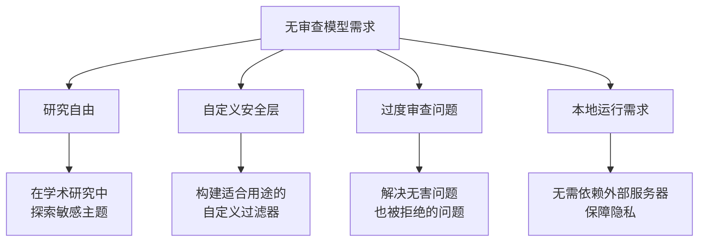
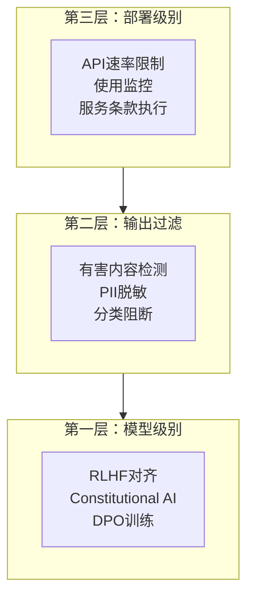
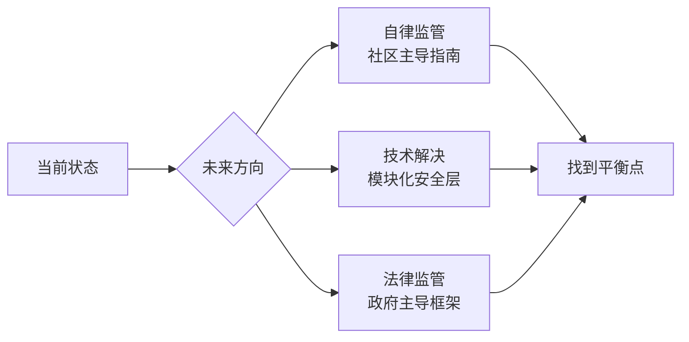

## 概述

2026年初，开源LLM社区掀起了巨大波澜。<strong>GPT-OSS 120B Uncensored</strong>——一个拥有1170亿参数的无审查模型的发布，在Reddit r/LocalLLaMA等社区引发了关于"AI审查撤除"的激烈讨论。

本文将从技术背景、无审查模型受关注的原因，以及围绕安全护栏的技术与伦理争议三个方面进行综合分析。

## 什么是GPT-OSS 120B Uncensored？

### 模型概览

GPT-OSS 120B Uncensored是一个从现有大型语言模型中移除了<strong>安全过滤器（safety filter）</strong>和<strong>基于RLHF的审查层</strong>的开源模型。

- <strong>参数量</strong>：约1170亿（117B）
- <strong>发布平台</strong>：Hugging Face
- <strong>衍生模型</strong>：包括Aggressive版本在内的多种社区微调版本
- <strong>格式</strong>：提供bf16、GGUF等多种量化版本

### "Uncensored"的含义

这里的"Uncensored"并不仅仅意味着允许脏话或成人内容。从技术角度来看，它包含以下变化：

```
标准模型安全管道：
[用户输入] → [输入过滤] → [模型推理] → [输出过滤] → [RLHF对齐] → [响应]

Uncensored模型：
[用户输入] → [模型推理] → [响应]
```

- <strong>移除RLHF对齐</strong>：解除向"有用但无害"方向的强制调整
- <strong>移除拒绝模式</strong>：删除"抱歉，我无法帮助处理该请求"类型的拒绝响应训练数据
- <strong>解除主题限制</strong>：放宽医疗、法律、化学等敏感领域的响应限制

## 为什么无审查模型受到关注？

### 研究者和开发者的视角



r/LocalLLaMA社区支持无审查模型的核心原因如下：

1. <strong>过度审查（Over-censorship）问题</strong>：商业模型频繁拒绝无害请求
2. <strong>研究目的</strong>：偏见研究、红队测试等需要不受限制的模型
3. <strong>自定义安全层</strong>：在基础模型上构建自有安全机制的需求
4. <strong>隐私保护</strong>：在本地处理敏感数据，无需发送到外部API

### 社区反应

该话题在Reddit r/LocalLLaMA上获得了超过224个赞，展示了开源AI社区的强烈关注。主要观点大致分为两派：

- <strong>支持派</strong>："AI模型只是工具，用户应承担责任"
- <strong>担忧派</strong>："不受限制的访问会增加滥用风险"

## 安全护栏争论

### 技术视角：护栏的实现方式

当前LLM的安全保障方法主要分为三个层次：



无审查模型移除的是<strong>第一层（模型级别）</strong>的约束。对研究者而言，这相当于获得了"原材料"的访问权，但同时也意味着所有安全机制都被去除了。

### 伦理视角：开源AI的困境

无审查模型的发布暴露了开源AI的根本困境：

| 争议点 | 开源自由倡导 | 安全优先主张 |
|--------|------------|------------|
| <strong>可及性</strong> | 人人享有平等的AI访问权 | 同时也在武装恶意用户 |
| <strong>透明度</strong> | 消除审查标准的不透明性 | 透明度和无限制是两码事 |
| <strong>创新</strong> | 不受限制的实验促进创新 | 创新不应以社会危害为代价 |
| <strong>责任</strong> | 工具制造者无责，用户负责 | 提供者对可预见的危害负有责任 |

### 监管动态

各主要国家的AI监管动向也在影响这场讨论：

- <strong>EU AI Act</strong>：对高风险AI系统施加义务，正在讨论开源豁免条款
- <strong>美国</strong>：强调基于行政命令的自我监管，对开源模型监管持消极态度
- <strong>日本</strong>：通过AI事业者指南实施软性监管
- <strong>中国</strong>：通过生成式AI管理规定实施强有力的事前监管

## 技术考量

### 本地运行环境

在本地运行120B规模模型的最低要求：

```bash
# bf16全精度：需要约240GB VRAM
# GGUF Q4量化：需要约60-70GB VRAM/RAM
# GGUF Q2量化：需要约35-40GB VRAM/RAM

# 典型运行环境示例（llama.cpp）
./llama-server \
  --model gpt-oss-120b-uncensored-Q4_K_M.gguf \
  --ctx-size 4096 \
  --n-gpu-layers 80 \
  --host 0.0.0.0 \
  --port 8080
```

### 构建自定义安全层

在利用无审查模型的同时确保安全性的方法：

```python
# 在无审查模型上构建自定义安全层的模式
class CustomSafetyLayer:
    def __init__(self, base_model, safety_config):
        self.model = base_model
        self.config = safety_config
        self.classifier = self._load_safety_classifier()
    
    def generate(self, prompt: str) -> str:
        # 输入验证（领域特定自定义规则）
        if self._check_input(prompt):
            response = self.model.generate(prompt)
            # 输出过滤（用途特定自定义规则）
            return self._filter_output(response)
        return self._get_rejection_message(prompt)
    
    def _check_input(self, prompt: str) -> bool:
        # 针对组织/用途的自定义输入验证
        risk_score = self.classifier.evaluate(prompt)
        return risk_score < self.config.threshold
```

这种方法的优势在于能够构建<strong>针对特定用途优化的安全机制</strong>。医疗聊天机器人应用医疗规则，教育用途则应用教育规则。

## 开源AI的未来方向

无审查模型的争论已经超越了简单的"审查 vs 自由"二元对立，扩展为开源AI生态系统的治理问题。



最有前景的方向是<strong>模块化安全架构</strong>：
- 基础模型不受限制地公开
- 安全层作为独立模块提供
- 根据用途选择适当的安全级别
- 明确部署环境中的责任归属

## 结论

GPT-OSS 120B Uncensored的出现向开源AI社区提出了一个根本性问题：<strong>"技术自由与安全能否共存？"</strong>

核心启示总结：

1. <strong>无审查模型本身是中性工具</strong>：研究、自定义安全层构建等正当用途确实存在
2. <strong>过度审查是真实问题</strong>：商业模型的过度拒绝推动了无审查需求
3. <strong>模块化安全是解答</strong>：基础模型与安全层的分离最为现实
4. <strong>需要社区治理</strong>：仅靠法律监管难以控制开源生态系统
5. <strong>持续对话不可或缺</strong>：伦理框架必须跟上技术发展的步伐

只要开源LLM继续发展，这场讨论将始终是AI开发的核心议题。

## 参考资料

- [Reddit r/LocalLLaMA — GPT-OSS 120B Uncensored相关讨论](https://www.reddit.com/r/LocalLLaMA/)
- [Hugging Face — GPT-OSS 120B Uncensored模型页面](https://huggingface.co/models?search=uncensored+120b)
- [EU AI Act官方文档](https://artificialintelligenceact.eu/)
- [NIST AI Risk Management Framework](https://www.nist.gov/artificial-intelligence/ai-risk-management-framework)
