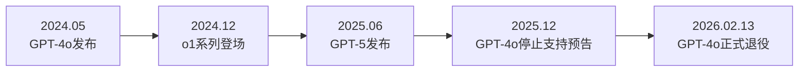
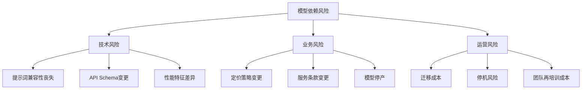
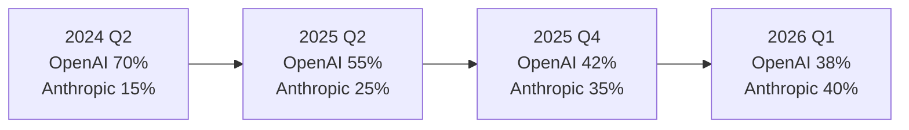
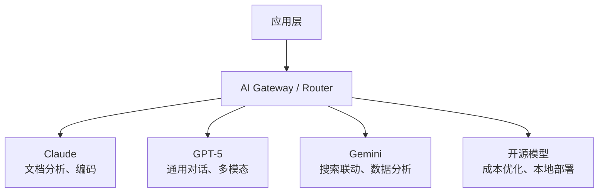
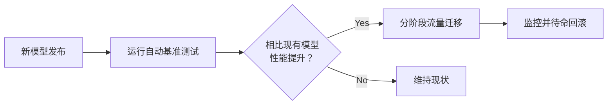

## 概述

2026年2月13日，OpenAI的GPT-4o正式退役。距2024年5月发布仅约两年时间。这一事件不仅仅是简单的模型替换，更是<strong>深刻揭示了依赖单一模型的企业所面临的结构性风险</strong>的典型案例，同时也是理解Anthropic的Claude如何在企业市场实现份额逆转的关键。

本文将分析GPT-4o退役对企业AI战略的影响、Claude在企业市场崛起的原因，以及为什么多模型策略已成为必选项。

## GPT-4o退役：变化何在

### 时间线

GPT-4o于2024年5月发布，迅速成为OpenAI的旗舰模型。凭借多模态能力、快速响应和合理定价，众多企业将其集成到生产系统中。



### 受影响的企业

直接调用GPT-4o API的生产系统企业面临以下挑战：

- <strong>API端点迁移</strong>：应对GPT-4o专用参数和响应格式变更
- <strong>提示词重新优化</strong>：为新模型重写提示词的成本
- <strong>性能回归测试</strong>：验证现有工作流在新模型上保持同等质量
- <strong>成本结构变化</strong>：后继模型Token价格变动带来的预算重组

## 什么是模型依赖风险

### AI版的供应商锁定

与传统软件中的供应商锁定（Vendor Lock-in）类似，AI领域出现了一种新形式的依赖性：<strong>模型锁定（Model Lock-in）</strong>。



### 实际案例：GPT-4o依赖企业的困境

让我们来看看深度依赖GPT-4o的企业面临的典型问题：

1. <strong>提示词工程资产贬值</strong>：数月优化的提示词在新模型上无法同样运行
2. <strong>微调模型的丢失</strong>：基于GPT-4o微调的自定义模型可能失去兼容性
3. <strong>评估标准的重建</strong>：质量基准和评估流水线需要从头构建

## Claude在企业市场份额的逆转

### 企业为什么转向Claude

Anthropic的Claude自2025年下半年起在企业市场展现出显著增长。其背后有几个结构性因素：

<strong>1. 安全性与可靠性优先的理念</strong>

Anthropic以企业友好的形式提供Constitutional AI等安全技术。在监管日趋严格的金融、医疗、法律领域，这一方法赢得了高度信任。

<strong>2. 一致的API策略</strong>

OpenAI频繁的模型更替和API变更给企业客户带来了不确定性，而Anthropic保持了相对稳定的模型版本管理和明确的弃用（deprecation）策略。

<strong>3. 编码与分析能力的领先</strong>

自Claude 3.5 Sonnet以来，Claude系列在编码、文档分析和长文本处理方面超越了竞争模型。特别是在企业内部文档处理和代码审查自动化方面获得了高度评价。

<strong>4. 200K上下文窗口的实用性</strong>

Claude的200K Token上下文窗口在企业环境中为分析长合同、技术文档和代码库提供了直接价值。

### 市场份额变化



以上数据综合了行业分析师的估算，基于企业API使用量。特别值得注意的是，在Fortune 500企业的AI部署案例中，Claude的采用率急剧上升。

## 多模型策略：风险管理之道

### 多模型架构的基本结构

摆脱单一模型依赖的多模型策略具有以下结构：



### 实战实施策略

#### 1. 引入抽象层

```typescript
// AI Gateway抽象示例
interface AIProvider {
  name: string;
  chat(messages: Message[], options: ModelOptions): Promise<Response>;
  embed(text: string): Promise<number[]>;
}

class AIRouter {
  private providers: Map<string, AIProvider>;
  private fallbackChain: string[];

  async route(task: TaskType, messages: Message[]): Promise<Response> {
    const primary = this.selectProvider(task);
    try {
      return await primary.chat(messages, this.getOptions(task));
    } catch (error) {
      // 沿着回退链切换到下一个提供商
      return this.fallback(task, messages, error);
    }
  }

  private selectProvider(task: TaskType): AIProvider {
    // 根据任务类型选择最优提供商
    switch (task) {
      case 'code-review': return this.providers.get('claude');
      case 'multimodal': return this.providers.get('gpt5');
      case 'search-augmented': return this.providers.get('gemini');
      default: return this.providers.get('claude');
    }
  }
}
```

#### 2. 确保提示词可移植性

跨模型可移植的提示词设计原则：

- <strong>不依赖模型特定功能</strong>：避免仅在特定模型上生效的系统提示词技巧
- <strong>使用结构化输出</strong>：基于JSON Schema的响应格式确保跨模型兼容性
- <strong>标准化评估标准</strong>：构建不依赖特定模型的质量评估流水线

#### 3. 持续基准测试



## 企业现在应该做什么

### 可立即执行的清单

1. <strong>审计当前模型依赖度</strong>：列出生产环境中使用的所有AI模型和API调用点
2. <strong>建立回退策略</strong>：构建主力模型故障时自动切换到备选模型的机制
3. <strong>管理提示词资产</strong>：对提示词进行版本控制，自动化模型间转换测试
4. <strong>成本模拟</strong>：预先模拟多模型运营的成本结构
5. <strong>团队能力多元化</strong>：培养AI工程通用能力而非单一模型专家

### 长期视角

AI模型市场未来将变化更快。[仅2026年2月就有7个以上主要模型同时发布](/zh/blog/ai-model-rush-february-2026)。在这样的环境中，<strong>全押单一模型就是在积累技术债务</strong>。

## 结论

GPT-4o的退役是AI行业自然的世代交替，但对未做准备的企业来说却是危机。从这一事件中可以学到的核心教训如下：

1. <strong>单一模型依赖是技术债务</strong>：任何模型最终都会退役
2. <strong>抽象层是保险</strong>：通过AI Gateway进行多模型路由不是可选项，而是必选项
3. <strong>Claude的崛起并非偶然</strong>：稳定性、性能和企业友好的策略推动了市场变革
4. <strong>多模型策略是竞争力</strong>：利用各模型优势的战略方法才是赢家

AI模型是工具。真正的竞争力不是依赖某个工具，而是拥有<strong>随时更换工具的灵活性</strong>。

## 参考资料

- [OpenAI Model Deprecation Policy](https://platform.openai.com/docs/deprecations)
- [Anthropic Claude Enterprise](https://www.anthropic.com/enterprise)
- [2026年2月AI模型大战分析](/zh/blog/ai-model-rush-february-2026)
