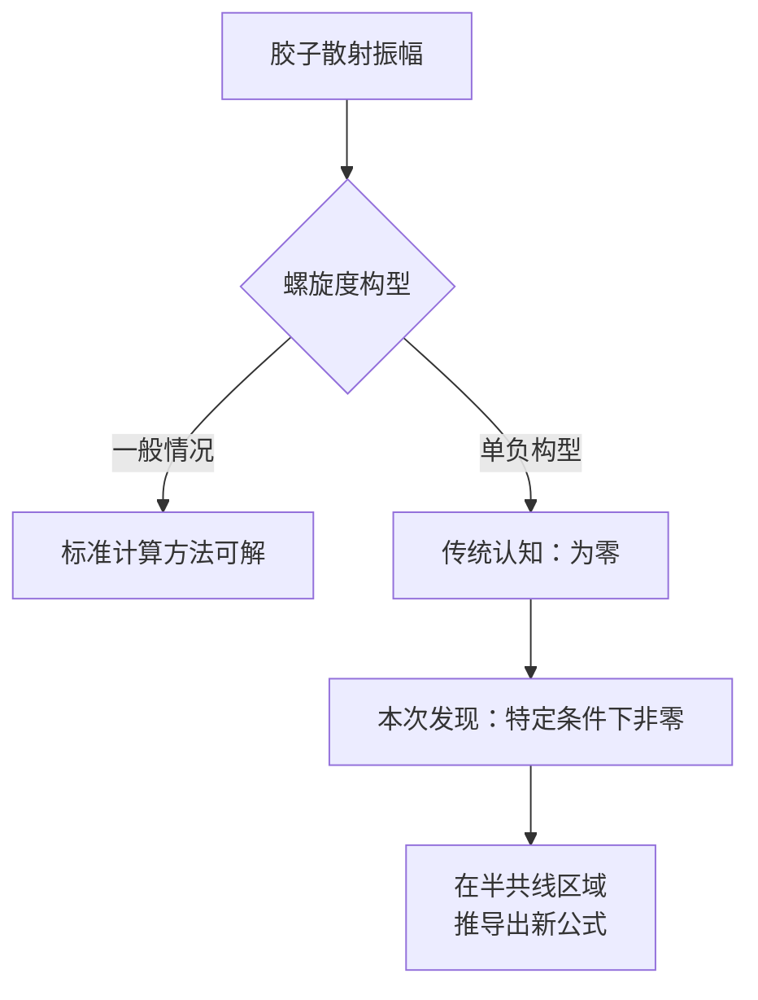
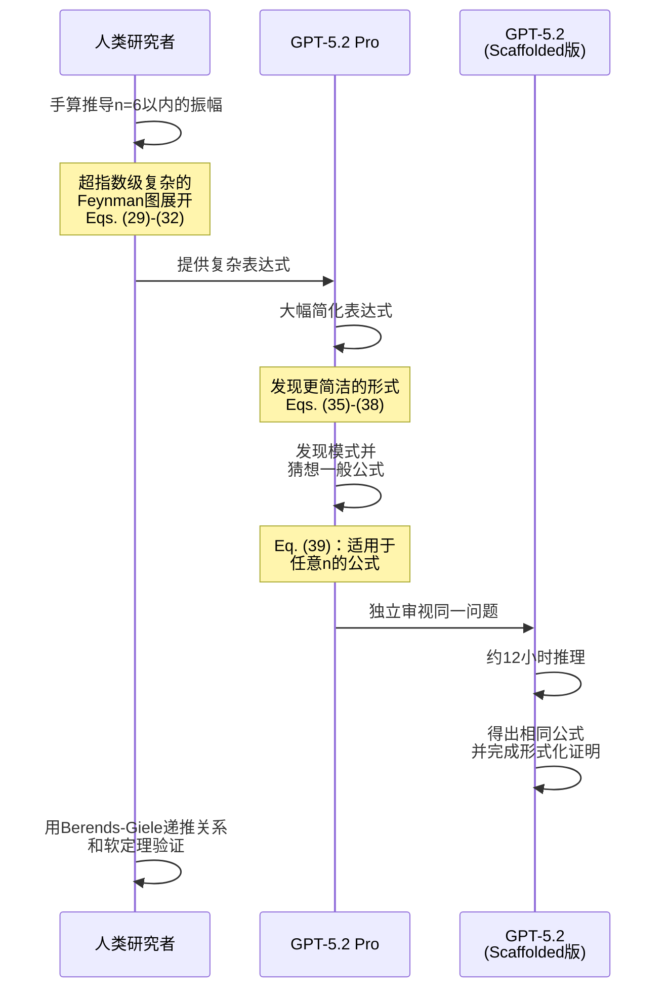
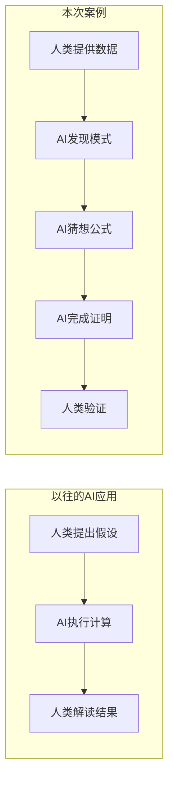
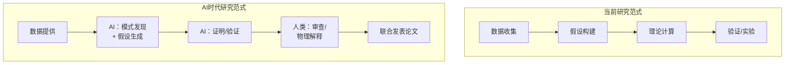

## 概述

2026年2月，OpenAI发布了一项理论物理学领域的突破性成果。<strong>GPT-5.2 Pro</strong>针对胶子（传递强核力的粒子）的散射振幅，<strong>自主推测出了新公式，并完成了形式化证明</strong>。

该成果以预印本形式发布在arXiv上，由普林斯顿高等研究院、哈佛大学、剑桥大学的研究人员共同署名。这标志着AI在科学研究中从"工具"转变为"发现者"的历史性转折点。

## 发现了什么

### 单负胶子振幅的重新发现

论文标题为<strong>"Single-minus gluon tree amplitudes are nonzero"</strong>，涉及粒子物理学的核心概念——散射振幅。

传统教科书认为，当1个胶子具有负螺旋度、其余n-1个具有正螺旋度时，树级振幅必须为零。

然而本研究表明，在被称为<strong>"半共线（half-collinear）区域"</strong>的特定运动学条件下，该振幅并不为零。

### 为什么重要

散射振幅的简化一再揭示了量子场论中更深层的结构。本次发现的意义在于：

- <strong>颠覆教科书常识</strong>：证明长期被认为为零的振幅实际上非零
- <strong>可扩展至引力子</strong>：相同分析适用于传递引力的粒子（引力子）
- <strong>开辟新研究领域</strong>：成为众多后续研究的起点

## AI的角色：从工具到发现者

### GPT-5.2的具体贡献

在这项研究中，AI的角色远非简单的计算辅助。

<strong>步骤1</strong>：人类研究者手算推导了n=6以内的散射振幅，得到了非常复杂的表达式。

<strong>步骤2</strong>：GPT-5.2 Pro大幅简化了这些复杂表达式。

<strong>步骤3</strong>：从简化后的表达式中发现模式，并推测出适用于任意n的一般公式（论文中的Eq. 39）。

<strong>步骤4</strong>：内部的scaffolded版GPT-5.2花费约12小时独立推理，得出相同公式并<strong>完成了形式化证明</strong>。

### 与以往AI应用的本质区别

以往AI应用中，假设的生成是人类的职责。但这一次：

- <strong>模式识别</strong>：从复杂表达式中发现规律性
- <strong>假设生成</strong>：自主推测一般公式
- <strong>证明</strong>：通过约12小时的自主推理完成形式化证明

这是AI承担科学发现过程核心环节的首批重要案例之一。

## 科学界的反响

### 高等研究院 尼马·阿卡尼-哈梅德教授

> "在物理学的这个领域，用教科书方法计算出的物理量表达式看起来极其复杂，但实际上非常简单，这种情况经常发生。（中略）<strong>我期待看到这一趋势在不久的将来发展为通用的'简单公式模式识别'工具。</strong>"

### UCSB 纳撒尼尔·克雷格教授

> "这篇预印本让人<strong>窥见了AI辅助科学的未来</strong>，展示了物理学家与AI携手合作产生和验证新见解的景象。物理学家与LLM之间的对话能够<strong>产生根本性的新知识</strong>，这一点毋庸置疑。"

## 对科学研究工作流的影响

### 研究范式的转变

本次案例展示了科学研究工作流发生根本性变化的可能性。

<strong>1. 超人类的模式识别</strong>

在超指数级复杂的表达式中发现人类难以识别的模式。GPT-5.2实现了这一点，正如阿卡尼-哈梅德教授所指出的，开辟了通往"通用简单公式模式识别工具"的道路。

<strong>2. 长时间自主推理</strong>

12小时的形式化证明完成表明，AI不仅能进行短时间响应，还能进行长时间的深度思考。

<strong>3. 人类与AI的新协作模式</strong>

本研究确立了人类进行基础计算、AI负责更深层发现的新协作模式。作者名单中包含OpenAI的Kevin Weil"代表OpenAI"，正式承认了AI的贡献。

### 未来展望

研究团队已借助GPT-5.2：

- 完成了从胶子到<strong>引力子</strong>的扩展
- 其他推广工作也在进行中
- 这些AI辅助成果将另行报告

## 对工程师的启示

### 技术视角

本案例对软件工程也具有重要启示：

- <strong>AI推理能力的进化</strong>：12小时持续推理和形式化证明暗示了超越代码生成和bug修复的能力
- <strong>与领域专家的协作模式</strong>：人类定义问题、AI探索解决方案的协作模式可推广到其他领域
- <strong>验证的重要性</strong>：人类用已有方法（Berends-Giele递推关系）验证AI结果的流程至关重要

### AI署名权问题

本论文中，OpenAI的Kevin Weil以"代表OpenAI"身份被列为作者。这提出了如何正式认定AI科学贡献的新问题。

## 结论

GPT-5.2推导理论物理学新成果，标志着<strong>AI作为科学发现者发挥作用的历史性转折点</strong>。不仅仅是计算工具，而是承担了模式发现、公式推测和形式化证明——科学发现过程的核心环节。

本案例为AI辅助科学研究的未来提供了一个模板：人类研究者与AI作为平等伙伴协作，达到任何一方都无法单独实现的发现。科学的新时代正在到来。

## 参考资料

- [OpenAI官方公告：GPT-5.2 derives a new result in theoretical physics](https://openai.com/index/new-result-theoretical-physics)
- [arXiv预印本：Single-minus gluon tree amplitudes are nonzero (arXiv:2602.12176)](https://arxiv.org/abs/2602.12176)
