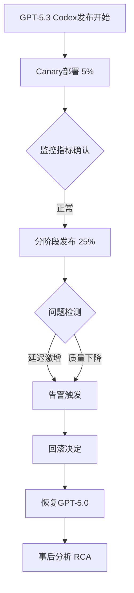
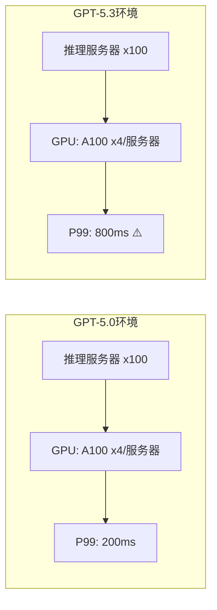

## 概述

2026年2月，GitHub在全平台推出基于GPT-5.3的Codex功能时发现了严重的可靠性问题，决定<strong>临时回滚到上一版本（GPT-5.0）</strong>。这一事件再次提醒我们，AI模型的版本升级不仅仅是功能改进，它直接关系到整个生产基础设施的稳定性。

本文分析GitHub Codex回滚事件的背景和原因，并从工程管理者（EM）的角度讨论如何管理AI模型版本升级的风险。

## 事件经过

### 什么是GPT-5.3 Codex？

Codex是GitHub Copilot的核心引擎，基于OpenAI的GPT模型提供代码生成、自动补全和代码审查等功能。升级到GPT-5.3的目标改进包括：

- <strong>代码生成准确度提升</strong>：增强复杂多文件上下文理解能力
- <strong>响应速度改善</strong>：通过推理优化降低延迟
- <strong>新语言支持</strong>：扩展Rust、Zig等系统编程语言支持

### 发布过程中出现的问题

发布按照分阶段方式（canary → staged rollout）进行，但在大规模扩展部署阶段出现了以下问题：

1. <strong>响应延迟激增</strong>：P99延迟比原来增加3-5倍
2. <strong>代码建议质量下降</strong>：TypeScript、Python等特定语言的幻觉率上升
3. <strong>VSCode扩展崩溃</strong>：内存使用量激增导致IDE不稳定
4. <strong>API限流问题</strong>：后端推理服务器过载引发连锁故障

### 回滚决定

GitHub工程团队综合考虑<strong>用户影响程度</strong>和<strong>恢复时间</strong>，决定立即回滚到GPT-5.0。这是基于"安全第一（safety-first）"原则做出的判断。

## 技术分析：为什么会出现问题

### 1. 模型规模与推理成本的权衡

GPT-5.3的参数量比5.0增加了约40%。理论上可以期待更高质量的输出，但在实际生产环境中：

- <strong>GPU内存使用增加</strong> → 可同时处理的请求数减少
- <strong>推理时间增加</strong> → 用户感知延迟恶化
- <strong>批处理效率降低</strong> → 单服务器吞吐量减少

### 2. 提示词兼容性问题

为GPT-5.0优化的系统提示词和few-shot示例在5.3中表现异常。具体而言：

- <strong>代码上下文窗口处理方式变更</strong>：文件边界识别逻辑差异
- <strong>分词（tokenization）变更</strong>：代码分词器的细微差异影响输出
- <strong>安全过滤器强化</strong>：过度过滤导致正常代码建议也被拦截

### 3. 基础设施扩展不匹配

在相同基础设施上服务更大的模型时容量规划不足，是根本原因之一。

## 工程管理者视角的教训

### 1. AI模型版本升级等同于基础设施变更

不应将AI模型版本升级视为简单的"软件更新"。模型变更伴随着：

- <strong>基础设施容量重新评估</strong>：GPU、内存、网络带宽
- <strong>性能基线重新设定</strong>：SLA/SLO重新审视
- <strong>集成测试全面重新执行</strong>：下游服务影响评估

### 2. 金丝雀部署远远不够

在此次事件中，金丝雀部署（5%）未能暴露问题。这揭示了以下陷阱：

- <strong>流量模式差异</strong>：金丝雀目标用户的使用模式可能与整体不同
- <strong>负载依赖问题</strong>：只在一定规模以上的并发请求时才出现的瓶颈
- <strong>长期累积问题</strong>：内存泄漏等随时间推移恶化的问题

<strong>对策</strong>：必须同时进行Shadow traffic testing（实际流量复制测试）和负载测试。

### 3. 提前制定回滚策略

GitHub团队能够快速回滚的原因是<strong>事先制定了回滚计划</strong>。作为EM应确保：

- <strong>基于Feature Flag的部署</strong>：设计为可在运行时切换模型版本
- <strong>自动回滚触发器</strong>：核心指标（延迟、错误率）超过阈值时自动恢复
- <strong>回滚演练</strong>：定期测试回滚场景

### 4. 用户沟通体系

平台故障时透明地向用户共享情况是维护信任的关键：

- <strong>Status Page即时更新</strong>：故障确认后15分钟内公告
- <strong>技术原因适度披露</strong>：不需要过度详细，但原因和对策要明确
- <strong>恢复时间线分享</strong>：即使不确定也要共享预估时间

## AI模型版本升级风险管理框架

为工程组织管理AI模型版本升级提供的检查清单：

### 部署前（Pre-deployment）

| 项目 | 详情 |
|------|------|
| 基准测试 | 与现有模型比较准确度/延迟/吞吐量 |
| 基础设施容量验证 | 评估并配置新模型的资源需求 |
| 提示词兼容性验证 | 确认现有系统提示词的行为 |
| 回滚计划制定 | Feature flag、自动触发器、演练 |
| Shadow Testing | 通过复制实际流量进行预先验证 |

### 部署中（During deployment）

| 项目 | 详情 |
|------|------|
| 分阶段发布 | 5% → 25% → 50% → 100% |
| 实时监控 | 延迟、错误率、用户反馈 |
| 自动回滚阈值 | P99 > 2x baseline → 自动停止 |
| 用户影响分析 | 追踪实际用户体验指标 |

### 部署后（Post-deployment）

| 项目 | 详情 |
|------|------|
| RCA（根本原因分析） | 分析问题发生时的根本原因 |
| 事后复盘分享 | 无指责的事后复盘文化 |
| 流程改进 | 更新检查清单，加强自动化 |

## 对VSCode扩展生态系统的影响

此次事件对VSCode扩展开发者生态系统也留下了重要启示：

- <strong>扩展稳定性的依赖关系</strong>：Copilot扩展不稳定时会影响其他扩展
- <strong>资源使用指南的必要性</strong>：AI扩展的内存/CPU使用限制
- <strong>优雅降级模式</strong>：设计为后端故障时IDE仍能正常工作

## 结论

GitHub的GPT-5.3 Codex回滚事件展示了<strong>AI模型的生产部署是多么复杂的工程挑战</strong>。简单地认为应用"更好的模型"就能改善服务的假设是危险的。

工程管理者需要记住的核心要点：

1. <strong>AI模型变更需要与基础设施变更同等水平的风险管理</strong>
2. <strong>金丝雀部署 + Shadow Testing + 负载测试的三重验证必不可少</strong>
3. <strong>回滚计划必须是部署计划的一部分</strong>
4. <strong>用户沟通与技术应对同等重要</strong>

希望此次事件能推动AI服务部署流程的进一步成熟。

## 参考资料

- [GitHub Status — Codex回滚公告](https://x.com/github/status/2021040916451164412)
- [GitHub Copilot官方文档](https://docs.github.com/en/copilot)
- [Google SRE Book — Release Engineering](https://sre.google/sre-book/release-engineering/)
- [Progressive Delivery: Feature Flags, Canary, and Shadow Traffic](https://launchdarkly.com/blog/progressive-delivery/)
