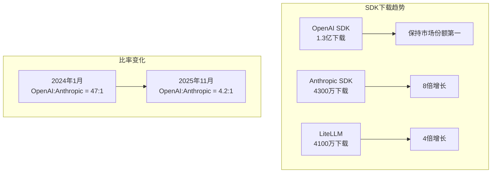
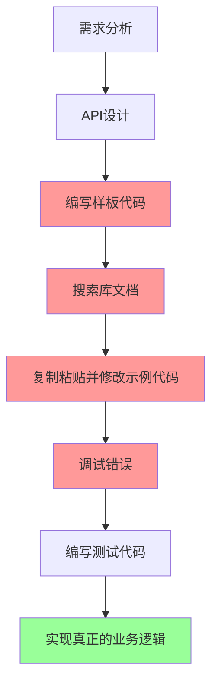
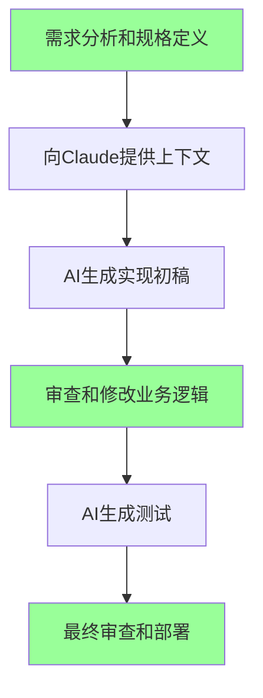

## 概述

Greptile 发布的**《The State of AI Coding 2025》**报告在业界引起了广泛关注。该报告基于 2025 年 3 月至 11 月的数据，定量分析了 AI 编程工具对开发者生产力的实际影响。

本文将总结报告的核心发现，并结合我的个人经验，探讨 AI 编程工具带来的实质性变化。

> **注**：本文是对 [Greptile State of AI Coding 2025](https://www.greptile.com/state-of-ai-coding-2025) 报告的评测。

## 报告核心发现总结

### 1. 开发者生产力指标的显著变化

报告中最值得关注的数据：

| 指标 | 变化率 | 详情 |
|------|--------|------|
| **每位开发者的代码输出量** | **+76%** | 4,450 行 → 7,839 行 |
| **PR 规模（中位数）** | **+33%** | 57 行 → 76 行 |
| **每文件变更行数** | **+20%** | 18 行 → 22 行 |

特别值得注意的是，6〜15 人规模的中型团队记录了**89% 的代码输出增长**。这表明 AI 工具不仅对个人开发者有效，在团队协作环境中同样表现出色。

### 2. AI 工具生态系统的快速增长

尽管 OpenAI 仍然领先市场，但 Anthropic 的增长势头令人瞩目。**1,547 倍的增长**数据显示了 Claude 在开发者社区中被快速采用的程度。

### 3. CLAUDE.md 文件的标准化

根据报告，**67% 的代码仓库采用了 CLAUDE.md 规则文件**。这意味着向 AI 代理提供代码库上下文已成为开发工作流程的标准。

17% 的仓库同时使用三种格式（CLAUDE.md、.cursorrules、.github/copilot-instructions.md），显示多 AI 工具环境正在成为现实。

### 4. 模型性能基准测试

| 模型 | TTFT (p50) | 成本倍数 |
|------|-----------|----------|
| Claude Opus 4.5 | < 2.5秒 | 3.30x |
| Claude Sonnet 4.5 | < 2.5秒 | 2.00x |
| GPT-5.1 | > 5秒 | 1x（基准） |
| GPT-5 Codex | > 5秒 | 1x |
| Gemini 3 Pro | 13.1秒 | 1.40x |

Anthropic 模型在响应速度方面表现出优势，这直接影响开发者体验。代码编写过程中的延迟减少可以保持开发流程不中断，从而提升生产力。

## 我的经验：能够只专注于规格说明和业务逻辑

报告中的数字令人印象深刻，但对我来说更重要的是**工作方式的根本性转变**。

### Before：被实现细节占用时间的日子

以前，我**将超过 70% 的开发时间花在实现细节上**：
- "这个库怎么配置？"
- "这个错误信息是什么意思？"
- "我在哪里见过类似的代码来着..."
- "测试代码应该怎么组织结构？"

### After：专注于业务逻辑的现在

现在我**专注于规格定义和业务逻辑审查**：

1. **明确的规格编写**：对"要构建什么"的清晰定义
2. **上下文提供**：通过 CLAUDE.md 传达项目结构和规则
3. **成果物审查**：确认 AI 生成的代码是否满足业务需求
4. **核心逻辑调整**：处理复杂的业务规则和边缘情况

### 具体的生产力提升案例

#### 1. 新功能开发

**以前**：添加一个新的 API 端点需要 2〜3 小时
- 路由配置
- 请求/响应类型定义
- 错误处理
- 编写测试

**现在**：30 分钟以内
- 向 Claude 说明需求
- 审查生成的代码
- 微调业务逻辑
- 运行并验证测试

#### 2. 调试

**以前**：错误日志分析 → Stack Overflow 搜索 → 反复试错（1〜2 小时）

**现在**：提供错误信息和上下文 → 原因分析和解决方案（10〜20 分钟）

#### 3. 代码审查

**以前**：手动检查代码风格、潜在错误和性能问题

**现在**：AI 进行初审后，只专注于核心业务逻辑和架构决策

### 定量体感变化

| 工作领域 | 节省时间 | 主要原因 |
|----------|----------|----------|
| 样板代码 | **90%** | AI 基于模式即时生成 |
| 库学习 | **80%** | 提供基于上下文的示例而非文档 |
| 调试 | **70%** | 错误原因分析自动化 |
| 测试编写 | **75%** | 测试用例自动生成 |
| 代码重构 | **60%** | 模式识别和改进建议 |

## 生产力提升的真正意义

报告提到了 76% 的代码输出增长，但我认为有**更重要的变化**。

### 1. 认知负担减轻

AI 工具减轻了"如何实现"的负担，使我能够将更多精力投入到思考**"要构建什么"**上。

### 2. 学习曲线缓和

引入新技术或框架时的障碍降低了。不用从头阅读文档，可以立即获得适合当前代码库的具体示例。

### 3. 实验更容易

能够快速将想法转化为原型，使得更多的实验和迭代成为可能。

## 需要注意的事项

当然，AI 编程工具并非万能。

### 1. 上下文提供的重要性

要让 AI 产出好的成果，需要**明确的上下文和需求**。像 CLAUDE.md 这样的规则文件的质量直接影响输出质量。

### 2. 审查的必要性

不应直接使用 AI 生成的代码。特别是：
- 安全相关代码
- 业务关键逻辑
- 性能敏感部分

### 3. 领域知识的重要性

AI 是工具。**领域专业知识和系统设计能力**仍然是开发者的核心能力。

## 结论

Greptile 的报告用数据证明了 AI 编程工具正在对开发生产力产生积极影响。76% 的代码输出增长、33% 的 PR 规模增长等数字支持了这一结论。

然而，对我来说更有意义的变化是**工作方式的转变**。不再被实现细节消耗时间，能够**专注于规格说明和业务逻辑**。我认为这才是 AI 编程工具带来的真正生产力提升。

AI 时代的开发者不再是"敲代码的人"。他们的角色正在演变为**"定义问题并设计解决方案的人"**。而这一变化才刚刚开始。

## 参考资料

- [Greptile - The State of AI Coding 2025](https://www.greptile.com/state-of-ai-coding-2025)
- [Anthropic - Claude Code Best Practices](https://www.anthropic.com/engineering/claude-code-best-practices)
- [GitHub - Copilot Impact Report 2024](https://github.blog/news-insights/research/the-state-of-the-octoverse-2024/)
