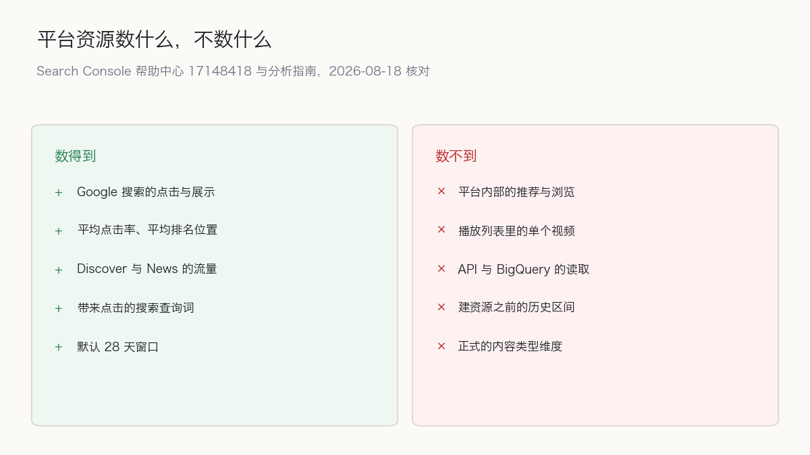

7 月 29 日，Google 宣布 Search Console 的平台资源向所有人开放。今天是 8 月 18 日，我用 curl 把帮助中心那两页的正文取回来，里面仍然写着这项功能正在逐步推出。同一家公司、同一个功能，两份官方文档在同一天说着不同的可用性。

先说结论。用手打开 Search Console 看报表的团队，今天就把四个账号接上，花费是零，没有理由等。把 Search Console [拉进 API 或 BigQuery 做自动报表](/zh/blog/zh/google-analytics-mcp-automation/)的团队，我的建议相反：资源可以接，管道里先别放。拦住管道的不是权限，是名字——参考文档里没有一种写法能指向这类资源。结果是把测量自动化建得越早的组织，越晚看到这批新数据，手动打开面板的团队反而先看到。

## 三个日期，一个还没长出接口的功能

变的东西不多。Search Console 原来只认网站，现在多了一种资源类型，指向社交和视频平台上的账号。

7 月 7 日的第一篇公告列出可选的四个平台：Instagram、TikTok、X、YouTube，并说明推出会分几批。三周后的 7 月 29 日，第二篇公告把话收紧了。

> "Today, platform properties are globally available to everyone."
> — [Google Search Central Blog：平台资源全球开放，并新增社交与视频表现指南](https://developers.google.com/search/blog/2026/07/platform-properties-social-video-guide)

同一篇公告里，覆盖的表面从 Search 与 Discover 扩到了 Google News。指标没有另立一套：点击总数、展示总数、平均点击率、平均排名位置，和站点资源上的那四个是同一组。

验证方式的变化比指标更值得记一笔。站点资源靠 DNS 记录、HTML 标签或者分析代码证明所有权。平台资源不走那条路，帮助中心把可选项写成一句话：用已有的网站资源自动连接，或者直接用平台账号登录。资源的标识符也换了形状，写出来是 `instagram.com/username` 这样的账号路径，不再是一条 URL。

## 同一天，两份文档说着不同的可用性

我读的是文档本身。先把帮助中心 17148418 的正文抓下来，剥掉标签，搜那句逐步推出的话。

```bash
curl -sSL -A "Mozilla/5.0" "https://support.google.com/webmasters/answer/17148418?hl=en" \
  | python3 -c "import sys,re,html;s=sys.stdin.read();s=re.sub(r'<[^>]+>',' ',s);print('HIT' if 'rolling out this feature gradually' in html.unescape(s) else 'GONE')"
# HIT
```

HIT。全球开放的公告发出 20 天之后，这句话还在原地。

> "We’re rolling out this feature gradually, so it might not be available to everyone yet."
> — [Search Console 帮助中心：关于 Search Console 中的平台资源](https://support.google.com/webmasters/answer/17148418)

添加资源那一页（34592）留着同一句。两篇博客公告说全球开放，两页帮助中心说分批推出。

文档更新日志倒是齐的。7 月 29 日的条目写着新增了分析社交与视频平台内容表现的指南，日期和第二篇公告对得上。也就是说 Google 在同一天更新了博客、发布了新指南、记了日志，唯独漏掉帮助中心里那两句关于推出节奏的话。

这句话留在那里，可能只是文档滞后，也可能按账号类型或地区还留着实际的例外。匿名请求看不出是哪一种。具体原因我没有答案，先记着。

引号里的英文，我都拿 curl 取回原文做过子串比对，空白归一化之后逐条通过。日期出自公告本身，或者页面上的最后更新时间。

## 卡住管道的不是权限，是名字

Search Console API 指向一个资源，用的是一个叫 `siteUrl` 的字符串。参考文档给 `siteUrl` 的示例只有两种形状。

> "The URL of the property to retrieve, as defined by Search Console. Examples: http://www.example.com/ (for a URL-prefix property) or sc-domain:example.com (for a Domain property)"
> — [Google for Developers：Sites: get，Search Console API](https://developers.google.com/webmaster-tools/search-console-api-original/v3/sites/get)

URL 前缀，或者 `sc-domain:` 前缀。平台资源的标识符是账号路径，两种形状都套不进去。需要第三种写法，而这一页最后一次改动的日期是 2024-07-23，比平台资源出现早了两年。

```bash
curl -sSL "https://developers.google.com/webmaster-tools/search-console-api-original/v3/sites/get" \
  | grep -o "sc-domain:example.com\|Last updated 2024-07-23 UTC\|instagram" | sort | uniq -c
#    1 Last updated 2024-07-23 UTC
#    1 sc-domain:example.com
```

`instagram` 出现 0 次。自动报表读不到平台资源，原因不在权限，在于不知道用什么字符串去指它。实际端点会不会收账号路径，我不知道。文档里没有的写法，试出来的结果也不能当依据。这两件事的区别很实际：权限问题可以申请，命名问题只能等文档。只存在于 Search Console、拉取请求里找不到的控制点也是同一层。范围在仓库外面被决定。

要打个比方：这批数据现在只开了柜台窗口，没有邮购。想要就自己走一趟。比方在一个地方失效 —— 邮购渠道不是没建，是建了没印地址。端点也许已经能收，只是没人知道信封上该写什么。

同一类命名问题在界面里也有一处，而且这一处会直接让数字对不上。

> "On the Insights page, the top summary card shows all clicks to your property across Google (including web, image, video, and news searches). However, the detailed lists below the summary card focus specifically on traffic from web search results. Because of this, the total from specific cards might be lower than the number shown in the main summary card."
> — [Search Console 帮助中心：关于 Search Console 中的平台资源](https://support.google.com/webmasters/answer/17148418)

顶部汇总卡数的是 Google 上的全部点击，含网页、图片、视频、新闻搜索；下面的明细列表只数网页搜索。两个数字都叫 clicks。[prerender 页面把 LCP 记成 6.2 秒](/zh/blog/zh/prerender-activationstart-cwv-measurement-2026/)也是同一类：指标名不告诉你它从哪只表开始走。谁把汇总卡的数抄进周报，再拿明细列表去解释，就会算出自己解释不了的差额，而差额本身是正常的。



## 反过来说：这是创作者的功能，不该动我的测量设计

这套判断有一个我认为成立的反面，先把它说到最强的样子。

技术站点、B2B 站点，社交和视频内容带来的 Google 搜索流量通常小到不值得单开一条测量路径。YouTube Studio 给的观看时长、留存曲线、流量来源分布，比 Search Console 的四个指标细得多，Instagram 的后台也一样。既然平台自己的后台更精确，何必把同一批内容搬到 Search Console 里看粗版？何况新资源要一个个验证，验证完还得维护登录状态，换来的只是一组别处早有的粗数字。按这个逻辑，平台资源是给创作者做的功能。Google 的公告本身也是这么写的：社交与视频内容的表现。web 开发组织没有理由为它重画测量设计。

这个反面在一个范围里完全正确：几乎不运营社交账号、流量绝大多数来自自然网页搜索的组织。这类组织接上四个资源，除了资源列表里多出四行以外什么都不会变，而验证和维护的工作量是实的。我不打算把他们劝进来。

范围之外，这个反面在一个地方裂开。裂口是查询词。平台后台会告诉你流量来自 Google 搜索，但不会告诉你是哪个词把人带过来的。反过来，平台资源数的是 Google 搜索侧的表现，不数平台内部曝光。

> "Platform properties only show how your content performs on Google Search. They don’t track when people see your content on the platform itself (for example, they won’t show how many times your video appeared on TikTok)."
> — [Search Console 帮助中心：关于 Search Console 中的平台资源](https://support.google.com/webmasters/answer/17148418)

两边不是同一个指标的粗版和细版，是两个各带盲区的指标。YouTube Studio 看不见搜索词，Search Console 看不见平台内部的推荐。谁想知道「搜我们品牌名的人最后落在哪儿」，只有把两边摆在一起才拼得出来。

承认这个反面之后，我要收回自己论断里的一部分。平台资源不改 KPI，也不重画测量设计。它改的是报表里的一行脚注，说明这份数字不包含哪些表面。脚注比 KPI 便宜，但脚注写错的代价会拖很久。

## 三条轴，把各自看不见的地方摆清

所有权的依据。站点资源用 DNS 记录或页面标签证明所有权，那些东西我不删就不会消失。平台资源换成了另一套依据，而这套依据会过期。

> "For security, ownership is periodically checked. If your connection is lost, either because an external login expired, access to your platform property will pause until you re-verify. Once you re-verify, you get access to the same report and you don't need to wait for data to accumulate."
> — [Search Console 帮助中心：关于 Search Console 中的平台资源](https://support.google.com/webmasters/answer/17148418)

重新验证之后报表回来，不用重新等数据攒够。这一点做得体面。但报表停着的那段时间，自动化的日程照跑，跑出来的是空值。

数的对象。平台资源数 Google 上的表现，平台后台数平台内部的曝光。Discover 和 News 的报表还要看有没有流量才出现，没流量就没那一栏，于是不同资源的报表长得不一样，做统一模板的人会先撞上这种版面差异。

取数的方式。官方给跨平台比较的做法是导出：在一个资源里点导出、选格式，然后到下一个资源重复一遍。四个平台就是四次，每月一次就是一年四十八次。这条路顶不了 API，它是 API 缺位期间的手工活，成本随账号数线性涨。

## 账单是零，成本不是

功能本身不收钱，API 和 BigQuery 的费用也谈不上，那条路还没开通。成本在别处。

配额上，一个账号最多 1,000 个资源。四个平台听着不多，但资源按账号或频道算，品牌有几个账号就乘几倍，多语言运营的组织会先碰到验证的工作量，而不是上限。

时间上，新建资源要等几天才有数，界面上会先给空图。Insights 和表现报表的默认区间是 28 天，新资源只填得上开始采集之后那一段。想拿同比，得等到明年 8 月。

已经在 Google 上认领过 Search profile 的账号能省掉一部分手工活，那些已验证的账号会自动变成资源。这些资源的数据起始日和手工加的是不是同一天，文档没说，从外面也看不出来。

## 明天要改的是报表的脚注

落到操作上，我建议按顺序做三件事：

先改脚注，再接资源。在现有的周报或月报里加一行，写明这份数字包含哪些表面、不包含哪些。这一行不用等任何数据，今天就能写，而它防住的是最贵的那种错误：有人拿一个不含社交与视频表现的数字，去回答一个关于品牌整体搜索存在感的问题。

再接四个资源，用眼睛看一遍 28 天窗口。重点看品牌词：同一个品牌名，在站点资源和在 YouTube 频道资源里各拿到多少点击。这个对比不用写代码，也不用写进任何管道。看完之后你会知道自己原来漏了多少，或者知道原来没漏多少，两个结论都值这半小时。

最后再决定要不要合进自动报表，判断的依据是参考文档的状态，不是产品公告的口气。文档里出现第三种 `siteUrl` 写法之前，任何合并都是在猜。

顺手说两个界面上的坑。想比不同格式的表现，得靠 URL 字符串过滤，官方指南给的做法是拿含 `/watch` 的 URL 对比含 `/shorts/` 的 URL，因为没有内容类型这一正式维度。播放列表的过滤更要留意。

> "Note that this will show you the performance for the playlist page itself, not the videos included in it."
> — [Google Search Central：在 Search Console 中分析社交与视频平台内容的表现](https://developers.google.com/search/docs/monitor-debug/analyze-social-video-content)

改过标题或者说明文之后想看效果，用 Search Console 图表上的注释功能把那天钉住，然后看前后。这是这套报表现在最实在的用法。

## 谁现在接，谁先等

现在接：那些觉得 YouTube 频道或 Instagram 主页吸走了品牌词、却在报表里查不到吸走量的组织。社交和视频由另一个团队运营、跟网站之间一直没有共同指标的组织，现在可以拿同一组点击和展示把两边并排放。想确认改过标题在 Google 搜索侧有没有变化的人。以及那些没有自己网站、只运营平台的发布者——他们第一次在 Search Console 里有了自己的一栏。

先等：想看平台内部推荐和浏览流量的，接了也白接，那部分它不数。要播放列表里单个视频的表现，过滤器给不了。要今天就把数字合进自动报表，标识符的写法还没有。需要按内容类型切分的分析，手上只有 URL 字符串过滤这一替代物。打算把这组数字升成全公司 KPI 的，新资源没有历史区间，同比在明年之前不成立。

我选的一边是：现在接，但不自动化。手动看几分钟换到的信息量，比等一份不知道何时更新的参考文档划算；在文档给出写法之前把账号路径塞进管道，做出来的是一个悄悄算错的合计，还很难排查。这个选择在一个条件下会失效：如果 Google 下次更新参考文档时补上了平台资源的 `siteUrl` 写法，我这句「别放进管道」当天作废，那天该做的事是把这一个月的手工导出全部丢掉重跑。

能说的范围到文档为止。接上四个资源之后那些数字长什么样，那要另外一篇，用自己账号里的点击来写。公开文档能比较的东西，和接过之后才能说的东西，是两回事。

有一点值得单独放着。测量权限的依据，在平台资源上第一次从所有权证明挪到了会话维持。DNS 记录我不删就不会消失，平台登录会因为别人家的政策过期，过期了报表就停。以前的隐含前提是「只要我不动，观测就一直在」，现在换成了「只要那边不断，观测就一直在」。观测的连续性离开我的手，是从这里开始的。

## 参考资料

- [Google Search Central Blog：See how content from social and video platforms performs on Google Search](https://developers.google.com/search/blog/2026/07/search-console-social-video-platforms)
- [Google Search Central Blog：Platform properties roll out globally, plus a new social and video performance guide](https://developers.google.com/search/blog/2026/07/platform-properties-social-video-guide)
- [Search Console 帮助中心：About platform properties in Search Console](https://support.google.com/webmasters/answer/17148418)
- [Google Search Central：Analyze your social and video platform content performance in Search Console](https://developers.google.com/search/docs/monitor-debug/analyze-social-video-content)
- [Search Console 帮助中心：Add a website or platform property to Search Console](https://support.google.com/webmasters/answer/34592)
- [Google for Developers：Sites: get，Search Console API](https://developers.google.com/webmaster-tools/search-console-api-original/v3/sites/get)
- [Google Search Central：Latest Google Search Documentation Updates](https://developers.google.com/search/updates)
