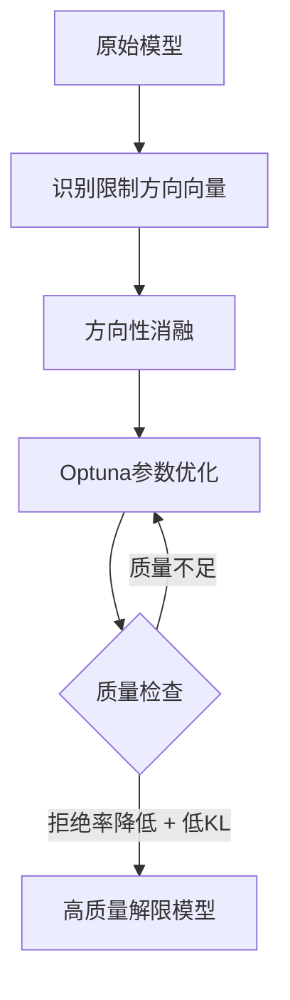
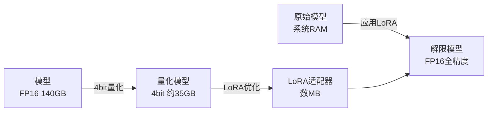
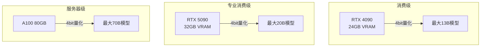

## 概述

运行本地LLM时，<strong>VRAM不足</strong>是最大的瓶颈。大规模模型的消融（censorship removal）处理通常需要以全精度加载模型，消耗数十GB的VRAM。

2026年2月，<strong>Heretic 1.2</strong>正式发布。在Reddit r/LocalLLaMA上获得268分，受到社区高度评价。此版本引入了通过4bit量化实现的<strong>VRAM使用量最多降低70%</strong>以及名为<strong>Magnitude-Preserving Orthogonal Ablation（MPOA）</strong>的新消融技术。

## 什么是Heretic

[Heretic](https://github.com/p-e-w/heretic)是一个自动从基于Transformer的语言模型中移除审查（安全对齐）的工具。自首次发布以来的三个月内，社区已使用Heretic发布了<strong>超过1,300个模型</strong>。

Heretic的核心技术基于两大支柱：

- <strong>方向性消融（Directional Ablation）</strong>：通过移除模型中特定方向的向量来解除限制
- <strong>TPE基础参数优化</strong>：利用[Optuna](https://optuna.org/)同时最小化拒绝次数和KL散度



## VRAM降低70%：基于LoRA的量化引擎

### 此前的挑战

传统消融处理需要将整个模型以全精度（FP16/BF16）加载到VRAM中。例如，70B参数模型需要<strong>约140GB的VRAM</strong>。

### 新方法

Heretic 1.2引入了由贡献者accemlcc实现的<strong>基于LoRA的消融引擎</strong>。

```yaml
# Heretic配置示例
quantization: bnb_4bit    # 启用4bit量化
orthogonalize_direction: true  # 启用MPOA
row_normalization: full        # 行归一化
```

该方法的工作原理如下：

1. <strong>4bit量化加载</strong>：使用bitsandbytes以4bit加载模型，将VRAM使用量最多降低70%
2. <strong>LoRA适配器优化</strong>：基于PEFT，在量化状态下优化消融参数
3. <strong>全精度导出</strong>：将原始模型重新加载到系统RAM中，并应用优化后的LoRA适配器



### 实际VRAM对比

| 模型大小 | 传统方式 | Heretic 1.2（4bit） | 降低率 |
|:---:|:---:|:---:|:---:|
| 7B | ~14GB | ~4.2GB | 70% |
| 13B | ~26GB | ~7.8GB | 70% |
| 70B | ~140GB | ~42GB | 70% |

消费级GPU（RTX 4090，24GB VRAM）现在也能处理<strong>13B级模型</strong>。

## MPOA：高质量消融的新技术

### 什么是Magnitude-Preserving Orthogonal Ablation

MPOA是Jim Lai开发的消融技术，与传统方法相比能够<strong>将模型质量下降降到最低</strong>。

传统消融在移除限制方向向量时会改变权重的大小（范数），导致模型能力下降。MPOA通过以下方法解决此问题：

1. <strong>正交投影</strong>：将向量投影到与限制方向正交的子空间
2. <strong>范数保持</strong>：将投影后向量的范数恢复到原始大小
3. <strong>Optuna优化</strong>：使用Optuna优化权重参数并自动化层选择

### 基准测试对比

以Heretic官方示例中gpt-oss-20b模型的对比结果为例：

| 模型 | UGI分数 | W/10 | NatInt | Writing |
|:---|:---:|:---:|:---:|:---:|
| Heretic版（MPOA） | <strong>39.05</strong> | 胜出 | 胜出 | 胜出 |
| 传统Derestricted版 | 34.22 | — | — | — |

Heretic版在所有类别中均领先，<strong>UGI分数提升约14%</strong>。

### 配置方法

```yaml
# 启用MPOA
orthogonalize_direction: true
row_normalization: full
```

仅需两行配置即可享受MPOA的优势。

## 其他亮点功能

### 视觉语言模型（VLM）支持

Heretic 1.2由贡献者anrp添加了<strong>VLM支持</strong>。仅对文本解码器部分进行消融，图像编码器保持不变。

### 会话自动保存与恢复

即使在长时间优化运行中发生崩溃，Heretic也会自动保存进度。重启后可从中断处继续。也可以用Ctrl+C手动中断后稍后恢复。

## 实战指南：使用Heretic 1.2

### 前提条件

- Python 3.10以上
- 支持CUDA的GPU（4bit量化需要NVIDIA GPU）
- 充足的系统RAM（用于全精度导出）

### 安装与运行

```bash
# 安装Heretic
pip install heretic

# 基本运行（4bit量化 + MPOA）
heretic --model meta-llama/Llama-3.1-8B-Instruct \
  --quantization bnb_4bit \
  --orthogonalize-direction true \
  --row-normalization full
```

### 推荐硬件配置



## 社区反响

Reddit r/LocalLLaMA帖子获得<strong>268分</strong>，反映出社区的高度认可。在HuggingFace上，使用Heretic创建的模型已<strong>超过1,300个</strong>，占所有消融模型的三分之一以上。

社区特别关注的要点：

- <strong>成本效益</strong>：消费级GPU即可处理大规模模型
- <strong>质量提升</strong>：MPOA超越传统技术
- <strong>易用性</strong>：完全自动化的工作流程

## 总结

Heretic 1.2同时解决了本地LLM运营中的两大挑战：

1. <strong>大幅降低VRAM使用量</strong>：4bit量化使原本需要昂贵GPU的处理可在消费级硬件上完成
2. <strong>提升消融质量</strong>：MPOA在保持模型能力的同时解除限制

随着本地LLM民主化的加速，像Heretic这样的工具在构建<strong>人人都能使用高质量模型的环境</strong>中扮演着重要角色。

## 参考资料

- [Heretic GitHub仓库](https://github.com/p-e-w/heretic)
- [Reddit r/LocalLLaMA: Heretic 1.2发布帖](https://www.reddit.com/r/LocalLLaMA/comments/1r4n3as/heretic_12_released_70_lower_vram_usage_with/)
- [Arditi et al. 2024 — Refusal in Language Models Is Mediated by a Single Direction](https://arxiv.org/abs/2406.11717)
- [Jim Lai — Norm-Preserving Biprojected Abliteration](https://huggingface.co/blog/grimjim/norm-preserving-biprojected-abliteration)
- [Heretic HuggingFace Organization](https://huggingface.co/heretic-org)
